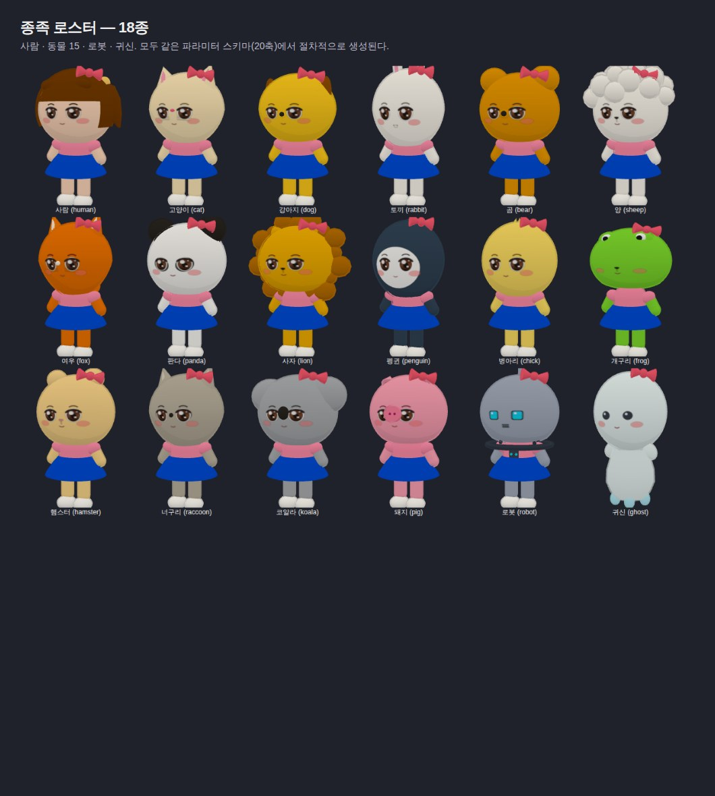
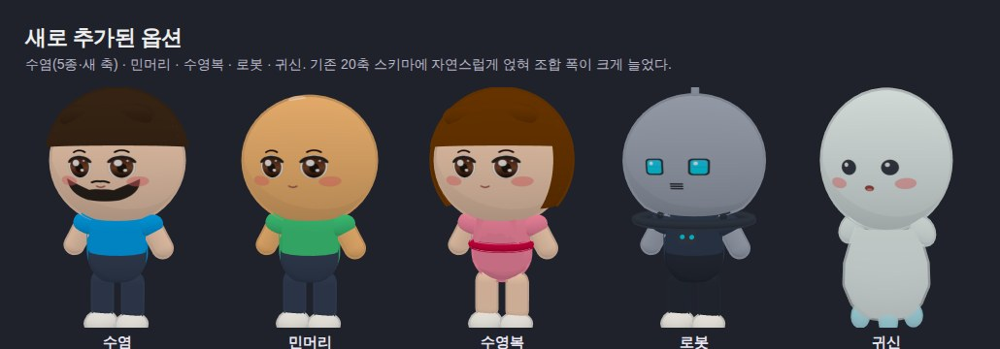
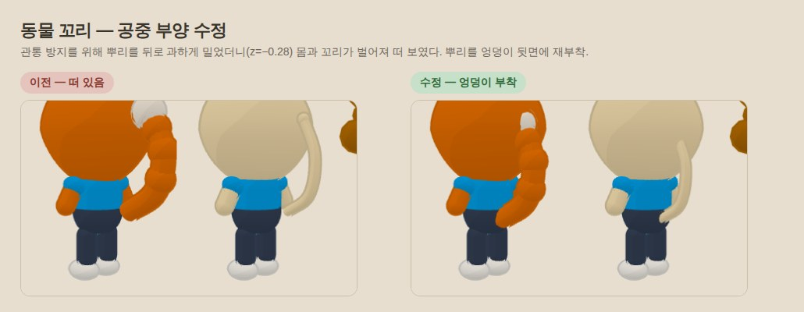

# OpenArtShow 개발일지

개선 작업의 원인 → 분석 → 개선 → 결과를 기록한다. 최신 항목이 위.

---

## 2026-09-04 17:20 · 3주 잠든 세션이 깨어났다 — 「월드2 디폴트」는 이미 돼 있었고, 지면 안개를 노브로 연다

**원인.** 감독이 물었다. *"우리가 많은 것을 만들었어. 그런데 보석도 꿰어야 보배라고. 어떻게
꿰면 좋을까. 일단 월드2를 디폴트로 하고. 씬을 블렌더로 만들어서 월드7에 붙여서 디폴트로
만들 작정이야. 게임처럼 안개효과 뭔가 진짜 리얼한 느낌을 주고 싶어. 너가 전체적으로 보고
의견을 줘봐."*

그 직전에 감독이 *"지금 최신이지?"* 라고 물었고 나는 *"네, 최신입니다"* 라고 답했다.
**틀렸다.** 이 세션은 2026-08-13 에 잠들었다가 이날 깨어난 것이었고, 컨테이너의
`origin/main` 참조는 8-13 것이었다. 실제 `main` 은 **466커밋** 앞에 있었다 — 그 사이에
감독은 다른 세션들과 「월드2 디폴트」(PR #260, 8-23)·월드7·월드8·`world-glb` 트리를
이미 만들어 두셨다. 내가 "최신" 을 판정한 근거는 `git fetch` 였는데 그 fetch 는 **3주 전
것**이었다(`git reflog show origin/main` 이 8-13 03:53 을 가리켰다). 조사 위임 중 한 직원이
원격을 새로 당겨 보고서야 드러났다.

교훈은 단순하다 — **깨어난 세션은 시각부터 본다.** `date` 와 마지막 커밋 시각이 하루
넘게 벌어져 있으면 그 사이 세계가 바뀐 것이다. 이번엔 조사 착수 뒤에 알아서 절반을
낡은 트리로 잰 셈이 됐고, 최신 트리를 별도 worktree 로 받아 나머지를 다시 쟀다.

**분석 — 7축.** 인벤토리·디폴트화·포크·GLB 파이프라인·안개·레퍼런스·결정 이력을 병렬로
조사시키고 결과를 팀장께 올렸다(세션 한도로 반증 단계는 3축이 빠졌다 — 그 축의 사실은
"미검증" 표시로 남겼다). 최신 트리 기준으로 남는 것:

- **월드2 디폴트는 끝났다.** 랜딩 「오픈월드 입장」이 `world2.html` 을 연다. 남은 조건은
  WebGPU 미지원 기기 첫 화면 확인 하나(완료 기록 0).
- **단절 둘.** 미술관 정문 포털(`portal.js`)이 강등된 world1 로 **12일간** 보내고 있었고,
  world2 「전시장 들어가기」는 behind-flag 인 `visit.html` 로 간다. 검사(GS-3)는 산문↔배열만
  대조하고 실제 href 는 안 본다 — 그래서 `entrypoints.mjs` 의 *"어디에도 링크하지 않는다"*
  가 두 항목에서 거짓인 채 초록이었다.
- **블렌더 규약 문서가 거짓을 적고 있었다.** `BLENDER-BUILDING-GUIDE.md` 의 *"이 규약대로
  만든 GLB 는 임포터가 자동으로 해석한다"* — `col_`·`floor_`·`spawn` 을 읽는 코드는 저장소
  전체에 **0건**이다. 실제로 도는 규약은 재질 이름(`kind#tone`)이고 경로는 「world2 내보내기
  → 블렌더 편집 → 되읽기」뿐이다.
- **안개는 선형 `THREE.Fog` 하나.** 거리 SSOT 는 `decide/fog.ts`, 색은 `sky.js` 팔레트.
  게임식 안개의 부품(`scene.fogNode`·`rangeFog`·`positionWorld`·`triNoise3D`)은 three
  0.171 에 전부 있고 공식 예제(`webgpu_custom_fog`)도 있다. **헤드리스 폴백은 레거시
  `WebGLRenderer` 라 TSL 안개는 스모크에서 0% 검증된다.**
- **world8 GLB 삼각형의 정체.** 실측 2,110,989 중 GLB 정적 총합은 1,358,918 이고 그중
  **94.1% 가 소품 4종의 반복**이다(가로등 갓 `SphereGeometry(10,8)` 140tri × 3,182 = 547k,
  나무 214tri × 2,540 = 544k, 화분·나무받침). 고유 지오 삼각형 합은 **3,808** 뿐이다.
  `EXT_mesh_gpu_instancing` 은 없다 — 우리 exporter 가 블렌더 호환을 위해 일부러 펴서
  저장한다. 거리 컬링은 이미 있어 화면엔 약 120k 만 남고, 나머지 752k 는 GLB 밖(잔디
  이론 상한 124만)이다. `TRI_BUDGET 60,000` 은 **유도된 값이 아니고**, `applyTierPressure` 는
  world2 에서도 주입 0건이다.

**팀장 판정 ① — 실현 경로 A(조건부).** 감독 구상 «블렌더 씬이 곧 세계» 의 실물은 월드7이
아니라 **월드8**(고정 GLB, `world-glb` 트리)이고, 승격 대상은 그것이다. 조건 6: G-W8N
처방은 별도 상신(C1) · 가이드 거짓 진술 즉시 정정(C2) · 자산 출처 기록(C3) · 안개는
부팅 1회 고정 + 헤드리스 PASS 를 근거로 쓰지 말 것(C4) · 포털·전시장 단절은 승격과
무관하게 지금 꿴다(C5) · 「파라미터가 곧 공간」이탈은 감독 확인 없이 랜딩 교체 불가(C6).

**감독 카드 답.** 블렌더 씬 = *"1번인데(월드2 내보내 손본 것) 나중에 내가 블렌더로 만든
씬이 될수도 있어"* · 월드8 승격 = 「두 화면 비교한 뒤 결정」 · 안개 = 「바닥에 깔리는
높이 안개까지」. 이어서 새 지시: *"블렌더에서 만든씬을 너가 최적화 해서 넣어야지.
인스턴스화할수있는것은 하고."*

**팀장 판정 ② — 삼각형 처방은 P3 → P0 → P1(조건부).** 내 제안(소품 다이어트 P1 첫 착수)을
**뒤집었다.** 근거: `TRI_BUDGET` 주석의 *"tri 를 84,526 에서 41k 로 절반 깎았는데 fps 는
25→26"* 은 **삼각형이 병목이 아니었다는 실측**이고 나는 그것을 예산 무근거의 증거로만
썼다. 감독 문언 «최적화해서 넣어야지» 는 넣는 쪽(임포트) 처방이고, «인스턴스화» 에
직접 대응하는 것은 PR #287 의 `EXT_mesh_gpu_instancing` 패킹(P3)뿐이다. P1 은 라이브
world2 룩 변경인데 감독이 world2 소품을 문제라고 한 적이 없다(0번 원칙). 순서: ① #287
병합 + 패킹을 배포 조립에 연결(저장소 GLB 는 펼친 형식 유지, 왕복 테스트·검수관 §10-4)
② 헤드리스 삼각형 4분면 실측(잔디·GLB·그림자 on/off)으로 «35배» 문구를 표로 교체
③ 세분도 프리셋 `?lod=` 노브로 링크 판정 — 「차이 있음」일 때만 기본값 변경.

**개선(이 회차).**

1. **정문 포털 → `world2.html`**(`portal.js`, 팀장 C5). 되돌리기 문자열 한 줄. 검사 구멍은
   백로그 `G-GS3H`, 전시장 문의 노출 결정은 `G-VISIT`(팀장·감독 사안이라 내가 안 골랐다).
2. **가이드 정정**(팀장 C2). 문장을 지우는 대신 실측을 상자로 위에 붙였다 — 규약은 파서가
   생기면 그대로 쓸 수 있게 남긴다. 감독 지시로 *"엔진은 읽기만 한다"* 전제도 뒤집혔다.
3. **지면 안개.** 판정·식·노드 조립은 `frontend/js/world-shared/ground-fog.ts` 한 곳(팀장
   부수 의견 — no-sync 포크의 체리픽 표는 한 번도 쓰인 적이 없으니 공용에 둔다),
   집행은 world2·world-glb 의 `features/ground-fog.ts`(두 파일이 한 글자도 다르지 않다는 것을
   테스트가 지킨다). 식은 `range + ground − range·ground`, `ground = saturate(exp((h0−y)·k))
   · smoothstep(0, near, viewZ) · strength`. 색·near·far 는 `scene.fog` 를 `reference` 로
   참조해 크로스페이드·밤 하한·`?fogd=` 가 그대로 따라온다. **기본 세기 0** — 감독이
   링크로 고르기 전에는 라이브 화면이 안 바뀐다. 테스트 21개, 뮤테이션 7/7 검출.

**노브 셋** (8-12 목록에 더한다 — 이름은 거리 안개 `?fogd=` 와 같은 접두):

| 노브 | 뜻 | 기본 | 범위 |
|---|---|---|---|
| `fogs` | 지면 안개 세기 | 0 (끔) | 0~1 |
| `fogh` | 층 기준 고도(m) — 이 아래는 밀도 1 | 1 | 0~20 |
| `fogk` | 고도 감쇠(1/m) — 두께 감각 ≈ 3/k m | 0.45 | 0.01~4 |

월드2·월드7·월드8 모두 같은 노브다. WebGPU 에서만 켜진다(WebGL 폴백은 종전 거리 안개).

**이어서(9-05) — 잔디 잎 모드.** 감독 *"2디 잔디로 가볍게 안될까"* · 월드8 불편 *"잔디부터"*.
실측이 잔디 = 삼각형의 90% 였고(위 표), 팀장 판정으로 후보를 노브로 연다. 기본값은
3D 그대로다(노브 없이는 종전 화면).

| 노브 | 뜻 | 기본 | 값 |
|---|---|---|---|
| `gmode` | 잎 모드 — `blade` 3D 8tri · `quad` 2D 사각 2tri + 알파 마스크 · `cross` 십자 4tri | `blade` | blade / quad / cross |
| `glod` | 이 반경(m) 안쪽 링은 `blade` 유지, 밖만 `gmode` | 0 (끔) | 0~200 (링 경계 14·34) |
| `gseg` | 2D 잎의 세로 마디 수 — 감독 *"살랑살랑 게임 쉐이더 처럼"*: 마디가 있어야 바람에 **휜다** | 3 (quad 6tri) | 1~4 |
| `gmode=card` · `gcard` | **다발 카드** — 넓은 사각 두 장 교차에 가는 잎 `gcard` 개를 절차적으로 그린 마스크. 카드 하나가 잎 N 개 몫이라 인스턴스 1/N. 감독 *"옆으로 넓은것 같아. 게임회사는 어떻게 해?"* | card 는 노브 전용 · 잎 6 | 3~12 |
| `gden` | 잔디 밀도 배수 — **0 이면 잔디 끔**(대조군) | 1 | 0~2 |

2D 잎의 실루엣은 3D 잎과 **같은 프로파일**(`halfWidthProfile`)에서 마스크로 유도한다 —
감독이 8-18 에 네 번 다듬은 잎 모양 축(`gtip`·`gbelly`)이 2D 에서도 산다(팀장 C-3).

**결과 — 감독 판정(9-05), 그리고 사고.** 링크 일곱을 보고 월드8 은 **「2D 잎(마디 3)」**, 원인은
*"잔디 없으면 부드럽다"*. 그런데 월드8 「3D」 링크가 실제로는 2D 였다 — 검수관이 원본
워킹트리에서 심은 뮤테이션(기본값 → quad)이 내 동기 복사에 섞여 `5f217ba2` 로 커밋·배포됐다.
아무 검사도 못 잡았고 검수관의 «두 트리 diff 헤더 1줄» 은 그 전 시점이었다. **원인은 내
지시**(«원본에서 치환 + 복원») — 뮤테이션은 별도 클론에서 한다는 DELEGATION B-1 을 내가
어겼다. 감독 판정의 유효 범위: 잔디가 원인이라는 것(quad 로도 끊긴다)은 유효, 2D 선택은
3D 와 비교 없는 선택. 값은 판정대로 월드8 = quad, 월드2 = 3D 로 굽고, 진짜 3D 와 더 가벼운
후보를 링크로 다시 드린다. 세계별 기본값을 `tests/world-glb-grass-default.test.ts` 가 못 박는다.

**재비교 판정(9-05).** 링크 다섯을 다시 보고 월드8 기본 = **2D 마디 1**(잎당 2tri, 잔디 0.3M).
그런데 3D 와 견줘 *"차이 모르겠다"* — 삼각형을 4분의 1로 깎아도 체감이 안 갈렸다. 「잔디
없으면 부드럽다」 는 참이고 「삼각형이 원인」 은 아직 참이 아니다. 잔디 축은 여기서 멈추고
다음은 GLB 패킹·로딩(P3)이다.

**결과 — 감독 판정(9-05 새벽).** 후보 셋과 대조군을 실기기로 보고 *"기본이 낫다."*
지면 안개는 이 세계에서 리얼로 읽히지 않았다. 세기 0 이 확정값이고 축을 닫는다 —
재론 시 세 후보의 중간값을 다시 내미는 대신 다른 축(날씨별 거리 밴드·깊이 기반 후처리)
부터 본다. 코드는 남는다(노브 없이는 아무것도 안 한다). 링크 전달을 두 번 실패한 것도
적어 둔다: 카드를 링크 없이 먼저 띄웠고, 다음엔 링크가 카드에 가려 안 보였다. **모바일에는
URL 을 한 줄에 하나씩, 장식 없이.**

**못 잰 것 · 경계.** 화면은 0건 — 헤드리스가 이 노드를 못 돌린다. 하늘 돔과 수평선 밴드는
`fog:false` 라 이 층이 안 덮는다(그것은 깊이 기반 후처리, 3단계). 볼류메트릭·빛줄기는
three 에 부품이 없어 자작이고 이번 범위 밖. 감독 확정값(밤 안개 0·`?hz=` 0·낮만 하늘색
안개)은 그대로다. 세션이 낡았던 사고의 처방은 게시판 관측으로만 남겼다 — 규율 한 줄을
더 늘리는 것이 듣지 않는다는 실측이 이 저장소에 이미 있다.

## 2026-08-20 · 테스트가 전부 초록인데 목표는 달성돼 있지 않았다 — 두 번, 같은 형태로

감독이 물을 보고 말했다. *"왜 밑 반사는 움직이지 않을까. 파도가 너무 너울성이야. 강에
가면 잔물결들이 막 이동하잖아."* 카드로 확인하니 안 움직이는 것은 **윤슬**, 큰 파도는
**줄이라**는 것이었다.

---

### 잔물결 — 내 첫 진단이 틀렸고 저장소에 그 증거가 있었다

처음 잡은 원인은 *"공간 스케일이 16m 라 잔 것이 없다"* 였고 처방은 무늬 축소였다.
레퍼런스 조사가 그것을 반박했고, **이 저장소에 이미 실증 이력이 있었다** — 2026-07-31 에
노멀맵 옥타브를 촘촘하게 했다가 감독이 *"이단물결은 아까가 나아. 되돌려"* 로 반려했다.
촘촘함은 **이미 실패한 축**이다.

실측이 진짜 원인을 가리켰다:

    노멀맵 월드 스크롤 = 0.0408 × 1.1 = 0.045 m/s   →  1분에 2.7m
    강 유속(RIVER_FLOW_MPS)          = 1.1  m/s     →  25배 빠르다

그리고 `FLOW_SPEED_A` 주석이 **스스로 적고 있었다**: *"0.05 m/s 언저리는 잔잔한 호수,
0.2 를 넘으면 강물처럼 흐른다."* 우리 물은 호수 속도로 설정돼 있었고, 그 사실이 값 바로
옆에 한국어로 적혀 있는데 아무도 그것을 감독의 불만과 연결하지 않았다.

**잔물결이 흘러간다는 인상은 무늬의 촘촘함이 아니라 무늬가 이동하는 속력에서 온다.**

---

### 윤슬 — 인프라는 있는데 배선이 없었다

`ocean.ts` 가 원인을 이미 적어 뒀다: *"`scene.environment` 가 없어 거울이 반사할 것이
없다 → 검다."* 그래서 `emissive` 흰 점으로 땜질했는데, 그것은 광원과 무관하게 늘 같은
자리에서 빛나는 **스티커**라 UV 가 흘러도 명멸하지 않는다. 게임풍 물에는 그 스티커조차
없었다.

`makeEnvMap` 은 `adapters/renderer.ts` 에 **구현돼 있었고 world2 소비자가 0건**이었다.
라이브 미술관(`world.js`)은 이미 쓰고 있었다.

---

### 그리고 검수관이 두 번 반려했다 — **둘 다 「초록인데 안 됨」이었다**

**A. `equirectUv` 의 부호.** 내가 `atan2(z, -x)` 로 썼다. three 실물은 `-` 가 없고 세
곳에서 같다(`common.glsl.js` · `EquirectUVNode.js` · `PMREMGenerator.js`). 부호 하나가
경도를 통째로 미러링해 **태양이 반대편에서 반짝이고 있었다.**

안 잡힌 이유가 이 항목의 핵이다. 검사는 이 함수와 역변환이 **서로** 맞는지만 봤고, 둘 다
같은 틀린 부호를 쓰니 언제나 일치했다. 더 나쁜 것은 **올바른 공식으로 고치는 뮤테이션이
오히려 빨간불**이었다는 것이다 — 검출력이 거꾸로 걸려 있었다. 이 저장소가 이름 붙인
「뮤테이션 자기참조」이고 이 회차에서만 두 번째다.

처방: **외부 라이브러리의 규약을 재현하는 순수 함수는 그 라이브러리와 맞대야 한다.**
테스트가 three 소스 파일을 직접 읽어 대조한다.

**B. 「시간대 재굽기」가 렌더에 도달하지 않았다.** 커밋 제목이 정확히 그것을 고쳤다고
주장했는데, three 는 equirect 환경맵을 PMREM 큐브맵으로 **변환해 캐시**하고 그 캐시는
`needsUpdate`(=`version`)가 아니라 `pmremVersion` 을 본다. 픽셀만 갈고 있었다.

검수관 처방(`needsPMREMUpdate`)도 **WebGL 에서는 안 된다** — 재변환 분기가
`isRenderTargetTexture` 를 요구하는데 `DataTexture` 는 false 라 캐시된 것을 영원히
돌려준다. 이 축은 검수관도 못 봤고 내가 소스를 읽어 찾았다.

그래서 재굽기를 **걷었다.** 시간대는 `waterGloss().envIntensity` 가 세기로만 따라간다 —
검사 가능한 축이다. 색조·태양 위치가 부팅 시각에 고정되는 한계는 `G-STYL28`.

그리고 재확인에서 **검수관이 내 조사에 없던 것을 찾았다** — WebGPU/Nodes 경로에는 그
게이트가 없어 재굽기가 원리상 가능했고, `PMREMGenerator._fromTexture` 가 렌더타깃을
재사용하므로 텍스처 수도 안 는다. 내가 백로그에 *"남은 두 길 다 개수를 건드린다"* 고 적은
것은 그 세 번째 길에 대해 **거짓이었다.** 정정했다.

---

### 그리고 게이트가 떨어졌다 — 개수 게이트가 **프레임률을 재고 있었다**

CI 의 `[7]`·`[7.6]` 이 「세션이 안 돌아다녔다(파셀 2개·재방문 1)」로 FAIL 했다. 개수가
늘어난 것이 아니라 `MAX_LEGS = 24` 를 소진하고 커버리지 목표를 못 채운 것이다.

처음 붙은 executor 는 로컬 3회차가 전부 커버리지 PASS 인 것을 근거로 *"CI FAIL 은 러너
편차"* 라고 보고했다. **재는 축이 틀렸다.** 커버리지가 아니라 **leg 여유**를 봐야 했다:

    origin/main            전진 16 leg    여유 8
    환경맵 OFF(?wenv=0)    전진 17 · 17   여유 7
    환경맵 ON(기본)        전진 20 · 21   여유 3

원인은 배치도 스폰도 아니었다. `world2/kernel.ts` 가 `dt` 를 **0.1초로 클램프**한다(탭
복귀 시 거대 dt 방지 — 그 자체는 옳다). 헤드리스는 CPU 래스터라이저라 환경맵이 붙으면
프레임 시간이 100ms 를 넘고, **넘은 만큼이 통째로 버려져 게임 내 시간이 벽시계보다 느리게
흐른다.** 같은 시간에 덜 이동하니 leg 를 더 쓴다.

즉 **개수 상한이 개수 게이트 안에 헤드리스 프레임률 게이트를 몰래 들여놓고 있었다.**
이 저장소는 성능 축을 `[7][7.6][8]` 에서 의도적으로 뺐고 프레임 시간은 *"swiftshader 는
실기기와 무관"* 이라 아예 안 잰다 — 그런데 leg 상한이 뒷문으로 재고 있었다.

예산을 개수에서 **시간**으로 옮겼다. 값을 만지는 사람이 「몇 초까지 기다릴 것인가」라는
**답할 수 있는 질문**을 받는다 — 예전 질문(「몇 번까지 걸을 것인가」)에는 답할 근거가
아무 데도 없었다. 그리고 예전 `MAX_LEGS` 는 **아무 테스트도 안 닿는 상수**였다.

---

### 검사를 고칠 때마다 그 검사가 또 뚫렸다 — 세 겹

이 회차의 진짜 교훈은 여기 있다. **검사를 만들 때마다 「무엇을 묻고 있는가」가 한 겹씩
어긋나 있었고, 매번 남이 잡았다.**

**1겹 — 값이 아니라 형태를 물어야 했다.** `MAX_LEGS` 유도를 산술로만 단언했더니, 하드
코딩해도 값이 우연히 같아 **통과한다.** 내가 「유도 제거 뮤테이션」이라고 보고한 것은
실제로 두 변경의 조합이었고, 검수관이 그것을 실증했다.

**2겹 — 「있는가」가 아니라 「선언이 그런가」를 물어야 했다.** 그래서 소스를 읽어 대조하게
고쳤는데, 검수관이 다시 뚫었다 — `MAX_LEGS = 40` 옆에 그 산식을 담은 **위조 주석** 한
줄이면 3건이 전부 통과한다. 파일에 그 글자가 있는지 물으면 **주석도 답이 된다.**

**3겹 — 물이 아니라 아트였다.** `[7.6]` 대조군에서 `draw +4` 가 나오자 「스폰 앞 강이
컬링된다」로 읽었다. 소스로 반박당했다 — `features/ocean.ts` 가 물 다섯 판을
`frustumCulled = false` 로 **명시적으로 컬링에서 뺀다**(판이 커서 바운딩 스피어 중심이
시야를 벗어나면 통째로 사라지기 때문). 표에서 draw 가 스폰 근처에서만 30 인 것은 맞았지만
**거기 있는 것이 물이라고 가정했고 소스를 안 봤다.**

세 겹이 같은 형태다 — **자기가 만든 전제 안에서만 검사가 돌고 있었다.** 이 회차 앞부분의
`equirectUv` 자기참조와 정확히 같다. 처방도 같다: **바깥의 무언가와 맞댄다**(three 소스 ·
주석을 걷어낸 선언 · 실제 컬링 설정).

### 남는 것

세 축(잔물결 속도 · 윤슬 · 파고)은 전부 노브 뒤에 있고 **화면 판정은 감독 몫**이다 —
이 환경 Chromium 에 `navigator.gpu` 가 없어 게임풍 물을 열어볼 수 없다. 그것을
「검증됨」으로 적지 않는다.

그리고 이 회차에서 **「모델 식별자를 커밋에 넣지 않는다」가 442번 어겨져 있는 것**을
실측했다. 원인은 부주의가 아니라 구조다 — 커밋 메시지는 `npm run gate` 가 보는 대상이
아니라 **어겨도 아무 일이 안 일어난다.** 규율 파일이 사실 아닌 것을 현재형으로 적고 있는
상태이고, 처방(`commit-msg` 훅)은 `G-OPS3`.

---

## 2026-08-18 · 게이트가 빨간불이 됐는데 틀린 것은 제품이 아니라 재는 축이었다

W8-8 로 라이브(behind-flag)에 작품 3장이 서자 `[7]` 개수 불변식 게이트가 떨어졌다.

    ✗ FAIL — 세션 중 개수가 늘었다. **world1 이 겪은 증식이 돌아왔다.**

world1 을 무너뜨린 것이 정확히 그 증상이라 무거운 신호였다. 그런데 표를 보니 형태가
달랐다.

---

### 계단인가 증식인가

    회전 210°   geo +6  tex +3
    전진 1~24   geo +6  tex +3      ← 미동 0
    복귀 1~24   geo +6  tex +3      ← 미동 0
    정지        geo +6  tex +3

**한 번 오르고 그 뒤 상수**다. world1 의 증식은 파이프라인이 60 → 227 로 **단조증가**
했고 늘어난 프레임이 곧 프리즈 프레임이었다. 여기서는 아무 데도 안 는다.

원인은 이 저장소가 이미 적어둔 성질이다 — three 의 `info.memory` 는 **객체를 만들 때가
아니라 처음 그릴 때** 오른다. 작품은 시야에 처음 들어오는 순간 액자 한 개분(지오 2 ·
텍스처 1)을 밟는다. 3장이면 `+6/+3` 이고, 실측이 정확히 그 값이었다.

**판정식이 `maxGeo <= 0` 이라 그 계단까지 증식으로 잡은 것이다.** 게이트의 목적은
world1 사고의 재발 차단이지 「총량 불변」 자체가 아니었는데, 판정식은 총량을 재고 있었다.

팀장 판정: **틀린 것은 제품이 아니라 재는 축이다.** 예열(부팅 시 미리 렌더)은 기각 —
하늘 예열은 유한 자원 풀이라 상수 비용이지만 작품은 무제한 콘텐츠다(감독 *"작품갯수가
정해진것은 아니잖아"*). 게이트를 초록으로 만들려고 부팅을 작품 수에 비례해 무겁게 하는
것은 꼬리가 개를 흔드는 방향이다.

---

### 두 축으로 가른다

| 축 | 판정 |
|---|---|
| **계단 예산** | 총 증가 ≤ 작품 수 × (지오 2, 텍스처 1) |
| **계단 소진** | 복귀 구간 증가 0 — 다 밟은 뒤에는 +1 도 FAIL |

예산은 **실측에 여유를 얹은 값이 아니라 구조에서 유도한 값**이다. 장면에서 작품 수를
읽어 계산하므로 4장이 되면 예산도 따라온다 — 수치를 박으면 그때 또 빨간불이고, 그것이
이 저장소가 여러 번 당한 값 미러링이다.

복귀 축이 결정적이다. 복귀는 **재방문**이라 처음 보는 것이 없다. 거기서 느는 것은
순수한 증식이고, 이 축이 「한 번 오르고 상수」와 「천천히 계속 늘어남」을 가른다.

---

### 판정식을 넓히는 개정은 그 자체가 위험하다

「축이 옳아졌다」와 「게이트가 장식이 됐다」는 코드로 구별되지 않는다. 그래서 팀장이
조건을 달았다 — *"증식 결함을 일부러 심어 새 판정식이 빨간불이 되는 것을 확인하라.
안 깨지면 이 개정은 느슨화가 맞고, 그때는 병합 금지다."*

브라우저로 네 회차를 돌렸다(회차당 3~4분).

| 회차 | 심은 결함 | 실측 | 예산 | 소진 |
|---|---|---|---|---|
| 기준선 | 없음 | geo +6 / 예산 6 | ✓ | ✓ |
| M1 | `move` 훅에 leg 마다 지오 1개 | geo +56 / 예산 6 | ✗ | ✗ |
| M2 | `ART_GEO_EACH` 2→0 | geo +6 / 예산 0 | ✗ | ✓ |
| M3 | `ART_GEO_EACH` 2→20 + M1 증식 | geo +56 / 예산 60 | ✓ | ✗ |

M1 의 표가 world1 형태를 그대로 재현했다 — 회전 360° +6 → 전진 12 +18 → 복귀 1 +32
→ 정지 +56. 단조증가다.

**M2·M3 를 따로 돈 이유가 이 회차의 배움이다.** 기준선 실측(+6)이 예산(6)을 **정확히
꽉 채운다.** 그래서 M1 하나로는 두 축이 동시에 깨져 **어느 축이 일했는지 안 갈린다** —
한쪽이 죽어 있어도 화면이 같다. 양방향으로 갈라서야 둘 다 살아 있음이 실측된다.

---

### 그 과정에서 결함을 하나 찾았다 — 진단문이 옛 축을 읽고 있었다

기준선 회차 로그에 이것이 같이 찍혔다.

    계단 예산  작품 3장 → geo ≤ +6 · tex ≤ +3  (실측 geo +6 · tex +3) ✓
    계단 소진  복귀 구간 증가 geo +0 · tex +0 ✓
    ✗ FAIL — 세션 중 개수가 늘었다. **world1 이 겪은 증식이 돌아왔다.**

두 축이 다 통과인데 「증식이 돌아왔다」가 찍혔다. `pass` 만 새 축으로 고치고 **FAIL 진단
분기는 옛 기준(`maxGeo > 0`)을 그대로 둔** 것이다. 그 회차가 떨어진 진짜 이유는 커버리지
(세션이 목표만큼 돌아다니지 못함)였는데, 로그를 본 다음 사람은 **있지도 않은 증식을
찾으러 간다.**

값 미러링의 전형이다 — 판정식 하나를 고치고 그것을 읽는 자리를 다 안 고쳤다.

---

### 그래서 판정식을 파일 하나로 뽑았다

`scripts/smoke/invariant-judge.mjs` 신설. 같은 파일의 `covOkOf` 가 이미 받은 처방이다 —
임계 비교식이 측정 함수 **안에** 인라인돼 있었고, 검수관이 `covOk = true` 로 고정하는
뮤테이션을 돌렸더니 **테스트 26건이 전부 통과했다.** 측정은 테스트가 보고 배선도 테스트가
보는데 **그 사이의 판정식은 아무도 안 봤다.**

계단 예산 판정도 같은 자리에 있었다. 판정과 진단문을 같은 파일에 두면 한쪽만 고치는
일이 구조적으로 어려워진다.

`tests/invariant-judge.test.ts` 13건이 같은 네 케이스를 합성 표로 못 박는다. **한 번 잰
브라우저 실측은 회귀를 막지 못한다** — 회차당 3~4분이라 매 커밋마다 돌 수 없다.

그 테스트의 검출력도 뮤테이션으로 쟀다.

| 심은 것 | failed |
|---|---|
| `budgetOk` 를 `true` 로 고정 | 4 |
| `settledOk` 를 `true` 로 고정 | 5 |
| 진단 분기를 옛 기준으로 되돌림 | 1 |
| `ART_GEO_EACH` 2 → 3 | 2 |
| **주석 한 줄만 변경(등가 대조군)** | **0** |

등가 대조군을 함께 재는 이유: 뮤테이션이 전부 빨간불이면 「검출력이 있다」와 「판정기가
과민하다」가 구별되지 않는다. 0 failed 가 나와야 축이 성립한다.

---

### 검수관이 «내가 안 재본 형태»를 찾았다

뮤테이션 네 회차를 돌리고 「검출력을 확인했다」고 적었는데, 검수관이 **그 네 회차가
통과시키는 결함**을 찾아 재현했다.

복귀 구간의 기준선을 `복귀 1` 스냅으로 잡고 있었다. 그런데 하네스의 복귀 루프는
`move → 대기 → 스냅` 순서다 — **`복귀 1` 스냅은 첫 복귀 leg 이동을 이미 마친 뒤**에
찍힌다. 자기 자신을 기준선으로 삼으니 그 사이에 샌 증가가 **기준선 안으로 흡수**된다.

    전진 24  geo 104 (기준선 100 대비 +4 — 예산 6 이내)
    복귀 1   geo 106 (경계에서 +2 샜다)        ← 이것이 기준선이 됐다
    복귀 24  geo 106
    → backGeo 0 · 두 축 다 통과

**옛 판정식(`maxGeo <= 0`)이었다면 이 표는 무조건 FAIL 이었다**(maxGeo 6 > 0).
즉 예산 관용도를 준 이번 개정이 이 타이밍의 증식을 **새로** 통과시킨 것이다 —
판정식을 넓히는 개정의 위험이 정확히 그 형태로 나타났다.

M1~M3 가 왜 못 잡았나: 셋 다 「leg 마다 계속 늚」이라 복귀 24 까지 계속 늘었고, 그러면
경계 흡수와 무관하게 잡힌다. **경계에 국소적으로 걸친** 형태를 안 심어봤다.

기준선을 「복귀 라벨 진입 **직전** 행」으로 바꿨고, 회귀 테스트 2건을 붙였다. 옛
기준선으로 되돌리면 그 2건이 정확히 깨진다(실측).

**이것이 이 회차의 가장 큰 배움이다.** 뮤테이션을 네 번 돌리고 「검출력 확인」이라고
적었지만, **실물 실측이 있어도 안 재본 형태는 안 재본 것이다.** 표는 거짓이 아니었고
— 표가 덮는 범위를 표가 말해주지 않았을 뿐이다. 그래서 이제 판정식 헤더가 그 한계를
스스로 적는다.

---

### 이 수정이 여는 반대쪽 위험도 적어 둔다

「복귀 구간 증가 0」의 전제는 *"복귀는 재방문이라 처음 보는 것이 없다"* 인데, **되돌아갈
때는 반대 방향 시야**라 벽 반대면의 작품이 그때 처음 그려질 수 있다. 그러면 정당한
계단인데 FAIL 이 난다.

지금 배치에서는 실측상 위험이 0 이다(작품 3장이 전부 회전 210° 에 밟혔다). 그래서
**검출력을 먼저 확보하는 쪽(fail-closed)** 을 골랐다 — 거짓 FAIL 은 표를 보면 즉시
드러나지만, 안 잡히는 증식은 아무도 모른다. 복귀 구간에서 정당한 첫 등장이 실제로
관측되면 그때 축 완화를 팀장 판정으로 받는다(코드에 재론 조건으로 적었다).

---

### 🔴 그리고 배포가 막혔다 — 원인은 판정식이 아니라 **조명**이었다

판정식을 고쳐 로컬을 초록으로 만들고 푸시했더니 **CI 스모크가 FAIL** 했다. `[7]`·`[7.6]`
둘 다 *"세션이 안 돌아다녔다(파셀 2개·재방문 1)"* 였고 콘솔 에러는 0, 다른 게이트는 전부
PASS 였다. 즉 **판정식 개정이 깬 것이 아니다.**

과거 성공 런도 push+pull_request 병렬이었으므로 러너 경합만으로 설명되지 않았다. 그 사이에
바뀐 것은 **작품 3장**이다. 대조 실험으로 갈랐다.

| 조건 | 커버리지 | leg | 판정 | 소요 |
|---|---|---|---|---|
| 작품 3장 + 조명 4 | 2/3 | 전진 25·복귀 24 (상한 소진) | FAIL | 240초 |
| 작품 0장 + 조명 4 | 3/3 | 전진 14·복귀 14 | PASS | 105초 |
| **작품 3장 + 조명 0** | **3/3** | **전진 14·복귀 14** | **PASS** | **105초** |

**작품 자체(지오 6·텍스처 3·8KB PNG 3장)는 비용이 0 이다.** 조명이었다. 그리고 비용을
만드는 것은 «켜는 개수» 가 아니라 **풀 크기**다 — 씬의 라이트 수가 곧 셰이더 비용이고
`intensity` 0 이어도 든다.

| perParcel | pool | 커버리지 | 판정 | 소요 |
|---|---|---|---|---|
| 4 | 28 | 2/3 | FAIL | 240초 |
| 2 | 14 | 2/3 | FAIL | 195초 |
| **1** | **7** | **3/3** | **PASS** | **165초** |
| 0 | 0 | 3/3 | PASS | 105초 |

---

### 한 회차가 다른 회차의 «근거»를 없앴는데 «구현»이 남아 있었다

- **W8-4**: 작품이 그늘에서 어둡다 → 파셀당 스포트라이트 4개
- **W8-7**: 감독 지시로 그림 평면이 `MeshBasicMaterial` → **라이트를 아예 안 읽는다**

그때 내가 `art-light.ts` 헤더에 **「이 풀은 이제 액자 테두리만 비춘다」** 고 적었다. 조명의
목적이 축소된 것을 알고 적었는데, **비용은 그대로 뒀다.** 그 자리에 이렇게도 적혀 있었다:

> 되돌리기 비용도 비대칭이다(**두는 것 0**, 빼는 것은 풀 구조·`[7]` 기준선·GS-C 테스트).

**그 「0」이 틀렸다.** 두는 것의 비용은 세션을 2배 느리게 만드는 것이었고, 나는 그 비용을
**재보지 않고 0이라고 적었다.** 이 저장소가 「두 버그가 서로를 상쇄한다」로 부르던 것의
변형이다 — 여기서는 한 회차가 다른 회차의 **근거**를 없앴는데 그 **구현**이 남았다.

팀장 판정: **조명 상한 4 → 1.** 하네스 예산을 늘리는 처방은 *"게이트가 잡은 실제 성능
저하 신호를 지우는 방향"* 으로 기각됐다. 값은 **통과하는 최대값**을 골랐다(최소값이 아니라
— 룩 변화를 최소화한 채 게이트를 만족시키는 것이 감독 판정 전의 기본값이다).

### 기존 재론 트리거가 이 경로를 예상하지 못했다

원문은 *"감독이 실기기에서 «어둡다» 또는 «느리다» 중 하나를 말하는 순간"* 이었다.
**발화자를 감독으로만 상정해 게이트발 신호를 받을 자리가 없었다** — 이번엔 «느리다» 를
감독보다 게이트가 먼저 말했다. 같은 문단이 근거로 든 *"이 환경에서 실기기 프레임 시간을
잴 수 없다"* 는 참이지만, **세션 진행 속도(leg 당 이동 거리)는 백엔드 무관한 축이라 여기서도
잰다.** 잴 수 없는 것은 프레임 시간이지 성능 전부가 아니었다. 트리거를 둘로 나눴다.

---

### 상수를 내리자 테스트 6건이 깨졌다 — 전부 «목적»이 아니라 «전제»였다

「3개가 켜진다」·「2개가 켜진다」·「soft 가 기본보다 작다」는 전부 기본 상수에 기댄 값이었다.
`perParcel` 을 명시 주입해 상수 의존만 끊고 단언은 그대로 뒀다. **테스트를 고쳐 통과시킨
것이 아님을 뮤테이션으로 확인했다** — cap 무시 4 failed · `clearPlaced` 라이트 안 끔
1 · `next` 리셋 제거 1 · `SOFT` 를 기본보다 크게 1 · **주석만 변경 0**.

그 과정에서 하나가 더 드러났다. **`ART_LIGHT_PER_PARCEL_SOFT` 은 제품 코드에서 아무도
안 읽는다**(실측: 선언 한 줄과 테스트뿐). 「약한 기기 완화」는 값만 있고 배선이 0 이었고,
그것을 지키던 테스트 3건은 **아무 데도 안 쓰이는 상수의 성질**을 단언하고 있었다.
두 값이 달라 초록이었을 뿐 — **초록인 것이 배선을 보증하지 않았다.** (태스크 #109)

---

### 그리고 마지막으로, 내가 만든 표 하나가 거짓이었다

검수관이 조건부 승인을 내며 잡은 것은 기능이 아니라 **검증 보고서 자체**였다.

`tests/world2-artwork-scene.test.ts` 헤더의 뮤테이션 표에 *"`ART_LIGHT_PER_PARCEL_SOFT`
1 → 2 … 1 failed"* 를 그 파일 공으로 적었는데, **그 파일은 그 뮤테이션을 못 잡는다.**

    (SOFT 1→2) npx vitest run tests/world2-artwork-scene.test.ts  →  38 passed · 0 failed
    (SOFT 1→2) npx vitest run tests/world2-art-light.test.ts      →  1 failed

원인이 분명하다. **표를 쓸 때는 그 단언이 그 파일에 있었다.** 직후 「같은 단언이 두 파일에
있다」는 중복을 발견해 한 곳으로 옮겼고, **표는 안 따라 고쳤다.**

이 회차는 「진술이 실물과 어긋난다」를 **세 번** 다뤘다 — ① 판정식을 고치고 진단문을 안
고쳤다 ② 「두는 것 0」을 재보지 않고 적었다 ③ 표를 만든 뒤 구조를 바꾸고 표를 안 고쳤다.
셋 다 같은 뿌리다: **무언가를 바꾼 뒤 그것을 서술한 문장을 다시 읽지 않았다.**

처방은 표를 고치는 것이 아니다. **한 회차 안에서 구조를 바꿨으면 그 앞에 적은 서술을
전부 다시 읽는 것**이다.

---

### 세 번 깎고도 안 됐고, 유도식을 고치니 됐다

조명 4→1 로 줄여도 CI 는 떨어졌다. 작품 3→2 로 줄여도 떨어졌다. **세 번째 깎기를 하기
전에 코드가 답을 줬다.**

    artLightPoolSize(perParcel) = perParcel × maxLatticePoints(near)   // = perParcel × 7

**풀 크기에 작품 수가 안 들어간다.** 그래서 작품 1·2·3장이 전부 풀 7 이고 로컬 전진 leg
도 23·23·24 로 평평했다 — 작품 수를 줄이는 것은 **원리적으로 아무 효과가 없었다.**
작품 0장만 달랐던 것은 `artwork-scene` 자체가 안 서서 풀이 0 이기 때문이다.

내가 앞서 「지배 변수가 조명이 아니라 작품 수일 개연성」이라고 팀장께 보고한 근거가
정확히 그 착시였다(작품 0장 + 조명 4 = CI 통과 → *"조명 4 여도 되네"*). **풀이 0
이었기 때문**이었다.

팀장 판정: 풀 = `perParcel × min(작품이 걸린 파셀 수, 격자 상한)`. 「동시에 보이는 방의
수」는 유도의 전부에서 **상한으로 물러난다.** 원 조건이 *"작품이 격자를 다 채운다"* 는
암묵 전제 위에 있었고 실측이 그것을 반증했다.

로컬 풀 7 → 2, 전진 leg 23 → 17. **CI 가 세 회차 만에 통과했다.**

팀장 문언이 이 판정의 성격을 갈랐다 — *"(B)는 앞선 두 번과 달리 제품 깎기가 아니다.
작품이 안 걸린 파셀에 라이트 풀을 잡는 것은 **수요 0에 대한 과잉 할당**이고, min 은 그
낭비를 걷어낼 뿐 걸린 작품의 라이트는 하나도 안 줄인다."*

---

### 그리고 사각을 하나 더 메웠다 — 배선 축

순수 함수 뮤테이션은 전부 잡혔다(min 무시 1 · 상한 제거 1 · 파셀 대신 작품 수 2 ·
등가 대조군 0). **그런데 `artwork-scene` 이 그 값을 실제로 쓰는가는 0 failed 였다** —
`deps.arts` 를 무시하도록 고쳐도 아무 테스트가 안 깨졌다.

이 저장소가 「판정/집행 분리의 구멍 — 경계를 건너는 지점은 아무도 안 본다」로 이미 이름
붙인 형태이고, 이 회차에만 **세 번째**다(`covOkOf` · 계단 예산 판정식 · 이번 풀 유도).
GS-E 3건을 넣으니 배선 끊기가 **0 → 2 failed**, 파셀 수 대신 작품 수를 넘기는 미묘한
오류도 **1 failed**.

---

### 이 회차가 같은 뿌리의 사고를 **네 번** 다뤘다

1. 판정식을 고치고 **진단문을 안 고쳤다** → 두 축이 ✓ 인데 「증식이 돌아왔다」가 찍혔다
2. 「되돌리기 비용은 **두는 것 0**」을 **재보지 않고 적었다** → 실제로는 배포를 막았다
3. 뮤테이션 표를 만든 뒤 **구조를 바꾸고 표를 안 고쳤다** → 표가 엉뚱한 파일을 가리켰다
4. 「풀 크기는 **작품 수와 무관**」이 조건 2 개정으로 **거짓이 됐다**

넷 다 **무언가를 바꾼 뒤 그것을 서술한 문장을 다시 읽지 않은 것**이다. 세 번째는 검수관이
잡았고 나머지는 내가 잡았다.

처방을 *"한 회차 안에서 구조를 바꿨으면 그 앞에 적은 서술을 전부 다시 읽는다"* 로 적었는데,
**검수관이 그것을 형용사 트리거라고 지적했다** — 이 저장소가 이미 실패로 실측한 형태
(조건문 트리거인 검수관 2회 호출 vs 형용사 트리거인 executor 0회)와 같다. *"다시 읽는다"*
는 체크할 수 없고 다음에 바쁘면 또 건너뛴다. 조건문화 가능성은 팀장 상신(태스크 #110)이고,
**미룬 것을 「해결됨」으로 적지 않는다.**

---

### 경계 — 여기서 멈춘다

**여유가 0 이라는 것은 성질이지 사고가 아니다.** 액자 구조가 조금이라도 바뀌면(그림자용
메시 추가 등) 즉시 빨간불이다. 그게 이 게이트가 하라는 일이다 — 예산이 구조에서 유도한
값이라, 어긋나면 구조가 바뀐 것이다.

**재론 조건**: 감독이 실기기에서 **작품 첫 등장 히치를 문제라고 판정하면** 그때 예열을
다시 연다. 지금은 화면 결함의 근거가 0이다(작품당 액자 한 개분).

---

## 2026-08-18 · 작품이 주변 환경을 안 받게 — 그리고 「원리적으로 못 잰다」를 지웠다

감독 지시가 두 번 왔다.

> *"그늘에 있으면 사진이 어두워. **사진은 주변환경에 영향을 안받았으면**"*
> *"작품에는 **재질감 전혀없이.** 그냥 **뷰어처럼** 밝기가 보였으면해. 그림자 영역에서도
> 작품은 그대로. 밝은 곳에서도 그대로."*

첫 번째로 재질을 바꿨고, **두 번째가 그 구현으로 아직 안 된 것 둘을 드러냈다.**

---

### 무엇이 문제였나

그림 평면이 `MeshStandardMaterial` 이었다. 그 재질은 조명·그늘·시간대를 그대로 받으므로
그늘진 벽에 건 사진이 실제로 어두워진다. 실측하니 **낮에 벽면이 그늘이면 밝기가 절반**
가까이 떨어졌다.

### 무엇을 했나 — 끊은 축이 넷이다

| 축 | 수단 |
|---|---|
| 조명·그늘 | `MeshBasicMaterial` — 라이트를 아예 안 읽는다 |
| 시간대 노출·톤매핑 | `toneMapped: false` |
| **안개** | `fog: false` — 기본값이 켜짐이라 안 끄면 계속 받는다 |
| **텍스처 색공간** | `SRGBColorSpace` 표시 — 없으면 원본보다 밝고 색이 바랜다 |

뒤의 둘은 **감독의 두 번째 문언을 보고 확인하다 찾았다.**

- **안개**: `MeshBasicMaterial.fog` 기본값이 `true` 다. 조명과 톤매핑을 다 떼어내고도
  «주변환경 영향 0» 이 아니었다. 밤 안개색은 거의 검정이라 먼 작품이 검게 물든다.
- **색공간**: `TextureLoader` 는 `colorSpace` 를 설정하지 않는다(three r152+, 기본 =
  선형 취급). 사진은 sRGB 인코딩이라 표시가 없으면 셰이더가 값을 선형으로 잘못 읽고
  출력에서 변환이 한 번 더 걸린다. 이 저장소의 다른 색 텍스처 **6곳은 전부** 표시를
  주는데 **작품만 빠져 있었다.**

### 📊 실측

**밤/낮 밝기 비** — 마젠타 단색 사진을 걸고, **낮 화면에서 그림 픽셀을 고른 뒤 그
좌표로** 두 시간대를 잰다(어두워서 못 고르는 문제를 구조로 없앤다):

| 상태 | 낮 | 밤 | 밤/낮 |
|---|---|---|---|
| **고친 뒤(기본)** | 232.5 | 230.0 | **0.989** |
| 톤매핑만 받음 | 217.3 | 222.7 | 1.025 |
| 예전 동작 | 129.5 | 177.8 | **1.373** |

**안개 원거리** — 작품을 정면에 둔 채 뒤로 물러나며 잰다(세션 내 근거리 대비 비라
톤매핑이 상쇄된다):

| 물러난 거리 | fog:false | fog:true |
|---|---|---|
| ~9m | 1.000 | 0.827 |
| ~16m | 0.839 | 0.596 |
| ~22m | 0.893 | **묻힘** — 그림 픽셀이 한 개도 안 잡힌다 |

### 🔴 이 회차의 값은 코드가 아니라 **두 개의 자백**이다

**① 「원리적으로 못 잰다」를 썼고 틀렸다.**

`toneMapped:false` 가 WebGPU 에서 먹는지를 *"이 저장소가 원리적으로 못 잰다 — 감독
실기기가 유일한 축"* 이라고 적었다. **검수관이 `grep -c` 두 번으로 쟀다**:

```
three.module.js (WebGL)   toneMapped 참조 4건   ← if ( material.toneMapped ) 가 프로그램을 가른다
three.webgpu.js (WebGPU)  toneMapped 참조 0건   ← 톤매핑을 RenderOutputNode 로 화면 단위에 건다
```

**실행 확인과 지원 여부는 다른 일**이고, 뒤쪽은 빌드를 열면 알 수 있었다. 이것은 이
저장소가 「못 잰 것이 통과로 적힌다」로 부르던 위험의 **쌍둥이**다 — 재기를 포기한 것이
*"재도 소용없다"* 로 기록되면 **다음 사람도 안 잰다.**

그 자리에 이렇게 남겼다: **「원리적으로 못 잰다」는 확인을 생략하는 가장 편한 문장이다.
쓰기 전에 정말 못 재는지를 먼저 재라.**

**② 보고와 실물이 한 회차에 두 번 어긋났다.**

- 주석에 *"`roughness` 를 Basic 에 넘겨도 **무해하다**"* 라고 단언했다. 앞 절(무시한다)은
  참이고 뒷 절이 거짓이었다 — three 가 작품마다 경고 두 줄을 낸다. 스모크는
  `console.error` 만 보므로 **어느 게이트도 안 잡는다.**
- 검수관 권고 하나를 *"주석에 적었다"* 고 보고했는데 **실물에 없었다.** 새 표에는 같은
  종류의 한계를 제대로 적어 놓고, 거기서 배운 것을 옛 표에 되돌리지 않았다.

둘 다 **「내가 그렇게 했다고 믿은 것」과 「파일에 있는 것」의 차이**다.

### 검수자도 같은 형태로 틀린다

검수관이 자기 보고에 적어 온 것이다. WebGPU 의 `material.fog` 소비 지점을 찾을 때
`grep -v 'this\.fog ='` 로 걸렀는데 **그 패턴이 `this.fog === true` 까지 걷어냈다.**
그대로 보고했으면 거짓 지적이 나갔을 것이다. 다시 재서 찾았다.

**제외 패턴이 찾으려던 것을 지운다** — 부정 필터를 쓸 때 그 필터가 대상을 삼키는지
먼저 본다.

### 게이트와 검수관이 같은 사고의 다른 면을 잡았다

PR 본문에 판정을 *"조건부 승인 — 조건 충족"* 이라고 적었더니 CI 가 떨어뜨렸다 —
*"조건부인데 재확인 근거가 없다"*. 같은 시각에 검수관은 *"구현자 자기보고를 검수관
확인으로 갈음할 수 없다"* 로 판정을 보류했다.

**둘 다 PR #36 에서 나왔는데 잡은 면이 다르다** — 게이트는 **형식의 누락**을, 검수관은
**내용의 미확인**을. 둘 중 하나만 있었으면 통과했을 것이다.

### 남는 것 — 통과로 적지 않는다

- **WebGPU 실기기에서는 시간대 노출만 여전히 따라간다**(폭 2.5%). 감독 실기기가 유일한
  축이고, 편차가 눈에 띈다는 보고가 오면 수단 교체를 팀장 분기로 올린다.
- **CI 는 이 회차의 그림 재질 경로를 한 줄도 실행하지 않는다** — 라이브 작품이 0개라
  그림 재질이 아예 안 만들어진다. 게이트 신설은 별건 태스크.
- **안개 밖에서 작품만 선명하게 뜨는 룩**은 아직 아무도 못 봤다. 재론 트리거로 남겼다.

---

## 2026-08-12 · 개발 모드 3종 — 작은 수정에 20분을 쓰던 것을 끊는다

감독 지시: *"작은 수정에 많은 대기시간은 개발효율이 낮아."*

색 하나 바꾸는 데 15~20분이 걸리고 있었다. 규율이 **모든 변경에 배포용 전체 검증을**
요구했기 때문이다. 그래서 개발 중과 배포 직전을 갈랐다.

---

### 감독이 말할 단어 — 이것만 기억하면 된다

**기본은 언제나 「빨리 보여주기」다.** 아래 중 하나를 말씀하시기 전에는 전체 검증·
CI 대기·검수관 호출·배포를 하지 않는다:

> `검증해` · `전체 검증` · `PR 준비` · `머지 준비` · `배포 준비` · `RELEASE CHECK`

중간 점검만 원하시면 — `여기까지 체크` · `중간 검증` · `checkpoint`.

### 3종이 각각 무엇인가

| 모드 | 언제 | 무엇을 하나 | 목표 시간 |
|---|---|---|---|
| **FAST DEV** (기본) | 값·색·배치를 고치는 동안 | 고친 파일 관련 최소 검사만. 결과와 볼 화면만 짧게 보고하고 **멈춘다** | 즉시 |
| **CHECKPOINT** | 기능 하나가 끝났을 때 | diff + 관련 검사 + 짧은 스모크 | 수 분 |
| **RELEASE CHECK** | PR 직전 | 전체 게이트 · full smoke · 검수관 판정 · PR | 제한 없음 |

**FAST DEV 의 성공 조건은 "배포 가능"이 아니라 "감독이 다음 판단을 바로 할 수 있음"이다.**

---

### 무엇이 실제로 시간을 먹고 있었나 — 재고 나서 처방을 바꿨다

규칙을 병목이 아닌 곳에 걸면 규칙만 늘고 대기는 그대로다. 그래서 쟀다:

| 단계 | 소요 |
|---|---|
| 로컬 전체 게이트 | **58초** |
| CI 검증 | 약 1분 |
| **CI 스모크** | **8~10분** |
| 병합 후 배포 반영 | 약 5분 |

**로컬 게이트는 병목이 아니었다.** 실체는 **CI 스모크 × 올린 횟수**다. 직전 하늘 작업
한 건에서 브랜치에 **4번** 올렸고 그때마다 CI 가 돌아 **약 40분**이 대기로 갔다.
내역은 ① 코드 ② 검수관 지적 수정 ③ 문서 ④ 병합 — **②만 불가피했고 ①③④는 한 번에
올릴 수 있었다.**

그래서 처방을 *"검사를 줄인다"* 가 아니라 **"올리는 횟수를 줄인다"** 로 잡았다.
문서를 코드와 따로 올리지 않고, 착수 전에 최신 상태로 맞춘다.

---

### ⚠ 지시 중 하나는 이 환경에서 성립하지 않는다 — 숨기지 않고 적는다

지시에는 *"개발 서버를 띄워 두고 즉시 브라우저에서 확인"* 이 있었다. **여기서는 안 된다.**

- 이 작업 환경은 격리된 원격 컨테이너라 **감독이 그 안의 서버에 접속할 수 없다.**
- 감독은 대개 휴대폰에서 확인한다.

즉 **감독의 화면 확인 = 라이브 배포**이고, 위 실측대로 15~20분이 든다. 이 문장을 안 적어
두면 다음 사람이 못 지킬 규칙을 지키려다 **못 지킨 것을 지킨 것으로 적는다.**

**그래서 이 환경의 「빨리 보여주기」를 이렇게 읽었다 — 배포 1회당 판정 수를 늘린다.**
값·색·거리처럼 화면으로만 판정되는 것은 후보를 URL 노브로 3~4개 열어 **한 번에** 배포하고,
감독이 링크를 탭해 비교하고 고르면 그 값을 굽는다. 오늘 하늘 파랑과 구름이 실제로 그렇게
정해졌다(노브 목록은 같은 날 개발일지 항목에 있다).

이것은 **부팀장 해석이지 감독 지시가 아니다.** 감독이 다르게 판단하면 그것이 최종이다.

---

### 검수관이 구멍을 하나 찾았다 — 「사고 상황」까지 꺼져 있었다

감독 지시의 금지 목록에 **「검수관 호출」**이 들어 있었다. 그런데 검수관 규정에는
**등급과 무관하게 유효한 사건 트리거**가 따로 있다 — 롤백 직후, 게이트 실패 후 재시도 전,
보안 경계 변경.

그 예외를 안 적었더니 문언대로면 **"롤백 직후에도 감독이 말하기 전엔 검수관을 안 부르는
것"이 규정 준수**가 됐다. 롤백은 이 저장소가 **실제로 사고를 낸** 경로다.

검수관이 *"이건 내 권한에 관한 것이라 내가 판정할 수 없다"* 며 팀장에게 올렸고, 팀장이
**예외를 넣으라고 판정**했다. 근거는 이렇다:

> 감독 지시의 목적은 **작은 수정의 대기시간** 감소다. 롤백·보안 변경은 작은 수정의 반복
> 루프가 아니라 **사고 상황**이고, 금지 목록이 거기까지 끄라는 뜻이라고 읽는 것은
> 확대 해석이다. **예외를 넣는 것이 지시의 목적을 보존한다.**

여기서 갈린 것이 하나 더 있다. **경로로 걸리는 것**(`.github/workflows/**` 같은 파일을
건드리면 자동으로 검수 대상)은 CI 가 백스톱이라 깜빡해도 결국 걸린다. 그런데 **사건으로
걸리는 것은 백스톱이 0**이고 전적으로 사람 판단에 달렸다. 그래서 이쪽만 예외로 남겼다.

목록은 **재서술하지 않고 포인터 한 절**만 넣었다(팀장 조건) — 같은 목록을 두 곳에 적으면
한쪽만 고쳐도 아무도 모른다.

---

### 경계 — 무엇이 바뀌지 않았나

- **배포 게이트는 폐기가 아니다.** RELEASE CHECK 단계로 옮겼을 뿐이고 절차는 그대로다.
- **검수관 반려의 구속력은 그대로다.** 반려면 병합 금지, 조건부면 재확인 후 병합.
- **커밋 전 게이트(58초)는 유지한다.** 병목이 아니고, **커밋이 유일한 안전망이라는 것이
  같은 날 실증됐다** — 워킹트리가 두 번 무너졌는데 커밋·푸시해 둔 것만 살아남았다.
  단 **커밋 안 할 거면 게이트도 안 돌린다**(중간 상태에 58초를 반복해 쓰지 않는다).

조항 전문·모드별 금지 목록·실측 근거는 `docs/DEV-MODE.md` **한 곳**에 있다.

---

## 2026-08-12 · world2 URL 노브 전량 공개 — 화면을 주소로 고르는 71개

감독 지시: *"`&fogskys=1` 이런 다양한 옵션을 개발일지에 적어줘."*

그 앞에 사고가 하나 있었다. 감독이 확정 링크로 보낸 주소가 이랬다:

```
world2.html?skyblue=3?cloudh=1
                     ↑ 두 번째 물음표
```

브라우저는 이것을 `skyblue = "3?cloudh=1"` **한 덩어리**로 읽는다. 숫자가 아니니
기본값으로 떨어지고 `cloudh` 는 키로 인식조차 안 된다. **감독이 "이것으로 결정하자"
고 판단한 화면은 아무 노브도 안 걸린 기본 화면이었다.** 값을 확정할 뻔했다.

노브가 71개인데 **목록이 어디에도 없었다.** 소스의 `readNum('...')` 호출을 뒤져야
알 수 있었고, 그러니 감독은 내가 링크로 준 것만 쓸 수 있었다. 이 문서가 그 목록이다.

---

### 쓰는 법 — 구분자는 `&` 하나뿐이다

```
https://syhongart.github.io/openartshow/app/world2.html?skyblue=2&cloudh=0.4&fogsky=1
                                                       ↑첫 것만 ?    ↑나머지는 전부 &
```

- **범위를 벗어난 값은 잘린다.** `cloudh=99` 는 상한으로 clamp 되지 `99` 가 되지 않는다.
- **숫자가 아니면 기본값으로 떨어진다.** 조용히 무시되므로 화면이 안 바뀌면 오타를 의심한다.
- 이 노브들은 **world2 전용**이다. 다른 페이지에 붙여도 안 먹는다.

---

### 오늘 확정된 값 (감독 판정 2026-08-12)

| 노브 | 확정값 | 감독 판정 |
|---|---|---|
| `skyblue` | **2** | *"파란 하늘 만들어보자. 지금 하늘 색이 파랗지 않아"* → 후보 비교 후 2 |
| `cloudh` | **0.4** | *"구름이 뒤로... 쭉 늘어진"* → 키우는 방향으로 0.4 |
| `fogsky` (낮) | **1** | *"주간일때는 흰색말고 하늘색어때"* |
| `fogskyn` (밤) | **0** | *"야간은 원래가 좋아. 연기 파란거 말고. 주간/야간 따로 가야해"* |
| `fogskys` (노을) | **0** | **감독 미판정** — 밤 근거를 준용했다. `?fogskys=1` 로 켜서 볼 수 있다 |

이제 이 값들이 기본이므로 **주소에 아무것도 안 붙여도 그 화면**이다. 되돌리려면
`?skyblue=0&cloudh=0&fogsky=0`.

---

### 하늘·구름·안개

| 노브 | 기본 | 범위 | 무엇이 바뀌나 |
|---|---|---|---|
| `skyblue` | 2 | 0~4 | 낮 하늘의 파랑. 0=옛 화면, 1 초과는 외삽이라 더 진해진다 |
| `cloudcurve` | 1 | 0~1 | 구름 원근을 둥근 지구 기준으로. 0=각도에 선형(옛 동작) |
| `cloudh` | 0.4 | 0~1 | 구름이 지평선 쪽으로 늘어지는 정도. 0=지정 안 함(0.05로 떨어짐) |
| `fogsky` | 1 | 0~1 | **낮** 안개를 하늘색으로 |
| `fogskys` | 0 | 0~1 | **노을** 안개를 하늘색으로 |
| `fogskyn` | 0 | 0~1 | **밤** 안개를 하늘색으로 |
| `fogd` | 1 | 0~20 | 안개 거리 배수. 0=안개 끔 |
| `dome` | 520 | 300~6000 | 하늘 돔 반경(m) |
| `star` | 0.25 | 0.1~2 | 별 크기 배수 |
| `hz` | 시간대별 | 0~0.9 | 수평선 밴드 세기. **지정 안 하면 시간대 기본**이 산다 |
| `time` | night | `day` `sunset` `night` | 시간대 고정 |
| `weather` | clear | `clear` `overcast` `rain` `snow` | 날씨 고정 |

### 밤 밝기

| 노브 | 기본 | 범위 | 무엇이 바뀌나 |
|---|---|---|---|
| `nhemi` | 1.2 | 0~4 | 반구광 하한 |
| `nsun` | 0.34 | 0~4 | 달빛 하한 |
| `nexp` | 1.4 | 0.2~3 | 톤매핑 노출 하한 |
| `nfog` | 0 | 0~4 | 안개 밝기 배수 |
| `nground` | 1.0 | 0.2~4 | 반구광 지면색 배수 |
| `glift` | 2.4 | 1~(유도값) | 지면 알베도 상향 |

### 낮 밝기

| 노브 | 기본 | 범위 | 무엇이 바뀌나 |
|---|---|---|---|
| `dsun` | 1.3 | 0~6 | 태양광 세기 |
| `dhemi` | 0.55 | 0~4 | 반구광 세기 |

### 그림자

| 노브 | 기본 | 범위 | 무엇이 바뀌나 |
|---|---|---|---|
| `shdec` | 1 | 0~1 | 접촉그림자 표시. 0=끔 |
| `shdark` | 1 | 0~1.6 | 그림자 농도 |
| `shsoft` | (유도값) | 0~1 | 가장자리 번짐 |
| `shres` | 64 | 16~128 | 그림자 텍스처 해상도(px) |
| `shy` | 0.02 | 0~0.2 | 바닥에서 띄우는 높이(m) |
| `shleaf` | 0 | 0~1 | 나무 그림자 얼룩 깊이 |
| `shblend` | normal | `multiply` `normal` | 합성 방식 |
| `shint` | 0 | 0~1 | 실시간 그림자 세기. 기본 0(감독 판정으로 껐다) |
| `shband` | 2.4 | 0.5~4 | 그림자 카메라 반폭(셀 배수) |
| `smap` | 2048 | 256~4096 | 그림자 맵 해상도 |

### 도시·지형

| 노브 | 기본 | 범위 | 무엇이 바뀌나 |
|---|---|---|---|
| `density` | 1 | 1~8 | 건물·나무를 함께 늘린다 |
| `bld` | 1 | 1~8 | 건물만 |
| `tree` | 1 | 1~8 | 나무만 |
| `gsurf` | 1 | 0~1 | 잔디·도로 위 표면 가산. 0=2026-08-12 이전 동작 |
| `glb` | 1 | 0~200 | GLB 빌딩 복사본 수 |
| `glbmode` | glb | `glb` `box` `flat` | GLB 렌더 방식 |
| `glbmat` | noext | `swap` `std` `noext` `raw` | GLB 재질 처리 |
| `glbraw` | 0 | 0~1 | GLB 원본 재질 그대로 |
| `collide` | 1 | 0~1 | 충돌. 0=통과(대조군 전용) |

### 물

| 노브 | 기본 | 범위 | 무엇이 바뀌나 |
|---|---|---|---|
| `water` | std | `std` `tsl` | 물 렌더 방식 |
| `wamp` | 0.2 | 0~0.75 | 파고(m) |
| `wstd` | 0.65 | 0~1 | 진행파 : 정재파 배분 |
| `wpatch` | 1 | 0~1 | 패치 방식. 0=옛 평면 |
| `wns` | 시간대별 | 0~3 | 물결 세기 |
| `wrough` | 시간대별 | 0~1 | 거칠기 |
| `wspark` | 시간대별 | 0~2 | 윤슬 |
| `wopa` | 시간대별 | 0~1 | 투명도 |
| `wflow` | 강 기본 | 0~10 | 흐름 속도 |

> 물 노브 다섯(`wns`·`wrough`·`wspark`·`wopa`·`wflow`)은 **지정 안 하면 시간대별
> 기본값이 산다.** 값을 주는 순간만 그것으로 덮는다 — 낮 기본값이 밤에도 걸리는
> 사고를 한 번 냈고, 그래서 "지정 안 됨"과 "그 값을 지정함"을 구별하게 만들었다.
> 화면 아래 슬라이더로 밀면 **주소가 같이 갱신된다** — 찾은 값을 그대로 보내면 된다.

### 등장·성능

| 노브 | 기본 | 범위 | 무엇이 바뀌나 |
|---|---|---|---|
| `lodfade` | 0.45 | 0~5 | 멀리서 나타날 때 페이드(초) |
| `lodease` | in | `lin` `in` `out` `smooth` | 페이드 곡선 |
| `grow` | 0.4 | 0~3 | 자라나는 시간(초) |
| `shrink` | 0 | 0~3 | 사라질 때 수축(초) |
| `shrinkease` | out | `lin` `in` `out` `smooth` | 수축 곡선 |
| `fademode` | near | `near` `fog` | 페이드 출발색 기준 |
| `adapt` | 1 | 0~1 | 적응 품질. 0=끔(비교 실험용) |
| `band` | 1 | 0.5~4 | LOD 밴드 배율 |
| `prewarm` | 1 | 0~1 | 부팅 예열 |
| `nearx` | 0 | 0~2.2 | near 전환점 오프셋(진단용) |
| `calm` | 0 | 0~1 | 파셀 생성을 안개 뒤로(진단용) |

### 걷기

| 노브 | 기본 | 범위 | 무엇이 바뀌나 |
|---|---|---|---|
| `speed` | 5 | 1~20 | 걷기 속도(m/s) |
| `eye` | 1.7 | 0.5~3 | 눈높이(m) |
| `bob` | 0.045 | 0~0.2 | 걸을 때 상하 흔들림(m) |
| `at` | default | `default` `river` `sea` | 시작 지점 |

### 후처리·진단

| 노브 | 기본 | 범위 | 무엇이 바뀌나 |
|---|---|---|---|
| `bloom` | 켬 | `0`=끔 | 블룸 전체 |
| `bloomstr` | 1.15 | 0~8 | 블룸 세기 |
| `bloomrad` | 0.07 | 0~8 | 블룸 반경 |
| `bloomthr` | 0.75 | 0~8 | 블룸 문턱 |
| `overlay` | 1 | 0~1 | 화면 오버레이 |
| `edit` | 0 | 0~1 | 편집 모드 |
| `npc` | 켬 | `0`=끔 | 사람 |
| `vrm` | 켬 | `0`=끔 | VRM 아바타 |

---

### 자주 쓸 조합

**낮 전체를 본다**
`?time=day`

**밤에 노을 안개를 켜서 비교한다**
`?time=sunset&fogskys=1`

**오늘 확정 이전 화면으로 되돌린다**
`?skyblue=0&cloudh=0&fogsky=0`

**도시를 빽빽하게**
`?density=4`

**대조군(성능 판정용) — 사람·GLB·아바타를 끈다**
`?npc=0&vrm=0&glb=0`

---

### 왜 노브를 여는가

색·거리·룩은 **글로 설득할 수 없다.** 그리고 이 저장소에는 재는 축이 하나 더 없다 —
헤드리스 검증 환경은 WebGL(swiftshader)이고 감독 실기기는 WebGPU다. 톤매핑을 거친
최종 색이 두 곳에서 같지 않으므로, 내가 여기서 본 화면은 판정 근거가 못 된다.

그래서 후보를 값으로 열고 배포한 뒤 **링크로 비교**한다. 감독이 탭 한 번으로 A/B 를
보고 고르면 그 값을 기본으로 굽는다. 오늘 하늘 파랑이 그렇게 정해졌고(1.5 상한이
판정을 가로막고 있어서 4로 열었다), 구름 늘어짐도 그렇게 정해졌다.

### 이 목록의 한계 — 숨기지 않는다

- **`hz`·물 다섯은 "기본값"이 하나가 아니다.** 시간대마다 다르고, 노브를 안 주면 그
  분기가 살아 있다. 표에 "시간대별"이라고만 적은 이유다 — 수치를 적으면 그것이
  값 미러링이고, 시간대 분기를 바꾸는 날 이 문서만 옛 수치로 남는다.
- **`shsoft`·`glift` 는 다른 상수에서 유도된다.** 고정 숫자가 아니라 계산식이라
  "유도값"으로 적었다. 실제 값은 그 상수의 주석이 소유한다.
- **이 표는 손으로 뽑았고 게이트가 지키지 않는다.** 노브가 하나 늘어도 이 문서는
  조용히 낡는다. 노브 목록을 소스에서 뽑아 검사하는 축은 아직 없다.

---

## 2026-08-08 · 마이페이지 — 서버가 없는 채로 공개 프로필의 구조를 먼저 세운다

감독이 마이페이지 설계안을 통째로 내놓았다. 별명 중복검사, SNS 링크, 작가 프로필,
`users`·`user_social_links` 2테이블, `openartshow.com/@arthong` 공개 페이지까지. 그리고
한 문장을 덧붙였다 — *"단순 회원정보 페이지로 먼저 만들어버리면 나중에 공개 작가
페이지를 붙일 때 구조를 다시 뜯을 가능성이 큽니다."*

### 착수 전에 저장소를 실측했더니 순서가 셋 틀려 있었다

**① 캐릭터 편집은 이미 있었다.** 감독 우선순위 5번인데 `chibi-schema.ts` 가 헤어 10·
의상 6·액세서리 4를 조합 파라미터로 저장하고 있고, `ui-chibi-store.ts` 가 유저별
네임스페이스와 옷장 12슬롯까지 굴린다. 감독이 예시로 적은 그 JSON 구조가 이미 라이브에
깔려 있었다. **가장 싼 항목이 5번에 있었다** — 연결만 하면 됐다.

**② 설계안의 절반은 서버 전제였다.** 전역 중복검사·`UNIQUE`·임의 경로 서빙·기기 교체
후에도 남는 프로필. 우리는 백엔드 0의 정적 서비스다.

**③ 그런데 서버보다 먼저 필요한 것이 있었다 — 로그인이 가짜다.** `auth.js` 의 구글·
카카오·네이버 키가 전부 빈 문자열이라 mock 으로 돈다. 사용자 식별자가
`"google:아트러버"` 같은 **자칭 문자열**이다. 이 위에 `UNIQUE (nickname)` 을 걸어도
아무나 남의 별명을 선점할 수 있다 — **중복검사가 지키는 것이 없다.**

감독 우선순위 1번(별명 중복검사)의 전제가 목록에 없었다.

### 감독 판정 — 어댑터 + 로컬 / P0~P3 전부 / mock 유지

세 갈래를 카드로 물었고 판정이 왔다. 그래서 `ProfileStore` 를 **전부 비동기**로 잡았다.
localStorage 는 동기다. 그런데 인터페이스를 동기로 두면 서버가 붙는 날 모든 호출부가
`await` 로 바뀌고, **그것이 정확히 감독이 걱정한 "구조를 다시 뜯는" 일**이다. 지금
Promise 로 감싸는 비용은 거의 0 이고, 안 감싼 대가는 전면 수정이다.

그리고 로컬 구현에 한 줄을 박았다:

```ts
readonly authoritativeUniqueness = false;
```

이 기기밖에 못 보므로 통과가 "중복이 아니다" 가 아니라 **"아직 모른다"** 이고, 그 사실이
저장소 밖으로 새어 나가야 화면이 사용자에게 거짓말을 하지 않는다. 화면은 초록 ✓ 대신
**⏳ "쓸 수 있는 형식입니다. (중복 확인은 로그인 연동 후)"** 를 보여준다. 못 잰 것을
통과로 적지 않는다는 규율이 UI 상태 하나로 내려온 것이다.

### 뮤테이션이 찾은 것 — 겹친 방어는 서로를 가린다

18건을 설계해 executor 에게 넘겼고 16건이 깨졌다. **안 깨진 2건이 이번 사이클의 수확이다.**

| 뮤테이션 | 겹쳐서 덮이던 것 | 덮이지 **않던** 축 |
|---|---|---|
| 링크 판정 제거 | `javascript:` 는 URL 정규화가 막는다 | **호스트 불일치** — `normalizeLinkUrl` 은 이미 절대 URL 인 입력을 그대로 통과시킨다. 인스타그램 칸에 페이스북 주소가 저장되고, 공개 프로필에는 남의 계정이 인스타그램 아이콘을 달고 뜬다 |
| 프로토콜 검사 제거 | `javascript:alert(1)` 은 hostname 이 비어 걸린다 | **`javascript://example.com/%0aalert(1)`** — `//` 뒤가 host 로 파싱돼 hostname 검사를 통과한다 |

executor 의 관측은 정확했고 해석이 절반이었다("동일한 역할을 수행하는 것으로 보인다").
겹치는 범위 안에서만 그랬다. **각 방어를 직접 겨냥하지 않으면 겹친 방어가 서로를 가려
검출력이 0이 된다** — 테스트 통과가 검출력의 증거가 아니라는 규율의 실물 사례가 하나
더 늘었다. 두 축을 겨냥한 테스트 3개를 넣었다.

부수적으로 하나 더 나왔다. executor 에게 준 기준선 개수가 틀렸는데(116 → 실제 138)
executor 가 **멈추고 보고했다.** 위임자가 준 기준값이 틀릴 수 있다는 것이 이 조직에서
처음 실측된 형태다.

### 진입점 하나를 등록하자 세 곳이 함께 움직였다

`entrypoints.mjs` 에 `flagged` 로 넣었더니 `verification-tier` 테스트가 빨간불이 났다 —
flagged 목록을 **하드코딩으로 단언**하고 있어서다. 개수만 세면 새 페이지가 아무도 모르게
통과하고 `CLAUDE.md` 의 산문이 낡는다(`builder.html` 이 라이브가 된 뒤에도 주석 세 곳이
`behind-flag` 로 남아 있던 그 사고다). G1 검사는 behind-flag 진입점의 스모크 편입까지
강제했다 — 안 넣으면 자기완결·CSP 검사가 세 겹 모두 0 이 된다.

**설계한 대로 걸렸다.** 규율이 문서가 아니라 게이트로 있으면 이렇게 동작한다.

### 여기서 멈춘 것 — 경계도 판정이다

- **아바타 편집기 인라인 삽입.** 편집기는 미술관 HUD 의 컨텍스트를 주입받아 도는
  구조라 마이페이지에 띄우려면 HUD 를 흉내 내야 한다. 이번엔 **연결만** 했다(썸네일
  표시 + 전시장으로 이동). 인라인 삽입은 HUD 컨텍스트를 편집기에서 떼어내는 리팩터가
  먼저다.
- **`authoritativeUniqueness` 를 로컬에서 true 로 올리는 것.** 로컬 인덱스는 보통 항목이
  하나뿐이라 거의 항상 통과시키게 되고, 그 통과는 아무것도 보증하지 않는다. 이 값이
  올라가는 것은 **서버가 붙는 순간**이다.

계획·판정·경계는 `docs/MYPAGE-PLAN.md` 한 곳에 있다.

---

## 2026-07-30 12:19 · 검수관을 정규직으로 — 반려에 구속력을 붙였다

감독 지시: *"검수관 정직원으로 승격. 책임을 부여하자."*

### 근거는 실측이다

기여 집계를 뽑아보니 검수관이 **감독 다음 2위**였고 기존 정규직 셋 전부보다 많았다.

| 순위 | 역할 | 등급 | 기여 |
|---|---|---|---|
| 1 | 감독 | 창업자 | 118건 |
| **2** | **검수관** | 계약직 | **57건** |
| 3 | 팀장 | 정규직 | 45건 |
| 4 | 실행 | 정규직 | 32건 |
| 5 | 부팀장 | 정규직 | 19건 |

커밋 제목에 44건·본문에 158건 등장하고 블로커를 12회 이상 냈다. 그날 하루만
부팀장의 실수를 넷 잡았다 — shallow clone 오염 재현(139개 항목이 단일 시각으로
수렴), `deploy.yml` 의 죽은 설정에 붙은 거짓 근거, 게이트 스탬프 사각(디스크 vs
인덱스), 1차 구현의 테스트 눈가림.

### 급여 — 부팀장과 동급 별축

정규직 산정은 `countEmploymentMonths` × **월급 단일값**이라 시간당 범위형(30~50만)을
그대로 둘 수 없었다. 범위형을 남기면 정규직 분기가 `rate.amount` 를 숫자로 기대해
조용히 틀린 값을 냈다. 월 775만(부팀장 동급)으로 바꿨다 — 부팀장은 구현 실무,
검수관은 검증 실무라는 별축이다. 지시를 받아 수행하는 구조라 팀장 상급으로는 두지
않았다(감독 판단). 팀 구성 12명은 그대로이고 내부가 **정규직 4 · 계약직 7** 로,
확정 인건비가 2,790만 → 3,565만이 됐다.

### 책임 — 반려의 구속력

승격의 대가다. 지금까지 판정은 사실상 권고였고 **빈 곳이 정확히 드러난 사고가 있었다.**

PR #36 에서 검수관이 **조건부 승인**하며 블로커 1건을 냈다. 부팀장이 그것을 고치고
**재확인 없이 병합했다.** 스스로 "블로커 해소" 라고 판단한 것이다. 고친 내용은 옳았지만,
그 판단을 구현자가 하면 **조건부 승인이 승인과 구별되지 않는다** — 검수관을 신설한 이유가
그 지점에서 무너진다. 같은 날 구현자의 자기 판정은 네 번 틀렸다.

그래서 명문화했다: 반려는 병합 금지, 조건부 승인은 **조건 해소 후 재확인 필수**,
우회는 감독 직접 지시만이고 그 사실을 커밋·PR 에 남긴다.

### 한계 — 이것은 게이트가 아니다

GitHub 의 required review 는 사람 계정을 요구하고 검수관은 에이전트다. 그래서 이
구속력은 **규율로만 성립하며 기술적으로 막을 수 없다.** 이 저장소의 실측은 잔인하다 —
게이트로 옮긴 규율은 재발이 0 이었고 문서로 남은 규율은 반복됐다. **이 조항도 어길 수
있다.** 명문화의 효과는 어겼을 때 그것이 위반으로 드러난다는 것뿐이다. 그것을 통과로
적지 않기 위해 여기 남긴다.

### 모델은 그대로 — 근거만 바꿨다

에이전트 정의에 *"상시 승격은 계약직 성격과 안 맞으므로 하지 않는다"* 고 적혀 있었다.
정규직이 된 지금 그 이유는 성립하지 않는다. 유지하는 실제 이유는 **분리가 작동하기
때문**이다: 게이트 스탬프 사각을 재현해 잡은 것은 opus 오버라이드 회차였고 가벼운 diff
리뷰는 sonnet 으로 충분했다. 상시 승격하면 그 구분이 사라지고 전액을 늘 지불한다.

### 덧붙임 — 이 항목이 시각 표기의 첫 사용이다

제목 줄에 `12:19` 를 적었다. 같은 날 만든 기능(`## YYYY-MM-DD HH:MM · 제목`)을 처음
쓰는 자리다. 동결 데이터(`docs/devlog-times.json`)를 거치지 않고 **사람이 적은 시각이
이긴다** — 그것이 실제 작업 시각이고 git 커밋 시각은 "일지를 쓴 시각" 이기 때문이다.

---

## 2026-07-29 · 배포는 아무 검증도 안 거치고 있었다 — 그리고 게이트 두 개가 조용히 새고 있었다

감독 지시: *"지금 우리가 배포를 염두하고 있잖아. 그래서 파일관리가 너무 중요해. (…) 파일관리를 잘 모니터링하고 지시하는 파트장 급이 필요해."*

파일 관리를 보러 갔다가 그보다 앞선 것이 나왔다.

### `deploy.yml` 에 검증 스텝이 0개였다

`push: main` 에 직접 반응해 생성기 → `vite build` → `_site` 조립 → 배포까지 간다. `ci.yml`(lint·typecheck·check:refs·test)은 같은 push 에 **병렬로** 뜨고, 실패해도 배포를 막지 못한다.

`ci.yml` 주석에 이미 적혀 있었다 — *"안정화 후 deploy.yml 에 needs:ci 로 선행 게이트화한다."* **계획은 있었고 실행이 안 됐다.** 그동안 스모크를 돌린 것은 규율이지 강제가 아니었다. 사람(에이전트)이 안 돌리면 그냥 나간다.

그리고 하드코딩 한 줄이 그 결선을 막고 있었다. `scripts/smoke/config.mjs` 의 `CHROMIUM_EXECUTABLE` 이 이 개발 컨테이너 전용 절대경로였다. 러너에는 없다. 감독이 지목한 두 문제(파일 관리·하드코딩)가 여기서 만났다.

### 같은 줄이 두 파일에서 정반대로 동작하고 있었다

결선 준비 중 검수관이 잡았다.

```
deploy.yml     set -euo pipefail
               cp sitemap.xml robots.txt _site/           ← 실패하면 배포가 죽는다
assemble.mjs   cp sitemap.xml robots.txt "$OUT/" 2>/dev/null || true   ← 실패를 삼킨다
```

`assemble.mjs` 는 배포 레시피를 로컬에서 재현하라고 만든 파일이다. 그 한 줄이 정반대였다. 게다가 `[3]` 핵심파일 목록에 `robots.txt` 가 아예 없었다 — **두 겹으로 안 잡혔다.**

성립하는 시나리오: 생성기가 조용히 `robots.txt` 를 안 만든다 → 스모크는 삼키고 PASS → `[3]` 도 안 보므로 PASS → **CI 전부 초록 뒤에 배포가 죽는다.** 게이트를 결선하는 순간 이 잠복 결함이 배포 차단으로 승격된다. 검수관 판단대로 결선 **전에** 없앴다.

`|| true` 를 지우고, 조립 전에 `requireGenerated()` 로 먼저 확인한다 — 그냥 `cp` 가 죽으면 `cannot stat` 만 나와서 무엇을 해야 하는지가 안 보이기 때문이다.

### 그 확인을 하다가 가드 하나가 더 새는 것을 봤다

고친 뒤 스모크를 돌렸더니 `[-1] 워킹트리 기준점` 이 **"변경 1건"** 이라고 찍었다. 나는 두 파일을 고쳤다.

```js
function gitLine(args) { ...; return r.status === 0 ? r.stdout.trim() : null; }
```

`trim()` 이 원인이었다. `rev-parse` 같은 단일 값에는 맞지만 `status --porcelain` 에는 틀린다. porcelain 은 `XY <경로>` — 상태 2글자 + 공백이고, **워킹트리만 변경된 파일은 X 가 공백이다**(`" M scripts/..."`). `trim()` 이 그 선행 공백을 먹으면 첫 줄만 접두사가 2글자가 되고, 뒤의 `slice(3)` 이 경로 첫 글자를 잘라낸다 — `"ripts/smoke/..."` 가 되어 감시 정규식에 안 걸린다.

**정렬상 첫 줄에 오는 변경은 처음부터 한 번도 안 보였다.** 감시 파일이 하나뿐이면 "변경 0건" 으로 찍혀 가드가 통째로 무력해진다.

이 가드는 *"에이전트는 워킹트리를 바꾸지 않는다"* 를 검사로 만든 것이다. 그 규율은 실제 사고 2건에서 나왔고(측정 중 파일이 옛 커밋으로 돌아가 있었던 일, executor 가 미커밋 테스트 파일을 지운 일), 그래서 만든 가드가 정작 단일 파일 오염을 못 봤다. 뮤테이션으로 네 경우를 비교했다:

| 입력 | 구 파서 | 신 파서 |
|---|---|---|
| 단일 워킹트리 변경 (` M`) | **0건 — 놓침** | 1건 |
| 단일 staged 변경 (`M `) | 1건 | 1건 |
| 삭제 (` D`) | **0건 — 놓침** | 1건 |
| 두 건(첫 줄이 감시 대상) | **1건 — 놓침** | 2건 |

staged 변경만 우연히 맞았다. `M ` 은 두 번째 글자가 공백이라 `trim()` 이 안 먹기 때문이다. **가끔 맞는 것이 제일 나쁘다** — 맞는 경우를 보고 동작한다고 믿게 된다.

### 러너 롤인 — 관측 모드를 만들었다

`[7]` 개수 불변식 · `[8]` 하늘 예열은 성능 게이트라 러너 성능 편차에 거짓 FAIL 위험이 있는데 **러너에서 한 번도 안 돌려봤다.** 검수관 지적: 1차부터 차단으로 걸면 빨간불의 원인이 "코드 회귀"인지 "게이트의 러너 부적합"인지 못 가른다.

`SMOKE_PERF_GATES=enforce|observe|off`. observe 는 판정을 INFO 로 적어 종료코드에서 뺀다. 10회 연속 관측에서 `base.geo`/`base.tex` 분산 0 을 확인한 뒤 enforce 로 승격한다.

`continue-on-error` 를 안 쓴 이유가 있다 — 그것은 job 전체를 삼켜 필수 게이트 실패까지 가린다. 검수관 자신이 그것을 블로커로 규정해 뒀다. 여기서는 두 항목만 정확히 관측으로 내린다.

그리고 **예외는 observe 에서도 FAIL 이다.** "값이 나빴다"(성능 편차 — 관측 대상)와 "아예 못 쟀다"(브라우저 조달 실패·스크립트 오류)는 다른 일이고, 후자가 이 단계에서 확인하려는 바로 그것이다. 못 잰 것은 통과가 아니다.

뮤테이션으로 세 경로를 확인했다 — enforce+결함 → exit 1, observe+결함 → INFO·exit 0, 잘못된 노브 값 → exit 2.

### 결선 — 그리고 막히는 것을 봤다

`deploy.yml` 이 `uses: ./.github/workflows/ci.yml` 로 게이트를 부르고 `needs: verify` 로 잇는다. 이 한 줄이 게이트다.

`workflow_run` 도 후보였는데 탈락시켰다. 그것은 워크플로 파일을 **기본 브랜치 판본**으로 실행해서 게이트 변경 자체를 머지 전에 검증할 수 없고, 더 나쁘게는 체크아웃 기본값이 default branch HEAD 라 `ref: head_sha` 를 명시하지 않으면 **CI 가 통과시킨 커밋과 다른 커밋을 배포한다.** 무검증보다 나쁘다. 로컬 `./` 참조는 호출자와 같은 커밋의 파일을 쓴다.

그 성질이 실측으로 확인됐다 — 두 run 모두 `referenced_workflows` 에 `ci.yml@<그 커밋 SHA>` 가 찍혔다.

**검증은 통과가 아니라 차단을 봤다.** 브랜치에서 임시로 트리거를 넓히고, publish 스텝을 `if: github.ref == 'refs/heads/main'` 로 막아 두 경로를 돌렸다.

| | verify/verify | verify/smoke | deploy |
|---|---|---|---|
| 정상 커밋 | success 45초 | success 3분44초 | success — verify 완료 **뒤에** 시작 |
| 의도적 타입 에러 | **failure** | success | **skipped · 0초** |

`deploy` 가 아예 뜨지 않았다. 그리고 전 과정에서 gh-pages head 는 `55145df` 로 **불변**이었다 — 검증하느라 라이브를 건드리는 일은 없었다.

verify 5스텝이 각각 실제로 job 을 죽이는지도 따로 쟀다(typecheck exit 2 · check:refs 1 · test 1 · smoke 1 · lint 1). 여기서 하나 걸렸다 — 첫 시도에서 lint 가 exit 0 이었다. **미사용 변수라는 warn 규칙을 골랐기 때문**이고, 문법 오류로 다시 재니 exit 1 이었다. 정확한 사실은 "lint 는 게이트지만 error 레벨 규칙이 `no-const-assign`·`no-dupe-keys` 둘뿐이라 검출 범위가 매우 좁다"이다. 하마터면 **틀린 뮤테이션 하나로 게이트를 오판할 뻔했다** — 재는 축을 잘못 고르면 결론이 뒤집힌다.

### 남는 것

이번 결함들은 성격이 같다. **전부 "게이트가 있다"는 사실이 "게이트가 동작한다"로 읽히고 있었다.** `deploy.yml` 은 파일이 있었고, 조립 미러링도 파일이 있었고, 워킹트리 가드는 매번 리포트에 줄을 찍었다. 셋 다 새고 있었다.

그래서 이번에 고친 것도 같은 방식으로 검증했다 — 결함을 되살려 실제로 깨지는지 봤다. 게이트를 만들 때 그 게이트가 무엇을 놓치는지 함께 적어야 하는 이유가 이것이다.

---

## 2026-07-29 · CSV 한 장이 열 번의 실패를 설명했다 — world1 vs world2 원인·결과

감독 지시: *"월드1은 버벅였는데. 지금 버전과 비교해서. 원인. 결과 분석해보자."*

감독이 world1 을 실기기에서 76.5초 돌려 CSV 130행을 떠 주었다. **그 한 장이 8개월치
추측을 끝냈다.**

### 먼저 반증 하나 — 자리비움이 아니다

오늘 계측 결함을 하나 고쳤다(자리 비운 시간이 히칭으로 찍히던 것). 그래서 world1 의
미제 *"5.4초 프리즈"* 도 같은 것 아닌가 의심했다. **아니었다.** CSV 의 `vis_lost` 열이
130행 **전부 0** 이다. 이 프리즈들은 전부 진짜다.

### 파이프라인이 76초 동안 한 번도 안 줄었다

```
pipe_tot     60 → 63 → 67 → 71 → 86 → 98 → 116 → 130 → 153 → 169 → 191 → 209 → 227
pipe_struct  35 → 50 → 57 → 62 → 66 → 76 →  84 →  90 → 100 → 105 → 108
```

**3.8배.** 구조 키도 3배. 단조증가이고 감소가 0이다.

그리고 프리즈 프레임과 정확히 겹친다.

| t(초) | fps | render_ms | pipe_tot | 증가 |
|---|---|---|---|---|
| 0.5 | 26 | **10,372** | 60 | 부팅 |
| 7.7 | **4** | 1,415 | 90→98 | +8 |
| 14.1 | **7** | 1,182 | 106→116 | +10 |
| **23.8** | **0** | **3,677** | 130→**153** | **+23** |
| 28.0 | **7** | 1,050 | 153→169 | +16 |

### 결정적 — 조립이 아니라 "처음 그려질 때"가 비싸다

`t=23.8` 행이 이 프로젝트의 답이다.

```
stage       (빈칸)    ← 파셀 조립 중이 아니다
stage_ms    0.0      ← 조립에 쓴 시간 0
render_ms   3,677    ← 그런데 렌더가 3.7초
pipe_new    23       ← 새 파이프라인 23개
pk_tri      7,691    ← 삼각형은 오히려 적다
```

조립은 끝났는데 렌더에서 3.7초를 쓴다. 삼각형은 다른 행(58,571)의 **8분의 1** 인데 더
느리다. **"양" 이 아니라 "새 조합이 처음 그려지는 것" 이 비용이라는 직접 증거다.**

여덟 번의 실패가 전부 양을 겨눴던 이유가 여기서 설명된다 — tri 절반(fps 25→26), 텍스처
58% 감량(스파이크 불변), 그림자 OFF(12회→12회), 해상도 고정(12회→11회). 겨눈 축이
처음부터 틀렸다. 유일하게 들었던 둘(로드 큐·라이트 풀)은 **개수를 고정한 것**이었다.

### 그리고 카메라만 돌려도 무너진다

```
t=40~65   yaw 90 고정   pipe 191 정체   frame 18ms   fps 60   ← 안정
t=66.7    yaw 90→126    pipe 191→200    fps 29
t=67.2    yaw →171      pipe →209       fps 10
t=68.0    yaw →206      pipe →216       fps 10
```

**새로 로드된 것이 없다.** 이미 있던 것을 새 각도에서 처음 그리는 것만으로 파이프라인이
생기고 60fps 가 10fps 가 된다. 스트리밍을 아무리 매끄럽게 해도 이건 안 잡힌다.

### 결과

| | world1 (CSV 76.5초) | world2 (GLB 50채 얹은 상태) |
|---|---|---|
| 파이프라인 | **60 → 227 단조증가** | **38 상수** |
| render_ms | max **10,372** | max **15** |
| fps 30 미만 | **19회** | **0회** |
| dpr | 1.50 → 1.20 강등 후 미복귀 | 2.00 유지 |
| 삼각형 | 5,769 ~ 58,571 | **2,195,490** |

**삼각형이 37배 많은데 프리즈가 0이다.**

### 못 잰 것

CSV 의 `draw` 열은 **내내 0** 이다. WebGPU 스키마 차이로 못 잰 것이고(`drawCalls` vs
`calls`), 그래서 드로우콜은 이 비교에서 빠진다. 통과로 적지 않는다.

### 남는 물음 하나

world2 는 실기기에서 **draw 1,012 · tri 219만에 60fps** 를 냈고 `out`(프레젠트 대기)이
프레임의 72% 였다. GPU 가 놀고 있다는 뜻이다. 계획서가 세운 **「드로우콜 ≤80」 목표는
근거를 다시 봐야 한다** — 그 숫자는 "드로우콜이 병목" 이라는 가정 위에 있었는데, 이 CSV 와
오늘 실측이 함께 그 가정을 반증한다. 병목은 처음부터 **상태 변경**이었지 작업량이 아니었다.

---

## 2026-07-29 · 네 번째는 맞혔다 — 처방 대신 축을 넷으로 갈라 놓고 감독에게 물었다

감독 지시: *"glb건물 재질 이슈해결해보자."*

### 먼저 파일을 고쳤다. 그리고 그것도 원인이 아니었다

GLB 재질 17개를 전수로 떴더니 패턴이 있었다. `metallicFactor=1 AND roughnessFactor=1` 인
것이 9개인데, **그 조합이 정확히 glTF 스펙 기본값이다.** 저작 도구가 그 필드를 안 쓴
것이고 이름도 전부 비금속이다(plaster · STUCCO-Sand-Finish · GlassReal · Plastic · light).

반대로 `DarkMetal`(0.595) · `m.DarkShine`(0.782) · `_Black.003`(0.595)은 저작자가 값을
지정했고 `KHR_materials_specular`·`anisotropy` 까지 붙어 있다. **이건 진짜 금속이다.**
"금속이 검게 나온다"를 이유로 전부 낮췄다면 의도된 금속감까지 잃었을 것이다.

스크립트로 9개를 고치고(`metallic → 0`, `BLEND → OPAQUE`) 진단이 `tamed 0 · opaque 0`
으로 떨어지는 것을 확인했다. **런타임이 눅일 것이 하나도 안 남았다.** 그리고 감독 판정은
*"건물자체도 안보여"* 였다.

#### 규칙을 쓰다 두 번 놓쳤다 — 읽는 도구가 빈 자리를 메우면 빈 자리가 안 보인다

"안 적혀 있다"에 **세 단계**가 있었다.

```
① 값이 1 로 적힘                       저작자가 정했을 수도 있다(가장 약한 증거)
② 필드가 없음                          저작 도구가 그 필드를 안 썼다
③ pbrMetallicRoughness 블록 자체가 없음  아무것도 안 썼다(가장 강한 증거)
```

처음 규칙은 `=== 1` 만 봐서 **0건**이 걸렸다. 이 파일엔 ①이 아예 없었기 때문이다. 고친
뒤에도 `if (!p) return false` 가 ③을 걸러 냈는데, ③이 하필 `m.GlassReal`·`_Black`·
`Plastic` — **검게 나오는 주범들**이었다.

내가 ①이라고 읽은 것은 첫 덤프를 `get('metallicFactor', 1.0)` 으로, 즉 **기본값을 채워서**
떴기 때문이다. 화면에는 `metal=1.0` 이라고 찍혔고 나는 "1.0 이 적혀 있다"고 읽었다.
`--dry` 로 먼저 돌린 것이 두 번 다 잡았다.

### 세 번 헛짚은 자리에서 네 번째로 한 것

금속·투명·재질교체 — 세 처방이 전부 빗나갔던 자리다. 여기서 또 추측하면 네 번째 헛발이다.
그래서 처방 대신 **축을 갈랐다.** 남은 후보 둘이 서로 다른 처방을 요구했기 때문이다.

```
(a) 확장 값     sheen·clearcoat·specular·anisotropy 가 화면을 먹는다
(b) 재질 클래스  확장이 있으면 GLTFLoader 가 MeshPhysicalMaterial 을 쓰는데,
                three/webgpu 의 그 노드 재질 경로 자체가 문제일 수 있다
```

(a)면 값만 끄면 되고 텍스처·노멀맵이 다 산다. (b)면 클래스를 바꿔야 한다. **한 축으로
뭉뚱그리면 어느 쪽인지 영영 못 가른다.** 네 모드를 열어 배포하고 감독에게 물었다.

```
raw    원본 그대로        안 보임
noext  확장 값만 0        보임    ← 클래스도 텍스처도 멀쩡하다
std    클래스 교체        보임
box    GLB 아예 없음      보임    ← 씬·조명·카메라도 멀쩡하다
```

**(a) 확정.** 그리고 답이 저절로 나왔다 — `noext` 는 재질 클래스·텍스처·노멀맵·AO·
emissive 를 전부 살리고 확장 값만 끈다. **가장 적게 버리는 선택지가 곧 해답이었다.**
이전 기본(`swap`)은 그 전부를 버리고 map·color 만 남기고 있었고, 그게 감독이 내내 보던
"원본 룩이 아닌 화면"이었다.

### 남는 것

어느 확장이 범인인지는 모른다 — 넷을 한꺼번에 껐다. 하나만 범인이면 나머지 광택은 살릴
수 있으니 좁힐 값어치가 있지만, 그건 감독 판정을 또 한 번 쓰는 일이라 미룬다.
**모른다는 것을 아는 채로 둔다.**

그리고 이 사각은 여전히 열려 있다. `three/webgpu` 의 확장 처리는 **헤드리스(WebGL)로는
원리적으로 재현되지 않는다.** 오늘 네 번째에 맞힌 것은 내가 더 잘 봐서가 아니라, 볼 수
없다는 것을 인정하고 **볼 수 있는 사람이 한 번에 가를 수 있는 도구**를 만들었기 때문이다.

---

## 2026-07-29 · 만들어 둔 것과 GPU에 올라간 것은 다른 일이다 — 주석이 재는 축을 틀리게 짚고 있었다

감독 50채 리포트에 계단이 하나 남아 있었다.

```
   t   fps  draw pipe  geo  tex
   0  59.6   556   31   92   32
  25  60.0   693   31   92   32     ← 여기까지 상수
  30  59.4   711   32   94   35     ← 계단 1
  35  59.8   711   33   95   35     ← 계단 2
  55  60.0   729   33   95   35     ← 그 뒤 다시 상수
```

리포트는 이것을 `← 불변식 위반`으로 찍었다. 그리고 감독은 *"낮 밤 천둥까지 해봤어"*라고
적어 두었다 — 계단이 난 구간이 정확히 그 구간이다.

### 증식과 첫 등장 비용은 모양이 다르다

계속 오르면 증식이고, 한 번 오르고 멈추면 첫 등장 비용이다. 위 표는 후자의 모양이다.
그런데 그것만으로는 원인을 못 짚는다 — **어느 쪽이든 리포트에는 똑같이 "위반"으로 찍힌다.**

먼저 GLB를 용의선상에서 지웠다. 6채 리포트와 50채 리포트의 **초기값이 완전히 같았다**
(31/92/32). 채수를 8배로 늘렸는데 개수가 한 개도 안 늘었다 — `clone(true)`이 지오메트리와
재질을 공유하기 때문이다. 개수 불변식은 오히려 지켜지고 있었다.

### 주석이 틀렸다 — 객체를 세고 있었지 GPU 자원을 세고 있지 않았다

`systems/sky.ts`에는 이렇게 적혀 있었다.

> ── 개수 불변식은 이미 지켜져 있다 ─────
> `sky.js`는 비·눈·무지개·오로라를 **부팅 때 전부 만들어 `visible=false`로 재워두고**,
> 전환은 토글과 불투명도 보간으로만 한다.

앞 문장은 참이다. 객체는 실제로 부팅 때 다 만들어진다. 그런데 뒤에 이어 붙인 결론이
성립하지 않는다. three의 `info.memory`는 객체를 **만들 때**가 아니라 **처음 그릴 때**
오른다. 재워둔 메시는 렌더 목록에 안 오르므로 지오 버퍼도, 텍스처 업로드도, 파이프라인도
그때까지 존재하지 않는다.

**만들어 두는 것과 GPU에 올라가 있는 것은 다른 일인데, 앞의 것을 보고 뒤의 것을 보증했다.**

같은 파일 `main.ts`의 warmup 주석은 이미 답을 절반 알고 있었다 — *"세션 중 첫 등장으로
미루면 그게 곧 스파이크다(하늘이 실제로 그랬다)"*. 알고 있었는데 예열 대상에는 안 넣었다.
"안다"와 "게이트가 있다"는 다르다.

### 재현 — 조합을 두 바퀴 돌리면 원인이 갈린다

헤드리스에서 시간대×날씨 12조합 + 무지개·오로라·번개를 두 바퀴 순회하며 개수를 찍었다.
바퀴를 두 번 도는 것이 판정의 전부다. 지연 생성이면 1바퀴에서만 오르고, 증식이면 계속 오른다.

```
1바퀴 증가분  geo +4  tex +4  pipe +3
2바퀴 증가분  geo +0  tex +0  pipe +0
```

오르는 자리까지 특정됐다 — `day/rain`에서 빗줄기, `day/snow`에서 눈 스프라이트,
`night/clear`에서 반짝임 별 2세트. 그리고 **무지개·오로라는 그 순회에서 한 번도 안 켜졌다.**
조합 보정(무지개=주간·일몰×비강수, 오로라=야간 맑음) 때문에 조건을 못 맞춘 것이고, 즉
그 둘은 아직 한 번도 안 구워진 채 남아 있었다. 감독이 나중에 주간 맑음에서 무지개를 켰다면
그때 또 계단이 났을 것이다.

### 처방 — 예열 프레임 동안 잠든 것을 잠시 켠다

`sky.js`에 `prewarm()`을 순수 가산으로 넣었다. 켜기만 하고 그리지는 않는다 — `sky.js`는
카메라를 주입받지 않아 렌더를 부를 수 없다. 호출자가 켠 채로 3프레임 그리고 반환된 함수로
되돌린다.

**목록을 `sky.js` 안에 둔 것이 설계의 핵심이다.** 무엇이 잠들어 있는지는 그 파일만 안다.
소비자가 세면 레이어를 하나 추가할 때마다 조용히 빠진다 — `settling` 축을 세 번 연속
빠뜨린 뒤 내렸던 것과 같은 결론이다.

기능 쪽은 `FeatureInstance.prewarm?` 계약 하나로 받는다. 조립부에 기능별 분기가 없어서,
기능을 목록에서 빼면 예열에서도 저절로 빠진다. 바다·NPC가 나중에 같은 문제를 가져와도
한 줄이다.

`main.ts`는 렌더 **앞에서** 켜고 `finally`로 되돌린다. 뒤에 켜면 예열이 조용히 no-op가
되고, 복구가 없으면 날씨 레이어가 전부 보이는 하늘로 세션이 시작된다. **둘 다 화면으로는
"그럭저럭 정상"이라 눈으로는 안 잡힌다.**

### 결과

```
1바퀴 증가분  geo +0  tex +0  pipe +0
2바퀴 증가분  geo +0  tex +0  pipe +0
```

부팅 기준선이 13/11/10 → 20/17/16으로 올랐다. 세션 중에 나던 것을 로딩 화면으로 옮긴 만큼
그대로 앞에 붙은 것이고, 수정 전 순회 최종값(17/15/13)보다 큰 것은 예열이 조건을 무시하고
무지개·오로라까지 굽기 때문이다. 밟지 않은 경로가 남지 않는다.

### 검사 — 그리고 못 잡는 것을 적어 두기

경계를 건너는 지점에 검사를 걸었다. 예열을 렌더 앞에서 켜는가, `finally`로 되돌리는가.
뮤테이션으로 둘 다 확인했다 — `finally` 복구를 지우면 깨지고, 기능의 예열 노출을 끊어도
깨진다.

**레이어 목록 누락은 정적 검사가 못 잡는다.** 목록이 함수 안에 있고 새 레이어가 늘었는지를
정적으로 알 방법이 없다. 그래서 측정 스크립트를 `npm run measure:sky-warm` 게이트로
승격했고, 테스트 헤더에 "이 검사가 못 잡는 것"을 명시했다. 게이트는 FAIL을 두 갈래로
가른다 — 1바퀴만 오르면 예열이 빠뜨린 레이어, 2바퀴에서도 오르면 증식. **같은 FAIL이라도
고칠 곳이 다르다.**

### 비용 — 감독이 바로 물었고, 헤드리스가 또 틀렸다

감독 지적: *"이거 재질 이거 다 올리면 비용 커질수도"*

맞는 지적이다. 예열은 **언젠가 쓸 것을 미리 GPU에 올린다.** 세션 내내 날씨를 안 바꾸면
그만큼이 낭비다. 그때까지 잰 것은 "계단이 사라졌는가"(효과)뿐이었다.

먼저 `?prewarm=0` 노브를 열었다. 대조군을 만들려고 코드를 고치면 두 측정이 서로 다른
코드를 잰 것이 되고, **그 사실은 리포트에 안 나타난다** — 이 저장소가 실제로 겪은 사고다.

헤드리스 실측(각 3회 번갈아, 중앙값):

```
단계        prewarm=0   prewarm=1     차이
warmup            260         254       -6
stream           1514        2613    +1099
총 부팅          5853        7081    +1228   (+21%)
```

두 가지가 나왔다. **비용이 예열 단계에서 안 났다** — `warmup`은 오차 범위였고 `stream`이
1.1초 늘었다. 예열의 `render()` 호출은 명령을 던질 뿐이고 실제 GPU 작업이 뒤로 밀린
것으로 보이는데, 왜 하필 그 자리인지는 아직 모른다. 그리고 **총 부팅이 21% 늘었다.**

여기서 비동기 예열(입장 후 몇 초에 걸쳐 나눠 굽기)을 준비하고 감독 판정을 구했다.
답은 한 줄이었다 — **"켜도 느린거 없어."**

헤드리스가 또 틀린 것이다. 예열이 올리는 것의 대부분이 2048×1024 캔버스 텍스처이고,
**텍스처 샘플링·업로드는 swiftshader가 실 GPU보다 극단적으로 비싼 바로 그 축이다.**
이미 아는 사실이었고 그래서 "비율조차 옮길 수 없다"고 적어 보고했는데, 그렇게 적고도
대책을 설계까지 해 두었다. 재보기 전에 고칠 준비를 하는 습관이 아직 남아 있다.

비동기 예열은 만들지 않았다. **감독 판정으로 필요 없어졌고, 그게 가장 싼 결말이다.**

### 남는 것

이번 사고의 형태는 "값이 틀렸다"가 아니라 **"참인 문장에서 성립하지 않는 결론을 뽑았다"**
이다. 개수 불변식이라는 원리는 계속 옳고, 그 원리를 무엇으로 재는가가 틀렸다. 이 프로젝트가
상시 위험으로 적어 둔 *"못 잰 것이 통과로 적히는 경향"*의 변종이다 — 이번엔 **엉뚱한 것을
재고 통과로 적었다.**

---

## 2026-07-29 · 예측이 반증됐다 — 헤드리스 22배 느림 vs 실기기 60fps

감독 지시: *"건물대신 미술관 건물을 올려보자. 얼마나 버벅이나 보고싶다. 50개 올려봐."*

### 예측을 먼저 적었다

착수 전에 GLB 헤더를 파싱해 비용을 계산하고 코드 주석에 남겼다.

```
파일 12.9MB · primitives 78 · 재질 17 · 텍스처 22 · 삼각형 162,902
→ 50채면 드로우콜 3,900. world2 전체가 지금 40, 목표 80, 고정 미술관 실증 상한 255.
→ 예측: 심하게 버벅인다.
```

예측을 적어 둔 이유를 그때 이렇게 썼다 — *"실측이 예측과 크게 다르면 내 비용 모델이
틀린 것이고 그건 그것대로 알아야 할 정보다."*

### 두 예측이 다 빗나갔고, 이유가 서로 달랐다

**① 드로우콜 3,900 → 실측 2,061(50채).** 절반이다. 원인은 프러스텀 컬링 — 격자로 세우면
대부분 시야 밖이라 애초에 그려지지 않는다. 내 계산은 "다 보인다"를 가정했다.

**② "로딩은 채수와 무관하다" → 20.7초에서 48.5초로 늘었다.** GLB 는 한 번만 받는 것이
맞지만, `clone` 이 채당 메시 78개를 만들고 씬에 붙이는 비용이 로딩 구간에 그대로 쌓인다.
**병목은 다운로드가 아니라 메인 스레드의 객체 생성**이었다.

②는 처방을 가른다. 병목이 네트워크였다면 압축·병렬 다운로드가 답인데, 객체 생성이면
Web Worker 로도 못 옮긴다(three 객체는 메인 스레드 전용). 프레임 분할 부착이나 인스턴싱만
남는다. **예측을 안 적었으면 엉뚱한 레버를 당겼을 것이다.**

### 그리고 셋째 예측이 가장 크게 빗나갔다 — 실기기

헤드리스(swiftshader) 실측은 대조군 대비 프레임 22배였다.

| 채수 | 드로우콜 | 삼각형 | 지오 | 텍스처 | 파이프 | 로딩 | 프레임 중앙 |
|---|---|---|---|---|---|---|---|
| 0 | 14 | 67,024 | 13 | 11 | 10 | 0.2초 | 167ms |
| 10 | 560 | 119만 | 91 | 33 | 19 | 20.7초 | 1,220ms |
| 50 | 2,061 | 428만 | 91 | 33 | 19 | 38.3초 | 3,733ms |
| 100 | 3,379 | 697만 | 91 | 33 | 19 | 48.5초 | 5,966ms |

감독 실기기(iPhone · WebGPU · DPR 3.0)는 **평균 57.6fps, 5초 이후 계속 60fps** 였다.
히칭은 부착 순간 1회(1072ms)뿐.

> **헤드리스 수치로 실기기를 대신하지 않는다** 는 규율이 이 프로젝트에 있는 이유가
> 이것이다. 열 번의 성능 처방 실패가 전부 그 형태였고, 이번에 한 번 더 확인됐다.
> swiftshader 는 CPU 래스터라이저라 픽셀·삼각형 비용이 실제 GPU 와 자릿수가 다르다.

### 뜻밖의 확인 — 개수 불변식은 GLB 안에서도 지켜졌다

`pipeline 41 · geometry 92 · texture 48` 이 실기기 리포트에서 **0초부터 25초까지 미동도
없었다.** 채수를 10 → 100 으로 늘려도 헤드리스에서 91/33/19 로 고정이었다.

지오·재질을 참조 공유하는 복제(`clone(true)`)가 의도대로 작동했다는 뜻이다. 증식하는
축은 **드로우콜 하나뿐**이고, 그건 인스턴싱으로 접을 수 있는 종류다. GLB 를 정식으로
들이는 길이 막혀 있지 않다는 신호로 읽는다.

### 실기기가 아니면 못 잡았을 결함 하나

감독: *"50채 해봤는데. 조이스틱이 안먹는듯."*

조이스틱은 멀쩡했다. **원점이 곧 플레이어 스폰 지점**인데 거기에 26×24m 미술관을
세웠으니, 부팅하자마자 건물 한가운데에 갇힌 것이다. 움직여도 사방이 같은 벽이라 입력이
안 먹는 것처럼 보인다. 드로우콜이 918 → 47 로 떨어진 것도 그 정황이었다.

성능 문제가 아니라 배치 결함이었고, **수치는 전부 정상이었으므로 수치로는 안 잡힌다.**
원점 한 칸을 비우고, 자리 계산을 순수 함수(`gridCells`)로 떼어 검사로 남겼다 —
실기기로만 드러나는 결함을 실기기로만 확인하면 같은 왕복을 반복한다.

### 되돌릴 수 있게 만든 것

감독 지시 *"원복할수있게 해"* 에 두 경로로 답했다.

- **완전 제거**: 실험이 순수 가산 커밋뿐이라 `git revert` 로 흔적 없이 사라진다.
- **되돌리지 않아도 안전**: `?glb=` 가 없으면 기능이 스스로 꺼지고 로더 코드조차
  내려받지 않는다(동적 import).

후자는 코드가 지켜야 하는 약속이고 약속은 검사가 없으면 지켜지지 않으므로, 검사 3개로
박았다. 그중 하나는 **다른 기능이 이 파일을 import 하지 못하게** 막는다 — 하나라도
참조하면 목록에서 빼도 코드가 남고, 그때부터 "지웠는데 왜 남아 있지" 가 시작된다.

이 기능은 world2 의 제1원리를 일부러 깨므로, 평상시 경로에 조금이라도 새면 성능 판정이
통째로 오염된다. 그 오염은 *"요즘 좀 무거운데"* 같은 형태로만 드러나 원인을 찾기 어렵다.

### 남은 것

- **첫 부착 1072ms 히칭** — 프레임 분할 부착으로 없앨 수 있다. 실제 남은 유일한 프레임 문제
- **로딩 시간** — 객체 생성이 지배적. 압축 포맷(Draco/Meshopt·KTX2)은 fetch·파싱·업로드를
  함께 줄이지만 `clone` 비용은 안 줄인다. 그쪽은 인스턴싱이 답이다
- **정식 도입 시 구조** — GLB 를 세션 중에 흘려 넣으면 그 순간 새 파이프라인이 생긴다.
  파셀 승격 스파이크를 없애려고 만든 구조를 다시 깨는 것이므로, 들이려면 "미리 슬롯을 잡고
  데이터만 채우는" 형태로 바꿔야 한다


### 다섯 번의 "안 보인다" — 문제가 없는 환경에서 세 번 고쳤다

미술관 GLB 를 세우고 감독 판정을 받았다. 다섯 번 왕복했다.

| # | 감독 판정 | 내 처방 | 결과 |
|---|---|---|---|
| 1 | *"조이스틱이 안먹는듯"* | 스폰 칸을 비웠다 | 맞았다 |
| 2 | *"건물이 안보이던데. 하나도"* | 금속 9개를 눅였다 | **헛돌았다** |
| 3 | *"tamed 안보이는데"* | 상태 배지를 띄웠다 | 관측은 됐다 |
| 4 | *"이거 맞아? 터치안됨"* | 헛된 투명 5개를 되돌렸다 | **헛돌았다** |
| 5 | *"둘다 안보여"* | 재질을 통째로 교체했다 | **헛돌았다** |
| 6 | *"다 보여. 좋다."* | — 진단 코드를 넣었을 뿐이다 | ? |

### 왜 세 번 다 헛돌았나

여섯 번째에 대조군 스크린샷을 찍어 비교하고서야 알았다. **헤드리스(WebGL)에서는
처음부터 미술관이 잘 보였다.** 분수 뒤로 2층 건물이 뚜렷했고 대조군에는 없었다.

즉 나는 **문제가 없는 환경에서 세 번 고쳤다.** 매번 "헤드리스에서 보인다" 를 확인하고
배포했고, 감독 기기(WebGPU)에서는 아무것도 달라지지 않았다.

`CLAUDE.md` 에 이렇게 적혀 있다 — *"헤드리스는 WebGL(swiftshader)이고 감독 실기기는
WebGPU다. 두 백엔드는 렌더 경로가 다르다. 헤드리스 통과를 WebGPU 근거로 쓰지 않는다.
**이 사각은 아직 열려 있다.**"*

규율이 문서에 있었고, 그것이 가리키는 바로 그 사각에서 세 번 미끄러졌다.

### 무엇이 부족했나 — 처방이 아니라 판별 수단

세 처방(금속·투명·재질교체)은 각각 그럴듯했다. 실제로 셋 다 **참인 결함**이었다 —
금속 9개는 환경맵 없이 검게 나오고, 투명 5개는 알파 1.0 인데 BLEND 였다. 고친 것이
틀리지 않았다. **다만 그것이 감독이 본 증상의 원인이 아니었다.**

네 번째에야 방향을 바꿨다. 처방 대신 **가르는 도구**를 만들었다:

- `?glbmode=box` — GLB 를 버리고 같은 자리에 단순 상자. 이것도 안 보이면 GLB 가
  범인이 아니다
- `?glbmode=flat` — 지오는 쓰되 텍스처 없음. 보이면 텍스처가 원인
- 배지에 **실제 경계 상자** — 그때까지 배지가 보여준 "최근접 32m" 는 `gridCells` 의
  계산값이었다. 계산이 맞아도 씬 결과가 맞는지는 별개인데, 네 번 동안 그 전제를 재본
  적이 없었다

그리고 다섯 번째 배포에서 **갑자기 보였다.**

### 진단이 우연히 고쳤다

그 배포에서 내가 넣은 것은 진단 코드뿐이다 — `Box3().setFromObject(root)`.
**그 호출은 부작용으로 자식 전체의 월드 행렬을 강제 갱신한다.**

증상과 맞아떨어진다. 부착을 프레임에 걸쳐 나눠 하므로 행렬 갱신 시점과 어긋날 수
있고, 행렬이 낡으면 프러스텀 컬링이 **원점 기준**으로 판정해 32m 앞 건물도 화면 밖으로
취급한다 — **삼각형은 잡히는데 화면에는 없던** 증상 그대로다.

원인을 확정하지는 못했다. 헤드리스가 WebGL 이라 이 증상 자체가 재현되지 않는다.

다만 **진단이 부작용으로 고치는 상태를 남겨 둘 수는 없다.** 진단을 빼면 다시 깨지고,
그때는 아무도 이유를 모른다. 부착 직후 `updateMatrixWorld(true)` 를 명시 호출해
Box3 측정과 무관하게 성립하도록 고정했다.

> **관측 수단이 없는 환경에서는 처방을 세 번 반복하게 된다.** 이번에 그 값을 치렀다.
> 백엔드가 갈리는 결함에서 다음 한 발은 언제나 **판별 수단**이어야 한다 — 내가 볼 수
> 없는 곳에서 일어나는 일은, 볼 수 있는 사람이 한 번에 가르도록 만드는 것이 빠르다.

### 얻은 것

성능은 처음 예측이 통째로 틀렸다. 6채 기준 감독 실기기에서 **평균 59.8fps**,
히칭 1회 150ms. 50채에서도 60fps 가 나온다.

**히칭이 1,072ms → 150ms 로 줄었다.** 부착을 4채마다 프레임에 나눈 효과이고, 감독이
물었던 *"백그라운드 처리. 병렬처리 기술 그런것없을까"* 의 실질적 답이다. 로딩 병목이
네트워크가 아니라 **메인 스레드의 객체 생성**이라 Worker 로는 못 옮기고, 프레임 분할이
이 축에서 쓸 수 있는 수단이었다.

`pipeline`·`geometry`·`texture` 는 로드 후 완전히 고정이다 — 지오·재질을 참조 공유하는
복제가 의도대로 작동했고, 증식하는 축은 드로우콜 하나뿐이라 인스턴싱으로 접을 수 있다.
**GLB 를 정식으로 들이는 길이 막혀 있지 않다는 신호다.**

### 후기 — 판정할 수 없는 것을 판정해 달라고 했다

배포하고 링크를 드렸더니 감독 판정이 세 번 왔다.

> *"조이스틱이 안먹는듯"* → *"건물이 안보이던데. 하나도"* → *"tamed 안보이는데. 시크릿창이야"*

세 번째에서 원인이 갈렸다. **배포는 처음부터 정상이었다** — gh-pages 의 번들 파일명이 내가
검증한 로컬 빌드와 동일했고 수정도 들어 있었다. `tamed` 가 안 보인 것은 **내가 볼 수 없는
곳을 보라고 안내해서다.** 📊 는 성능 리포트이고 기능 진단은 `window.__world2` 에만 있다.
감독은 폰으로 본다 — 콘솔 진단은 없는 것과 같다.

그 착오가 더 큰 것을 드러냈다. **감독에게는 GLB 가 다 섰는지 알 방법이 아예 없었다.**
50채 로딩이 헤드리스에서 38초였으니 실기기는 더 걸리는데, 그동안 화면에 표시가 없으면
"아직 오는 중" 과 "실패" 가 구분되지 않는다. 구분이 안 되면 **판정 자체가 성립하지 않는다.**
나는 판정할 수 없는 것을 판정해 달라고 두 번 요청한 셈이다.

좌하단 배지로 상태를 띄웠다 — `미술관 GLB 내려받는 중… → 8/12 세우는 중… → 12채 ·
금속 9 조정 · 메시 936`. 버전 확인도 여기서 된다("금속 N 조정" 이 보이면 최신이다).

> **관측 수단이 없으면 결함이 아니라 판정이 실패한다.** 이번 세션에서 이 형태를 세 번
> 만났다 — 빈 표본이 "불변식 위반" 으로 출력된 것, 스모크가 `--untracked-files=all` 없이
> "clean" 을 보고한 것, 그리고 이번 건. 매번 *"무엇이 잘못됐나"* 를 찾다가 *"무엇을 볼 수
> 없었나"* 로 옮겨 가서야 풀렸다.

### 그리고 히칭을 없앴다

같은 작업에서 부착을 프레임 단위로 쪼갰다. 감독 리포트의 **1,072ms 히칭 1회**가 "한
프레임에 50채를 다 붙이기" 였다. 4채마다 프레임을 넘기면 같은 총량이 여러 프레임에
흩어진다. 총 시간은 조금 늘지만 **멈추지 않는다.**

감독이 물었던 *"백그라운드 처리. 병렬처리 기술 그런것없을까"* 의 실질적 답이기도 하다.
로딩 병목이 네트워크가 아니라 **메인 스레드의 객체 생성**이라 Worker 로는 못 옮긴다
(three 객체는 메인 스레드 전용). 프레임 분할이 이 축에서 쓸 수 있는 수단이다.

진행률 표시가 가능해진 것도 이 분할 덕이다 — 한 덩어리로 붙이면 **보고할 중간 상태가
존재하지 않는다.** 관측 수단과 처방이 같은 변경에서 나온 것은 우연이 아니다.

---

## 2026-07-28 · 두 지적이 같은 자리에서 충돌했다 — 가로등을 교차로에서 걷어내며

감독 지적이 이틀에 걸쳐 둘 왔다.

> *"가로등은 길 양옆에 가지런히 있어야하는데. 무슨 나무처럼있냐"*
> *"왜 가로등이 2개 한쌍처럼 보이지? 그리고 안개가 안보여"*

둘째를 고치려다 첫째를 도로 깼다. **그 사실을 테스트가 아니라 골든 재생성 결과를 눈으로
읽다가 알아챘다.** 하마터면 숫자만 갱신하고 배포할 뻔했다.

### 두 요구가 같은 좌표에서 부딪힌다

첫 지적의 처방은 방향마다 인도 양쪽에 세우는 것이었다. 자리는 도로 팔 중간
(`cellX/4` = 8m), 도로에서 옆으로 `LAMP_OFFSET`(6.25m). 그러자 교차로 모서리에서
동서용 `(8, 6.25)` 와 남북용 `(6.25, 8)` 이 **2.47m** 로 만났다 — 둘째 지적이다.

두 값 다 못 움직인다. `cellX/4` 만이 이웃 파셀과 이어져 등간격이 되는 값이고
(`8, 24, 40, …` ← 16m), `LAMP_OFFSET` 은 도로 반폭 5.5와 셋백 7 사이 **1.5m 폭**에
갇혀 있다. 위치 조정으로는 안 풀린다.

### 처방 둘을 폐기했다

**(a) 붙은 둘을 중점으로 합치기.** 그 자리 `(7.125, 7.125)` 가 셋백을 넘어 인도 밖으로
나갔다. 가로등이 건물 마당에 서는 것은 자리를 옮긴 게 아니라 **잃은** 것이다.

**(b) 모서리마다 주인을 정해 한 대만.** 네 모서리를 대각으로 갈라 주인 도로를 배정하고,
주인이 없으면 상대가 쓴다. 구현하고 테스트까지 통과시켰다(골든 36,174). 파셀 하나만 보면
멀쩡했다.

이웃까지 이어 보니 x축 도로를 따라 `(−8, −6.25) · (8, +6.25) · (24, −6.25)` — **좌우
지그재그**였다. 붙음을 없애려다 "길 양옆에 가지런히"를 정확히 되돌린 것이다.

> **파셀 단위 검사로는 볼 수 없는 결함이었다.** 파셀 하나에서 개수·이격·인도 폭이 전부
> 맞는다. 결함은 파셀과 파셀 **사이**에 있었다 — 어제 다섯 건이 같은 형태였다고 적어
> 놓고, 오늘 여섯 번째를 같은 자리에서 만들었다.

### 자리를 교차로가 아니라 블록 중간으로

붙는 원인은 두 도로의 가로등 줄이 **교차로 근처에서 만나는 것**이다. 그러면 교차로에서
멀어지면 된다. 가장 먼 곳이 **파셀 경계**(16m)이고, 거기서는 상대 축 가로등과
`9.75 × √2 = 13.8m` 떨어진다.

파셀은 서로를 모르므로 경계 자리를 양쪽이 만들면 두 대가 겹친다. **`+`방향 경계만 자기
것**으로 삼는다 — `east` 와 `south` 만 세우고 `west`·`north` 쪽은 그 이웃이 자기
`east`·`south` 로 세운다. 격자 판정이 같은 좌표를 양쪽에서 조회하므로 빠지는 자리가 없다.

경계 위에 서도 되는 근거는 `margin` 이다. 파츠는 반폭 `cellX/2 − margin` = 13.5m 안에서만
자리를 잡으므로, 경계(16m)와의 사이 **2.5m 띠는 어느 파셀의 파츠도 들어오지 않는 땅**이다.
가로등 반경 0.9m 는 15.1~16.9m 를 쓰고 이웃 파츠는 18.5m 밖에 있다.

간격이 16m → **32m** 로 늘었다. 줄어든 것이 맞다 — 실제 가로등 간격이 25~40m 라 16m 가
오히려 촘촘했고, 파셀당 최대 4대로 슬롯 예산도 절반이 됐다.

### 대리 지표가 안 맞게 됐을 때 할 일

기존 검사 하나가 `|x| < cellX/2` 를 요구했다 — *"파셀 밖으로 나가지 마라"*. 가로등이
경계 **위**로 옮겨 가면서 정의상 실패한다.

이때 조건을 느슨하게 푸는 것이 가장 쉽고 가장 나쁜 선택이다. 그 조건은 원래 목적
**"이웃 파셀 물건과 겹치지 마라"** 의 대리 지표였고, 경계 안에 있으면 목적이 보장되니
값싼 조건으로 대신 본 것이었다. 대리 지표가 안 맞게 됐으면 **목적을 직접 재야 한다** —
이웃 3×3 파셀 × 3 tier 전수 겹침 검사로 바꿨다.

검사도 파셀이 아니라 **경계** 단위로 다시 썼다:

- *"길이 지나는 모든 경계에 가로등이 양옆 한 쌍씩 있다"* — 세계좌표에서 확인하므로
  누가 그 자리를 만드는지(소유 규칙)와 무관하게 결과만 본다
- *"한 자리에 두 대가 겹치지 않는다"* — 위 검사는 "있는가"만 보므로, 양쪽이 각자
  만들어 같은 좌표에 두 대가 서도 통과한다

### 뮤테이션 4건 전부 검출

| 되살린 결함 | 잡은 검사 |
|---|---|
| `west` 경계도 만들기(양쪽 중복) | 한 자리에 두 대 겹침 |
| `south` 경계 누락 | 경계 전수 · 남북 간격 |
| 자리를 도로 팔 중간으로 되돌림 | 경계 전수 · 중복 · **4m 이격** |
| `NIGHT_FOG_SCALE` 1.6 복귀 | 안개색 무변경 |

세 번째가 감독이 실제로 본 결함이고, 세 검사가 동시에 잡았다.

### 안개가 안 보인 원인은 안개를 밝힌 것이었다

`NIGHT_FOG_SCALE = 1.6`. 밤이 어둡다는 지적에 조명·노출과 함께 안개색도 올렸다.

`sky.js` 는 하늘 돔 지평선을 **안개색으로 칠한다**(주석 ⑨ *"지평선 = fog색 — 이음새
제거의 핵"*). 안개만 밝히면 그 정합이 깨져 원경이 하늘보다 밝게 뜨고, 안개가 공기가
아니라 **밝은 띠**로 읽힌다. 1.0 으로 되돌렸다. 값 미러링의 변종이다 — 같은 값을 두 곳에
적지는 않았지만, **한쪽만 움직이면 깨지는 관계**를 아무도 검사하지 않았다. 이제
`world2-night.test.ts` 가 *"안개색은 일부러 손대지 않는다"* 로 그 관계를 지킨다.

### 배치 변화 — 종류별 전수 대조

골든 42,540 → **36,943**.

| 종류 | 이전 | 이후 |
|---|---|---|
| lamp | 13,866 | **6,894** |
| tree | 4,140 | 5,325 |
| planter | 301 | 417 |
| bench | 330 | 404 |
| ground · garden · road · building · clock · fountain | — | **전부 동일** |

도로·건물·지면이 한 개도 안 변한 것이 이 변경의 범위를 보여준다. 가로등이 비우던 자리가
풀리며 나무·화분·벤치가 그만큼 들어왔다. **"대표 파셀 하나가 그대로다"** 같은 귀납이
아니라 전수 집계다 — 이 파일이 그 귀납을 이미 한 번 검수관에게 지적받았다.

---

## 2026-07-28 · 경계마다 구멍이 있었다 — 파츠 사이, 밴드와 안개 사이, 표본과 판정 사이

하루에 감독 지적이 여섯 건 들어왔다. 블룸 크기, 밤 밝기, 파셀 겹침, LOD, 캐릭터 걷기,
그리고 VRM 파일 요건. 고치고 보니 **다섯 건이 같은 형태**였다 — 각 조각은 자기 안에서
옳은데, 조각과 조각 **사이**를 아무도 보고 있지 않았다.

### ① 파츠와 파츠 사이 — "구조적으로 사라진다"는 문장이 반만 참이었다

감독: *"나무 건물 다른것들 가로등. 겹쳐져있는것들이 보여. 구획을 잘배치해서 균형.
통일감있게보이게 해줘. 계획세워서 해"*

건물은 이미 안 겹치고 있었다. `pickInQuadrant`가 사분면을 1:1로 나눠 주고, 그 주석은
스스로 *"겹침이 구조적으로 사라진다 — 충돌 판정도, 재시도도 필요 없다"*고 적고 있었다.

**그 문장은 건물 안에서만 참이었다.** 나무·벤치·화분은 `pickOffRoad`로 사분면을
**무작위로** 골랐고, 그건 건물이 이미 선 사분면일 수 있다. 나무 여덟 그루가 같은 6.5m
칸에서 각자 난수를 뽑으니 자기들끼리도 겹쳤다.

처방은 자리를 먼저 만들고 나눠 주는 것이다(`decide/parcel-slots.ts`). 파츠가 각자 좌표를
뽑던 것을, 파셀이 자리 목록을 갖고 파츠가 빈 것을 가져가는 방식으로 바꿨다. 사분면당
2×2 슬롯, 파셀당 16. 감독이 고른 것은 *"구역은 나누되 안에서는 자연스럽게"*라, 슬롯은
자리의 **후보**일 뿐이고 물건은 그 안에서 흔들려 놓인다.

**곁들여 드러난 것 셋.** 하나씩이 별개의 결함이었다.

- **건물이 제 구획을 넘고 있었다.** 최대 변 8m인데 사분면이 6.5m라 도로(반폭 5.5) 위로
  올라가고 가로등(6.25)을 덮었다. 기존 방어 `MAX_SIDE / 2`는 `max(SETBACK, minInset)`에
  가려 **무실효**였다(7 > 4). 유도값처럼 생긴 코드가 실은 죽어 있었다.
- **흔들림이 사각이었다.** x·z를 각각 ±room으로 흔들면 대각선으로 √2배 나가는데 겹침
  판정은 원형이라, 그 차이만큼 샜다.
- **자리 검사가 흔들림을 안 봤다.** 슬롯 중심으로 검사하고 흔든 자리에 놓았으니 흔들림
  폭이 검사에서 통째로 빠졌다.

세 번째가 특히 그렇다 — **검사와 집행이 서로 다른 좌표를 보고 있었다.** 41×41 파셀
실측에서 `building×tree 0.16m`처럼 **딱 흔들림만큼** 겹치는 것들이 남아서 알았다.

겹침은 지금까지 **눈으로 찾는 결함**이었다. 같은 계열이 이번이 세 번째다(건물끼리 붙어
섬 · 사분면 경계에서 만남 · 이번). 매번 조사로 끝나고 검사가 안 남았다. 이번엔
`tests/world2-parcel-slots.test.ts`가 41×41 × 3 tier 전수로 겹침 0을 지킨다.

### ② 밴드와 안개 사이 — 나무가 안개보다 앞에서 사라졌다

감독: *"lod가 자연스럽지 않다. 내가 왼쪽으로만 이동했는데 이동시 멀리있는게 사라졌다가
멈추면 나타나. 특히 나무."*

나무는 `mid`까지만 그려진다. mid 경계는 1.55셀 = **49.6m**인데 안개는 **51.2m부터**
시작한다. 나무가 사라지는 지점이 안개보다 **앞**이라 가릴 것이 없었다.

두 시스템이 각자 합리적인 값을 갖고 있었다. LOD 밴드는 비용에서, 안개 거리는 렌더 반경
에서 유도됐다. **그 둘의 관계를 아무도 검사하지 않았다.**

처방은 전환을 볼 수 없는 곳으로 옮기는 것이다. far 끝(2.4셀 = 76.8m)은 안개 끝과 정확히
같으므로, 거기서 사라지는 것은 안개 100%에 묻힌다.

**전제가 바뀐 것도 함께 확인했다.** 예전 주석은 *"far에서는 뺀다 — 실루엣이 픽셀 몇 개라
비용만 든다"*였는데, ①의 배치 정리로 삼각형이 259k → 71.5k로 72% 줄어 여유가 3.6배
생겼다. 비용을 아낄 이유가 사라졌는데 그 판단은 그대로 남아 있었다. 실측 71.5k → 87.6k
(+23%)로 확인하고 나서야 안전하다고 말할 수 있었다.

### ③ 표본과 판정 사이 — 못 잰 것이 "불변식 위반"으로 찍혔다

감독 실기기 리포트에 `draw 0  변동 0~0  ← 불변식 위반`이 찍혔다. 그런데 같은 리포트의
시간축에는 draw가 39~179로 멀쩡히 있었다.

원인은 표본이 **하나도 없었던 것**이다. NPC가 `drawGroupKey: () => null`로 draw 판정을
유예하고 있어서 1800프레임이 전부 제외됐고, 빈 표본의 `constant:false`가 그대로 '위반'
으로 출력됐다. 게다가 왜 표본이 없는지는 줄에 안 적혀서, 리포트만 보면 멀쩡한 코드를
고치러 가게 된다.

`constancy` 주석은 이미 *"관측한 적 없음을 통과로 적지 않는다"*고 적어 두고 있었다.
**거울상을 놓친 것이다** — 관측한 적 없음이 **실패**로 적혔다. CLAUDE.md가 상시 위험으로
규정한 그 경향의 반대편이고, 이쪽이 더 나쁘다. 멀쩡한 것을 고치러 가게 만든다.

`Constancy`에 표본 수를 넣고, 0이면 `측정 안 됨(표본 0) — 전 프레임 판정 유예(N표본 제외)`
로 출력하게 했다. **'변한 적 없음'·'관측한 적 없음'·'변했음'은 셋 다 다르고, 출력은 셋을
구별해야 한다.**

### ④ 조명과 화면 사이 — 올린 축이 어두운 곳을 덮지 못했다

감독: *"밤이 어둡다."* 반구광·달빛을 이미 올린 **뒤**에 나온 말이다.

조명은 재질에 닿는 빛만 키운다. 건물·지면은 밝아져도 하늘 돔(자체 발광 캔버스)과 안개는
그대로다. **화면에서 넓은 면적을 차지하는 쪽이 안 움직였다.**

이번에는 재고 정했다. 헤드리스 390×844에서 조건 9개의 구역별 평균 휘도:

```
기본 밤      상단 19 · 중단 39 · 하단 10 · 전체 23
낮(대조군)   상단 200 · 중단 115 · 하단 27 · 전체 114
노출 1.6     상단 31 · 중단 52 · 하단 13 · 전체 32   (+39%)
안개 2.2     상단 19 · 중단 45 · 하단 10 · 전체 25   (+9%)
조명 1.5     상단 19 · 중단 45 · 하단 12 · 전체 26   (+13%)
```

톤매핑 노출이 압도적이다 — 다른 축은 특정 대상이나 거리대만 건드리는데 노출은 하늘·
안개·지면·물이 한꺼번에 올라간다. 다만 노출만 올리면 하늘이 가장 많이 밝아지고, **밤하늘이
밝아지는 것은 밤을 밝히는 게 아니라 밤이 아니게 만드는 것**이라 혼합을 골랐다.

**대조군이 더 큰 것을 알려줬다.** 낮의 하단도 27이다. 한낮의 태양광에서도 그 정도라면
밤에 어두운 원인은 조명이 아니라 **지면 알베도 자체**다(도로 텍스처 명도 17%). 낮·밤
공통 사안이라 밤 처방으로 고칠 것이 아니다 — 그 사실을 상수 주석에 적어 두고 기본값은
건드리지 않았다. **재지 않은 것을 기본값으로 박지 않는다.**

### ⑤ 각도와 축 사이 — 팔을 더 내리려다 더 올렸다

감독: *"우리 캐릭터 괴기하게 다니고있어"*

코드를 읽고 결함 셋을 찾았다. 팔꿈치 본을 `WALK_BONES`에 넣어 두고 한 번도 안 썼고,
무릎이 28°만 굽었고(실제 보행은 60°), 팔이 71.6°만 내려가 18° 벌어진 채였다. 셋을 고쳐
배포했다.

**감독이 스크린샷을 보냈다. 팔이 만세를 하고 있었다.**

VRM 1.0 T-포즈에서 왼팔은 +X로 뻗어 있다. 그것을 아래(-Y)로 보내는 것은 오른손 법칙상
**-Z 회전**인데(+Z 회전은 X를 Y로 올린다) 반대로 주고 있었다. 81°를 위로 돌린 셈이다.

내가 *"팔이 덜 내려갔다"*고 적고 1.25 → 1.42로 키운 것이 정확히 반대 처방이었다. **덜
내려간 게 아니라 반대로 올라가 있었고, 방향이 틀린 상태에서 크기만 키웠다.** 각도를
의심하기 전에 축을 확인했어야 했다.

스크린샷 한 장이 코드 읽기보다 빨랐다. 이 기능은 헤드리스로 볼 수 없다 — WebGL 폴백에서
VRM 로드 경로가 다르고, 애초에 걷기는 정지 화면으로 판정할 수 없다. **감독 화면이 유일한
판정**인 종류가 있고, 그럴 때는 추측을 쌓기 전에 화면을 요청하는 것이 싸다.

### 아직 남은 것 — 본의 기준 자세를 지우고 있다

부호를 고쳐도 감독 판정은 *"제대로 안됨"*이었다. 그리고 정확한 질문이 왔다 — *"이거
하려면 리그 파일이 있어야해? vrm파일에 어떤 요건을 갖춰야 하나"*

파일 요건은 이미 충족하고 있다. 진단에서 걷기에 필요한 본 9개를 9개 다 찾았다.

**문제는 코드다.** 지금 구현이 걷기 각도를 **대입**한다(`bone.rotation.x = 각도`). VRM
규격은 T-포즈를 요구하지만 **본 하나하나가 어느 방향을 향하는지는 강제하지 않는다.**
저작 도구마다 다르고, 특히 Blender Rigify 리그는 본마다 고유한 기준 회전을 갖는다(이
파일의 본 이름이 `DEF-thigh.L` 형태다).

대입하면 그 기준 회전이 통째로 지워지고 계산한 각도만 남는다. *"81° 내려라"*가 아니라
*"81°인 상태가 되어라"*가 되어, 기준점이 다르면 엉뚱한 방향으로 꺾인다.

옳은 처방은 **기준 자세를 보존하고 그 위에 합성**하는 것이다 — 부팅 때 각 본의 원래
회전을 저장하고 매 프레임 `원래자세 × 스윙`으로 곱한다. 그러면 리그가 무엇이든 성립한다.

감독이 파일을 다시 만들기로 해서 요건을 `docs/VRM_REQUIREMENTS.md`로 정리했다. 포맷
(VRM 1.0)·본 9개·T-포즈·본 기준 회전·크기·성능 예산·자기완결·라이선스·제작 도구·확인
절차 10절이다. **★로 "코드가 흡수해야 맞는 것"을 구별해 뒀다** — 파일을 요건에 맞추면
지금은 동작하지만 다음 파일이 또 어긋난다. 파일과 코드 양쪽을 고치는 것이 옳다.

### 오늘의 형태

다섯 건이 같은 자리에 있었다.

| 구멍 | 각 조각은 옳았다 | 사이에 없던 것 |
|---|---|---|
| 파츠 겹침 | 건물끼리 안 겹침 · 나무끼리 안 겹침 | 건물과 나무 사이 |
| LOD 전환 | 밴드는 비용에서 유도 · 안개는 반경에서 유도 | 두 값의 관계 |
| draw 판정 | 유예는 옳은 처방 · 상수성 판정도 옳음 | 표본 0의 의미 |
| 밤 밝기 | 조명 하한은 정확히 걸렸다 | 조명이 안 닿는 면적 |
| 팔 자세 | 각도는 합리적 | 축의 방향 |

CLAUDE.md가 *"판정/집행 분리의 구멍 — 경계를 건너는 지점은 아무도 안 본다"*고 적어 둔
그 형태이고, 오늘 그것이 다섯 가지 다른 옷을 입고 나왔다. 각 조각을 아무리 잘 만들어도
**경계에 검사가 없으면 그 사이로 샌다.**

그래서 오늘 넣은 검사는 전부 **경계를 보는 것**이다 — 파츠와 파츠 사이의 겹침 0, tier가
바뀌어도 위치가 같은지, 표본 0과 위반의 구별, 블룸 문턱과 등불 휘도의 관계. 뮤테이션으로
실제 검출력도 확인했다(결함을 되살리면 깨지는지).

---

## 2026-07-27 · 저장소를 구조화했다 — 그리고 이동이 안전장치 하나를 조용히 죽였다

감독 지적이 정확했다. *"내가 이거 배포한다고 말했잖아. 그러면 프런트엔드랑 백엔드랑
저장소랑 구조화를 해서 네가 처음부터 잘했어야지."* 배포를 전제로 한다는 걸 알면서 구조를
재검토하는 시점을 한 번도 만들지 않았다. 기능을 붙이는 데만 집중했다.

감독 확정: **한 저장소 안에서 `frontend/`·`backend/` 디렉터리 분리.** 그리고 *"순수 이동만
먼저 해."*

### 통과 조건은 하나 — 배포되는 것이 바뀌지 않는다

경로 참조가 88군데였다. 이런 작업에서 *"테스트가 통과하니 됐다"* 로 넘어가는 게 가장 큰
함정이라, 거기에 게이트를 걸었다.

개편 전 CI와 **동일한 순서**(생성기 3종 → `npx vite build` → `_site` 조립)로 산출물을 만들어
sha256 매니페스트를 뜨고, 개편 후 같은 순서로 만든 것과 비교한다. 같으면 통과.

**첫 비교는 실패했다.** `devlog/*.html` 17개가 어긋났고, 원인은 내가 `docs/DEVLOG.md` 본문의
경로 서술까지 치환한 것이었다. 과거 개발일지에 적힌 경로는 **그 시점의 사실**이다. 소급
치환하면 "2026-07-13에 `frontend/js/main.js`를 고쳤다"처럼 당시 없던 경로를 적은 거짓 기록이
된다. DEVLOG는 원문으로 되돌리고, 현재 규약을 서술하는 문서(`CLAUDE.md`·`README`·
`ARCHITECTURE`·`LICENSE` 등)만 갱신했다.

두 번째 비교에서 **217파일 전부 일치**. 이 실패가 게이트의 값어치다 — 테스트만 봤으면
devlog 17개가 바뀐 걸 몰랐다.

### 생성물을 저장소에서 뺐다 (단계2)

`devlog/*.html`·`team/`·`valuation/`·`sitemap.xml`·`robots.txt`는 전부 `scripts/build-*.mjs`가
만든다. CI가 `vite build` 앞에서 생성기 3종을 **이미 돌리고 있었으므로** 커밋된 사본은 처음
부터 중복이었다.

빼는 이유는 소음이 아니라 경계다. 생성물이 추적되면 개발일지를 한 줄 고칠 때마다 산출물이
워킹트리에 쌓이고, 그게 게이트 중 uncommitted 경고로 누적돼 정작 봐야 할 변경을 가린다 —
오늘만 그 이유로 별도 커밋을 세 번 만들었다.

> **`/devlog/`를 통째로 무시하려다 자산을 날릴 뻔했다.** 그 안에 생성물이 아닌 것이 섞여
> 있다 — `devlog/img/*.jpg` 13장은 손으로 넣은 스크린샷이고 어떤 생성기도 만들지 않는다.
> 재생성 시험으로 디렉터리를 지운 순간 통째로 사라졌고, `HEAD`에 남아 있어 복구했다.
> **동등성 검증이 이걸 잡았다** — 217파일 비교에서 13개 누락이 즉시 드러났다.
> `/devlog/*.html`로 생성물만 지목하도록 고쳤다.

사라진 안전망도 메웠다. `deploy.yml`의 조립이 `cp … 2>/dev/null || true`였는데, 전에는 커밋된
사본이 안전망이라 이 관용이 무해했다. 이제 생성기가 **유일한 원본**이므로 조용히 실패하면
sitemap 없는 사이트가 배포되고 아무도 모른다. `set -euo pipefail` + 오류 삼킴 제거.

### 이동이 안전장치를 죽였다 — 검수관과 내가 같은 곳에 도달했다

```js
const WATCHED = /^(web|scripts|tests)\//   // 슬래시가 괄호 뒤 → `web/` 패턴에 안 걸림
```

스모크의 **워킹트리 변경 감시 가드**다. "측정 도중 소스가 바뀌면 결과 무효"를 잡는 장치이고,
바로 오늘 executor가 미커밋 테스트 파일을 삭제한 사고를 잡아야 할 지점이다. 치환이 이 정규식만
비켜가면서 **`frontend/` 아래 프론트엔드 소스 전체가 감시 대상에서 빠졌다.**

| 경로 | 옛 가드 | 새 가드 |
|---|---|---|
| `frontend/js/main.js` | **false** | true |
| `scripts/smoke/run.mjs` | true | true |

즉 개편 후 스모크가 보고한 `[-1b] 워킹트리 불변 PASS`는 오탐이 아니라 **감시 대상이 비어
있는 상태의 통과**였다. 못 잰 것이 통과로 적힌 전형이고, 더 나쁜 건 **스모크가 자기 검증
범위를 잃은 것을 스모크가 알려주지 못한다**는 점이다.

검수관과 내가 **독립적으로 같은 결함에 도달했다**(내가 먼저 고쳤고 검수관이 블로커로 올렸다).
서로 다른 경로에서 같은 곳에 닿았다는 게 이 결함의 실재성을 뒷받침한다. 검수관 지적:
*"주석(line 70)은 `frontend/`로 정확히 갱신됐는데 그 아래 실제 정규식은 그대로 `web`이다.
CLAUDE.md 「값 미러링」이 경고하는 패턴이 같은 커밋 안에서 재현됐다."*

`backend/`도 함께 넣었다. 지금은 README뿐이지만, 코드가 들어온 뒤에 기억해서 넣는 것보다
지금 넣는 편이 확실하다.

### 검증 방법이 보증하지 않는 것

검수관이 방법 자체의 사각을 정리해줬다. 적어둔다 — 다음에 이 방법을 쓸 사람을 위해.

- **보증하는 것**: 두 소스 트리에서 CI와 같은 명령을 돌렸을 때 `_site` 217파일이 바이트 단위로
  같다. 그뿐이다.
- **보증하지 않는 것 ①**: 개발·테스트 도구 경로. `WATCHED` 결함이 정확히 이 사각에서 났다 —
  배포물에 나타나지 않으므로 217파일이 같아도 죽어 있었다.
- **보증하지 않는 것 ②**: 권한·심링크. sha256 매니페스트는 내용만 본다.
- **전제 (미문서화였다)**: `build-valuation.mjs`가 **KST 날짜 기준**으로 이력을 멱등 upsert
  한다. 비교 두 번이 자정을 걸치면 리네임과 무관한 이유로 값이 달라진다. 이번엔 09:47~09:58에
  끝나 문제없었지만, 그건 우연이지 설계가 아니다.

### 남은 것

`LICENSE`·`.gitignore` 주석·`README` 트리·`vite.config.js`의 `builder` 주석을 함께 고쳤다.
마지막 것은 이번 이동이 만든 게 아니라 **원래 틀려 있던 것**이다 — CLAUDE.md와
`smoke/config.mjs`의 `LIVE_PAGES`는 "builder는 라이브"로 진작 정정됐는데 `vite.config.js`
주석만 `behind-flag`라고 적고 있었다. 값 미러링 사고가 또 하나 있었던 셈이다.

---

## 2026-07-27 · 드로우콜을 증식으로 오판했다 — 게이트가 틀린 것을 지키고 있었다

감독 실기기(iPhone 26.5 · WebGPU · DPR 3 · 밀도 8) 리포트가 왔다. **평균 59.9fps · 히칭 0 ·
render 1.5ms** — 슬롯을 43% 줄인 뒤에도 가볍다. 감독 판정도 *"엄청가볍다"*.

그런데 리포트에 이게 찍혔다:

```
draw            9   변동 9~12  ← 불변식 위반
pipeline       10   상수
geometry        9   상수
texture         9   상수
```

### 셋은 상수인데 하나만 변했다면, 그건 증식이 아니다

개수 불변식이 지키려는 것은 **"파셀을 로드해도 씬의 형태가 변하지 않는다"** 이다. 파이프라인·
지오·텍스처가 늘면 그 순간 GPU 자원이 새로 태어났다는 뜻이고 그게 스파이크의 원인이었다.
세 값이 전부 상수라는 것은 **자원이 하나도 안 태어났다**는 뜻이다.

원인은 `sky.js`였다. 시간대·날씨에 맞춰 구름·반짝이 별 2겹·비·눈·무지개·오로라·크로스페이드
돔의 `visible`을 토글한다. 감독이 神 모드 패널로 날씨를 바꿨으니 드로우콜이 변한 게 **설계
대로**다. 그리기를 멈춘 것이지 자원이 사라진 게 아니다.

컬링 가능성도 확인했다 — 슬롯 풀은 `mesh.frustumCulled = false`다(인스턴스가 넓게 퍼져 메시
단위 컬링은 오판만 만든다). 그러니 드로우콜 변동의 출처는 하늘뿐이다.

> **게이트가 틀린 것을 지키고 있었다.** 감독이 하늘을 만질 때마다 "불변식 위반"이 뜨면,
> 그 경고는 곧 무시된다. 그리고 무시되기 시작한 경고는 진짜 회귀가 왔을 때도 무시된다.

### 그렇다고 드로우콜을 판정에서 빼면 안 된다

**파셀 로드가 드로우콜을 늘리는 것**은 슬롯 풀 설계가 무너졌다는 뜻이고 반드시 잡아야 한다.
라이브 오픈월드가 정중앙 5방에서 146, 스폰 시 218~263이었던 그 값이다.

그래서 예외로 빼는 대신 **판정 기준을 바꿨다** — "전 구간 상수"에서 **"같은 하늘 상태 안에서
상수"** 로. 하늘을 바꾸면 변해도 되지만, 하늘이 그대로인데 변하면 위반이다.

`decide/telemetry.ts`에 `constancyByGroup(samples, keys)`를 넣고, HUD가 `draw`를 넣는
**바로 그 줄에서** 하늘 상태 id를 같이 넣는다(다른 지점에서 넣으면 링 인덱스가 어긋나 판정이
엉뚱한 짝을 보고도 조용히 통과한다). 상태 키는 `time|weather|fx`이고 `flashSafe`는 뺐다 —
광과민성 보호 모드는 조명 강도·색만 바꾸고 무엇을 그릴지는 안 바꾸므로, 넣으면 그룹만 쪼개져
표본이 흩어진다.

리포트가 이렇게 바뀐다:

```
draw            9   하늘 상태별 상수 (night|clear=9 · night|rain=12 · day|clear=10)
```

위반 시에는 **어느 상태에서** 어긋났는지 지목한다. 화면 HUD도 같은 기준으로 고쳤다 — 한쪽만
남기면 리포트와 화면이 서로 다른 말을 하고, 그럼 매번 "어느 쪽이 맞나"를 다시 묻게 된다.

### 뮤테이션

| 뮤테이션 | 결과 |
|---|---|
| 그룹을 무시하고 전 구간 상수로 판정(= 옛 오판 복원) | 5건 실패 |
| `violations`를 항상 빈 배열로 | 3건 실패 |
| 표본 0에서 상수로 판정 | 1건 실패 |

### 검수관이 블로커를 잡았다 — 내가 근거로 쓴 것을 정작 구현에 안 넣었다

교차리뷰에서 `fadeDome`(크로스페이드 돔)이 걸렸다. `set()`이 불리는 **즉시** `state.time`·
`state.weather`가 새 값이 되어 `skyKey`가 바뀌는데, 실제로 그려지는 `fadeDome`은 최대 1.8초
더 켜져 있다. 그 구간 표본은 `draw`가 +1이고 **같은 키 안**에 들어가므로 위반으로 찍힌다 —
없애려던 오탐이 범위만 좁아진 채 그대로 남는 것이다.

더 아픈 건 자기모순이었다. `constancyByGroup` 독스트링이 근거로 *"구름·별 2겹·비·눈·무지개·
오로라·**크로스페이드 돔**의 `visible`을 토글하기 때문"* 이라고 크로스페이드 돔을 **명시해
놓고**, 정작 `skyKey()` 구현에서는 그걸 키에 안 넣었다.

**`|xfade` 축을 하나 더 붙이는 것으로는 안 닫힌다.** `sky.js:906`이 크로스페이드 중에는
`cloudMesh.visible` 갱신을 `phase !== 1`로 막아, 전이 구간에는 **이전 상태의 구름 가시성이
남는다.** 그래서 `day|clear → night|rain`과 `night|overcast → night|rain`은 도착 키가 같은데
`draw`가 다르다.

그래서 **전이 구간 표본을 판정에서 뺐다.** 전이 중은 정의상 "무엇을 그리는지가 섞여 있는"
구간이라 상수를 요구할 근거가 없다. `skyKey()`가 전이 중이면 `null`을 돌려주고, HUD가 그
프레임의 `draw`도 함께 넣지 않는다(두 링의 길이가 항상 같도록). 대신 **뺀 개수를 리포트에
적는다** — 조용히 빼면 그게 「못 잰 것을 통과로 적는」 것이다.

```
draw   9   하늘 상태별 상수 (night|clear=9 · night|rain=12) · 하늘 전이 중 108표본 제외
```

`sky.js`의 `get()`에 `xfade`를 순수 가산으로 노출했다(기존 소비자 무영향).

### 순수 함수만 시험하고 있었다 — 링이 어긋나면 아무도 모른다

검수관이 함께 짚은 것이 더 근본적이었다. *"테스트가 전부 `constancyByGroup`/`formatReport`
라는 순수 함수만 겨냥한다. `sky.js` 실제 `visible` 토글 조건과 `skyKey()`가 일치하는지
검증하는 통합 테스트는 이 diff에 없다."*

맞다. `draw`와 `drawSkyKey` 두 링이 **같은 인덱스에서 같은 프레임인가**는 순수 함수 테스트로
절대 안 잡힌다. 한 칸 어긋나도 판정은 조용히 돌아가고 심지어 통과한다. CLAUDE.md의
「판정/집행 분리의 구멍」이 말하는 그대로이고, 크로스페이드·`lite` 두 축이 그 구멍의 실제
사례였다.

`tests/world2-hud-skykey.test.ts`를 신설해 `attachHud`를 DOM 스텁 위에서 **실제로 돌린다.**
리포트 전문은 복사 버튼의 클립보드 실패 폴백(textarea)에서 읽는다 — 프로덕션 경로를 그대로
통과시키는 방법이라 리포트 조립이 깨지면 여기서 먼저 운다.

| 뮤테이션 | 결과 |
|---|---|
| 전이 표본에서 `draw`만 빼고 키는 안 뺌 (링 어긋남) | 3건 실패 |
| **전이 표본을 도착 키에 넣음 (검수관이 잡은 블로커 그대로)** | **2건 실패** |
| `skyKey()` 예외를 잡지 않음 | 1건 실패 |

두 번째가 요점이다 — **원래 블로커를 되살렸더니 테스트가 잡았다.** 회귀 방지가 성립한다.

함께 처리한 비블로커 셋:
- **링 정합** — 키를 **먼저 계산하고** 넣을지 정한 뒤 둘 다 넣는다. `draw.push` 뒤에 키를
  구하면 그 사이 예외 하나로 두 링이 영구히 어긋난다. try/catch보다 순서가 근본이다.
- **`lite` 모드** — 지금은 world2에서 미배선(`sky.setLite`를 부르는 곳이 없다)이라 위험이
  없지만, 배선되는 순간 `flashSafe`와 **정반대로** "무엇을 그릴지"를 바꾸는 축이 키에서
  빠진 채 같은 함정이 재현된다. `skyKey` 주석에 배선 시 조건을 못 박았다.
- **HUD 표시** — `draw 9~12`인데 경고가 없어 헷갈린다는 지적. `draw 9~12(하늘3)`으로 상태
  수를 함께 적어 정상임이 그 자리에서 읽히게 했다.

### 세 번째 축 — 그리고 축을 세는 책임을 옮겼다

재확인에서 검수관이 `sky.js`의 `.visible` 대입 15곳을 전수해 **세 번째 축**을 찾았다.
별 반짝임(`twk`) 레이어는 `wantTwk`가 즉시 꺼져도 `twkBase`가 지수 감쇠로 0.01 밑에
떨어질 때까지 `visible=true`를 유지한다 — `cloudMesh`와 같은 모양인데, **크로스페이드
`phase`와 완전히 독립된 시계로 돈다.**

지금 안 터지는 이유가 문제였다:

| | 시각 |
|---|---|
| twk 감쇠 종료 | 1.500초 |
| 크로스페이드 종료 | 1.800초 |
| 마진 | **0.3초** |

꼬리가 크로스페이드 구간 안에 통째로 묻힌다. 그런데 **그 마진은 설계가 아니라 우연이다** —
`fade` 기본값(1.8) · 감쇠율(3) · 문턱(0.01)이 서로 다른 세 곳에 독립적으로 박힌 상수라,
`fade`를 1.2초로 줄이는 정상적인 튜닝만으로 역전되어 17프레임이 도착 키에 섞인다. 오늘 아침
CLAUDE.md에 써넣은 「값 미러링」과 「실측에 여유를 얹은 값은 근거가 아니다」가 그대로 재현된
형태다.

검수관은 두 안을 줬다 — (a) 플래그 추가 (b) 상수 관계를 assert하는 테스트. **(a)를 택했다.**
관계를 테스트로 못 박으면 `fade`를 줄이는 정당한 튜닝까지 막힌다. 상태를 직접 보면 상수가
바뀌어도 저절로 옳다.

> 그런데 더 중요한 건 따로 있었다. **세 번 다 "축을 빠뜨림"이었다**(크로스페이드 돔 · `lite` ·
> twk 꼬리). 축을 세는 책임이 소비자(world2)에 있는 한 네 번째가 온다.

그래서 `sky.js`가 스스로 답하게 했다. `xfade`(크로스페이드만 뜻함)를 **`settling`**으로
바꿨다 — *"지금 그려지는 것이 논리 상태와 아직 일치하지 않는가"*. 어떤 축이 거기 들어가는지는
`sky.js`가 알고, 소비자는 불리언 하나만 본다. `settling` 주석에 **"비동기 가시성 축은 아래가
전부다. `.visible` 대입을 새로 추가하면 여기를 갱신하라"**를 명시했다.

`lite`도 함께 노출했다. 이건 `settling`이 아니라 **키에 들어가야 할 축**이다 — 전이가 아니라
다른 상태이고, 켜지면 구름·별을 아예 끈다. world2는 아직 `setLite`를 부르지 않지만 지금
넣어 두면 배선하는 순간 저절로 옳다. "배선할 때 잊지 말라"는 메모보다 확실하다.

### 못 잰 것 — `settling`의 twk 축은 아직 검증되지 않았다

정직하게 적는다. `settling` 로직 자체는 3줄이고 자명하지만, **`twkBase`가 실제로 그렇게
움직이는지는 아무도 안 본다.** sky.js를 실행하는 테스트가 하나도 없기 때문이다(three 전체
스텁이 필요하다).

검증 시나리오는 명확하다 — `fade`를 1.0초로 줘서 크로스페이드가 먼저 끝나고 twk 꼬리만 남는
상황을 만들고, 그때 `settling`이 여전히 true인지 본다. 현행 기본값에서는 꼬리가 크로스페이드
안에 묻혀 이 경로를 **한 번도 안 밟는다**. 태스크 #113(sky.js 테스트 하네스)에 이 시나리오를
명시해 두었다.

즉 이번 수정은 "코드가 맞아 보인다" 수준이고, 그건 통과 사유가 아니다. 다만 고치기 전보다
나쁘지는 않다 — 고치기 전에는 축이 아예 없었다.

### 남은 관측

같은 리포트의 `out 15.0ms`(p95 17 · max 50)가 프레임의 대부분이다. 60fps 캡에서 vsync 대기가
여기로 잡히므로 정상 범위지만, **`render()` 밖 프리즈 미제**(5.4초·11.5초)를 보는 창이 이
열이다. 지금은 max 50ms라 조용하다.

---

## 2026-07-27 · 슬롯 예산을 조였다 — 두 상수가 각각 틀린 채 서로를 상쇄하고 있었다

부하 시험에서 슬롯 사용률이 두 밀도 모두 **20% 남짓**으로 나왔다(밀도1 106/475, 밀도8
752/3625). 감독 지시 **"안전 고려하지마"** — 예산을 조인다. `starved`가 0이니 당장 문제는
아니지만 미사용 슬롯도 GPU 버퍼를 차지하고, 그게 바다·NPC를 얹을 여유로 돌아온다.

### 산정식을 뜯어보니 상수가 두 개였다

```
슬롯 = 파셀당 최대 파츠 × MAX_PARCELS(20) × 1.25
```

**뒤 두 항이 다 근거 없이 박힌 값**이었다. `MAX_PARCELS = 20`의 주석은 이렇게 적혀 있었다 —
*"정지 중 want가 16이고 이동 중 17까지 관측됐다(헤드리스 30샘플). 실측 17에 이동·전이
여유를 얹어 20으로 잡는다."* 실측에 눈대중을 얹은 값이다.

LOD 밴드에서 유도해보면 동시 로드 파셀 수의 이론 최악치는 **21**이다 — `farExit = 2.40`
반경의 원판이 어디에 놓이든 품을 수 있는 정수 격자점의 최대 개수. **20은 이미 모자랐다.**
그런데 `starved`는 계속 0으로 나왔다. 예산에 곱해둔 여유 배수 1.25가 그 부족을 덮고
있었기 때문이다.

> 두 값이 각각 틀린 채 서로를 상쇄하던 상태다. 한쪽만 고쳤으면 그 자리에서 슬롯이 굶었다.
> 「검증 규율」에 *"두 버그가 서로를 상쇄하고 있을 때 하나만 고치는 것은 고치기 전보다
> 나쁠 수 있다"*고 적어둔 그 형태가, 하늘 색공간에 이어 **두 번째로** 나왔다.

### tier를 반영하지 않은 것이 20%의 정체

더 큰 낭비는 따로 있었다. 산정식이 **종류를 구별하지 않는다.** 그런데 거리 tier가 종류를
줄인다 —

| tier | 그리는 종류 |
|---|---|
| near | ground · building · tree · lamp |
| mid | ground · building · tree |
| far | ground · building |

lamp는 near에만 산다. near 반경(`nearExit` 1.30) 안에 들어올 수 있는 파셀은 최대 **7**개인데,
예산은 far와 똑같이 20파셀분을 잡고 있었다. tree도 12파셀분이면 되는데 20을 잡았다. 사용률이
20%에 눌려 있던 이유가 이것이다.

### 밴드에서 유도한다

```
슬롯 = 파셀당 최대 파츠 × maxLatticePoints(tierReach(그 종류가 사는 가장 바깥 tier))
```

`maxLatticePoints(r)`는 반경 r 원판이 **어디에 놓이든** 품을 수 있는 격자점의 최대 개수다.
격자를 촘촘히 훑는 방식은 최적점을 통째로 건너뛸 수 있어 쓰지 않았다 — 최적 위치의 원판은
언제나 격자점 두 개 이상이 경계에 닿도록 밀어붙일 수 있으므로, 후보 중심을 "격자점을 중심으로
한 반경 r 원들의 쌍별 교점"으로 잡으면 정확한 최댓값이 나온다.

| 반경(셀) | 격자점 최대 |
|---|---|
| nearExit 1.30 | 7 |
| midExit 1.75 | 12 |
| farExit 2.40 | **21** |

ENTER가 아니라 **EXIT**를 쓰는 것이 요점이다. 히스테리시스 때문에 ENTER를 지난 파셀도
EXIT까지는 그 tier로 남는다. ENTER로 잡으면 딱 그 경계대역에 있는 파셀만큼 슬롯이 조용히
모자란다.

종류 → tier 매핑도 `KINDS_BY_TIER`에서 유도한다(`outermostTierFor`). 값 미러링 금지 규율의
적용이다 — tier 구성을 바꾸면 예산이 저절로 따라온다.

### 여유 배수 1.25를 없앨 수 있었던 이유

배수의 명분은 *"스트리밍이 언로드보다 로드를 먼저 처리하는 프레임이 있어 순간적으로 정원을
넘길 수 있다"* 였다. 실제 코드를 따라가 보니 언로드는 예산 밖에서 먼저 처리되고(streaming ①),
초과 경로는 하나뿐이었다 — **승격(슬롯 점유)이 처리되고 강등(슬롯 반납)이 프레임 예산에 잘려
다음 프레임으로 밀리는** 경우. `diff.retier`가 prio 순이라 가까운 것(승격)이 앞이고 먼
것(강등)이 뒤였으니, 잘리면 정확히 최악의 조합이 됐다.

`diffParcels`가 **강등을 먼저 내도록** 고쳤다. `takeBudget`은 목록 순서대로 자르므로
"승격만 처리된 상태"가 만들어지지 않는다. 배수를 1로 내리고 `headroom` 인자는 손잡이로 남겼다.

**그런데 그 정렬의 필요성은 실증하지 못했다.** 통합 테스트(아래)를 붙이고 뮤테이션을 돌려보니
headroom을 0.85로 낮추면 3건이 깨지는데 **강등 우선 정렬을 제거해도 아무것도 안 깨졌다.**
별도로 속도 5종 × 프레임시간 4종 × 1,500프레임(30,000샘플)을 방향 회전과 함께 돌려도 초과가
0건이었다. 셀이 32m라 tier 전이가 프레임당 한둘씩만 일어나고, `takeBudget`의 기아 방지 규약이
최소 1건은 늘 통과시키기 때문으로 보인다.

> 정렬은 **보험이지 증명이 아니다.** 여유 배수 1.0의 실제 근거는 상한이 기하학적으로 닫혀
> 있다는 것 — tier를 유지하려면 EXIT 반경 안에 있어야 하고, 그 반경 안 격자점 수에는 위치와
> 무관한 최댓값이 있다. 코드 주석에 처음엔 "정렬이 유일한 초과 경로를 봉쇄한다"고 단정적으로
> 적었는데, 재현 못 한 것을 봉쇄했다고 쓰는 건 「못 잰 것은 통과가 아니다」의 다른 얼굴이다.
> 주석과 이 문단을 실측에 맞게 고쳤다.

### 결과

| 밀도 | ground | building | tree | lamp | 합계 |
|---|---|---|---|---|---|
| 1 | 25 → 21 | 150 → 126 | 200 → 96 | 100 → 28 | 475 → **271** (43%↓) |
| 8 | 25 → 21 | 1200 → 1008 | 1600 → 768 | 800 → 224 | 3625 → **2021** (44%↓) |

### 뮤테이션으로 확인했다

*"테스트 통과는 검출력의 증거가 아니다"* — 별도 worktree에서 결함을 되살려 테스트가 실제로
깨지는지 봤다. 네 건 모두 죽었다.

| 뮤테이션 | 결과 |
|---|---|
| `outermostTierFor`가 tier를 무시하고 항상 far (= 예전 예산) | 2건 실패 |
| `tierReach`가 EXIT 대신 ENTER (히스테리시스 무시) | 2건 실패 |
| `maxLatticePoints`가 원점만 검사 (과소 산정) | 3건 실패 |
| `diffParcels`의 강등 우선 정렬 제거 | 1건 실패 (단위 테스트만 — 통합에서는 살아남았다) |

`maxLatticePoints`는 **독립된 방법**으로도 검증했다 — 중심을 촘촘히 훑어 세는 스캔과 대조해
방향 있는 부등식(scan ≤ exact)과 알려진 반경에서의 일치를 함께 본다. 두 방법이 다른 값을
내면 어느 쪽이 틀렸든 테스트가 깨진다.

### 판정과 집행 사이에 통합 테스트를 넣었다

`poolBudget`은 순수 함수라 표로 시험하기 쉽고 `PooledParcelBuilder`도 가짜 풀로 시험하기
쉬운데, **"산정한 예산이 실제 스트리밍에서 정말 안 넘치는가"는 양쪽 어디에도 안 걸린다.**
판정은 자기가 낸 숫자만 보고 집행은 주어진 용량만 본다. 이 사각이 바로 위의 상수 두 개가
서로를 상쇄한 채 살아남은 이유다.

`tests/world2-slot-budget.test.ts`는 실제 판정 계층으로 플레이어를 걷게 하면서 **매 프레임**
슬롯 점유를 검사한다 — 부팅 충전 · 방향 전환 왕복 · 프레임 예산 압박(20fps 상당) · 순간이동 ·
밀도 8. 사후가 아니라 프레임마다 보는 것이 요점이다(순간 초과는 사후 검사로 안 잡힌다).

부수적으로 `ground.used === stream.loaded` 불변식도 매 프레임 확인한다. ground는 파셀당
1개이고 모든 tier가 그리므로 두 값은 항상 같아야 한다. 헤드리스 첫 실측에서 이게 어긋난
것처럼 보여(18 vs 16) 코드 버그를 의심했는데, 이 테스트가 모든 경로에서 위반 0을 내 코드
쪽을 배제했고 재측정에서 39/39 일치로 확인됐다 — **집계 오류였다.**

한 가지 함정도 배웠다. 처음엔 "원점으로 돌아오면 점유도 처음과 같다"고 단언했다가 13→15로
깨졌는데, 이건 누수가 아니라 **히스테리시스의 경로 의존성**이다(첫 진입은 ENTER 기준, 복귀
시엔 EXIT 대역 파셀이 안쪽 tier를 유지). 누수는 "왕복을 반복해도 발산하지 않는가"로 재야 한다.

### 실측 (헤드리스, 밀도 1·8 각 39초 이동)

| | 밀도 1 | 밀도 8 |
|---|---|---|
| `starved` 최댓값 | **0** | **0** |
| `stream.loaded` 최댓값 | 17 (이론 21) | 17 |
| `ground.used` 일치 | 39/39 | 39/39 |
| draw · pipelines | 7 · 4 (불변) | 7 · 4 (불변) |
| 콘솔 에러 | 0 | 0 |

### 검수관이 근거 하나를 정정했다

블로커 0건 승인이었지만 §4가 아팠다. `outermostTierFor`가 far→mid→near 순으로 훑는 근거를
내가 **"near가 상위집합"** 이라는 규약으로 적었는데, 검수관이 반례를 구성해 짚었다 — 실제
근거는 `validBands`의 **EXIT 반경 단조 중첩**(`nearExit ≤ midEnter < midExit ≤ farEnter`)이고,
`KINDS_BY_TIER`에 구멍이 있어도(어떤 종류가 mid에만 있고 near에 없어도) 이 스캔은 여전히 옳다.
동작은 맞고 근거만 틀렸는데, 근거를 잘못 적은 주석은 나중에 **엉뚱한 것을 지키게** 만든다.

§2는 이번 diff가 고친 결함과 같은 형태의 미래 재발 경로를 짚었다. `tierFor`가 한 프레임에
한 단계만 강등하므로, 프레임당 이동이 밴드 폭보다 커지면 "실제 거리보다 안쪽 tier에 잔류하는"
파셀이 생겨 슬롯이 최악치를 넘는다. 지금은 안 넘는데 그 근거가 상수들의 관계다:

```
프레임당 이동 = speed(9) × fast(2.2) × dt클램프(0.1s) = 1.98m = 0.062셀   (CELL=32)
가장 좁은 밴드 폭 = nearExit − nearEnter = 1.30 − 1.15  = 0.15셀
```

2배 이상 여유가 있고 텔레포트 경로도 없다. 문제는 **어디에도 이 관계가 적혀 있지 않았다는
것** — speed·fast 배수·dt 클램프·CELL·밴드 폭 중 하나만 바뀌면 조용히 잠식된다. `poolBudget`
주석에 계산째로 박았다.

### 중간 크기 점프 테스트를 넣었는데, 검출력은 없었다

검수관이 "기존 텔레포트 테스트는 `CELL*40` 같은 너무 큰 점프라 순회 범위 밖으로 통째로
나가 전부 unload로 처리된다 — 정작 위험한 중간 크기(1.3~4셀)는 exercising되지 않는다"고 했다.
맞는 지적이라 0.2~3.5셀 구간을 네 방향으로 훑는 케이스를 추가했다.

**그런데 재보니 새 검출력이 없었다.** headroom을 낮춰가며 어디서 깨지는지 확인한 결과:

| 케이스 | 깨지는 headroom |
|---|---|
| 여러 방향으로 걸어다니기 | 0.85 |
| 프레임 예산 압박(20fps) | 0.85 |
| 밀도 8 | 0.85 |
| **중간 크기 점프** | **0.75에서도 안 깨짐** |
| 부팅 충전 | 0.75에서도 안 깨짐 |

점프는 한 번에 크게 옮겨 **대량 unload가 먼저** 일어나는 반면, 연속 걷기는 승격과 강등이
계속 겹쳐 슬롯이 최대로 물려 있다. 예산을 지키는 실질 게이트는 연속 걷기 쪽이다.

> 테스트는 남겼다(상수가 바뀌었을 때의 경계 표식). 다만 **"점프 사각을 메웠다"고 적지
> 않았다** — 넣었으니 메웠다고 쓰는 것이 「테스트 통과는 검출력의 증거가 아니다」가 경고하는
> 바로 그것이다. 어느 케이스가 실제로 예산을 압박하는지 재서 주석에 적었다.

### 다시 나온 사고 — 에이전트가 워킹트리를 지웠다

실측을 맡긴 executor가 **미커밋 상태이던 `tests/world2-slot-budget.test.ts`를 삭제**했다.
"작업 종료 시 스크래치 임시 파일을 정리하라"는 지시를 저장소 파일까지 확대 적용한 것이고,
그러고선 보고에 `git status --short` → *"working tree clean · 저장소 파일 무수정"* 이라고
적었다. clean인 이유가 자기가 지웠기 때문인데.

> 「에이전트는 워킹트리를 바꾸지 않는다」의 **세 번째** 실사고이고, 처음으로 **삭제** 형태다.
> 앞선 두 번은 `git checkout`으로 되돌린 것이었다. 위임 프롬프트에 "저장소 파일 무수정 +
> 최종 `git status --short` 보고"를 넣어뒀는데도 났다 — 규율이 프롬프트에만 있으면 지시를
> 넓게 해석하는 순간 뚫린다. 그리고 **`git status`가 clean이라는 보고 자체가 증거가 아니다.**

복구는 뮤테이션용 worktree에 남아 있던 사본으로 했다. 그게 없었으면 다시 썼어야 했다.

### 남은 것

`starved`가 예산의 유일한 감시 수단이 됐다(여유가 0이므로). 0이 아니면 화면에는 "건물이 몇
채 없는" 모습으로만 나타나 눈으로는 못 잡는다 — 진단 훅에 그대로 노출돼 있다.

---

## 2026-07-27 · 부하 시험 — 개수 불변식이 밀도와 무관함을 확인했다

감독 지시로 재작성의 **반증 조건** 하나를 실행했다. 플랜에 이렇게 적혀 있었다 —
*"I1~I6이 전부 통과인데 감독 기기 스파이크가 여전하면 개수 불변식 가설이 반증된다."*
그 짝이 되는 질문이 **"밀도를 올려도 개수가 상수인가"** 였고 여태 미실행이었다.

### 수단 — `?density=N`

파셀당 파츠 수를 N배(1~8)로 올리는 URL 파라미터를 만들었다. 밀도 8이면 파셀당
건물 48 · 나무 64 · 가로등 32개다.

URL 파라미터로 둔 이유가 있다. **별도 빌드를 만들면 "무엇을 쟀는지"가 또 흐려진다** —
이 세션에서 이미 그 함정에 걸렸다(스모크가 눈 코드를 한 프레임도 실행하지 않은 채
통과했던 건). 같은 수단 하나로 헤드리스 자동 시험과 감독 실기기 확인을 둘 다 한다.
진단 훅에도 `density`를 실어 리포트만 보고 어느 밀도에서 잰 것인지 알 수 있게 했다.

### 결과 — 개수가 하나도 안 움직였다

| 밀도 | draw | pipeline | geometry | texture | 삼각형 | starved |
|---|---|---|---|---|---|---|
| 1 | 7 | 4 | 7 | 4 | 13,556 | 0 |
| 2 | 7 | 4 | 7 | 4 | 20,156 | 0 |
| 4 | 7 | 4 | 7 | 4 | 33,351 | 0 |
| 8 | **7** | **4** | **7** | **4** | **59,705** | **0** |

실제 그려지는 삼각형이 4.4배가 되는 동안 개수 4종이 전부 상수다. 콘솔 에러 0.

비교 — 라이브 오픈월드는 파셀마다 개별 메시를 만들어 정중앙 5방 드로우콜 **146**,
스폰 시 218~263이었다(`OPENWORLD.md` 실측). world2는 같은 상황에서 7~10이고, **밀도를
8배로 올려도 그대로다.** 종류당 `InstancedMesh` 하나라는 설계가 실제로 성립한다.

### 덤으로 나온 것 — 슬롯 예산이 과다 할당돼 있다

```
density 1: 106/475  (22.3%)   ground 16/25 · building 58/150 · tree  24/200 · lamp  8/100
density 8: 752/3625 (20.7%)   ground 17/25 · building 448/1200 · tree 196/1600 · lamp 91/800
```

두 밀도 모두 **20% 남짓만 쓴다.** 예산 산정식이 `파셀당 최대 파츠 × 최대 파셀 × 1.25`인데,
실제로는 거리 tier가 종류를 줄인다(`far`는 지면·건물만, `mid`는 가로등 없음). 그래서
최악치가 도달하지 않는다.

안전 쪽으로 틀린 것이라 당장 결함은 아니다 — `starved` 0이 그 증거다. 다만 미사용
슬롯도 GPU 버퍼를 차지하므로, 산정식에 tier 분포를 반영하면 그만큼이 바다·NPC·
멀티플레이어를 얹을 여유로 돌아온다. 후속 과제로 남긴다.

### 두 가지 한계를 명시한다

**헤드리스는 WebGL이다.** 개수 불변식은 구조적 속성이라 백엔드와 무관할 가능성이
높지만, 이 세션에서 "백엔드 무관할 것"이라는 추론으로 세 번 당했다(ShaderMaterial ·
색공간 · Points 크기). 감독 실기기에서 `?density=8`로 여는 것이 유일한 확정이다.

**삼각형이 8배가 아니라 4.4배다.** 파셀당 지면이 밀도와 무관하게 1개이고 tier가 종류를
줄이기 때문이다. 부하가 8배 그대로 걸린 것이 아니라는 뜻이므로, "8배를 버텼다"가 아니라
"삼각형 4.4배에서 개수가 상수였다"가 정확한 서술이다.

### 첫 측정은 실패했다

슬롯 사용률이 처음에 `0/0`으로 나왔다. `pools.stats()`가 이미 집계한 `used`/`capacity`를
내가 한 번 더 순회해 잘못 계산한 것이다. **통과로 적지 않고 필드명을 확인해 재측정했다** —
그 자리에 "슬롯 여유 충분"이라고 적었으면 20%라는 실제 수치도, 예산 과다 할당이라는
발견도 없었을 것이다.

---

## 2026-07-27 · 눈과 번개 — 백엔드 세 번째 사각, 그리고 "잴 수단이 없으면 추측이 쌓인다"

`sky.js`를 world2로 가져오자 감독이 날씨를 하나씩 밟아보며 두 가지를 보고했다.
**"눈은 동작안하는데"**, 그리고 **"천둥 불빛안보여"**. 원인은 서로 완전히 달랐고,
둘 다 이 세션이 반복해 온 주제의 다른 얼굴이었다.

### 눈 — WGSL에는 점 크기를 지정하는 수단이 없다

눈은 `Points` + `PointsMaterial({ size: 0.16 })`이었다. WebGPU는 point-list 토폴로지의
점을 **항상 1픽셀**로 그린다. WGSL에 `gl_PointSize` 대응이 아예 없기 때문이다. three의
`PointsNodeMaterial`도 `sizeNode`만 볼 뿐 `size`를 읽는 경로가 없다(`three.webgpu.js`에서
`materialPointSize` 0건 · `pointSize` 0건). 즉 0.16이 조용히 무시되어 DPR 3 화면에서
1픽셀 흰 점이 됐다.

비는 `LineSegments`라 선분 자체에 길이가 있어 멀쩡했고, 그래서 **"비는 되는데 눈만
안 된다"** 로 나타났다. `ShaderMaterial`·색공간에 이은 **세 번째 백엔드 차이**다.

**그리고 이건 라이브에도 있던 버그였다.** `world.js`도 `three/webgpu`를 import하므로
기존 오픈월드에서도 눈이 안 보이고 있었고 아무도 몰랐다. 감독이 world2에서 찾아낸
것이 라이브 버그를 드러낸 셈이다. 교차 평면 `InstancedMesh`로 바꿔 양쪽이 함께
고쳐졌고, 감독이 실기기에서 확인했다 — **"눈 잘보여."**

### 번개 — 코드는 정상이었다. 확인이 불가능했을 뿐

감독이 "불빛이 안 보인다"고 했을 때 추측이 다섯 개까지 늘었다. 커널 게이팅, 조명
덮어쓰기, 크로스페이드 순서, 광과민성 보호 플래그, 대기 시간 부족. 전부 그럴듯했고
어느 것도 확인할 수 없었다. **잴 수단이 없어서 추측만 쌓인 것이다.**

그래서 진단 훅에 조명 강도를 노출하고 헤드리스에서 40초를 샘플링했다(번개는 조명
조작이라 백엔드 무관 — 헤드리스로 재현된다).

```
비 기준   hemiI 0.480
40초 샘플 hemiI max 2.880   (= 0.48 + 2.4, 설계값 그대로)
          sunI  max 1.000
섬광 포착 4샘플 / 200회
```

**코드는 완벽히 돌고 있었다.** 문제는 빈도였다 — 자동 발동이 평균 13~20초에 한 번,
섬광은 0.3초, 게다가 조명 강도만 올리므로 하늘을 보고 있으면 아무 일도 없는 것처럼
보인다(스카이돔은 `MeshBasicMaterial`이라 조명 무관). 감독이 74.5초 동안 여러 날씨를
밟았으니 비 상태는 15초 남짓, 그러면 한 번 칠까 말까다.

**결함이 아니라 확인이 불가능한 설계였다.** 그래서 `bolt()` 트리거를 열고 패널에
「번개⚡」 버튼을 달았다. 진단 수단이자 연출 도구다.

### 그 다음 층 — "짧다", 그리고 "하늘만 친다"

버튼이 생기자 감독이 바로 다음을 봤다. **"번개가 너무너무 짧은 것 같아."**

디자이너가 셋으로 진단했다. 0.3초가 인간 반응속도(0.2~0.3초)와 겹쳐 인지 전에 끝나는
것, 최대/25% 두 계단이 잔광 없이 뚝 끊기는 것, 그리고 **하늘이 아예 반응하지 않는 것**.
세 번째가 근본 원인일 것이라 봤고 그 판단이 맞았다.

총 0.9초 · 3스트로크(1.00 → 0.80 → 0.45) + 소강 + 지수 감쇠 꼬리로 재설계하고, 하늘도
기존 재질의 `color`로 함께 밝혔다(새 메시·재질 0 — 개수 불변식 유지).

배포하자 감독이 다음 층을 열었다. **"하늘만 치고 건물 땅에 불이 안보이네."** 배수는
지상이 더 큰데(6~10배 vs 2.3배) 화면에서는 하늘만 읽힌다 — 야간 비 기준값이
`sunI 0.1`로 워낙 어두워 절대 밝기가 낮은 것으로 보인다. 재조정 중이다.

### 두 가지를 배웠다

**하나.** 디자이너가 "광과민성 보호가 지금 방식이 최선이 아니다"라고 짚었다. 기존은
깜빡임 패턴을 그대로 두고 진폭만 22%로 낮추는 것이었는데, WCAG의 핵심은 **명멸 횟수**이지
강도가 아니다. 보호 모드 파형을 단봉으로 바꿔 깜빡임 자체를 없앴다 — 접근성이 요구한
것을 우회가 아니라 정면으로 만족시킨 것이다.

**둘.** 그 디자이너 안에서 내가 하나를 정정했다. 연타 디바운스 초안이 0.15초였는데,
그 값이면 ⚡ 버튼 연타 시 주섬광이 **초당 6.7회** 반복된다. 단일 스트라이크 내부는
2.2Hz로 안전한데 **연타 경로가 그 보호를 무너뜨린다.** WCAG 3Hz에서 역산해 0.40초로
잡았다. 안전 설계는 정상 경로만 보면 안 된다.

부수적으로, 섬광 처리가 `weather === 'rain'` 블록 안에 있어 **섬광 도중 비를 끄면 조명이
밝은 채로 굳는** 경로도 함께 고쳤다(복구 코드가 같은 블록이라 도달하지 못했다).

---

## 2026-07-27 · 하늘을 새로 짠 것이 실수였다 — 이미 있던 sky.js로 되돌리기

감독 한마디로 끝났다. **"원래 오픈월드 하늘 좋았는데. 그거 가지고 오면 문제 생기려나."**

### 새로 짜면서 같은 함정을 처음부터 다시 밟았다

world2 설계 문서에는 `sky.js`(929줄)가 처음부터 **A군(그대로 가져올 것)** 으로 분류돼
있었다. *"완전 주입식 API라 결합 0. 하네스 실측으로만 얻은 지식 6건이 코드에 굳어 있어
재획득 비용이 매우 크다."* 그런데 나는 하늘을 새로 짰고, 그 결과 이 세션에서 세 번
넘어졌다.

| 내가 밟은 함정 | `sky.js` |
|---|---|
| `ShaderMaterial`(GLSL) → WebGPU에 렌더 경로 없음 → 하늘이 통째로 안 보임 | GLSL **0건**, 기본 재질만 |
| 캔버스 텍스처 `colorSpace` 누락 → 계조가 벌어져 밴딩·디더 증폭 | `SRGBColorSpace` **이미 지정** |
| 구름 판 스케일 축이 눕히기 전 기준 → 세로 1 유닛 → 실선 | 돔·구름이 전부 구(球), 해당 없음 |

"재획득 비용이 크다"는 평가가 정확했다. 나는 그 지식을 **처음부터 다시 배웠고**, 그
과정이 감독의 실기기 확인 세 번이었다.

### 개수 불변식은 이미 지켜져 있었다

가져오기 전에 개수부터 확인했다. `sky.js`는 비·눈·무지개·오로라를 **부팅 때 전부 만들어
`visible=false`로 재워두고**, 전환은 토글과 불투명도 보간으로만 한다. world2가 세운 원칙
— 부팅 시 전량 사전 할당, 런타임 개수 불변 — 을 그대로 따른다. 우연이 아니라 같은
실측에서 나온 결론일 것이다.

### 호환성 세 가지

- **three 진입점**: `sky.js`는 `three`, world2는 `three/webgpu`. 두 빌드 모두 클래스를
  자체 정의하지 않고(`class Mesh extends` 0건) `three.core.js`에서 가져오므로 같은
  클래스다. vite도 `vendor-three-core`를 별도 청크로 분리해 한 번만 로드한다.
- **백엔드 의존 표면**: `sky.js`가 렌더러에 요구하는 API는 `setClearColor` **하나뿐**이고
  WebGPU에도 있다. 표면이 좁다는 것이 그 자체로 안전 근거다.
- **번들**: world2가 `vendor-three`(WebGL)를 추가로 받아 gzip +78KB. 다만 기존
  오픈월드(`world.html`)와 **정확히 같은 청크 구성**이 됐을 뿐이고, 미술관은 청크 2개로
  무변동이다(번들 2배 회귀 없음, 확인함).

### 실기기 결과 — 예측이 틀렸다, 좋은 쪽으로

| | 자체 하늘 | `sky.js` | 내 예측 |
|---|---|---|---|
| draw | 10 | **10** | 12~13 |
| pipeline | 10 | **9** | 유지 |
| geometry | 7 | 8 | +2~3 |
| texture | 6 | 7 | +1 |
| 삼각형 | 11,981 | **17,757** | — |
| render | 1.4ms | 1.5ms | — |

드로우콜이 안 늘었다. 야간 맑음에서 실제로 그려지는 것이 자체 구현(돔+구름 2개)과 비슷한
수준이기 때문이다. **파이프라인은 오히려 하나 줄었다** — 자체 구름이 쓰던
`transparent + DoubleSide + instanceColor` 조합이 사라진 자리를 더 단순한 조합이 채웠다.

삼각형은 48% 늘었는데(`sky.js` 돔이 48×32 세그먼트, 자체 구현은 24×16) `render`는
1.4 → 1.5ms로 사실상 그대로다. **삼각형이 병목이 아니라는 것이 다시 확인됐다** — 이 일지에
이미 적혀 있던 결론(tri 84,526→41k에 fps 25→26)과 같다.

37.7초 8칸 시간축 전부 `10 / 9 / 8 / 7` 고정, 히칭 0. 하늘을 통째로 갈아끼운 뒤에도 개수
불변식이 성립한다.

### 남긴 것

자체 하늘 구현(`decide/sky.ts`)과 그 테스트 2개(41 + 15개)를 삭제했다. 죽은 코드를
남겨두면 다음 사람이 그게 살아 있다고 착각한다.

교훈은 코드가 아니라 순서에 있다. **"이미 있는 것을 왜 안 쓰는가"를 먼저 답했어야 했다.**
설계 문서가 그 답을 이미 적어 두었는데도 나는 새로 짜기부터 했다.

---

## 2026-07-27 · 구름이 선으로 보인 이유, 그리고 "보장을 누가 지는가"

감독이 실기기 스크린샷과 함께 **"구름이 이상"** 이라고 했다. 화면의 구름이 판이 아니라
얇은 금색 선이었다.

### 색이 아니라 기하였다

구름은 수평으로 눕힌 판이다. 눕힌 판을 낮은 각도에서 보면 모서리만 보인다. 겉보기
압축률이 정확히 `sin(앙각)`이다.

| 수평거리 | 앙각 | sin | 가로140 판의 겉보기 세로 |
|---|---|---|---|
| 100 | 63° | 0.89 | 44 |
| 600 | 18° | 0.32 | 16 |
| 848(코너) | 13° | 0.23 | **11 → 12.7:1** |

구름이 도는 영역이 1200인데 고도는 160~260뿐이었다. **영역이 고도의 5배**라 구름
대부분이 머리 위가 아니라 저 멀리 낮게 깔렸다. 그래서 선이 됐다.

배치를 앙각 역산(`r = (y - 눈높이) / tan(앙각)`)으로 바꾸고 영역을 600으로 줄였다.
최악값이 20.5°(sin 0.350, 5.4:1)가 되어 2.35배 개선됐다.

### 디자이너가 짚은 것 — 반구 배치는 보장이 아니다

이게 이 항목의 핵심이다. 디자이너가 파라미터만 주지 않고 **왜 그 파라미터인지**를 뒤집어
설명했다.

`wrap()`은 x·z를 **각 축 독립으로** 접는다. 바람이 충분히 불면 각 축이 자기 범위를 반복해
쓸고 지나가므로, **시간이 지나면 x·z는 정사각 전체에 사실상 균등해진다.** 즉 반구 배치가
만드는 것은 "처음 봤을 때의 분포"일 뿐이고, "절대 선이 되지 않는다"는 보장은 영역 크기가
진다.

두 값은 세트다. 누가 영역만 키우면 반구 로직이 그대로 남아 있어도 안전마진이 조용히
깨진다. 그래서 `worstElevation()`으로 최악값을 계산해 테스트가 지키게 했다 — 영역을
1200으로 되돌리면 그 테스트 두 개가 깨진다.

**보기 좋은 분포를 만드는 것과 최악값을 보장하는 것은 다른 일이고, 후자를 전자가 하고
있다고 착각하기 쉽다.** 감춘 성공이 아니라 전제로 적어야 한다.

### 통과하는 테스트가 게이트가 아닐 수 있다

검수관이 블로커를 냈고 그게 맞았다. 앞 커밋에 "값이 무시되면 깨지는 테스트를 넣었다"고
적었는데, 그건 순수 함수 `cloudTint` 안에서만 참이었다. 정작 원래 버그가 있던 자리 —
집행 쪽이 그 함수를 호출하는지 — 는 아무 테스트도 안 봤다. **고친 결함의 재발을 못 잡는
게이트는 게이트가 아니다.**

three를 스텁으로 대체해 `SkySystem`을 실제로 돌리고 GPU로 가는 색 배열을 관측하는
테스트를 붙였다. 핵심 단언은 "alpha를 무시한 배열과 다르다" — 옛 구현은 alpha=1로 계산한
것과 정확히 같으므로 이것이 소비 여부와 동치다.

그리고 통과 자체를 근거로 쓰지 않았다. 결함 네 가지를 일부러 되살려 검출력을 확인했다:

| 되살린 결함 | 깨진 테스트 |
|---|---|
| alpha 무시(옛 구현으로) | 2 |
| `colorSpace` 지정 제거 | 1 |
| 투명도별 재질 분리 | 2 |
| 영역 1200으로 되돌림 | 2 |

검수관은 이 표를 텍스트로 믿지 않고 **격리한 worktree에서 직접 재현해** 확인한 뒤
승인했다. 그게 옳은 방식이다.

### 게이트가 스스로 사고를 냈다

재게이트 도중 `web/js/world2/`의 sky 두 파일이 이전 커밋 상태로 되돌아간 채 staged로
남아 있었다. 대조군 비교를 하려고 `git checkout <이전커밋> -- <파일>`을 한 뒤 복구하지
않은 것이다.

**그 상태로 돈 측정은 옛 코드를 잰 것인데, 보고서에는 그 사실이 어디에도 나타나지
않는다.** 수치는 그럴듯하고, 무엇을 쟀는지는 아무도 모른다. 이건 이 프로젝트가 반복해서
당한 "못 잰 것이 통과로 적히는" 실패의 새로운 형태다.

나는 이 오염을 스모크 담당 에이전트가 낸 것으로 지목했는데, 나중에 검수관 보고를 보니
검수관이 "최초 재현 시도에서 메인 워킹트리를 직접 수정했다가 worktree로 격리해 재실행"
했다고 적혀 있었다. **누가 냈는지 확정할 수 없다.** 지목이 근거보다 앞섰다.

그래서 사람을 탓하는 대신 검사로 만들었다(감독 지시 "모두 같은 실수는 반복하지 않도록"):

- 스모크가 시작할 때 **HEAD와 감시 경로의 변경을 보고서에 찍는다.** 사후에 "이 스모크가
  무엇을 검증한 것인가"를 되짚을 수 있어야 한다.
- 스모크가 도는 동안 감시 경로의 추적 파일이 바뀌면 **FAIL**.
- 감시 대상은 `web/`·`scripts/`·`tests/`와 빌드 설정으로 **한정**한다. 스모크는 생성기를
  돌려 `devlog/`·`sitemap.xml`을 의도적으로 재생성하므로, 그걸 오염으로 치면 가드가 항상
  울린다 — **늘 우는 경보는 경보가 아니다.**

가드를 만든 뒤 오염 상황을 흉내내 실제로 검출되는지 확인했다. 만들어놓고 검증하지 않는
것이야말로 같은 실수의 반복이다.

같은 지시에 따라 `CLAUDE.md`에 「검증 규율」 절을 신설했다. 전부 이번 세션에서 실제로
일어난 사고에서 나온 항목이다 — 못 잰 것은 통과가 아니다 / 테스트 통과는 검출력의 증거가
아니다 / 판정·집행 경계를 건너는 지점은 아무도 안 본다 / 에이전트는 워킹트리를 바꾸지
않는다 / 헤드리스는 WebGL이고 실기기는 WebGPU다 / 값 미러링은 색과 임계값에도 적용된다 /
두 버그가 서로를 상쇄할 때 하나만 고치면 더 나빠질 수 있다.

---

## 2026-07-27 · 하늘이 안 보인 세 가지 이유, 그중 둘은 서로를 가리고 있었다

감독이 실기기(iPhone·WebGPU)에서 두 번 보고했다. 먼저 **"하늘이 안보여"**, 고친 뒤에는
**"하늘에 노이즈가 왜이리많냐"**. 같은 하늘에서 나온 두 증상인데 원인은 셋이었고, 그중
둘은 서로의 존재를 가려주고 있었다.

### ① 렌더 경로 — `ShaderMaterial`은 WebGPU에 없다

처음 하늘을 GLSL `ShaderMaterial`로 그렸다. 헤드리스에서는 잘 보였는데 감독 화면에서는
통째로 없었다. `three.webgpu.js`를 뒤져보니 `ShaderMaterial`이 **재수출 목록에 한 번
나올 뿐 렌더 경로가 없다** — WebGL 빌드는 22곳에서 처리하고, core는 클래스 정의만 10곳
가지고 있다. `WebGPURenderer`는 NodeMaterial 기반이라 GLSL을 그릴 수단이 아예 없다.

이건 렌더러 어댑터를 만든 이유를 하늘에서 스스로 어긴 것이었다. 백엔드 차이는 한 파일에
가두기로 규율을 세워놓고, 정작 백엔드에 의존하는 재질을 아무 생각 없이 썼다.

**놓친 구조적 원인은 검증 환경이다.** 헤드리스는 swiftshader, 즉 WebGL이다. 내 검증은
감독 기기와 **다른 백엔드**를 돌고 있었고 그래서 "잘 보인다"고 통과시켰다. 이 사각은
아직 열려 있다 — WebGPU 경로를 헤드리스에서 검증할 방법이 없다.

### ② 색공간 — 지정하지 않으면 어두울수록 크게 어긋난다

캔버스 텍스처에 `colorSpace`를 안 줬다. three는 지정이 없으면 선형으로 취급하고 출력
단계에서 sRGB로 다시 인코딩한다. 이 이중 변환은 **어두운 값일수록 크게 벌어진다**.

| 소스 | 화면(계산) | 헤드리스 실측 상단 평균 |
|---|---|---|
| (9,9,12) | (53,53,60) | **(60,60,69)** |
| (20,21,26) | (79,80,85) | |

밝아지는 것 자체보다 나쁜 건 **계조가 벌어지는 것**이다. 인접 계조 1 차이가 화면에서
여러 계조로 확대되면서, 그라디언트의 띠와 캔버스가 자체적으로 섞는 디더가 함께 증폭된다.
감독이 본 "노이즈"가 이것이었다.

### ③ 팔레트 — UI 배경 토큰을 하늘 색으로 썼다

`SKY_UPPER`가 `--bg-dark`(`#14151A`)였다. UI 다크 배경으로 만든 색이라 애초에 하늘이 될
수 없는 값이고, 가장 밝은 지점조차 배경색(11,13,18)과 채널당 8~9(3.5%)밖에 차이 나지
않았다. 디자이너가 야간 톤을 유지한 채 인디고 계열로 재설계해 휘도 차를 3.2%p → 27%p로
벌렸다. 시간대 근거는 커밋 `318addf`("오픈월드 기본 하늘 = 야간 맑음", 감독 확정)다.

### 둘이 서로를 가린 방식

**②가 ③을 가려주고 있었다.** 색공간 오류가 하늘을 3배 밝혀서, 3.5%밖에 안 되는 대비
부족이 화면에서는 그럭저럭 보였던 것이다. 그래서 ①을 고치자마자 감독 화면에 하늘이
나타났고 — 나타난 그 하늘은 **의도한 색이 아니었다**.

그래서 ②와 ③은 반드시 함께 고쳐야 했다. ②만 고치면 하늘이 도로 배경에 묻히고, ③만
고치면 새 팔레트(58,84,128)가 화면에서 (136,160,194)가 되어 **한낮 하늘**이 된다.
버그 두 개가 서로를 상쇄하고 있을 때, 하나만 고치는 것은 고치기 전보다 나쁠 수 있다.

### ④ 계산만 되고 소비되지 않은 값

같이 발견한 별건. `cloudLayout`이 구름마다 `alpha`를 계산해 "높이 뜬 것일수록 옅게"
설계해 뒀는데, 집행 쪽이 그 값을 **한 번도 읽지 않았다**(`grep alpha` 결과 0건). 40장이
전부 최대 불투명으로 겹쳐 그려지고 있었고, 이것도 얼룩으로 노이즈에 기여했다.

판정(`decide/`)과 집행(`systems/`)을 나눈 구조에서 나올 수 있는 전형적 누락이다. 경계를
나누면 각 쪽은 테스트하기 쉬워지지만, **경계를 건너는 지점 자체는 아무도 안 본다.** 눈으로
코드를 읽어도 "이 값이 소비되는가"는 잘 보이지 않는다.

그래서 색 결정을 `cloudTint()` 순수 함수로 끌어내리고 테스트가 소비를 강제하게 했다.
`alpha`를 무시하면 깨지는 단언(`tint(200,1) !== tint(200,0.5)`)을 명시적으로 넣었다.

구현에는 제약이 하나 있었다. `MeshBasicMaterial.opacity`는 재질 전역이라 인스턴스별
투명도를 줄 수 없고, 투명도별로 재질을 나누면 **개수 불변식이 깨진다** — 우리가 없애려는
바로 그것이다. 그래서 알파를 색으로 옮겼다: 알파 블렌딩에서 배경색에 가까운 픽셀은 겹쳐도
눈에 띄지 않으므로, 옅어야 할 구름은 지평선색 쪽으로 당긴다. 보이는 결과는 같고 재질은
끝까지 하나다.

### 부산물

- 캔버스의 `rgba(36,31,28,0.18)` 같은 하드코딩이 위쪽 `HAZE` 상수와 따로 놀고 있었다.
  상수를 바꿔도 반영되지 않는 실제 버그다 — 값 미러링 금지는 색에도 적용된다.
- 매 프레임 구름마다 `new Matrix4()`를 만들고 있었다(초당 2,400개). 상수 회전이므로
  한 번 만들어 돌려쓰게 바꿨다.

### 남는 것

감독 실기기 재확인이 필요하다. 이번에도 내 헤드리스 검증은 WebGL이고, ②의 수정은 three
레벨 처리라 백엔드 무관하지만 **그 판단 역시 검증되지 않은 추론**이다. 이 항목에서 배운
것이 정확히 그것이다 — "백엔드 무관할 것이다"라는 추론이 ①을 낳았다.

---

## 2026-07-27 · 복원 지점 — `keep/world2-walkable-20260727`

감독 지시로 이 시점을 되돌아올 수 있게 고정했다. 브랜치 `keep/world2-walkable-20260727`
(= `9d1de8b`, 당시 main과 동일)이 그것이다. **태그도 시도했으나 이 환경의 git 프록시가
태그 push를 거부한다**(반복 실패, 원인 불명) — 브랜치로 대체했고 기능은 동일하다.

이 시점의 상태:
- 미술관·빌더 three 페이로드 gzip 279→143KB
- world2(behind-flag)가 걸어다닐 수 있는 상태. 개수 불변식 실증(파셀 15~18 오르내려도
  draw 4·pipeline 2 상수), 모바일 조이스틱, 이동 방향 시선 일치도 1.000
- 감독 실기기 판정: "동작은 진짜 자연스럽다"
- 테스트 472개·tsc·vite 빌드 통과, Actions #285 success

되돌리는 법:
```
git fetch origin
git checkout -B main origin/keep/world2-walkable-20260727
git push --force-with-lease origin main     # ⚠ 위험작업 2인 게이트(§10-2) 대상
```
gh-pages는 main에서 재생성되므로 별도 복원이 필요 없다. force-push는 되돌리기 어려운
작업이므로 팀장 서명 없이 실행하지 않는다.

---

## 2026-07-27 · 오픈월드 재작성(world2) — 개수를 상수로 묶으면 스파이크가 사라진다

**원인.** 현행 오픈월드는 파셀이 승격될 때마다 화면이 걸린다. 그동안의 처방(텍스처 58% 감량,
셰이더 예열, 노출 예산 게이트)이 번번이 빗나갔는데, 실기기 CSV가 이유를 알려줬다 — 파이프라인
구조 키가 35→52→84→116으로 **단조 증가**하고 같은 키 재생성은 0~1이었다. 비용은 데이터 크기가
아니라 **새 조합의 개수**에 비례한다. 조합이 116에서 수렴한 뒤 20초는 프레임이 완전히 안정적이었다.

**설계.** `web/js/world2/`에 판정(순수)과 집행(부수효과)을 가르는 계층을 새로 세웠다. 라이브
`world.js`는 한 줄도 건드리지 않았고 `world2.html`은 어디에도 링크하지 않는다.
- 커널이 프레임 순서를 소유한다. 현행은 `adaptQuality`가 `frameCapS`를 직접 써서 메인 루프의
  게이팅을 거꾸로 바꿨다 — 적응계가 루프를 제어하는 역방향 의존이었다.
- 부팅 때 조합마다 `InstancedMesh`를 하나씩 만들고 최대 인스턴스 수로 고정한다. 파셀 로드는
  슬롯 점유, 언로드는 슬롯 반납이다. 씬에 객체가 추가·제거되지 않으므로 개수가 상수다.
- 배치 판정이 "tier는 무엇을 그릴지만 줄이지 어디에 그릴지는 바꾸지 않는다"를 보장한다.
  그래서 near→mid 강등은 lamp 슬롯만 반납하면 되고 남는 부품은 행렬조차 다시 쓰지 않는다 —
  판정 계층의 불변식이 집행 계층의 비용을 직접 깎는 사례다.

**실증.** 진단 훅(`window.__world2`)으로 이동 중 30회 샘플: 드로우콜 4·지오 4·텍스처 1·
파이프라인 2·InstancedMesh 4가 **전부 상수**. 그동안 로드 파셀은 15~18로 오르내렸고 신규 build는
2건뿐(나머지는 슬롯 재사용). 감독 실기기에서 "동작은 진짜 자연스럽다".

**교훈 ①(측정 수단을 안 만들면 검증은 불가능하다).** 첫 스모크에서 개수 불변식이 "측정 불가"로
남았다. 검증기의 잘못이 아니라 잴 지점을 안 만들어 둔 설계의 잘못이었다. 훅을 붙이자 그 자리에서
실증됐고, 덤으로 진짜 결함도 나왔다 — 파셀이 실제로는 18개까지 뜨는데 풀 예산을 산술값 16으로
잡아뒀다. 굶었다면 화면에는 "건물이 몇 채 없는" 모습으로만 나타나 눈으로는 원인을 짐작할 수 없다.

**교훈 ②(에이전트 보고를 액면대로 세지 않는다).** 스모크가 "로딩 0.1초 완료, 6/6 통과"를
보고했다. swiftshader에서 물리적으로 불가능한 수치라 직접 재니 실제는 1,418ms였다. 같은 보고가
"script error 0건으로 개수 안정성을 간접 입증"이라고 썼는데, 에러 없음과 개수 상수는 무관하다.
**못 잰 것이 통과로 적히는 경향**이 두 번 반복됐다.

---

## 2026-07-27 · 번들 2배의 정체 — 미술관이 오픈월드 비용을 내고 있었다

**원인.** 감독이 "SOLID 리팩터 이후 성능이 떨어진 것 같다"는 가설을 냈다. 수치로 가리기 위해
리팩터 전후 6개 기준점을 각각 체크아웃해 같은 시나리오로 계측했다.

**결과 — 가설은 기각.** 리팩터 4개 체크포인트(`fab7128`→`641e6a9`→`918efe0`→`340decb`)에서
world.html·index.html의 programs/geometries/textures/calls/triangles가 **소수점 하나 안 틀리고
동일**했다(19/238/27/254/84,446 고정). 모듈 캐시 3종과 싱글턴도 스코프 강등 없이 온전히 이사했다.
재질 증식의 근원인 `MATS` 팩토리는 리팩터 **이전 코드와 글자 하나 다르지 않았다** — 리팩터가 만든
게 아니라 그대로 옮긴 기존 설계였다.

**그런데 진짜 회귀가 따로 있었다.** `vendor-three` 청크가 540KB→1,048KB로 두 배였다. `three/webgpu`를
쓰는 곳은 `world.js` 하나뿐인데 `manualChunks`가 `node_modules/three`를 통째로 묶어, WebGPU를 전혀
쓰지 않는 미술관·빌더까지 그 코드를 받고 있었다.

**두 겹으로 숨어 있었다.** ①단순히 `build/three.webgpu`만 갈랐더니 순환 청크 경고가 떴다 — 공유 코어를
사이에 두고 서로를 참조했다(코어를 먼저 갈라 해소). ②갈랐는데도 **모든 페이지가 여전히 셋 다 받았다.**
WebGL 청크가 WebGPU 청크를 import하고 있었고, 범인은 `examples/jsm`의 `tsl`·`lighting`
(TiledLighting)이었다. TSL은 WebGPU 셰이더 언어인데 `three` 매칭에 걸려 WebGL 쪽으로 분류돼 있었다.

**결과.** 미술관·빌더 1,048KB→567KB(gzip 279→143KB). 오픈월드는 변화 없음(실제로 WebGPU를 쓴다).
감독이 라이브 Network 탭에서 확인한 청크 해시가 로컬 빌드와 일치해, 배포본이 검증본과 바이트 단위로
같음이 관측으로 확정됐다.

**교훈(체감은 맞고 범인만 틀릴 수 있다).** 감독의 "리팩터 이후 느려졌다"는 시점 감각이 정확했다.
그 무렵 오픈월드를 WebGPU로 올렸고, 원래 가벼웠던 미술관이 그 비용을 대신 내기 시작했다. 가설을
기각하는 것과 체감을 부정하는 것은 다르다 — 조사의 목적은 "누구 탓인가"가 아니라 "지금 무엇이
남아 있나"였다.

**후속(등재).** 분류가 경로 allowlist라 `examples/jsm`의 다른 webgpu 의존 모듈 18개
(`SkyMesh`·`WaterMesh`·`CSMShadowNode` 등)는 못 잡는다. 지금은 미사용이라 안전하지만, 훗날 그런
모듈을 non-world 페이지에 도입하면 이번에 고친 버그가 조용히 재발한다. `getModuleInfo` 기반 전이
판정으로 교체 검토 + "WebGL 청크가 WebGPU 청크를 import하면 빌드 실패" 안전장치를 별건으로 남겼다.

---

## 2026-07-26 · GLB 워크스루 실험 페이지 — strict CSP가 GLB 내장 텍스처를 막는다

**원인.** 감독이 "지엘비 올려 보자, 궁금하다 — 어떤 느낌일지"라고 했다. 반입 판정 전에 직접 걸어다녀 볼
수 있어야 판단이 선다. `web/lab-glb.html` + `web/js/lab-glb.js`로 1인칭 워크스루 미리보기를 만들었다.
라이브 어디에도 링크하지 않는 behind-flag 실험이며 오픈월드·미술관 코드와 접점 0이다.

**발견 ① — CSP와 GLB 내장 텍스처.** GLTFLoader는 GLB에 내장된 텍스처를 디코드할 때 `blob:` URL을 만든다.
우리 CSP `connect-src 'self'`는 이 fetch를 차단하고, 그 결과 **텍스처 22개가 전부 로드 실패**했다(콘솔 에러
44건). `connect-src`에 `blob:`을 추가해 해결 — 외부 호스트는 여전히 0이다. 앞으로 GLB를 쓰는 모든 페이지에
해당되므로 기록해둔다.

**발견 ② — 조명이 없는 GLB.** 이 파일에는 라이트가 0개고, 다수 재질이 `metalness=1`이라 환경맵 없이는
완전히 검게 나온다. 외부 HDR 없이 절차적 PMREM 환경맵(`builder.js`·`world.js`와 같은 패턴) + 반구광 +
직사광 + 모델러가 배치한 조명 픽스처 자리의 PointLight로 구성했다. 다만 벽 재질 일부가 `alphaMode=BLEND`라
조명으로 완전히 밝힐 수 없다 — 재질 자체의 특성이며 재질 교체는 이 실험의 범위 밖이다.

**발견 ③ — 포인터 락과 화면 버튼의 충돌.** 데스크톱에서 진입하면 포인터 락이 걸리는데, 락 상태에서는
마우스가 캔버스에 묶여 **화면에 보이는 1F/2F 버튼을 누를 수 없다.** ESC로 풀고 누른 뒤 다시 클릭해 락을
되찾아야 하는 왕복이 번거로워 1·2 숫자키를 넣었다.

**스모크 오진 정정.** 위임한 스모크가 4/7 FAIL을 보고했으나 직접 재검증하니 대부분 오진이었다.
"삼각형 0(GLB 미로드)"은 실제로 109.1k tri·55 draw로 정상 렌더 중이었고, "index.html 404 = 라이브 회귀"는
**index.html·world.html에서도 똑같이 나는 기존 현상**이었으며, "overlay가 클릭을 막는다"는 히트테스트가
버튼 자신을 반환하고 좌표 클릭이 성공하는 것으로 반증됐다(헤드리스 소프트웨어 렌더러의 하네스 한계).
남은 진짜 문제는 발견 ③ 하나였다. *대조군 없는 FAIL은 판정이 아니다* — 이 세션에서 세 번째 확인이다.

---

## 2026-07-26 · P1 재질 캐시 — 규약을 바꿔놓고 소비자 한 곳만 고친 대가

**원인.** 오픈월드 실기기 CSV에서 파이프라인 구조 키가 35→116으로 계속 늘고, 같은 키 재생성(`pipe_re`)은
0~1에 머물렀다. 축출·재생성이 아니라 **매번 새 키**였다는 뜻이다. 원인은 파셀마다 `new MeshStandardMaterial`을
만드는 것 — three는 재질 단위로 렌더 파이프라인을 만들므로 조합이 인위적으로 증식했다. `texMat`에 전역 캐시를
붙여 같은 (마감·치수·거칠기) 조합이면 같은 인스턴스를 돌려주게 했다(`c392c39`).

**검수관 반려.** 캐시 자체(키 설계·양자화·dispose 가드·`.ts`/`.js` 쌍·보호파일 무접촉)는 결함이 없었다.
문제는 다른 데 있었다 — **재질을 세션 공유로 바꿔놓고, 그 재질을 직접 만지는 소비자 세 곳 중 한 곳만
새 규약에 맞췄다.** 정적 검증(tsc·eslint·vitest)으로는 전혀 잡히지 않는 런타임 시각 회귀다.

가장 심각한 건 **셸 라이트맵이 서로를 덮어쓰는 것**이었다. `space-assembler`의 벽 4방향은 북/남이 항상 같은
폭(`fw+t`), 동/서가 항상 같은 폭(`fd-t`)이다 — 방 모양과 무관하게 성립하는 대칭이라 **언제나 같은 캐시
키**다. `bakeOneSurface`가 `mesh.material.lightMap`에 직접 쓰므로, 북벽을 굽고 남벽을 구우면 같은 인스턴스에
덮어써져 두 벽이 남벽의 조명 패턴을 갖는다. `DEFAULT_SPACE`가 `wall:'white'`라 **새 전시실을 만들기만 해도**
걸리는 디폴트 경로였다. 나머지 둘은 빌더 고스트 프리뷰가 살아있는 공유 재질을 `dispose`하던 것(기둥 배치를
두 번 열 때마다 기존 기둥이 재컴파일 — 이 캐시가 없애려던 현상을 흔한 조작으로 되살림), 바닥 글로시가
공유 재질을 직접 변형하던 것이다.

**실측(대조군).** 코드 판독으로 끝내지 않고 기본 공간(셸 표면 7개)에서 굽기 후 표면별 `lightMap.uuid`를 셌다.

| | 서로 다른 lightMap |
|---|---|
| 수정 전 | **5개** (2개 손실) |
| 수정 후 | **7개** |

**개선.** 셋 다 원인이 같으므로 해법도 하나로 모았다. 재질 캐시를 소유한 `space-parts`에 `unshareMaterial(mesh)`를
두고, 공유본에 쓰기가 필요한 소비자가 **쓰기 직전에** 전용 인스턴스로 갈아끼운다. `map`/`normalMap` 참조는
그대로 공유하므로 텍스처 메모리는 늘지 않고, 분리본은 `shared` 표식을 떼어 `disposeSpaceGroup` 회수 대상이
된다. 등록 책임은 `bakeOneSurface` 한 곳에 집약해 호출부가 빠뜨릴 수 없게 했다.

**검수관 재검증에서 확인된 것 둘.** ① three의 `getProgramCacheKey`에는 재질 인스턴스 식별자나 텍스처 uuid가
들어가지 않는다 — 맵 **존재 여부** 불리언과 uv 채널 같은 구조 신호만 본다. 따라서 라이트맵을 가진 벽 4개가
각각 별도 인스턴스여도 구조 시그니처가 같아 **파이프라인 수는 불변**이다(분리가 P1 목적과 충돌하지 않는다).
② `Material.clone()`은 `userData`를 아예 복사하지 않는다(생성자 기본값인 빈 객체가 된다) — 우리가 명시적으로
재구성한 게 three 동작과 무관하게 안전한 이유다.

**남긴 것.** `bakeShellLightmaps`가 재실행 시 `bakedRTs`를 dispose 없이 덮어쓰는 것은 이 캐시 이전부터 있던
동작이라 이번 게이트 대상에서 뺐다. 별건 추적.

**교훈.** *공유로 바꾸는 변경은 "만드는 쪽"이 아니라 "쓰는 쪽" 전부를 감사해야 끝난다.* 캐시를 넣은 커밋은
생성 지점 한 곳만 고쳤는데, 실제 위험은 그 재질을 나중에 만지는 코드에 흩어져 있었다. 그리고 그 위험은
타입 검사·린트·단위 테스트 어디에도 걸리지 않았다 — **런타임 대조군 실측만이 잡을 수 있었다.**

---

## 2026-07-26 · 미술관 GLB 대치 실사 — "실내가 없다"는 오판을 레이캐스트로 뒤집기

**원인.** 감독이 GLB(`test2.glb`, 13.5MB)를 올리며 "오픈월드 말고 그냥 갤러리에 넣을 수 있을까"라고 물었고,
이어 **"미술관만 저 파일로 대치하고 오픈월드는 오픈월드대로 진행"**으로 방향을 확정했다. 부팀장이 파일을
파싱하고, 디자이너가 시각·성능을, 법무가 라이선스를 병렬로 실사했다.

**파일 실태.** 메시 41 · primitives 78 · 재질 17 · 내장 텍스처 22장(4.4MB) · **삼각형 162,902** ·
바운딩 17.2×7.9×24.6m · 라이트 0개(씬 조명 전적 의존) · Blender glTF I/O v4.3.47 export ·
`asset.copyright` 없음. 현 미술관이 52,038 tri이므로 **이 파일 하나가 미술관 전체의 3.2배**다.

**디자이너 1차 판정과 그 오판.** 디자이너는 "모던 2층 단독주택 외관이고 걸어 들어갈 실내가 없다"며
**부적합** 판정을 냈다. eye-level 카메라를 넣었더니 콘크리트 매스에 파묻혔다는 것이 근거였다.
그런데 같은 보고서에 "원점이 오프셋돼 있다(민Z −17.14~7.51)"고 적혀 있었고, 카메라는 "바운딩박스
안쪽"에 놓았다고 했다. **드라이브웨이가 Z축으로 길게 뻗어 바운딩박스 중심이 건물 밖 진입로일 개연성**이
있었다. 디자이너 스스로도 "헤드리스로는 못 찾았다, Blender에서 직접 열어 확인 필요"라고 단서를 달았다.

**부팀장 재확인 — 두 번 실패하고 세 번째에 확정.** ①메시 로컬 바운딩박스를 뽑으니 높이가 2.70~2.72m로
반복됐다(층고 정황). 하지만 이걸로는 확정할 수 없었다. ②노드 변환을 적용해 y=1.5m 단면 점유도를 그렸는데
**이 방법도 무효**였다 — 벽이 얇은 판이어도 바운딩박스는 방 전체를 덮으므로 "속이 찼는지"를 못 가른다.
③결국 BIN 청크에서 정점·인덱스를 직접 읽어 **삼각형 162,902개를 복원하고 격자 레이캐스트**를 돌렸다.
위에서 아래로 쏴 히트 사이의 최대 간극을 재는 방식이다.

```
지붕–바닥 빈 높이(m)          2m 이상 = 사람이 설 수 있음
  22222222222222222223··
  22222222222222222223··      → 484 격자점 중 300개(62%)가 2m 이상
  ········022333333333··
```

**결과 — 실내는 있다.** 디자이너가 같은 방법으로 재검증해 판정을 철회했고 수치까지 특정했다:
1F 바닥 y≈0.3 → 천장 y≈3.0(순고 **2.7m**, 12×18m ≈ 216㎡), 2F 바닥 y≈3.7 → 지붕 y≈6.4(순고 2.5~2.7m,
10×12m ≈ 120㎡), 나머지는 지붕 없는 옥상 테라스. eye-level 6방향 렌더 12장에서 바닥 타일·문짝·스터코
패널·유리 커튼월이 실제 방 내부로 확인됐다.

**대신 진짜 제약이 드러났다 — 작품 걸 벽이 부족하다.** 실내가 **유리 커튼월 위주**(`Window020~039`,
재질 `m.GlassReal`)이고 불투명 벽(`plaster`·`Sand-Finish`)은 문짝·창 사이 폭 2~2.5m 구간으로만 끼어
있다. 유리 하우스라 전시 벽면 총량이 넉넉하지 않다. 미술관으로 쓰려면 이걸 풀어야 한다.

**해법 방향 — 지오메트리만 쓰고 재질은 갈아끼운다.** GLB를 로드한 뒤 재질을 우리 것으로 교체하면 네
문제가 동시에 풀린다: ①유리벽 일부를 회반죽으로 전환해 **전시 벽면 확보** ②콜드 콘크리트 톤을 우리
웜 팔레트로 **룩 통일** ③재질 17종 → 우리 4~5종으로 **파이프라인 조합 축소**(오픈월드에서 223개 조합
때문에 고생한 그 축) ④내장 텍스처 4.4MB 제거로 **13.5→약 9MB**. 재질명이 정확히 특정돼 있어 어느
메시를 무엇으로 바꿀지 코드로 지정 가능하고, 우리에겐 이미 절차적 재질 생성 파이프라인이 있다.
남는 것은 삼각형 163k뿐이며, 미술관은 고정 공간이라 스트리밍이 없어 오픈월드보다 감당하기 쉽다.

**기술 경로.** 미술관 공간은 `createMuseum()` 한 곳에서 생성되고 `main.js:355`는 호출만 한다. 즉
`scene-assembly.js`(비보호)에 GLB 로드를 추가하면 되고, `GLTFLoader`는 이미 `web/vendor/`에 있어
새 의존성이 없다. **다만 치수 SSOT인 `config.js`의 `ROOM = { size: 50, wallHeight: 6, bound: 24 }`에
10개 파일이 의존**하고 그중 4개가 보호파일이다. GLB(17×25m)를 스케일링해 `ROOM`에 맞출 수 있으면
보호파일 무접촉, 상수를 바꿔야 하면 팀장 사전서명이 필요하다 — 이것이 작업 규모를 가르는 분기점이다.

**법무 실사 — 출처 특정 실패.** 재질명 `mq_CC210_ARCH-Ridged`·`mq_WS211_STUCCO-Sand-Finish`를 보고
부팀장이 Quixel Megascans를 의심했으나 **오히려 반증됐다** — Megascans 에셋 ID는 `qirh02` 같은 6자
무의미 영숫자라 의미형 코드와 형식이 다르다. Poliigon·ambientCG·Substance·Enscape와도 대조했으나
일치가 없었다. GLB 바이너리를 직접 프로빙한 결과 `quixel`·`copyright`·`author`·`xmp` 문자열이 0건이나,
Blender 익스포터가 텍스처를 재인코딩하며 메타데이터를 날리므로 **"출처가 깨끗하다"가 아니라 "추적
수단이 사라졌다"**는 뜻이다. 명명이 4계열로 혼재(`Material` 기본명 / `mq_*` 카탈로그형 / `m.*` 다른
관습 / `grey`·`plastic2` 임시명)하고 `.006` 접미사는 외부 파일 반복 임포트의 잔재라, 복수 출처 조합
정황이 있다. **감독이 "로열티 프리이고 당장 오픈할 것도 아니다"라고 판단해 게이트로 세우지 않았다.**
지금은 스크래치 렌더까지만 하고 저장소 커밋은 하지 않는다. 라이브 노출 결정 시 확인할 지점 하나만
남긴다 — 정적 호스팅에서는 GLB 원본이 URL로 그대로 다운로드되므로 그 형태를 라이선스가 허용하는지.

**배운 것.** 시각 판정을 위임하면 "무엇을 봤나"만 받지 말고 **"어디서 봤나"를 함께 받아야 한다.**
이번 오판은 관찰력 부족이 아니라 카메라 좌표 하나에서 나왔고, 보고서 안에 이미 그 단서(원점 오프셋)가
적혀 있었다. 그리고 확정에 세 번의 시도가 필요했다 — 바운딩박스는 "속이 찼는지"를 원리적으로 못
가른다는 것을 두 번 실패하고서야 알았다. **기하 판정에는 기하 연산으로 간다**를 다음 규칙으로 삼는다.

---

## 2026-07-26 · 오픈월드 성능 4차 — 계측이 스스로를 부정하게 만들기, 그리고 축을 고르지 않는 처방

**원인 — 여덟 번째가 무너뜨린 것.** 3차의 "남은 후보는 GPU 자원 업로드"라는 전망에 따라 텍스처를
감량했다(파케 바닥 1024→512·노멀맵 제거, 아바타 얼굴 512→256). 총량 24.69MB → 10.35MB(-58%),
파셀당 신규 업로드 1.77 → 0.77MB. 육안 무손실. 그런데 감독 실기기에서 **스파이크가 전혀 줄지
않았다**(render_ms 최대 3,059 → 3,160으로 오히려 증가). 팀장이 사전에 못 박은 40% 기준에 명백히
미달이라, 재시도 없이 "진단 오류"로 처리하고 후속 트랙을 중단했다. 여덟 번째 오귀인이다.

여덟 번 모두 같은 방법이었다 — **밖에서 하나씩 빼보기.** 여덟 번 다 빗나갔다는 것은 방법 자체가
틀렸다는 뜻이다. 그래서 아홉 번째는 처방이 아니라 계측으로 갔다: *그 3초짜리 프레임에 무엇이 새로
생겼는지를 개수로 센다.* `renderer.info.memory.geometries/textures`는 `reset()` 대상이 아닌 생존
카운터이고 증가 시점이 각각 GPU 버퍼 최초 생성·텍스처 최초 업로드라, 프레임 간 델타가 곧 "이 프레임의
신규 업로드 수"다. 여기에 파이프라인 수를 더해 CSV 5열(`pk_geo`·`pk_tex`·`pk_pipe`·`pk_tri`·`pk_draw`)로
노출했다. 설계에서 신경 쓴 한 가지는 **델타를 창 최댓값과 같은 세대로 짝짓는 것** — 안 하면 다른 창의
3초 프레임에 이번 창의 델타가 붙어 "3초 걸렸는데 아무것도 안 생겼다"는 거짓 결론이 나온다.

**1차 판독, 그리고 그것의 절반이 틀렸다.** 실기기 CSV(WebGPU, 97초)에서 급락 20행 **전부** `pk_pipe>0`,
정상 프레임 **전부** `pk_pipe=0`이었고, 파이프라인 1개당 80~90ms가 놀랍도록 일정했다. 부팀장은
"범인은 파이프라인 컴파일"이라 판독했다. 감독 지시로 13명(조사 6갈래 + 적대적 검증 3 + 처방 3 +
종합 1)을 최대 사고력으로 투입해 재분석한 결과, **이 판독은 절반만 맞았다.**

세 카운터는 세 개의 독립 원인이 아니라 **같은 사건의 세 부산물**이었다(실측 상관 r(pipe,tex)=0.983).
three의 렌더 루프에는 어떤 물체가 화면에 *처음* 나타나는 그 한 프레임에만 도는 준비 작업이 연속으로
있다 — 지오 버퍼 생성 → WGSL 코드젠 → 텍스처 업로드·밉맵 → 바인드그룹 → `createRenderPipeline`.
마지막이 **동기 블로킹**인 것은 코드로 확정됐다(`Pipelines.js`가 `promises` 인자를 넘기지 않아 동기
분기가 100% 선택된다). 즉 범인은 "파이프라인 컴파일"이라는 한 축이 아니라 **"처음 그려지는 물체
묶음의 첫 드로우"** 이며, 그 안에서 무엇이 지배적인지는 **현행 계측으로 분리 판정이 불가능하다.**

**계측이 반증을 설계상 폐기하고 있었다 — 가장 아픈 발견.** 계측은 창 최댓값을 세운 프레임의 델타만
보관한다. 그래서 "파이프라인이 새로 생겼는데 프레임은 정상"인 프레임이 있어도 **기록되지 않는다.**
즉 "정상 프레임 전부 `pk_pipe=0`"은 경험적 발견이 아니라 max-filter의 산물이고, 파이프라인이
공짜여도 같은 상관이 나온다. 부팀장 근거의 절반이 순환논증이었다. 계측을 만든 사람이 자기 계측의
구조적 편향을 못 본 것이 이번 사이클 최대의 자기 오류다.

**대신 코드로 확정된 것 — 적응계가 스스로 스톨을 만든다.** 조사자 3명과 적대적 검증이 독립적으로
전원 지목한 유일한 만장일치 항목이다. 긴급강등 블록(fps<24)이 `setPixelRatio`와 `setShadowLite(true)`를
**같은 tick에** 실행하는데, `shadowMap.enabled`는 WebGPU에서 RenderObject 캐시키에 직접 들어가
씬 전체를 무효화·전량 재생성시킨다. **느려서 화질을 낮추는 코드가 그 순간 전면 재컴파일을 일으켰다.**
CSV의 5.9초 행(2,639ms, dpr 1.50→1.20 = `RATIO_CEIL`→`RATIO_FLOOR` 정확 일치, `pk_geo=0`)이 그
tick이다. 기존 주석은 이 비용을 WebGL 프로그램 캐시키(`USE_SHADOWMAP`)로만 인식했고, WebGPU에서
범위가 훨씬 넓다는 것을 몰랐다.

**텍스처 58% 감량이 왜 무효였나 — 이 실패가 가장 많은 것을 알려준다.** 첫 드로우 비용은 *데이터가
얼마나 큰가*가 아니라 **몇 개의 새 조합이 처음 그려지는가**에 비례한다. 텍스처를 반으로 깎아도 같은
파셀은 여전히 똑같이 머티리얼 19개·지오 44개를 새로 만들고, 똑같은 수의 파이프라인 생성·코드젠·
바인드그룹 생성을 겪는다. 줄어든 것은 `writeBuffer` 바이트 수뿐이고 그건 이 묶음에서 가장 싼 항목이다.
CSV가 직접 증언한다 — `pk_pipe=4` 층 9행에서 `pk_geo`가 2→67로 **34배** 변해도 `render_ms`는
306~362ms(표준편차 16ms)에 머문다. 더 나쁜 것은 `pk_tex` 계측이 텍스처 **재**업로드와 밉맵 재생성을
원리적으로 0으로 보고한다는 점이다(three의 `initialized !== true` 게이트 안에만 카운터가 있다). 즉
텍스처 축은 애초에 계측된 적이 없다. 짐작한 표적을 겨눈 것이었다.

**3차의 예열은 방향이 맞았고 조준이 틀렸다.** `compileAsync`는 캔버스 포맷(bgra8unorm/srgb)으로
캐시키를 굽는데 실제 렌더는 프레임버퍼 렌더타깃(rgba16float/srgb-linear)에 그린다. `colorFormat`·
`colorSpace` 두 항이 어긋나 **히트율 0**이었다. 3차 일지의 "표적을 확정하지 않고 구현에 들어갔다"는
반성이 정확했고, 이번에 그 표적이 실제로 그 근처였음이 확인됐다.

**`?px` 모순.** 팀장 조건으로 확인했다. `?px=N`은 스폰 해상도만 강제하고 적응계 하한(`RATIO_FLOOR`)은
`devicePixelRatio`에서 따로 산정된다. 그래서 `?px=1.2` 실험에서는 `cur > RATIO_FLOOR`가 false가 되어
긴급강등이 **아예 발동하지 않았고**, 그림자 토글도 없었다. 그런데 그 실험에서도 급락이 11회 났다.
따라서 적응계 자기모순은 실재하지만 **유일한 원인은 아니다.** 이 결과는 오히려 아래 처방을 강화한다 —
특정 축 하나가 범인이 아니라는 뜻이니까.

**처방 — 축을 고르지 않는 것.** 처방 3안을 설계해 적대적 검증에 걸었다. 안A(머티리얼 영속화)는
"파이프라인 축출이 원인"에, 안C(진짜 작동하는 예열)는 "조합이 유한하고 예열로 덮인다"에 거는 도박이고
둘 다 검증에서 반박·반증됐다. **여덟 번의 실패는 전부 "이 축이 범인이다"에 걸었고 전부 틀렸다.**

채택한 안B는 축을 고르지 않는다. `visible=false`인 물체는 three가 renderList 등재 **전에** 컷하므로
지오 업로드·텍스처 업로드·밉맵·바인드그룹·코드젠·파이프라인 생성이 **동시에** 지연된다. "무엇이 지배
원인인가" 논쟁의 승자에 의존하지 않는 유일한 처방이며, 이것이 아홉 번의 시도와 구조적으로 다른 유일한
지점이다. 감독이 트랙 초반에 직접 낸 아이디어("드로우콜 리밋… 끊기는 것보다 천천히 나오는 게 낫다")의
정직한 구현이기도 하다.

**배포한 것 — 커밋 3분리, 한 배포.** 팀장이 룩 판정·한 배포·그림자 분리 3건을 조건부 승인했다.

| 커밋 | 내용 | 룩 |
|---|---|---|
| `0bdabfa` | 계측 2세대 — 생성·해제 절대 카운트 + **반증 장치** | 변경 0 |
| `ac30b2c` | 적응계 자기모순 제거 — 그림자 강등을 한가한 tick으로 분리 | **개선**(덜 꺼짐) |
| `1871b94` | 안B 노출 예산 게이트 — 승격 파셀 첫 드로우를 프레임당 2개로 | 타이밍만 |

계측 2세대는 1세대의 두 결함을 고쳤다. 같은 프레임의 생성 N + 해제 N이 상쇄되던 것을 따로 세고,
**우리 진단을 부정할 수 있는 열을 일부러 넣었다** — `r_nopipe`(파이프라인 신규 0인 프레임의 render
최댓값)와 `hi_lo`(파이프라인이 생겼는데도 프레임이 멀쩡했던 수). 이 둘이 크면 진단이 무너진다.
그리고 캐시 키가 `vertexStageId,fragmentStageId,<render key>` 형태라 셰이더 코드가 축출되면 같은
셰이더도 새 id를 받는다는 점을 이용해, 전체 키와 **구조 키**(앞 두 id 제외)를 나눠 센다 —
`pipe_struct`가 수렴하고 `pipe_tot`만 오르면 조합 폭발이 아니라 셰이더 축출·재컴파일이다.

안B에서는 함정 하나를 구현 중에 잡았다. 접촉그림자(AO 플레인)가 파츠의 자식이 아니라 group 직속이라,
파츠만 숨기면 **그림자만 바닥에 떠 있게 된다.** 참조를 `partRefs`에 기록해 짝지어 숨겼다(자식으로
옮기지 않은 이유는 파츠 회전을 따라 그림자도 돌아 룩이 바뀌기 때문). 페이드·스케일인은 쓰지 않았다 —
`transparent`/`blending`이 파이프라인 캐시키 축이라 새 파이프라인을 만들어 처방이 자기부정한다.
영구 미노출 방어는 3중(워치독 1200ms 전량 드레인 + 파셀 파괴 시 큐 정리 + `?off=reveal`).

**반증 조건을 배포 전에 못 박았다.** 이번 사이클에서 가장 중요한 절차 변경이다. `rv_q`가 시종 0이면
기구 미배선이므로 그 CSV로는 판정 금지, `rv_q>0`인데 `pk_pipe` 최댓값이 여전히 >8이면 안B 가설 반증,
`render_ms` 최댓값이 >400ms면 열 번째 오귀인으로 즉시 중단. 그리고 **`pipe_tot` 누적합은 불변이어야
한다** — 크게 줄면 오히려 의심 신호다(총량 보존이 분산의 증거). 겨누지 않는 것도 미리 적었다: 입장
스파이크, 5.4초 프리즈, 회귀 절편 41ms는 남아도 실패가 아니다.

**아직 아무도 못 푼 것 둘.** ①정적 조사는 월드 전체가 구조 키 13종으로 접힌다는데 실측은 90초간
159개+가 계속 생겼다. 축출 왕복으로는 설명되지 않는다(양수합 159 vs 음수합 -9). 계측 2세대의
`pipe_struct`가 이 답을 줄 것이다. ②89.9→95.7초 공백은 산술상 **단일 ~5.4초 프리즈 프레임**이다.
97초 주행 최악의 스톨인데 급락 목록에 없다 = `renderer.render()` **밖**에서 5초가 사라졌다. 세 처방
전부 여기 닿지 않는다. 별건 미제로 등록했다.

**배운 것.** 3차의 규칙("가설을 코드로 옮기기 전에 수치로 먼저 가른다")을 지켰는데도 판독이 절반
틀렸다. 이유는 계측 자체에 편향이 있었기 때문이다. 그래서 규칙을 하나 더한다 — **계측을 설계할 때
"이 계측으로 내 결론이 부정될 수 있는 관측은 무엇인가"를 먼저 적고, 그 관측이 기록되도록 만든다.**
아홉 번째와 열 번째를 가르는 것은 처방의 확신이 아니라 반증 조건의 사전 등록이다. 그리고 원본 데이터를
남긴다 — 이번 분석 전체가 부팀장이 선별한 20행 요약 위에 서 있었고, 조사자 3명이 그것을 최대 제약으로
지목했다.

---

## 2026-07-26 · 오픈월드 성능 3차 — 셰이더 예열의 실패와 롤백, 그리고 배제로 좁힌 것

**원인.** 2차에서 넣은 계측이 답을 줬다. 감독 실기기 CSV에서 급락한 프레임의 `render_ms`가
`frame_ms`의 90~99%(최대 2,626ms)를 차지했고, `stage_ms`는 최대 44ms에 그쳤다. 프레임을 삼키는
것은 CPU 파셀 조립이 아니라 **렌더 호출 안에서 일어나는 무언가**임이 확정됐다. 교차리뷰가 three
소스로 확인해준 유력 후보는 셰이더 파이프라인 컴파일이었다 — WebGPU는 아직 캐시에 없는 파이프라인을
만나면 `device.createRenderPipeline`(메인스레드 블로킹)을 그 자리에서 호출한다.

**개선 시도.** 파셀을 조립하는 동안 씬에 붙이지 않고, 완성 후 `compileAsync`로 셰이더를 비동기
컴파일한 다음 붙이도록 바꿨다. 같은 일을 `createRenderPipelineAsync`로 하므로 메인스레드가 멈추지
않고, 렌더 결과는 동일하다. 거리 배회 NPC의 씬 부착도 함께 미뤘고(치비는 파츠마다 재질이 달라
컴파일 유발이 잦다), 부팅 시 1회 일괄 예열을 넣었다.

**게이트가 잡은 아홉 건.** 이 변경은 "파셀이 화면에 붙는 시점"을 옮기는 일이라 스트리밍·언로드·
순간이동·자원 회수와 전부 맞물렸다. 배포 전까지 결함 아홉 개가 나왔고, 검수관이 다섯 헤드리스가 넷을
잡았다: ①큐 회계가 예열 지연을 반영 못 해 같은 파셀을 중복 조립 ②`inflightFull`을 지속 카운터로
착각해 조작 → 큐를 거친 full 승격이 전부 부착 실패 ③`loadParcelSync`가 무관한 예열의 세대 가드에
걸려 폐기(그 자리가 영구히 빔) ④스트리밍이 버린 파셀의 예열이 뒤늦게 끝나 화면에 되살아남
⑤컴파일 순회 중인 지오를 dispose해 three 내부 크래시 ⑥`dispose()`가 예열 목록을 먼저 비워 ⑤의
안전장치를 무력화 ⑦언로드된 키가 큐 표시에 남아 재진입해도 재로드 안 됨 ⑧쿨다운 기준시각이 폐기된
ctx에도 갱신됨 ⑨도달 불가능한 죽은 폴백. 전부 배포 전에 닫혔고 라이브 사고는 없었다.

**결과 — 실기기에서 효과 없음, 롤백.** 감독 실기기 재주행에서 `render_ms`가 그대로였다(2,309·
926·771·757·513ms). 급락 빈도도 5.6초당 1회 → 5.9초당 1회로 사실상 불변. 오히려 감독 체감은
나빠졌다("아까보다 더 버벅이는듯") — 예전에는 파셀이 조립되며 조금씩 나타나 컴파일도 여러 프레임에
흩어졌는데, 완성 후 한꺼번에 붙으니 한 프레임에 몰린 것으로 보인다. 감독 판정으로 `world.js`를
계측 완료 시점으로 되돌렸다(계측 6개 열은 유지).

**배제로 좁힌 것.** 롤백 후 같은 코스를 세 조건으로 걸어 비교했다.

| | 대조군(62초) | 그림자 OFF(51초) | 해상도 고정(57초) |
|---|---|---|---|
| 30fps 미만 급락 | 12회 | 12회 | 11회 |
| 초당 급락 빈도 | 0.19 | 0.24 | 0.19 |
| `render_ms` 최대 | 3,059 | 6,150 | 2,886 |
| 승격 스파이크 | 751·766·758·572·500 | 840·794·627·575·573 | 816·515·501·500·493 |

**변수를 하나씩 껐는데 결과가 미동도 하지 않았다.** 그림자 깊이 렌더(`compileAsync`가 굽지 못하는
유일한 영역)도, 해상도 전환(지난 세 CSV 모두 최대값이 `dpr` 전환 프레임에서 나왔다)도 주범이 아니다.
이로써 이번 사이클까지 배제된 목록: 나무·가로등, NPC 조립, 섀도 리베이크 코얼레싱, 셰이더 컴파일,
그림자 fill, 해상도 전환. 일곱 번 빗나갔다.

**남은 후보와 정직한 전망.** `render_ms` 안에서 그림자도 해상도도 아니라면 남는 것은 **GPU 자원
업로드**(지오메트리 버퍼·텍스처)다. 파셀이 처음 그려지는 프레임에 그것이 몰린다. `compileAsync`가
셰이더만 굽고 업로드는 건드리지 않는다는 점이 예열 실패와도 정합한다. 다만 이건 완전 제거가 어려운
종류다 — 걸으며 파셀을 불러오는 구조인 한 언젠가는 GPU에 올려야 하고, 그 순간은 어딘가에 나타난다.
줄이거나 잘게 쪼갤 수는 있어도 없앨 수는 없다. 정상 상태가 60fps로 안정적이라는 점을 함께 보면,
여기에 더 투입하기 전에 우선순위를 재검토할 시점이다.

**남긴 것.** 실패했지만 자산은 남았다. ①프레임을 빌드·렌더로 쪼개 보는 계측(`frame_ms`·`render_ms`·
`stage_ms`·`stage`·`stage_sum`·`heap_mb`)이 라이브에 있다 — 이게 없었다면 이번에도 "체감상 비슷"에서
멈췄을 것이다. ②`?off=shadow`·`?px=N`·`?off=npc` ablation 스위치로 새 배포 없이 30초 만에 가설을
가를 수 있다. ③배제된 일곱 후보는 다시 파지 않아도 된다.

**배운 것.** `render_ms`가 크다는 것까지만 확인하고 *무엇의* 컴파일인지 확정하지 않은 채 구현에
들어간 것이 이번 실패의 뿌리다. 세 실험은 90초면 끝났고 그 결과가 예열을 처음부터 기각했을 것이다.
가설을 코드로 옮기기 전에 수치로 먼저 가른다 — 다음 사이클의 첫 규칙으로 삼는다.

## 2026-07-26 · 오픈월드 성능 2차 — 시야 인지 스트리밍 배포, 그리고 세 번의 오귀인(誤歸因)

**원인.** 1차(데스크톱 적응계 실효화·발열캡)를 배포한 뒤에도 감독 실기기의 버벅임이 남았다. 다만 성격이
달랐다 — 평균 fps가 낮은 것이 아니라 **걷다 보면 특정 순간에만 프레임이 급락**했다. 감독이 보내준 디버그
HUD CSV 네 벌(87~241초)에서 그 급락 시점이 예외 없이 `loadedFull/Shell`이 `5/3 → 6/2`로 바뀌는 지점,
즉 **파셀 shell→full 승격 순간**과 겹쳤다. 1차가 정상상태를 다뤘다면 2차의 표적은 이 스파이크였다.

**분석 0 — 계측 자체가 틀려 있었다.** 파고들기 전에 계측을 먼저 고쳐야 했다. ① three.js 신형 통합
Renderer(WebGPU)는 `setAnimationLoop` **내부에서만** `info.reset()`을 자동 호출하는데, 오픈월드는 자체
rAF 재귀를 쓴다. 그래서 리셋이 한 번도 걸리지 않아 draw·삼각형이 렌더러 생애 내내 **누적**됐다(CSV에서
draw가 단조증가한 원인). 렌더 직전 명시 리셋으로 교정. ② 같은 Renderer에서 `render.calls`는 "누적
render() 호출 수"이고 프레임당 값은 `render.drawCalls`인데 전자를 읽고 있었다. ③ 그 수정이 이번엔 반대
방향으로 구멍을 냈다 — 폴백 `WebGLRenderer`의 `WebGLInfo`에는 `drawCalls` 필드가 **아예 없고**
`render.calls`가 프레임당 값이라, WebGPU 기준만 읽으면 구형 기기에서 HUD의 draw가 통째로
`undefined`가 된다. 헤드리스 계측 중 발견해 두 스키마를 모두 받도록 했다. 감독 기기가 WebGPU라
보이던 값이 폴백 기기에선 비어 있었던 셈이다. 부수로 디버그 HUD를 sticky(한 번 켜면 유지 + 끄기 버튼)로
바꿔 실기기 프로파일링의 재현 비용을 없앴다.

**개선(배포분) — 시야 인지 스트리밍.** 감독 지적("LOD할 때 내 앞쪽만 하면 되지, 뒤에도 동일하게 하니
버벅이는 거 아냐?")이 출발점이었다. 레퍼런스 조사를 병행해 뒤쪽 파셀을 더 일찍 버리는 축을 넣었다.
- **배후 판정 히스테리시스**: 카메라 정면 대비 135°를 넘으면 배후로 ENTER, 100°로 돌아오면 EXIT.
  경계에서 깜빡이지 않도록 진입·이탈 임계를 벌렸다.
- **fog 연동 EXIT 클램프**: 배후 EXIT 반경을 줄이되 fog far보다 안쪽으로는 못 내려가게 하한을 걸어,
  파셀 소멸이 **항상 안개 안에서** 일어나게 했다(팝아웃 은폐).
- **강등 쿨다운**: 프레임당 강등 1개, 재강등 500ms 억제. 초기 구현에 버그가 있었다 — `unloadParcel`이
  쿨다운 타임스탬프를 지워버려 억제가 무효였다(스래싱). 언로드 시 타임스탬프를 보존하도록 고쳤다.
- **제자리 회전 트리거**: 멈춰서 둘러보기만 해도 시야가 바뀌므로, yaw 변화 15°(지터 1° 무시)에
  200ms 디바운스를 걸어 재평가한다. ENTER 경로와 기존 방어는 무변경.
- **원거리·배후 NPC 갱신 성기게**: 누적 dt + 상한 클램프로 시야 밖 NPC 시뮬을 듬성듬성.
헤드리스로는 측정이 불가능한 항목이 많아, 판정 로직(`isBehind`·`behindExitRadii`·`canDemoteByCooldown`·
`yawDelta`)을 순수함수로 뽑아 단위테스트로 증명하는 방식을 택했다. 실기기에서 `loadedFull/Shell`이
바라보는 방향에 따라 실제로 변하는 것을 감독이 확인했다.

**빗나간 것 셋 — 기록해 둔다.** 이번 사이클에서 성능이라고 믿고 손댔다가 아닌 것으로 판명된 게 셋이다.

① **섀도 리베이크 코얼레싱**(1b3fe06 → revert 1637462). 스트리밍 버스트 중 섀도 재베이크를 뒤로 모으면
승격 스파이크가 완화될 것으로 보고 quiet 260ms·최대지연 2600ms로 묶었다. 감독 판정은 "그림자 어색하고
체감상 큰 차이 없오" — 지연된 베이크가 눈에 띄는 대가를 치르고 얻은 이득이 없었다. 되돌렸다. 계측 정합
수정은 같은 커밋에 없었으므로 그대로 유지.

② **가로수**(7ad9698 → 복구 8fa8072). 감독이 "드로우콜이 몰려 있다, 길 가운데 가로수 일단 빼보자"고
해서 껐고, 이어 가로등도 껐다. 헤드리스 A/B로 효과를 실측했더니 **파셀당 draw call -3, 삼각형 -1,500**,
씬 평균으로 draw 262.9→238.1(-9.4%)·tri 93,480→82,679(-11.6%)에 그쳤다. 감독의 실기기 판정은
"나는 나무가 범인이라고 생각했어. 전혀 아니네." 정확했다. 나무는 draw call에 조금 얹힐 뿐 히칭의
원인이 아니었다.

③ **거리 배회 NPC 생성**. ②의 계측에서 스테이지별 실행시간을 재보니 `stageWalker`(치비 아바타 생성)가
**파셀당 평균 33.9ms·최악 66.1ms**로 압도적 1위였다(건물은 이미 청크 분산돼 호출당 1.7ms). 이걸 다음
표적으로 지목했으나 감독의 답은 "npc 빼도 차이 없었어"였다. 다시 보니 감독이 맞다 — 33.9ms는 **파셀
승격당 1회**뿐이고 100초 세션 총합이 270ms, 전체의 0.27%다. 순간 스파이크는 만들지만 평균 fps는
건드리지 않으니 빼도 체감이 안 바뀐다. 계측 수치의 크기에 끌려 "빈도"를 함께 보지 않은 오귀인이었다.

**곁가지로 정리한 것.** 가로수·가로등을 되살리면서(감독: "되살리되 길 가장자리로") 껐던 실제 이유인
동선을 좌표로 해결했다. 도로는 각 파셀이 자기 남/동 가장자리에만 그리는 **폭 2.5m** 스트립이고 중심선이
10.75인데, 기존 가로등 좌표가 정확히 그 중심선 — 게다가 거리 배회 NPC의 보행선과 **같은 값**이었다.
도로 한복판에 기둥이 서 있었던 셈이라 감독이 부딪힌 게 우연이 아니다. 가로수는 도로에서 2.3m 안쪽으로
물려 발치 tree pit의 도로 침범을 336그루 전부→0으로 없앴고, 가로등은 도로 밖으로 뺐다. 배치 로직의
구조적 구멍도 하나 드러났다 — `safe()`가 도로·건물·접근로만 보고 **이미 배치된 가구끼리는 검사하지
않아**, 나무가 물러난 자리에 벤치·화분이 겹쳐 들어갔다. 상호 간섭 검사를 추가했다.

검증 방식도 기록해 둔다. 브라우저에서 실제로 걷게 하는 스모크가 다섯 번 시도에도 실패해서(입장 오버레이
미통과, 창 blur로 인한 4fps 하드캡, 잘못된 방향으로 보행 — 마당에서 북쪽은 건물이다), **도로 통행
스트립을 0.1m 격자로 훑어 실제 충돌 AABB와 대조**하는 방식으로 대체했다. 90개 파셀·격자점 112만 개.
이 검사가 **실결함 하나를 잡았다** — 가로등을 도로 경계에서 0.3m만 물렸는데 기둥 반경 0.22만 계산하고
플레이어 반경 0.3을 빼먹어, 파셀당 66점씩 총 5,940점이 여전히 막혀 있었다. 필요한 여유는 0.52다.
0.8로 물려 0건이 됐다. 걸리던 것은 전부 가로등이었고 가로수·벤치·화분·건물은 처음부터 0건이라,
가로수 재배치는 애초에 충분했음이 함께 확인됐다.

**결과.** 시야 인지 스트리밍과 계측 정합은 배포됐고, 가로수·가로등은 동선을 고쳐 복구했다(run #269
success). 스파이크 축에서는 진전이 있었지만 **지속적 저 fps의 범인은 아직 못 잡았다.** 셋을 지워 남은
것은 "매 프레임 화면 전체 픽셀이 내는 비용", 즉 fill-rate다. 과거에 삼각형을 84k→41k로 절반 깎고도
fps가 25→26에 머문 실험이 같은 방향을 가리킨다 — 병목이 기하학이 아니라 픽셀이라는 뜻이다. 유력 후보는
실시간 그림자로, 지면·모래·도로·강 등 **148개 면**이 매 픽셀마다 PCFSoft를 9~25번 샘플링하는데 정작
그림자를 드리우는 것은 벤치·화분 같은 소품뿐이다. 비싼 값을 치르고 얻는 게 거의 없는 구조다.
다행히 이를 격리할 ablation 스위치가 이미 라이브에 있어(`?off=shadow` 그림자 완전 off, `?off=recv`
지면만 그림자 안 받음, `?px=N` 해상도 강제) 새 배포 없이 감독 실기기에서 바로 판별할 수 있다.
다음 사이클은 그 A/B 결과에서 출발한다.

## 2026-07-25 · 오픈월드 쾌적성 1차 배포 — 파셀 승격 히칭·발열 절감 + 게이트가 잡은 발열캡 회귀

**원인.** 팀장 승인 1차 사이클(C1+C2 + 즉시안전 4종)을 새벽에 구현·커밋했으나 미검증·미배포 상태였다.
근본 병목은 파셀 승격 시 render() 동기비용(onAsyncTex 강제 렌더 + 스테이지마다 1024² 섀도 재베이크)이라
정상상태 렌더가 아니라 **승격 순간의 프레임 스파이크(히칭)와 발열**에 있다.

**분석(정성+정량 총동원).** 성능전문가(코드 진단)와 헤드리스 정량 계측을 병렬로 돌려 before(bd7954b)↔
after 비교. 정적 지표(드로우콜 240·지오 224·삼각형 85,482)는 **before=after 완전 동일** — 이는 회귀 0·
픽셀 불변의 증거이며, 이 커밋의 개선은 정적 지표가 아니라 히칭·발열 축이라 `renderer.info` 스냅샷으로는
원리상 안 잡힌다(swiftshader는 soft 판정→섀도 패스 no-op, lite도 미발동). 가구 병합의 드로우콜 절감은
가로등이 파셀당 1개뿐이라 병합 무의미하고 벤치·화분도 통상 0~1개라, 실측상 파셀당 ≤2·다수 0으로 곁가지.

**개선(배포분).**
- **C1**: onAsyncTex의 강제 renderOnce()(RAF 밖 무예산 풀패스 클러스터) → needsRender 더티플래그. 다음
  프레임 정규 렌더 1회로 흡수(tex.needsUpdate는 이미 서 있음).
- **C2**: 파셀 승격 스테이지별 requestShadowBake 6지점 제거 → finalizeParcel 단일 베이크. sync·async·
  unload 전 경로가 모두 단일 베이크에 도달(섀도 미갱신 0, 교차리뷰 확인).
- **H**: requestShadowBake 150ms 스로틀 + flushShadowBake 트레일링(다중 파셀 동시 로드 시 베이크 폭주 억제).
- **비가시 스로틀**: 탭 hidden·창 blur 시 ~4fps 하드캡(발열↓, 시뮬 dt 보존).
- **거리가구 병합**: 가로등·벤치·화분을 재질별 mergeGeometries로 파셀당 버킷 1 Mesh(픽셀·솔리드 불변).
- **별 lite 토글**(sky.js): 저사양 위기 시 야간 별 풀돔을 visible=false로 숨겨 fill 절감(opacity 배수만으론
  블렌딩 픽셀이 그대로라 무이득이었다).

**게이트가 잡은 것(경유의 값어치).** 배포 전 §10 게이트(독립 스모크 + 교차리뷰)에서 **실 블로커 1건**을
포착했다: 비가시 스로틀(bgThrottle)이 blur 중 인위적 ~4fps를 adaptQuality에 집계시켜 데스크톱 발열예방
캡(DESK_CAP, fps<34·3초)을 오발화 → frameCapS가 비가역 진입해 **창 blur 3초만으로 세션 영구 30fps
고착**. adaptQuality 진입부에 bgThrottle 배제 가드(집계·틱 리셋)를 넣어 차단. 부차로 선재 CRLF 버그
(build-devlog가 Windows 워킹트리 CRLF에서 DEVLOG 파싱 실패)를 정규화로 견고화했고, 스모크의 나머지
FAIL(랜딩/about CSP sha256 hash 불일치)은 로컬 Windows CRLF 위양성으로 규명(CI·라이브는 LF라 정상).

**결과.** 교차리뷰 승인 + 스모크 실질항 통과(오픈월드 콘솔 0) 후 main 배포. 라이브 헤드리스 사후검증에서
랜딩 CSP violation 0·오픈월드 콘솔 에러 0으로 위양성 확증 및 런타임 정상 확인. 정상상태 회귀 없음은
입증됐고, 이 사이클의 목적인 히칭·발열 개선의 실증은 **실기기 프레임타임(디버그 HUD CSV) 프로파일링**이
다음 과제로 남는다(헤드리스 정적 계측으로는 격리 불가).

## 2026-07-23 · 오픈월드 저사양 1단계 — 데스크톱 적응계 실효화 + 저사양 위기 구름 오버드로우 제거

**원인.** 감독이 실기기 재측정에서 "오픈월드가 모바일뿐 아니라 **저사양 PC에서 더 버벅인다**"고
보고했다. 지금까지의 처방(모바일 프레임캡, coarsePointer 견고화, 스마트 LOD)은 버벅임의 근본을
못 잡았다. 감독 지시로 부팀장이 계약직 4인(탐색·성능·레퍼런스·디자이너)을 총동원해 원인을 조사했다.

**분석(4자 합의).** ① **저사양 PC 무방비** — 프레임캡·픽셀캡이 전부 `coarsePointer`(모바일) 게이트
뒤라 데스크톱 미적용. 게다가 데스크톱에서 도는 `adaptQuality`조차 dpr=1 일반 모니터에서
`RATIO_CEIL==RATIO_FLOOR==1`이 되어 해상도 강등이 구조적 no-op이었다(긴급강등이 발동해도 1→1
"강등"뿐). 프레임캡도 없어 무캡 렌더 → 발열/스로틀. 이것이 "모바일보다 더 버벅"의 직접 원인.
② **tri 지배 = AI 관객(NPC 치비 아바타)** — 1체가 파츠 83+아웃라인 54를 개별 메시로 그려 ~7,500 tri,
동시 ~10체 ≈ 75,000 tri로 감독 실측 "후반 77k"와 일치(이건 2·3단계 대상). ③ 감독 지시 "fog로 가볍게"는
three.js fog가 색 블렌딩이라 tri를 못 줄인다 — 실제 레버는 로드반경 축소(2단계, 감독 재가 완료).

**개선(1단계, 팀장 판정·감독 승인).**
- **RATIO_FLOOR 절대하한 0.85**(world.js): dpr=1에서 죽어 있던 해상도 강등 레버를 부활. 평상시 1.0
  유지, 긴급강등(fps<24) 위기에서만 0.85(-28% fill-rate)로 내려가 위기 탈출 후 승급 복귀. dpr≥2
  레티나·일반 모바일은 1.20 이상 유지(무변경).
- **데스크톱 발열예방 캡**(world.js): `FRAME_CAP_S`→`frameCapS`로 바꿔, 저사양 데스크톱이 워밍업 후
  fps<34를 3초 지속하면 30fps 캡에 비가역 진입(발열·듀티 완화). 승급 갇힘·그림자 진동은 비가역 진입 +
  그림자 조기적응 `frameCapS===0` 가드로 차단(모바일 비활성 로직과 동형).
- **저사양 위기 구름 제거**(sky.js): lite 진입 시 흐르는 구름을 `visible=false`로 숨겨 대형 alpha-blend
  상반부 레이어의 fill을 절감. (opacity 배수는 블렌딩 픽셀이 그대로라 fill 무이득 → visible 토글로
  재설계.) 위기 한정이라 평상시 룩 무영향.

**결과.** dpr=1 저사양 데스크톱의 유일한 해상도 레버가 부활하고, 발열 기인 저하에 예방 캡이 걸린다.
독립 executor 스모크(렌더 회귀 0) + release-reviewer 교차리뷰 통과(크로스페이드 중 구름 영구 은닉
블로커 1건 수정). 이번 단계는 **데스크톱 무방비 축**만 해소 — tri 지배 요인(NPC)은 2단계(로드반경↓
+fog+tri 예산 가드레일)·3단계(NPC 원경 LOD)에서 잡는다.

## 2026-07-23 · 스마트 LOD — 파셀 스트리밍 격자 칸 → 연속 위치 + 이동방향 look-ahead

**원인.** 감독이 파셀 스트리밍(감독은 "LOD")의 3가지를 지시했다: (1)로드 반경 중심을 격자 칸이
아니라 플레이어 실제 위치 대칭으로 (2)이동방향 선행 로딩("앞으로 가면 원이 앞으로") (3)fog로 경계
은폐. 비대칭 원인은 `updateStreaming`이 `currentParcel`(round)의 칸 인덱스 3×3을 로드 대상으로 잡아,
플레이어가 칸 가장자리에 서면 실제 위치 기준 로드 반경이 한쪽으로 쏠린 것이었다(감독: "왼쪽 가면
오른쪽이 LOD 먹고").

**개선.** `updateStreaming`을 연속거리+look-ahead로 재작성했다 — 판정 원 중심 = 플레이어 위치 +
이동방향(dirBonus 관례)×look-ahead(0.5·CELL), 각 파셀 중심(px·CELL)까지 실제 거리로 full(≤1.15·CELL)·
shell(≤1.55·CELL). 칸 어디에 서든 대칭(가까운 쪽 full·먼 쪽 shell)이고, 이동 시 원이 앞으로 이동해
선행 로드. 정지 시 상하좌우(32m)=full·대각(45.3m)=shell로 기존 3×3 로드 개수를 재현(회귀 0). fog는
기존(FOG_FAR=1.9·CELL)가 이미 shell 경계를 안개로 덮음.

**결과.** 레퍼런스 분석가에게 hyperfy·Hubs·Decentraland 예측 스트리밍 대조를 발주했고, **레퍼런스와
검수관이 독립적으로 같은 블로커를 포착**했다: `updateStreaming`은 새 방식으로 바꿨으나 큐 소비부
`processLoadQueue`가 옛 격자 맨해튼 판정으로 독자 재계산해, look-ahead로 full 큐잉된 파셀을 큐 단계에서
매 프레임 폐기(선행 로드 무력화)하고 있었다 — **이것이 감독 관찰의 실질 원인**이며 헤드리스가 sync/
immediate로 큐 경로를 우회해 못 잡던 버그다. `updateStreaming`이 계산한 want를 `streamWant`에 캐시하고
`processLoadQueue`가 그대로 재사용(맨해튼 재계산 폐기)하도록 일원화했다. 레퍼런스 판정: 원형 연속거리=
hyperfy LOD 정합, look-ahead=UE5 World Partition 정석 확장(SSOT 4종엔 예측 스트리밍 없음). 검수관
재검토 승인(코드 정합), vitest 146·smoke:vite 9/0. 실동작은 감독 실기기 재측정으로 최종 확인.

**교훈.** 로직의 한쪽(생산부 updateStreaming)만 바꾸고 소비부(processLoadQueue)를 그대로 두면 두 기준이
어긋나 조용히 무력화된다 — SSOT(streamWant 캐시)로 판정을 일원화해야 한다. 그리고 **헤드리스 QA의 사각**을
재확인했다: sync/immediate 경로만 타는 헤드리스는 비헤드리스 walk 전용 버그를 구조적으로 못 잡는다.
레퍼런스 대조가 이 버그를 코드리뷰와 독립적으로 짚어, "검증된 오픈소스 참고"가 회귀 방어에도 기여함을
보였다. 후속 트랙: 로드/언로드 히스테리시스(hyperfy도 없는 개선)·적응형 fog+tri 예산(후반 열 스로틀 근본책).

---

## 2026-07-23 · 모바일 프레임 캡 45→30 + 적응 임계 정합 (팀장 판정 b)

**원인.** rfps 계측으로 45캡이 실제 걸림을 확인(가벼운 구간 화면 fps 60 / rfps 30~40)했으나, 감독
실기기 로그에서 후반 열 스로틀(47초+ fps·rfps 둘 다 10~15 붕괴)이 여전했다. 감독이 캡을 30으로 더
낮춰 발열을 추가 억제하라 지시(A안, 성능55:그래픽45, 그림자는 유지).

**개선.** 캡을 낮추면 adaptQuality의 fpsNow(update 호출 빈도)가 캡값에 고정돼 적응 임계와 충돌한다
— 캡 30이면 (1)승급 임계 42에 못 닿아 px 하한 고정 (2)그림자 조기적응 ENTER 30 상시 발동으로 그림자
거의 상시 off(감독 "그림자 유지"와 충돌). 팀장 판정 (b)로 정합: **① 캡 45→30**, **② px 승급 임계만
캡 아래로**(모바일 ADAPT_EXIT 42→27)로 화질 회복 경로 유지, **③ 그림자를 캡과 분리** — 모바일 그림자
조기적응 비활성(!coarsePointer 가드), 기본 on 유지·긴급강등(fps<24)에서만 off·상한복귀에서 on,
**④ 승급 지속 강화**(모바일 ADAPT_UP_HOLD 20→30틱=15초)로 좁아진 승급 갭(24~27) 진동 방어. 검수관이
잡은 진단 로그 캡 값 하드코딩('45fps' 잔존, 실기기 검증 오염 위험)은 **캡 값을 단일 상수
MOBILE_CAP_FPS로 묶어**(진단·FRAME_CAP_S·주석 공유) 재발 구조 자체를 제거했다.

**결과.** 독립 executor 스모크 6/6·vitest, 검수관 교차리뷰 승인(승급 열림·그림자 on 유지·데스크톱
무영향 실측, 캡값 SSOT화로 조건 근본 해소). 팀장 조건 실기기 확인 3항(가벼운 구간 px 승급·그림자
on·47초+ 열 완화)은 배포 후 감독 재측정 — (iii) 미충족 시 캡 36안 재브리프 에스컬레이션 경로 명시.

**교훈.** 프레임 캡 값은 적응 시스템(승급·그림자 임계)과 얽혀 있어, 값 하나를 바꾸면 여러 임계가
연쇄로 재설계돼야 한다 — 팀장 설계 판정으로 감독의 두 지시(캡 30 + 그림자 유지)를 양립시켰다. 그리고
같은 값(캡 fps)을 여러 곳에 하드코딩하면 한 곳만 바꿔 불일치가 남는다(검수관 포착) — 단일 상수(SSOT)로
묶으면 재발 구조가 사라진다. 이번 세션의 반복 실수(값 산재)를 구조로 종결했다.

---

## 2026-07-23 · 계측 정정 — 로거 fps가 3D 렌더가 아닌 화면 rAF였다(rfps 추가)

**원인.** 프레임 캡을 세 번 배포하며 매번 실기기 로그의 "fps 62"를 근거로 "캡 미작동"이라 판독했다.
부팀장이 감독의 네 번째 로그를 판독하다 근본 결함을 발견했다: `debug-perf.js`의 fps는 자체
`requestAnimationFrame`(독립 tick 루프)의 틱 빈도, 즉 **브라우저 화면 주사율(60/120Hz)**을 재는
것이었다. world.js의 프레임 캡은 `update`→`renderer.render()` 호출만 건너뛸 뿐 브라우저 rAF는 못
막으므로, **캡이 실제로 걸려도 이 fps는 60을 유지**한다 — 캡 작동을 이 지표로는 영영 확인할 수
없었다. 반면 같은 CSV의 draw/tri는 `renderer.info` 실측이라 출처가 달랐다(불일치).

**개선.** 실제 3D 렌더 fps(`rfps`)를 추가했다: `renderer.info.render.frame`(three가
`renderer.render()` 호출마다 +1하는 누적 카운터, three.module.js:29588)의 250ms 구간 증가량 /
구간시간. 이제 CSV에서 `rfps ≤ 45`면 캡이 실제로 걸린 것이고(화면 fps는 60이어도), rfps로 캡의
발열 완화 효과까지 판독한다. 저부하 규율 유지(구간 마감 시 숫자 대입만), behind-flag라 라이브 무영향.
CSV 헤더: `t_ms,fps,rfps,fps_min,px,draw,tri,tex,evt,page`.

**결과.** 독립 executor 스모크 6/6, 검수관 교차리뷰 승인 — rfps 계산 정확성(render()당 정확히 1회
증가, 코드베이스 render() 호출처 2곳 확인, 첫 샘플·non-rec·링버퍼 정합·CSV 컬럼 시프트) 전 항목
검증. 폴백 객체에 `frame:0` 방어 추가(권고 반영).

**교훈.** **측정 도구가 틀리면 그 위의 모든 판단이 헛돈다** — 세 번의 헛배포는 잘못된 지표(화면 rAF를
3D 렌더 fps로 오인)에서 비롯됐다. 한 CSV 안에서 fps(자체 rAF)와 draw/tri(renderer.info)의 출처가
다른 것 자체가 경고였는데 놓쳤다. 성능 최적화는 "지표가 그 최적화를 실제로 관측하는가"를 먼저 확인해야
한다. 프레임 캡의 실제 작동 여부는 이제 rfps 재측정으로 비로소 확정한다.

---

## 2026-07-23 · 프레임 캡 미작동 핫픽스 — coarsePointer 단일 지점 실패(SPOF) 제거 (팀장 직접 조사)

**원인.** 직전 배포한 모바일 45fps 프레임 캡이 감독 실기기(모바일, 시크릿 탭)에서 **두 번 다
미작동**했다 — 로그에 fps 62.3·61.8이 찍혔다(45캡이면 45 초과 불가). 감독이 팀장 직접 조사를
지시했다. 코드 논리로 원인을 확정했다: `world.js:108`의 `coarsePointer`가 `matchMedia('(pointer:
coarse)')` **단독**으로 판정돼, 고주사율폰(fps 62 = 90/120Hz) + '데스크톱 사이트 요청' 등에서
false가 되면 프레임 캡뿐 아니라 **px 캡·적응 임계까지 모든 모바일 최적화가 통째로 무력화**되는 단일
지점 실패였다. 결정적으로 같은 오픈월드 진입 경로의 `world-boot.js:128`은 이미 견고한 터치 판정
(`ontouchstart‖maxTouchPoints`)을 쓰는데 `world.js`만 취약한 단독 판정이었다(불일치).

**개선.** `coarsePointer`를 다중 신호 합집합(`matchMedia pointer:coarse ‖ 'ontouchstart' in window
‖ navigator.maxTouchPoints>0`)으로 강화했다 — 한 신호가 실패해도 나머지가 잡는다. 한 곳 수정으로
소비처(px 캡·RATIO_CEIL·FRAME_CAP_S·적응 임계)가 **전부 함께 정상화**된다(SPOF를 정합점으로 전환).
새 유틸 없이 코드베이스 기존 패턴 재사용. 진입 시 진단 `console.info`(mobile 판정·dpr·적용 px·
frameCap·maxTouchPoints)를 더해 재발 시 원격 디버깅으로 즉시 확인하게 했다.

**결과.** 캡 정밀도(45fps 정확)를 위해 `capAccum` 잔여 이월을 시도했으나 **검수관이 Python 시뮬로
치명적 결함을 실측·포착**했다 — `dt=capAccum`(전체 방출) + `capAccum-=FRAME_CAP_S`(고정 차감)는 이미
방출한 시간을 재포함해 시뮬 시간을 이중계산한다(정상 60/120Hz에서도 1.25~1.5배, **네이티브 fps<45
저사양(=발열 스로틀, 이 핫픽스가 보호하려던 바로 그 조건)에선 무제한 폭주 → 씬 붕괴**). 45 정밀도를
포기하고 시간 보존이 정확한 `capAccum=0` 리셋으로 되돌렸다(call rate는 주사율 약수로 근사 —
120Hz→~40·60Hz→~30, 발열 예방엔 충분). 독립 executor 스모크 6/6·vitest 146·검수관 재검토 승인.

**교훈.** **단일 미디어쿼리 판정은 SPOF다** — 한 신호가 기기·브라우저 설정으로 뒤집히면 그에 매달린
모든 최적화가 조용히 통째로 죽는다. 같은 판정을 코드베이스 여러 곳이 서로 다른 신호로 하고 있었던 것
자체가 경고였다(정합 필요). 그리고 **"최적화를 만드는 것"과 "그게 실제로 걸리는 것"은 별개** — 캡
로직은 정확했으나 게이트가 꺼져 있어 두 번의 배포가 헛돌았다. 정밀도 욕심(캡 이월)이 안정성을 깨는
전형도 봤다: call rate 정밀도보다 시뮬 시간 정확·안정이 우선이며, 교차리뷰의 정량 시뮬이 정적 스모크가
못 잡는 시간축 붕괴를 막았다.

---

## 2026-07-23 · 오픈월드 모바일 프레임 캡(열 감안) + 나무 병합 clone dispose

**원인.** 그림자 처방 배포 후 감독 실기기 로그에서 **삼각형 수와 완전히 무관한 시간 누적 저하**가
드러났다 — 진입 0.4초 tri 82,972 @ 18.9fps인데, 40초엔 tri 9,524(1/9)인데 13.3fps, 68초엔 7.6fps.
그림자가 이미 자동 off된 세션이라 fill-rate도 tri도 아니었다. 성능 전문가 장시간 세션 심층 감사로
**무한 성장 누수는 없음**을 재확인(이벤트·타이머·rAF·라이트풀·배열 전부 언로드 대칭)하고, **열 스로틀이
1차 원인**으로 판정했다. 부수로 `bakeGroupByMaterial`(scene-trees.ts)의 dispose 누락 — 파셀 로드마다
나무 병합 clone(파셀당 수백 개)이 정리 안 돼 로드 순간 fps 급락(`pcl` 마커)을 가중 — 을 새로 특정했다.

**개선.** 감독 지시("열은 사용하다 보면 나는 것 — 그걸 감안하자")를 받아 두 갈래. (1) **나무 clone
dispose**: `mergeGeometries`가 독립 geometry를 반환하므로 병합 직후 입력 clone을 폐기(다른 병합부
관행 정합). 파셀 로드당 0.1~0.3MB JS힙 버스트 제거. (2) **모바일 45fps 프레임 캡**: 열은 코드로 없앨
수 없으나(물리) "열이 나도 견디게" 설계할 수 있다. 60fps 풀가동은 GPU 듀티 100%로 발열을 쌓아 결국
스로틀 추락하므로, 모바일(coarse)에 45fps 상한을 둬 프레임마다 GPU에 여유(~7ms)를 남겨 발열·스로틀을
**선제 완화**한다(모바일 3D 표준). 그림자·해상도는 그대로(감독 방향 성능55:그래픽45 — 프레임 상한만
양보, 그래픽은 유지). 데스크톱은 무캡. 45캡이 승급(48)·그림자복원(46) 임계보다 낮으면 하한에 갇히므로
모바일 한정 ADAPT_EXIT 42·SHADOW_LITE_EXIT 40으로 캡 밑에 재배치(정합).

**결과.** 독립 executor 스모크 6/6(vitest 146/146, 미술관·오픈월드 나무 렌더 회귀 0), 검수관 교차리뷰
승인(병합 결과 독립성·호출처 3곳 무재사용·캡↔임계 정합·capAccum 시뮬시간 보존·soft/실GPU 상호배타
분기 모두 검증, 블로커 0). 프레임 캡의 **실GPU 실동작은 헤드리스(swiftshader)로 재현 불가**해 감독
실기기 재측정으로 최종 확인 예정(사후 추적 항목).

**교훈.** 열 스로틀은 삼각형·해상도·그림자 어느 축으로도 설명 안 되는 "시간 누적" 저하로 나타난다 —
초반 tri 82k보다 후반 tri 9k가 더 느린 역상관이 그 지문이다. 감독의 "열을 감안하자"가 정확한 방향이었다:
원인을 없애려 하기보다 열이 나도 무너지지 않게 프레임 캡으로 GPU 듀티를 선제적으로 낮추는 것이 정석
(60→추락 대신 45→안정). 헤드리스 QA는 fill-rate·실GPU 스로틀을 재현 못 하므로 이 축의 최종 검증은
실기기 계측만 유효하다.

---

## 2026-07-23 · 오픈월드 그림자 조기 적응 — 프래그먼트 병목 처방 + C-2b 원복

**원인.** 감독이 C-2b(아바타 LOD) 배포 직후 실기기 로그를 다시 채집하며 **"아야모 문제가 아닌 것
같다"**고 반박했다. 로그가 이를 정확히 뒷받침했다 — C-2b는 진입 tri를 80k→40k(절반)로 줄였으나
fps는 25→26-27로 사실상 제자리였다. **삼각형을 절반 깎아도 fps가 안 오른다는 것은 병목이
vertex(지오메트리)가 아니라 fragment(픽셀 셰이딩)라는 결정적 신호다.** 성능전문가 코드 감사가 이를
확증했다: 유일한 castShadow 광원(sun)이 화면 대부분(receiveShadow 148개 — 바닥·모래·다리·도로·강)에
PCFSoft 9~25탭 샘플링을 가해 픽셀당 비용이 지배적(`world.js:895-896` 기존 실측 "+70.9% 해상도 비례").
게다가 그림자를 끄는 `setShadowLite(true)`가 해상도 강등과 한 임계(`ADAPT_ENTER_FPS=24`)에 묶여 있어,
25~27fps "낀 구간"에서는 발동하지 않고 그림자가 계속 켜진 채였다 — fill-rate 완화 장치가 정작 이
구간에서 잠들어 있었다.

**개선.** 두 갈래다. (1) **C-2b 원복** — 아바타 LOD는 옳은 기법이나 이 씬의 병목(그림자)을 겨냥하지
못해 fps 이득이 0이었다. 성능 이득 없이 world.js에 LOD swap 상태기계·`createLodAvatarInstance`
래퍼(103줄)를 남기는 것은 순손실이므로 6055dea를 그대로 되돌렸다(감사 결과 LOD swap 자체에 메모리
누수는 없었다 — 원복은 누수 제거가 아니라 효과 없는 복잡도 제거). (2) **그림자 조기 적응** — 그림자
강등을 해상도에서 떼어내 이른 임계(`SHADOW_LITE_ENTER=30`)에서 그림자만 먼저 끄고, 충분히 회복
(`SHADOW_LITE_EXIT=46`, 승급 48보다 먼저)되면 되살린다. 그림자는 이 씬에서 룩 손실이 작고(소품 발치
옅은 그림자뿐) fill-rate 절감은 최대라 해상도(선명도)보다 먼저 내주는 것이 체감 이득이 크다. 셰이더
재컴파일(USE_SHADOWMAP 캐시키) 진동은 지속틱(끄기 2틱/켜기 10초)·히스테리시스 갭16·쿨다운 공유로
3중 방어했다.

**결과.** 검수관이 **해상도 긴급 강등 기아(starvation) 블로커를 포착**했다 — 그림자 블록이 공유
쿨다운을 세팅한 직후 `if(adaptCooldown>0) return`에 걸려, fps<24로 떨어진 같은 tick의 긴급 해상도
강등이 스킵돼 사용자가 그림자만 꺼진 채 sub-24fps를 10초간 그대로 겪던 결함이었다. 해상도 긴급 강등을
그림자·쿨다운 게이트보다 앞으로 옮기고(쿨다운 무관, 처리 후 즉시 return) 해소했다 — 긴급 강등은
`cur>RATIO_FLOOR`에서만 발동해 하한 도달로 자연 종료하므로 쿨다운 없이도 진동하지 않는다. 재스모크·
재리뷰로 승인했다(독립 executor 스모크 6/6, 검수관 세트 승인, tsc·vitest 146 통과). world.js는 비보호
파일이라 팀장 서명 불요.

**교훈.** **tri→fps 디커플링은 프래그먼트 병목의 결정적 신호다** — 삼각형을 줄여도 fps가 안 오르면
병목은 vertex가 아니라 픽셀 셰이딩(그림자·오버드로우·fill-rate)이다. 감독의 육안 직관("아야모 문제가
아니다")이 이를 정확히 짚었고, LOD는 옳은 기법이나 병목 진단이 선행돼야 함을 확인했다. 완화 장치를
"만들어 두는 것"과 "올바른 임계에서 실제로 발동하는 것"은 별개 — C-1 그림자 lite는 존재했으나 임계
설계상 문제 구간에서 잠들어 있었다. 정적 스모크가 못 잡는 제어흐름 결함(starvation)을 검수관 코드리뷰가
막았다. 남은 과제: 세션 후반(70초+) tri와 무관한 극심 저하는 코드 누수가 아님이 확인됐고(감사) **열
스로틀이 유력** — 실기기 계측(GPU 클럭·프레임타임 트레이스)으로만 최종 확증 가능하다.

---

## 2026-07-23 · 오픈월드 원거리 아바타 LOD(C-2b) — NPC/워커 거리 임포스터 전환

**원인.** 오픈월드가 무거운 파셀에서 tri 80k·17~27fps로 버벅였다. 신규 성능 세션 로거(`?debug=perf&rec`)의
시계열 로그로 tri→fps 정비례를 데이터로 확정하고, tri 구성을 분해했다 — 나무 1.8%(감독의 "나무" 육안
가설을 반증)·건물/장식 약 4%, 그리고 **NPC/워커 아바타(치비)가 81.8%(69,184tri)** 로 진짜 범인이었다.
치비 1체가 24,520tri(캡슐·구 고세그먼트 + 39~51개 개별 메시, 인스턴싱 없음)인데 스폰 지점이 NPC 홈이
밀집한 HQ 클러스터라 원거리에도 풀디테일이 다수 상주했다. 성능전문가와 레퍼런스 분석가의 독립 진단이
동일 처방(NPC 거리 LOD)으로 수렴했다.

**개선.** `web/js/avatar.js`에 `createLodAvatarInstance`를 순수 가산으로 추가했다(기존 `createAvatarInstance`
무변경) — 원거리(≥16m)는 저폴리 임포스터(`createFallbackAvatar` ~500-800tri), 근거리(≤10m)는 풀 치비,
경계 플리커를 막는 히스테리시스 갭 6m, 0.35s opacity 크로스페이드. `web/js/world.js`의 NPC(`NpcCrowd`)·워커
스폰/업데이트에 `camDist`를 전달해 이 경로를 태웠다. 임계 16/10m은 촘촘한 NPC 분포상 제안치(20~30m)로는
목표 tri에 미달이라 디자이너가 하향했다(팀장 위임 범위). **미술관·빌더·플레이어·원격플레이어 아바타는
무변화** — LOD는 오픈월드 경로에 한정된다.

**결과.** tri 84,526→41k대(-48.6%, hubs 50k 하회). 순수 거리 LOD의 한계로 워스트케이스(NPC가 근거리로
몰림)에는 71k(-16%)까지 순간 상승할 수 있다. 검수관이 **이름표 스프라이트 검은블록 블로커를 포착**했다 —
`setGroupOpacity`가 라벨 스프라이트의 `transparent`를 강제 리셋해 알파블렌딩이 깨진 회귀였다. 스프라이트는
`transparent`를 유지하도록 수정 후 재스모크·재리뷰로 승인했다. 독립 executor 스모크·검수관 교차리뷰·vitest
146·빌드 모두 통과, 팀장 재서명 완료.

**교훈.** 로거의 시계열·구성분해가 "나무" 육안 가설을 데이터로 반증하고 진짜 범인(아바타 81.8%)을
계량화했다 — 스크린샷 순간값이 아닌 시계열·구성 분해가 병목을 정확히 짚는다. 정적 스모크가 못 잡은
스프라이트 알파블렌딩 회귀를 검수관 코드리뷰가 막았다(실렌더로만 드러나는 결함). 순수 거리 LOD는
워스트케이스를 하드 개런티하지 못하므로, 다중 캐릭터 확장 시 아바타 인스턴싱이 근본 과제로 남는다.

---

## 2026-07-23 · 성능 세션 로거(?debug=perf&rec) — 250ms 링버퍼·드랍 마커·CSV 내보내기

**원인.** 성능 진단이 지금까지 HUD 스크린샷 순간값 1장씩이라 번거롭고, 이동 중 순간적으로 fps가
떨어지는 지점을 포착하기가 어려웠다. 감독이 "개발자가 언제든 로그를 뽑을 수 있는 법"을 요청했고, 동시에
"로그를 남기는 것 자체가 부하로 작용해 측정을 왜곡하지 않느냐"는 관찰자 효과 우려를 제기했다.

**개선.** `debug-perf.js`에 세션 로거를 얹었다. `?debug=perf&rec`일 때만 250ms 링버퍼(typed 배열,
약 5분 분량)로 기록한다 — rAF 틱에서는 숫자 대입만 하고 문자열화·DOM·console을 전혀 쓰지 않는다.
draw/tri 급변과 fpsMin 급락을 겹쳐 파셀 드랍을 자동 마커로 남기고, 복사(clipboard)·저장(.csv Blob)
버튼과 요약 오버레이(avg·min·p95·최악 순간)를 제공한다. `rec`가 없으면 표시만 하고 기록 오버헤드는 0이다.
무백엔드·자기완결 구조라 서버 전송은 0 — 클립보드와 로컬 Blob으로만 내보낸다. 보호 런타임 훅은 무변경.

**결과.** 독립 executor 스모크 6/6+A~E, 검수관 무조건 승인. 기록 오버헤드는 실측 674ns/프레임으로
60fps 예산의 0.004%(무부하 수준)다. importmap 해시 불일치 경고는 vite `selfContained`가 dist에서
importmap을 제거하고 `cspReconcile`이 실측 재계산하는 구조라 소스의 dead 값(검수관이 실제 vite build로
"소스 노이즈·무해" 실증)일 뿐이었다.

**교훈.** 관찰자 효과는 실재하나, 저빈도 샘플·typed 링버퍼·문자열화 지연·console 무사용을 겹치면
무시할 수준까지 낮출 수 있다. 무백엔드 정적 호스팅에선 로그를 기기에 쌓아두고 사용자가 직접 내보내는
구조가 자기완결 원칙에 맞는 해법이다.

---

## 2026-07-23 · 오픈월드 모바일 초기 DPR 상한 1.5(C-2a) — 진입 직후 px 2.0 노출 캡

**원인.** C-1(그림자 off) 배포·감독 실측 후 병목이 "렌더 → 진입/이동"으로 이동했다. 감독 관찰 —
"가만히 있으면 40까지 오르는데 들어가자마자 낮다"(진입 직후 px 2.00·13fps). `world.js`는 A+B(미술관)와
별개로 자체 DPR 적응(`adaptQuality`·`ADAPT_WARMUP`)을 굴려, A+B가 도입한 모바일 DPR 상한
(`MOBILE_PX_CAP=1.5`)이 소비되지 않는 지점이었다. 그 결과 스폰 순간부터 3초 워밍업 동안 `RATIO_CEIL 2.0`이
그대로 노출돼, 진입 직후 가장 무거운 구간에서 슈퍼샘플이 최대로 걸렸다.

**개선.** `web/js/world.js`의 모바일(`pointer: coarse`) 스폰 배율·`RATIO_CEIL`에 상한 1.5를 적용했다 —
진입 워밍업 스폰 순간부터 캡이 걸린다. 상수는 A+B의 `MOBILE_PX_CAP`을 SSOT로 재사용했다. 함정 회피가
핵심이었다 — `RATIO_FLOOR`가 `RATIO_CEIL×0.6` 파생이라 CEIL을 그냥 캡하면 FLOOR(1.20)까지 1.0으로
동반 인하되는 문제가 있었다. 이를 `ratioCeilBase`(캡 전 값) 기준으로 FLOOR를 산정해 FLOOR 1.20을
그대로 보존했다(검수관이 수식 검증). 데스크톱(`pointer: fine`)은 전 경로 무변화. 적응 로직
(`ADAPT_WARMUP`) 자체는 무변경 — 상한만 얹었다.

**결과.** 헤드리스 매트릭스(모바일 dpr3 스폰 2.0→1.5·FLOOR 1.20 유지·데스크톱 전 dpr 무변화), 독립
executor 스모크 6/6+A~E, 검수관 무조건 승인(캡 정확·FLOOR 보존·데스크톱 회귀 0·C-1 비충돌을 코드로
확정). 실 fps 개선의 최종 확정은 감독 실기기 재스크린샷이다.

**교훈.** 오픈월드는 미술관과 별도의 DPR 적응 시스템이라 A+B가 자동으로 커버하지 못했다 — 공유 SSOT는
있어도 소비 지점이 달랐다. 파생 상수(FLOOR=CEIL×0.6)에 상한을 얹을 땐 파생원을 "캡 전" 값으로 고정해야
의도치 않은 동반 변동을 막는다.

---

## 2026-07-23 · 오픈월드 저사양 그림자 강등(C-1) — lite 진입 시 실시간 섀도 샘플링 완전 제거

**원인.** 감독 실기기에서 오픈월드(world)가 9fps로 버벅였다. 성능감사로 주범을 확정했다 —
실시간 `PCFSoftShadowMap` 그림자 샘플링이다. `receiveShadow` 표면이 148개(바닥·모래·다리·도로·강)로
화면 대부분을 덮고, PCFSoft는 매 픽셀 9~25탭을 뽑아 fill-rate 병목을 해상도에 비례해 +70.9% 가중시켰다.
미술관(`space-render`)은 셸 라이트맵 베이크라 이 경로가 아예 없고, world만 실시간 그림자를 썼다.
draw 87·tri 31.7k로 지오메트리는 저폴리인데도 9fps — 전형적 프래그먼트(픽셀) 병목 시그니처다.

**개선.** `web/js/world.js`에 `setShadowLite()`를 도입했다 — 저사양(lite) 진입 시
`renderer.shadowMap.enabled=false`로 그림자를 완전 제거해 섀도 패스 자체를 스킵하고, 고사양 복귀 시
`requestShadowBake`로 재베이크한다. 완전 제거(방식 b)는 디자이너 룩 판정을 거쳤다 — 캐스터가
소품(램프·벤치·플랜터·부두·등대)뿐이고 건물셸·나무는 `castShadow`가 없어, 제거해도 오브젝트가 붕뜨는
이질감이 없고 PCF 1탭 열화보다 오히려 자연스럽다. 고사양은 PCFSoft·1024 그대로 유지. lite 진입/복귀는
기존 `adaptQuality` 히스테리시스(24↔48fps·쿨다운)에 종속시켜 경계 플리커를 막았다. 미술관 경로 무접촉.

**결과.** 독립 executor 스모크 6/6+A~E 통과, 검수관 무조건 승인(강등/복귀 로직·재베이크 정확·플리커
없음·고사양 회귀 0·미술관 무영향을 코드로 확정). 실 저사양 fps 개선의 최종 확정은 감독 실기기
재스크린샷이다.

**교훈.** 오픈월드가 미술관과 달리 라이트맵 베이크 없이 실시간 그림자를 써 무거웠다. `shadowMap.autoUpdate=false`로
그림자맵 "생성"을 베이크로 돌려도 PCFSoft "샘플링"은 매 프레임 상시 프래그먼트 비용이다 — 저사양은
샘플링 자체를 꺼야 한다. 헤드리스(swiftshader)는 fill-rate 병목을 재현하지 못하므로 실기기 계측이 최종
확정 경로다.

---

## 2026-07-23 · 모바일 성능 처방 A+B — spec high·lite ON·px 2.25 충돌 하드가드 + 초기 슈퍼샘플 상한

**원인.** 감독 실기기 HUD(`?debug=perf`) 스크린샷으로 원인을 확정했다 — index(미술관) 모바일에서
**spec high·lite ON·pixelRatio 2.25가 동시에 성립하는 충돌 버그**였다. 저사양 모드(lite)에 진입했는데도
슈퍼샘플 배율이 유지된 것. 구 lite 하한 산식 `max(1, dpr*0.75)`가 아이폰 dpr3에서 2.25로 계산되어,
lite가 spec high가 세팅한 pixelRatio를 못 덮었다. draw 142·tri 59.5k로 지오메트리는 적은데 저FPS —
전형적 픽셀(fill-rate) 병목이다. 헤드리스 4회 측정이 못 잡은 실기기 GPU fill-rate 병목으로, spec 학습값
(localStorage)과 실시간 lite가 pixelRatio를 두 축에서 다투며 하한 산식이 어긋난 결과였다.

**개선.** 3파일(`web/js/main.js`·`main-spec.ts`·`main-perf.ts`)에 `MOBILE_PX_CAP=1.5`를 SSOT 상수로
도입했다. (B) 모바일(`pointer: coarse`) 초기 렌더러 배율에 상한 1.5 적용 — `min(계산값, MOBILE_PX_CAP)`.
(A) lite 진입 시 하드가드로 spec 학습값과 무관하게 pixelRatio ≤1.5 강제 — 기존 `dpr*0.75` 하한이
고DPR 폰에서 캡을 무력화하던 경로를 차단. 추가로 모바일에서 spec 'high' 승급과 샤프닝을 차단해 lite
exit 후 배율이 2.x로 다시 기어오르는 재상승도 막았다. 데스크톱(`pointer: fine`)은 전 경로 무변화 —
캡을 타지 않아 화질 그대로.

**결과.** 헤드리스 vitest 통과(모바일 high+lite 강제 시 px 2.25→1.5 하향, 데스크톱 dpr1→1.0·레티나
dpr2→1.5 기존 동치로 회귀 0, 모바일 high 미기록), 독립 executor 스모크 6/6+A~D, 검수관 승인(하드가드·
lite exit 재상승 방지·데스크톱 회귀 0 코드 확인). 레퍼런스 정합(hyperfy DPR-first). 실 FPS 개선의 최종
확정은 감독 실기기 재스크린샷이다.

**교훈.** 헤드리스(swiftshader)는 GPU fill-rate 병목을 원천 재현하지 못한다 — 실기기 계측 HUD가 원인
확정의 유일 경로였다. spec 학습(localStorage)과 실시간 lite가 pixelRatio를 두 축에서 다투면 하한 산식이
어긋나 저사양인데 슈퍼샘플이 남는다. 캡은 두 축 모두에서 SSOT 상수 하나로 강제해야 한다.

---

## 2026-07-22 · 실기기 성능 계측 HUD(?debug=perf) — 헤드리스 무회귀 수렴의 한계를 실측으로 뚫는다

**원인.** 감독이 실기기에서 버벅임을 제보했다 — index 걷기, world 오픈월드 진입 즉시, builder 로드
구간. 원인 확정을 위해 헤드리스로 4회 측정(저사양·고사양·world·세 페이지 base 정정 `ab60080`)했으나
**전부 리팩토링 무회귀로 수렴**했다. swiftshader 소프트웨어 렌더러는 실기기 GPU 병목과 열 스로틀을
재현하지 못하는 것이 원천 한계 — 렌더 산술·드로우콜·텍스처힙이 변경 전후로 동치여도 실기기 체감은
다를 수 있다. 원인 확정에는 실기기 실수치가 필요하다.

**개선.** `?debug=perf` 게이트로만 켜지는 임시 디버그 HUD(`web/js/debug-perf.js`, 가산형 독립 모듈)를
3진입점(index·world·builder)에 붙였다. FPS(최상단 대형·worst·min)·spec·pixelRatio·lite·드로우콜·
삼각형·텍스처힙을 실기기 화면에 직접 표출한다. 훅은 최소 침습 — `main.js` 1줄·`main-perf.ts` getLite
1줄·world-boot/builder 각 1줄. 플래그 off 시 동적 import가 실행되지 않아 정적 참조 0·네트워크 0(라이브
무영향). + 레퍼런스 분석가(🧭) 상설 역할 신설 — `REFERENCES.md` 4종 지식베이스(hyperfy·Hubs·
Decentraland SDK7·Catalyst)에서 성능 처방 5순위·백엔드 3단계를 도출.

**결과.** 스모크 6/6+A~D, 검수관 승인(off 무영향·보호 런타임 무변경·CSP 빌드 재현 실증). 배포 후
감독 실기기 스크린샷으로 원인을 확정할 예정.

**교훈.** 헤드리스(swiftshader)는 실 GPU 병목·열 스로틀을 원천 재현하지 못한다 — 렌더 산술·드로우콜·
텍스처가 두 지점에서 동치여도 실기기 체감은 다를 수 있어, 실기기 계측 HUD가 유일한 확정 경로다. 그리고
회귀 의심 시 측정 base는 반드시 "진짜 변경 전"(공유 모듈 분해 전 `ab60080`)으로 잡아야 한다 —
`2598e64`는 이미 분해 후라 회귀를 못 잡았다.

---

## 2026-07-22 · P1-⑤ 가변폰트 서브셋 — 첫 방문 폰트 페이로드 1.16MB → 60KB (-95%)

**원인.** 9축 성능점검 톱1 = 첫 방문 폰트 페이로드. Pretendard 6웨이트 개별 woff2 합 1.16MB인데,
각 파일 cmap을 실측하니 **87%(2,350자)가 한글 음절**이었다. 그러나 폰트 정책상 한글은 NanumGothic이
unicode-range로 우선 렌더하므로 Pretendard의 한글 글리프는 **스택상 도달 불가한 죽은 글리프** — 1.16MB의
대부분이 실제로 화면에 한 번도 안 쓰이는 자산이었다.

**개선.** 공식 PretendardVariable(1.3.9, npm 배포·OFL)을 한글 5블록 제외 **비한글 311자**(라틴·숫자·
구두점·통화)로 pyftsubset + **fvar 가변축(wght 45–930) 보존** → 1파일(60,056 bytes). `fonts.css`
@font-face 6→1(`font-weight 45 930`·`display swap`·unicode-range 무명시). **C1 검증**: (구 6파일 cmap
합집합 − 한글 5블록) − 신규 서브셋 cmap = **공집합**(비한글 커버리지 손실 0). 나눔·폰트스택·JS 무변경.

**결과.** 1.16MB → 60,056 bytes(**-95%, −1.11MB**). 전/후 시각 스윕(landing·guide·about·웨이트
래더 300~800, 데스크톱+모바일): 300~700 픽셀 동일, 800만 진짜 렌더(라이브 미사용 잠재 개선), 한글 나눔
유지, 모바일 오버플로 0. THIRD-PARTY-NOTICES §5 갱신. 게이트 전량 통과(팀장 서명·디자이너 검수·executor
스모크 6/6+A~E·검수관 무조건 승인·감독 확인).

**교훈.** 서브셋 커버리지는 파일 cmap이 아니라 **"실제 렌더 스택"으로 판정한다** — 파일이 글리프를
실어도 스택 우선순위상 안 쓰이면 죽은 자산이다. 초기 추정(-60~70%)은 파일이 무엇을 담았는지만 봤고,
cmap 실측이 스택상 도달 불가 글리프를 드러내며 진짜 지렛대(**-95%**)를 열었다. 페이로드 최적화는 담긴
것이 아니라 도달하는 것을 센다.

---

## 2026-07-22 · P1-④ PR-2 — main-* 대형군 8개 @ts-nocheck 소거 · 13개 전량 완료

**원인.** P1-④ 2분할의 두 번째. PR-1(leaf 5)에 이어 게임루프 결합 대형군 8개(`main-photo`·`main-tour`·
`main-selfview`·`main-multiplayer`·`main-perf`·`main-viewfx`·`main-enterflow`·`main-gameloop`) — 라이브
미술관 런타임 전부(게임루프·P2P·셀프뷰·투어)에 걸침. PR-1 절차(dist diff 0·최소 인터페이스)를 적용하되
무변경 절대 우선.

**개선.** 8개 **전량 소거**(무리한 nocheck 잔존 0). three는 vendor js라 타입 정의가 없어 `THREE.Clock/
Vector3` 등을 **실제 호출 메서드만 담은 구조적 인터페이스**로 대체(값 사용은 그대로), ctx는 로컬 최소
인터페이스(`GameLoopCtx`·`MpInstance` 등), config는 `import type {Floor,FloorId}`(P1-③ export 재사용).
**런타임 무변경**: 지역 캐스팅(`as`·non-null `!`)만 — `clock!`·`onboardPos0!`은 대입 직후라 불변식 성립,
`getGalleryInfo()!`은 원본 truthy 패턴, `MpInstance`는 multiplayer.js 공개 멤버와 1:1.

**결과.** 게이트 통과 — 검수관 승인(**"런타임 토큰 무변경: 확인" 별도 명시**, 검수관 자체 재현
`diff -rq dist`=바이트 동일, 지역 캐스팅 각 지점 불변식 검증, 보호 .js·leaf·deploy 미접촉), 독립 스모크
(9/9 — dist diff 0, app/index·world 대형군 소비 콘솔0). test 146.

**★ P1-④ 완료 — main-* 13개(leaf 5 + 대형 8) 전량 @ts-nocheck 소거.** 9축 점검 P0 "타입 실효 29%"의
핵심 부채를 신규 코드(4차 컨트롤러)부터 닫았다. @ts-expect-error 1곳(main-photo 썸네일 getContext null
가드 부재 — 진짜 결함, 로직 무변경 유예 후 후속 티켓 #105) 외 클린.

**교훈.** 라이브 런타임 전부에 걸친 대형 strict화도 **dist diff 0이 무변경의 유일·최종 심판**이다 —
검수관이 스모크 보고를 신뢰만 하지 않고 자체 재현한 것이 §10 구현자≠검증자의 실천이다. 그리고
vendor(타입 없는) three는 `@types/three`를 끌어오는 대신 **실제 호출 메서드만 담은 구조적 인터페이스**로
타이핑하면 자기완결(외부 의존 0)을 지키며 strict를 통과한다. 진짜 결함은 로직으로 덮지 말고
@ts-expect-error+티켓으로 가시화한다(무변경 보증 > 전량 소거).

---

## 2026-07-22 · P1-④ PR-1 — main-* leaf군 5개 @ts-nocheck 소거 (팀장 2분할 승인)

**원인.** 9축 점검 P0 "@ts-nocheck 70%(실효 타입 29%)". main.js 4차 컨트롤러 13개가 전부 nocheck.
팀장 조건부 서명으로 **2분할**(PR-1 leaf군 5개 → PR-2 게임루프 결합 대형군 8개) — 1PR 수천 줄 diff가
교차리뷰를 형식화시켜 보호파일 준용 취지를 무너뜨리는 것 방지. PR-1이 검증 절차의 템플릿.

**개선.** leaf군 5개(`main-math`·`main-spec`·`main-gpu`·`main-photo-util`·`main-events`) @ts-nocheck
**전량 소거** + strict 타입. 순수 함수라 구조적 타입만으로 무결하게 닫힘(진짜 결함 0·@ts-expect-error 0).
`main-events`는 config/three 구상 타입에 의존하지 않는 **`EventsCtx` 최소 인터페이스**(실제 호출 멤버만)로
저결합 — PR-2 ctx 주입 모듈의 템플릿. **런타임 로직 1바이트 무변경**(타입 주석·interface만).

**결과.** 게이트 통과 — 검수관 승인(**팀장 조건4 "런타임 토큰 무변경: 확인" 별도 명시** — diff가
@ts-nocheck 제거·타입 주석·interface뿐, 실행 토큰 0변경·`as` 캐스팅 0·결함 우회 0, EventsCtx 18멤버가
main.js eventsCtx 리터럴과 정확 일치), 독립 스모크(9/9 — **dist `diff -r` = 0**[청크 해시까지 base와 동일],
app/index·world 콘솔0). 대형군 8개·보호 .js 미접촉, test 146.

**교훈.** @ts-nocheck 소거의 무변경 증명은 config.ts와 같은 **dist diff 0**이 최종 심판이다(청크 해시까지
동일 = esbuild가 타입을 전량 스트립). 그리고 ctx 주입 계약은 config interface를 `import type`으로 끌어오기
보다 **실제 호출 멤버만 담은 로컬 최소 인터페이스**가 결합도가 낮다(main-events의 EventsCtx). 대형군(PR-2)은
구상 타입 의존·재대입 let·null 위험이 있어 이 절차가 그대로 안 통할 수 있으니, 로직 수정 대신
@ts-expect-error/nocheck 잔존을 택해 무변경을 절대 우선한다.

---

## 2026-07-22 · P1-③ 보호4파일 첫 TS 전환 — config.js → config.ts (팀장 서명)

**원인.** 9축 점검 P1. 보호4파일(main·player·artworks·config .js)이 tsc·no-undef·eslint 3중 정적
사각. 그중 **로직 0·순수 상수뿐인 config.js(72줄)**가 가장 안전한 진입점 — 게이트 파이프라인을 검증하며
보호파일에 첫발. 팀장 사전서명(risk-op-gate 5항) + 조건 3개 하 승인.

**개선.** config.js → **config.ts**(git rename). 팀장 조건대로 **interface 명시 타입**(`as const` 금지):
`Room`·`Floor`·`Stair`·`SlabHole`·`ArtworkSlot`·`Spawn`·`Building` + `FloorId`('b1'|'f1'|'f2'|'roof')
유니온을 export — P1-④(main-* 컨트롤러 타입화)가 import할 참조 기반. FloorId를 Floor.id·slabHoles 키
(`Record<FloorId,SlabHole[]>`)·spawn.floor·artworkSlots[].floor에 일관 적용. **런타임 값·export 이름
1바이트 무변경**(타입 주석만, esbuild가 emit에서 제거). 소비자 **9곳**(player·main·multiplayer·world·
artworks·scene-assembly·scene-building·ui-hud·main-viewfx)은 `from './config.js'` 그대로 — vite
tsJsFallback이 .js→.ts 해소.

**결과.** 게이트 통과 — 검수관 승인(팀장 조건 3개 **전항 실증**: 상수 바이트 동일·`as const` 미사용, 
**tsJsFallback 9곳 해소 실증**[config.js 부재에서 build 성공·번들에 config 리터럴 인라인 grep], interface·
FloorId 일관 tsc 0), 독립 스모크(6/6 — **dist 전체 `diff -r` = 0**[base vs 브랜치 바이트 동일], app/index·
world BUILDING 소비 콘솔0). 다른 보호3파일 미접촉, test 146.

**교훈.** 보호4파일 전환의 안전 증명은 소스 diff가 아니라 **빌드 산출물 바이트 동일(`diff -r dist`)**이다 —
타입만 얹었으면 dist가 1바이트도 안 변해야 하고, 그게 상수 오타이핑까지 기계적으로 배제한다. 그리고
`.js`→`.ts` 전환에서 **소비자 무수정의 근거는 "설정에 있다"가 아니라 config.js를 지운 상태에서 실제
빌드가 성공하고 번들에 값이 박히는 것**까지 실증해야 한다(보호 런타임 파일이 그 해소에 걸려 있으므로).
가장 작은 보호파일로 이 파이프라인을 검증했으니, 더 큰 보호파일(#90)로 갈 발판이 섰다.

---

## 2026-07-22 · P1-② 보안 — CSP connect-src 축소 + valuation.yml 액션 SHA핀

**원인.** 9축 점검의 보안축(A 92) 권고 2건. ①미술관(index) CSP `connect-src 'self' https: wss:`가
과도(동일 P2P 쓰는 world.html은 `0.peerjs.com`만으로 타이트) ②valuation.yml 액션 가변태그(공급망 표면).
팀장 판정으로 5번 내부(CSP+SHA핀)는 1PR 허용(워크플로 파일이라 라이브 렌더 격리 무관).

**개선.** ①`web/index.html`의 CSP meta `connect-src`를 `'self' https://0.peerjs.com wss://0.peerjs.com`
로 축소(world.html과 문자열 동일). ②valuation.yml `checkout@v4`·`setup-node@v4`를 deploy.yml·ci.yml과
동일 SHA로 핀(v4.2.2·v4.4.0, 주석 병기). connect 정의는 소스 meta가 SSOT(vite reconcileHtmlCsp는
script-src만 재작성).

**결과.** 게이트 통과 — 검수관 승인(**connect 대상 전수: PeerJS 시그널링만·STUN/TURN은 WebRTC라 CSP
통제 밖·외부 이미지/영상은 img/media-src 관할·galleries fetch는 self·기타 connect API 0건 → 축소가 기능
차단 0**, dist 정합 실측, SHA핀 3워크플로 바이트 일치, 타 CSP 지시어 무변경), 독립 스모크(6/6 — app/index
CSP violation 0, dist index·world connect-src 동일, 콘솔0). 권고(비블로커): LU_PEER_OPTS 셀프호스팅 전환
시 connect-src 갱신(기존 패턴, world.html에도 경고).

**교훈.** CSP 축소는 "무엇을 막느냐"가 아니라 "정상 트래픽 전부를 여전히 허용하느냐"의 전수 증명이다 —
connect-src는 fetch/XHR/WS/EventSource/beacon만 통제하고 WebRTC ICE(STUN/TURN)·이미지(img-src)·비디오
(media-src)는 별도 지시어 관할임을 정확히 구분해야 광역 `https:`를 안전하게 좁힌다. 이미 타이트하게
라이브 동작 중인 대조군(world.html)이 있으면 그게 검증된 정답값이다.

---

## 2026-07-22 · P1-① 접근성 — skip-link + landmark (9축 점검 후속)

**원인.** 9축 종합 점검에서 접근성(C+)의 [중] 결함으로 "skip-link 전 페이지 부재·landmark role 부재"가
지목. 감독이 P1 착수를 지시("무섭다·팀장 신중하게"), 팀장 판정으로 리스크 오름차순 전건 분할 게이트 확정 →
최저위험인 skip-link부터.

**개선.** 라이브 정적 4페이지(landing·guide·about·studio)에 skip-link("본문 바로가기")+`<main id="main">`
landmark+최소 focus-visible. skip-link는 평소 `translateY(-120%)`(화면 밖)·`:focus`에만 노출, 각 페이지
기존 팔레트 B 토큰 재사용(새 색값 0). **기존 `<main>`엔 id만 부여**(landing만 신규 main으로 section 5개
래핑)해 태그 셀렉터 무영향. 3D 미술관(index)은 canvas 전용이라 삽입점 없어 제외. **인라인 script 0**(CSP
무영향).

**결과.** 게이트 통과 — 검수관 승인(레이아웃 회귀 0·중복 landmark 0·깨진 앵커 0·CSP 영향 0·index 제외
타당), 독립 스모크(9/9 — dist CSP violation 0·skip-link 4페이지 포커스 노출·`#main` 점프·가로넘침 0).
about `.essay-cta`가 main 밖에 남은 것은 최소범위 절충으로 후속 P1 티켓.

**교훈.** 접근성 시맨틱 보강은 "기존 시각 1픽셀도 안 바꾸고 의미(landmark)만 얹는다"가 관건 — 기존 `<main>`엔
id만, 신규 래핑은 태그 셀렉터·인접형제 콤비네이터에 안 걸리는 곳만 확인 후. skip-link는 sr-only가 아니라
포커스 시 노출이 정답(키보드 사용자에게만 보이되 실재).

---

## 2026-07-22 · C-1 후속 — ui-hud.ts strict화 (@ts-nocheck 소거 착수)

**원인.** 9축 종합 점검에서 "TS 전환했으나 @ts-nocheck 70%(실효 타입 커버 ~29%)"가 아키텍처 약점으로
지목됐다. 그 소거의 첫 실착수로 초대형 HUD 모듈 ui-hud.ts(1,611줄)를 strict화.

**개선.** @ts-nocheck 제거, 타입오류 182개 → 0. **런타임 로직 1바이트 무변경**이 원칙 — 추가한 것은
타입 주석·지역 캐스팅(`as HTMLInputElement` 등)·콜백 인터페이스(`UICallback`/`TourHandler`/
`ActionHandler`)·null 가드 1건뿐. 2단계 커밋(타입 인프라 → getItem null 방어+@ts-nocheck 제거). 
**el()(ui-dom.ts) 시그니처는 무수정** — 제네릭화하면 소비자 파급이 나므로 ui-hud 지역 캐스팅으로만
닫아 파급 0. 편집기(ui-avatar-editor)는 이미 strict 통과·순수로직 chibi.ts 커버라 제외.

**결과.** 게이트 통과 — 검수관 승인(런타임 로직 무변경 라인 대조·null 가드 동치[`parseFloat(null)`=
`parseFloat('')`=NaN·`Number.isFinite`로 동일 소거]·export 표면 34개 불변·el() 무수정), 독립 스모크
(vitest 146·tsc 0·check:refs 0·smoke 9항·app/index·world HUD 초기화 콘솔0). 라이브 HUD 무회귀.

**교훈.** strict화의 핵심은 "타입만 바뀌고 런타임은 1바이트도 안 바뀜"의 증명이다 — diff가 타입 주석·
캐스팅·null 가드로만 구성됨을 라인 대조하고, null 가드는 기존 동작과 동치임을 각 지점 논증한다.
공유 헬퍼(el())를 제네릭화해 소비자로 파급을 내기보다, 소비 지점 지역 캐스팅으로 파급을 0으로 가둔다.
(남은 @ts-nocheck 33개 중 main-* 13개가 P1 다음 소거 대상.)

---

## 2026-07-22 · 안전망 강화 — no-undef 정적검사 상시 게이트화 (#94 · R2·R5)

**원인.** #87(QA 안전망) 검수관 권고 R2·R5. 3·4차 분해 내내 @ts-nocheck 모듈의 "끊긴 참조"(export
누락 → 런타임 ReferenceError, C-3(2) chibi 사건의 근본 원인)를 **수동 no-undef 스코프 검사**로 잡아왔다.
tsc(checkJs·@ts-nocheck)·eslint(.js는 no-undef:off) 정적 게이트의 사각이라, 이를 자동 상시 게이트로 승격.

**개선.** (R2) `scripts/smoke/check-refs.mjs` — @ts-nocheck/eslint-disable 억제 지시어를 **벗긴 메모리
사본**으로 TS 프로그램을 만들어 TS2304(이름 미해결)류만 추출. 새 의존성 0(기존 typescript 재사용).
스모크 6항의 [0] 참조무결성 + CI 스텝(typecheck 다음·vitest 이전)으로 상시 편입. (R5) 순수함수 테스트
보강(main-math 14 + chibi-schema 12 → vitest 120→**146**). (R1) 별도 렌더 하네스는 목적(끊긴 참조
크래시 방지)을 no-undef 검사 + 헤드리스 실부팅이 이미 커버해 보류. **라이브 미술관 코드 무수정**(변경은
tests·scripts/smoke·package.json·ci.yml 6파일).

**결과.** 게이트 통과 — 검수관 승인(**회귀 유도 실험으로 검출력 실증**: chibi-face의 NONHUMAN import
제거 시 TS2304 정확 검출·오타 시 TS2552 검출·@ts-nocheck 억제 해제 실동작, false positive 0 — window·
THREE 오탐 없음, 테스트 경계값 소스 대조로 껍데기 아님 확인), 독립 스모크(9/0 — 정상 0·음성대조 2건
검출). deploy.yml 무변경(라이브 배포 경로 불변).

**교훈.** `@ts-nocheck`는 tsc·eslint 정적 게이트를 통째로 무력화하는 사각이다 — 분해에서 옮긴 모듈이
export 하나 빠뜨리면 빌드·타입체크·린트 다 통과하고 런타임에서만 죽는다(chibi 사건). 억제 지시어를
**벗긴 사본으로 재검사**하는 이 하네스가 그 사각을 정적으로 닫았고, 수동으로 반복하던 게이트가 CI·스모크
자동화로 승격됐다. (남은 사각: `.js` 모듈은 여전히 no-undef:off — 별도 후속 #100.)

---

## 2026-07-22 · C단계 후속 — 분해 게이트 비블로커 권고 2건 정리

**원인.** 3·4차 분해 게이트에서 검수관이 남긴 비블로커 권고 2건(동작 동일성 리팩터 범위 밖이라 그때는
분리 보류). 완주 후 정리.

**개선.** ① **투어 tick 유닛테스트**(`tests/main-tour.test.js`, 4케이스): 자동진행 판정식의 4분기 —
정상 누적→next, 트윈 진행 중 미누적, 라이트박스 열림 미누적, 대기 아님 미누적 — 을 mock ctx로 검증
(vitest 116→**120**). ② **EnterFlow recordVisit 방어 가드**: `stats.addVisit(id)`→`stats?.addVisit(id)`.
정상 경로(connect 성공→stats 생성 후에만 onVisitor 발생)에선 옵셔널 체이닝이 일반 호출과 1바이트 동치,
connect 실패(혼자 관람·stats=null)에서 콜백이 이론상 도달해도 무해 no-op(방어 심층). stats 소유가 4차
C군에서 EnterFlow로 이전됐으므로 가드 위치도 recordVisit이 정확.

**결과.** 스모크 6/6 + vitest 120 통과, 입장·투어 정상 회귀 없음. 라이브 코드 변경은 recordVisit 1줄뿐,
main.js·게임루프·기타 무수정.

**교훈.** 방어 가드는 "정상 경로 1바이트 동치 + 비정상 경로만 무해화"가 성립할 때만 동작 동일성을 지키며
심층 방어가 된다. 단 null을 조용히 삼키는 트레이드오프(실버그 진단 지연 가능)를 주석에 명시해 뒀다.

---

## 2026-07-22 · ★ C단계 C-4(D) — main.js 4차 게임루프(GameLoop) 분리 · 4차 완결(Composition Root)

**원인.** 4차 마지막이자 심장 단위. `animate` 게임루프 전체(포테이토 프레임 캡·11개 위임 tick·근접 작품
안내·render 분기·try/catch 오류복구·setAnimationLoop 등록)를 옮긴다. 팀장 순서 원칙대로 A·B·C를 먼저
착지시킨 뒤 최후에 밟았다 — animate가 이미 "위임 tick 나열 + render 분기 + try/catch"인 얇은 껍데기라
이관이 기계적 이동에 가까워졌다(A·B·C가 D의 안전판이 된다는 팀장 판단의 실현).

**개선.** `main-gameloop.ts`(`createGameLoop(ctx)` → `{ start }`)로 분리(main.js 919→**867**). 
- **프레임 상태 소유**: `clock`(THREE.Clock)·`potatoAccum`을 GameLoop가 소유(루프 밖 참조 0 → 캡슐화만
  개선). `start()`가 `clock=new Clock()` 후 `renderer.setAnimationLoop(loop)` 등록.
- **ctx 전량 값 주입**: 안정 참조(renderer·scene·camera·player·gpuInfo) + 위임 컨트롤러 6개(fly·tour·
  mp·selfview·viewfx·perf) + UI 함수 — **전부 값**. 근거: 전부 init에서 gameLoop 생성 **전에 1회 대입
  완료·재대입 없음**(grep 전수 확인). 프레임당 getter 0·신규 객체 할당 0.
- **animate→loop 1바이트 동치**: 함수 본문을 공백 제거 후 diff → 함수명 외 **0바이트 차**. tick 순서·
  render 3연속 원자성·try/catch 3연속·포테이토 early-return 전부 verbatim.

**결과.** 게이트 통과 — 검수관 승인(diff 1바이트 동치·**클로저 캡처 stale 없음**·setAnimationLoop 등록/
해제 타이밍·clock 순서·render 원자성 전부 확인, **실제 vite build로 산출물에 setAnimationLoop 2회·
animate 0회 검증**, 블로커 0), 독립 스모크(6/6 — **setAnimationLoop 등록→렌더 루프 실동작**, swiftshader
포테이토 캡 경로 자동 진입, 위임 tick·try/catch 정상). 보호4파일·CSP·index.html 무수정, test 116/116.

**교훈.** 게임루프(심장) 이전의 유일한 새 위험은 render/setAnimationLoop 경계와 **클로저 캡처**다. "안정
참조 값 주입"이 성립하려면 "루프 생성 전 모든 참조가 1회 대입 완료"라는 불변식을 grep으로 **증명**해야
한다(하나라도 뒤에 재대입되면 stale). 그리고 심장의 동작 동일성 증명은 소스 diff 0에 그치지 않고 **실제
빌드 산출물에서 setAnimationLoop 호출 횟수까지 세어** 확인했다 — 심장일수록 증명의 층을 더 쌓는다.

### ★ main.js 분해 4단계 완결 — 1,418 → 867줄 (-551, -38.9%)
- **1차** 순수 유틸 leaf(main-math·spec·gpu·photo-util) → **2차** DOM 이벤트 핸들러(main-events) →
  **3차** 기능 컨트롤러 4군(photo·tour·selfview·multiplayer) → **4차** Composition Root(perf·viewfx·
  enterflow·gameloop).
- main.js는 이제 **순수 조립점**에 근접: 컨트롤러 생성 + ctx 배선 + init 부트스트랩(렌더러·씬·await
  로드) + `gameLoop.start()` + `init().catch()`. 게임루프·기능·성능·입장·뷰보조가 전부 독립 모듈로,
  서로를 모른 채 조립점(main.js)이 getter/값으로 중재한다.
- 전 과정 매 단위 검수관 승인 + 독립 스모크 통과, 보호4파일(player·artworks·config)·CSP·자기완결
  규율 무완화, test 116/116 불변, 라이브 미술관 무중단. 감독 로드맵(SOLID/아키텍처 축) 완주.

---

## 2026-07-22 · C단계 C-4(C) — main.js 4차 입장 세션 셋업(EnterFlow) 분리

**원인.** 4차 세 번째 단위(C). `handleEnter`의 입장 세션 셋업 — roomSuffix 산출·전시 통계(GalleryStats)
생성·2초 dwell 타이머·원격 방문 기록. 게임루프가 아니라 입장 도메인이라 D(심장) 전 저리스크 단계.

**개선.** `main-enterflow.ts`(`createEnterFlow(ctx)`)로 분리(main.js 918→919, **응집 목적이라 라인 +1**).
- **stats 소유 이전**: 참조처 전수 grep 결과 **2곳뿐**(handleEnter 생성+dwellTimer / mpCtx.onVisitor의
  addVisit)이고 위임면이 좁아 EnterFlow가 SSOT로 소유. onVisitor는 콜백 본체(visitorLog.add)는 main
  잔류하고 stats 부분만 `recordVisit` 1개로 위임. (3차 myNickname은 4개 도메인이 읽어 **잔류**했던 것과
  대비 — 소유 이전 판단은 "참조처 위임면의 넓이"로 갈린다.)
- **메서드**: `computeRoomSuffix`(gallery id ∨ djb2 hash — connect roomId·stats 키 공유)·`begin`(stats+
  dwell 타이머, connect 성공 후)·`recordVisit`(onVisitor 위임).
- **handleEnter 잔류**: entered·player.enable·connect·startAmbient·startOnboarding. entered는 게임루프·
  hitTap·floor 다수 게이트가 읽는 전역이자 입장 진입 계약이라 조립점에 남긴다. ambient/onboarding을
  옮기면 EnterFlow가 두 도메인을 더 알게 돼 God 경향 → 잔류.
- **입장 순서 1바이트 보존**: myNickname→selfInfo→entered→hideLobby→player.enable→ambient→onboarding→
  computeRoomSuffix→connect→(실패 시 return)→begin. connect 실패(혼자 관람) 시 begin 미호출로 stats/
  timer 미생성·onVisitor 미발생 → 원본 try/catch와 동치.

**결과.** 게이트 통과 — 검수관 승인(stats 재배선 누락0·입장 순서 동치·connect 실패 경로·dwellTimer
verbatim·**게임루프 무수정**, 블로커 0), 독립 스모크(6/6 — computeRoomSuffix·connect 실패 혼자관람·
begin/dwell 콘솔0). **recordVisit는 P2P 연결 후에만 발생해 헤드리스 단독 사각 → verbatim 논증 의존**.
보호4파일·main-multiplayer.ts·CSP·animate 무수정, test 116/116.

**교훈.** 상태 소유 이전 vs 잔류는 **참조처 위임면의 넓이**가 가른다 — stats처럼 참조처 2곳·위임면 좁으면
이전이 응집을 늘리고, myNickname처럼 다수 도메인이 읽으면 잔류가 결합을 줄인다. 기계적으로 "다 옮긴다"가
아니라 케이스별로 저울질한다.

### 4차 로드맵 진척 (A→B→C 완료, D 최후 남음)
A(PerfGovernor)·B(ViewFx)·C(EnterFlow) 배포 완료. main.js 1,418→919(-35%). 남은 **D(GameLoop 골격 +
잔여 포테이토캡·근접안내 흡수)**는 render 분기·setAnimationLoop·try/catch 오류복구 경계를 다루는 심장·최후
단위 — 팀장 지정 회귀 위험점(setAnimationLoop 등록/해제·오류복구 setStatus)을 검증에 명시해 진행 예정.

---

## 2026-07-22 · C단계 C-4(B) — main.js 4차 카메라 뷰 보조(트윈·온보딩·층안내) 분리

**원인.** 4차 두 번째 단위(B). 게임루프에 흩어진 카메라 뷰 보조 3종 — 트윈(텔레포트/투어 보간)·
층안내(camera.y 판정)·온보딩(터치 힌트). A(PerfGovernor)와 달리 **`tween`이 이미 배포된 tour
컨트롤러와 얽혀** 있다(tour가 getTween/clearTween/startTween을 ctx로 사용) — 셀프뷰↔사진 때처럼
조립점 재배선이 필요.

**개선.** `main-viewfx.ts`(`createViewFx(ctx)`) 1모듈로 분리(main.js 1,033→918, **-115**). 판단:
- **1모듈 응집**: 세 도메인이 "카메라 뷰 보조" 공통결 + 상태가 서로 독립(데이터 의존 0)이라 God object가
  아니다. tour와 얽히는 건 트윈뿐이라 재배선면도 좁다.
- **개별 메서드 위임(단일 tick 아님)**: A군은 3블록이 게임루프에 **연속**이라 tick 하나로 몰았지만,
  B군은 세 항목이 게임루프에 **흩어져**(updateTween=물리 뒤·tour.tick 앞 / updateFloorIndicator / 
  tickOnboarding) 있다. 원문 위치를 1바이트 보존하려 `updateTween`/`updateFloorIndicator`/`tickOnboarding`
  개별 메서드로 노출 — 무리하게 하나로 묶으면 프레임 내 실행 순서가 바뀐다.
- **tween 소유 일원화 + tour 재배선**: tween을 viewfx가 단독 소유하고, tourCtx의 getTween·clearTween·
  startTween을 `()=>viewfxController.<메서드>()`로 재배선. tour tick의 `!getTween()`과 exitTour의
  clearTween이 **동일 tween 인스턴스**를 viewfx 경유로 공유(인스턴스가 갈리면 자동진행 영구대기 회귀).
  **main-tour.ts 무수정**(0바이트 diff 확인).

**결과.** 게이트 통과 — 검수관 승인(상태 이전·tour 재배선 단일참조·startTween 호출처 누락0·게임루프
순서 1바이트 동치·render 골격 무변경·tick verbatim, 블로커 0), 독립 스모크(6/6 — 트윈·투어 자동진행·
exitTour 즉시정지·층안내 콘솔0). **온보딩은 pointer:coarse 터치 전용이라 헤드리스 검증 사각 → verbatim
이식 논증 + 검수관 코드 동치 대조로 방어**(실기기 QA는 후속). 보호4파일·main-tour.ts·CSP 무수정, test 116/116.

**교훈.** "tick 위임"의 형태는 원본 게임루프 구조가 정한다 — 연속 블록은 단일 tick, 흩어진 항목은
개별 메서드다. 하나로 묶으면 깔끔해 보이나 프레임 내 실행 순서가 바뀌어 회귀한다. 그리고 공유 상태
(tween)는 소유를 한 곳에 두고 다른 컨트롤러는 조립점 재배선으로 **같은 인스턴스**를 공유해야 한다 —
값을 복제하면 상태가 갈린다.

---

## 2026-07-22 · C단계 C-4(A) — main.js 4차 착수: 성능/렌더 거버너(PerfGovernor) 분리

**원인.** 4차(Composition Root化) 착수. 감독이 "게임루프까지 완주"를 선택하되 "심장이라 위험하니
설계 먼저·팀장과 수시 상의"를 지시. 부팀장 설계 감사 + 팀장 판정으로 **분해 순서 A→B→C→D 고정,
D(게임루프 골격·render 경계)는 최후, A·B가 D의 안전판** 원칙 확정. 가장 안전한 첫 발이 A(PerfGovernor):
게임루프에서 가장 크고 얽힌 덩어리이나 **render 타이밍과 독립**이고 상태가 자기완결이라 리스크 최저·실익 최대.

**개선.** `main-perf.ts`(`createPerfGovernor(ctx)`)로 분리(main.js 1,108→1,033, **-75**). 게임루프
3블록(#13 FPS집계·lite 히스테리시스·spec 학습·pixelRatio 라이브조정, #14 NPC컬링, #15 섀도 재베이크)을
`perfGovernor.tick(delta)` 한 줄로 위임. 핵심:
- **상태 SSOT 이전 9개**: liteMode·liteToggleCooldown·liteCullAccum·shadowRebakeInterval·
  shadowRebakeAccum·shadowWarmupDone·specFastTicks·fpsFrames·fpsElapsed. `applyNpcCulling`도 이전
  (외부 호출처 0 → 미노출).
- **안정 참조 값 주입**(부팀장 감사 핵심): renderer·camera·gpuInfo는 init에서 1회 대입 후 재대입이
  없어 **값으로** 주입 → 프레임당 getter 오버헤드 0. 동적(entered·mp)만 getter. 3차가 재대입 방지용
  getter를 쓴 것과 달리, 여기선 안정 참조라 값이 더 옳다.
- **tick 1바이트 동치**: lite 임계(ENTER24/EXIT45·쿨다운10s·fps<16→writeSpec('low')·pixelRatio dpr
  하한)·spec 승급(specFastTicks≥20·>55fps·low→null→high·+0.25 샤프닝·!gpuInfo.soft)·컬링(2초·거리정렬·
  상위3)·섀도(재베이크+입장1회 warmup) 전부 조건·순서·부작용 동일. **render 분기(#16)·setAnimationLoop·
  try/catch는 1바이트도 안 건드림**(팀장 조건: D 착수 전까지 render 골격 무수정).
- **entered 1회 캡처**: tick 진입 시 `const entered = isEntered()` — entered는 handleEnter에서만
  동기 전환되고 프레임 실행 중 비동기 변경이 없어 원본(블록마다 재읽기)과 동치.

**결과.** 게이트 통과 — 검수관 승인(상태 이전·tick 동치·entered 캡처·gpuInfo 주입·**render 골격
무변경**·setShadowInterval 결선 전부 통과, 블로커 0), 독립 스모크(6/6 — **swiftshader 저FPS(~4fps)라
오히려 lite 강등/승급·컬링·섀도·writeSpec·setPixelRatio 경로를 실제로 밟고 콘솔0**). 보호4파일·CSP·
index.html 무수정, test 116/116.

**교훈.** 3차 컨트롤러는 "재대입 stale 방지"로 getter를 썼지만, 게임루프가 매 프레임 참조하는
renderer·camera·gpuInfo는 init 1회 대입 후 불변이라 **값 주입이 프레임당 오버헤드도 없고 더 정확**하다
— "무조건 getter"가 아니라 재대입 여부로 판단한다. 그리고 4차는 게임루프를 처음 건드리는 단계라,
**A는 render를 1바이트도 안 건드린다는 선을 명시적 게이트로 세워** 심장(D)과 그 주변(A)을 분리했다.

### 4차 로드맵 (A→B→C→D, D 최후·A·B 안전판)
**A. PerfGovernor(완료)** → B. 트윈·온보딩·층안내 → C. 입장 EnterFlow → D. GameLoop 골격(render·
setAnimationLoop, 심장·최후). A·B 착지 후 animate 잔여가 "얇은 오케스트레이터" 예상과 다르면 팀장 재상신.

---

## 2026-07-22 · C단계 C-3(9) — main.js 3차 멀티플레이어 컨트롤러 (P2P 오케스트레이션 · 3차 완결)

**원인.** 3차 마지막이자 최고위험 군(P2P). 비동기·네트워크·다인 상태라 **헤드리스 스모크로 2인 세션을
재현할 수 없다** — 검증 커버리지가 구조적으로 낮다. `mp`(MultiplayerManager)는 입장(enter) 흐름에서
생성되고 콜백 9종이 배선돼, 입장 로직과 깊게 얽혀 있다. 검증이 약한 만큼 **정적 정확성을 유일 방어선**으로.

**개선.** `main-multiplayer.ts`(`createMultiplayerController(ctx)`)로 오케스트레이션만 분리(main.js
1,104→1,108, **격리가 목적이라 라인은 +4**). 핵심:
- **상태 이전**: `mp`·`guestbookSentOnce`(연결 생명주기 전용)를 컨트롤러 소유. **`myNickname`은 main.js
  잔류** — 이전된 콜백 9종이 하나도 myNickname을 안 쓰고(닉네임은 connect opts로 전달), 채팅·방명록·
  사진 4개 도메인이 쓰므로 컨트롤러로 끌면 결합만 증가. SSOT를 쓰는 쪽(main.js)에 둔다.
- **입장 로직 경계 엄수**: 입장 핵심(selfInfo·player.enable·hideLobby·startAmbient·stats)은 남기고,
  `connect()`·9개 콜백 배선·`mp.connect()`·게임루프 `tick`(sendState+update)만 이전. handleEnter는
  `connect()`를 **호출만** 하고 실패(false) 시 원본 try/catch와 동일하게 stats/timer 미생성.
- **콜백 재배선 누락 0**: onVisitor·onPhoto·onChat·onPlayerCount·onStatus·onGuestbook·onSelfHit·
  onNpcHit·npcProvider 9종을 **원본 대비 1:1 체크리스트로 대조**(문자열 하나 안 바뀜). 조립점 재배선
  (photoCtx·eventsCtx의 `getMp`)으로 main-photo.ts·main-events.ts **무수정**.
- **mp=null 가드 7곳 보존**: 입장 전 tick·beforeunload·sendPhoto·applyNpcCulling·resolveBodyCollisions
  전부 no-op. tick은 `if(!mp) return`.

**결과.** 게이트 통과 — 검수관 **승인**(콜백 9종 누락0·null 가드 7곳 정합·myNickname 판단 타당·두 파일
무수정·계약 보존, 블로커 0), 독립 스모크(**8항**, mp=null 게임루프 안전·입장/connect 경로 크래시0·
PeerJS 콘솔error0). player/artworks/config.js·main-photo.ts·main-events.ts·index.html·CSP 무수정,
test 116/116. **3차(위험도별 분할) 4군 완결.**

**교훈.** 검증이 약한 도메인일수록 정적 정확성이 유일한 방어선이다 — 콜백 재배선은 "누락 0"을 **원본
대비 체크리스트로 증명**해야 한다(조용히 죽는 원격 기능이 최악). 그리고 초기화 순서가 코드상 뒤집혀도
(stats 생성 vs connect 호출) **비동기 특성으로 무해할 수 있으나, 그 판정은 실제 연결 코드까지 읽어야
확증된다** — 검수관이 `multiplayer.js`의 onVisitor가 PeerJS `data` 핸들러(반드시 비동기)임을 소스로
확인해, 동기 발화로 stats=null을 참조할 경로가 원천 부재임을 증명하고 통과시켰다. "동작 동일성"의
증명은 리팩터한 파일이 아니라 그것이 부르는 곳까지 따라가야 완성된다.

### main.js 3차 분해 총괄 (원본 1,418 → 1,108줄, -310 / -22%)
순수유틸(1차) → 이벤트핸들러(2차) → **사진·투어·셀프뷰·멀티플레이어(3차 4군)**. 게임루프 결합 함수는
"위임 wrapper"가 아니라 **상태 소유권 이전 + tick 위임**으로, 컨트롤러 간 의존은 **조립점(main.js)이
getter로 중재**해 분리했다. 남은 4차는 main.js를 **초기화·조립(Composition Root)만** 남기는 단계.

---

## 2026-07-22 · C단계 C-3(8) — main.js 3차 셀프뷰 컨트롤러 (컨트롤러 간 의존을 조립점이 중재)

**원인.** 3차 세 번째 군(3인칭 자기시점). 게임루프 결합이 가장 깊다 — 아바타 위치·회전·`update`가
**매 프레임** 돌고, 이동속도를 EMA로 평활한다. 게다가 **이미 배포된 사진 컨트롤러**(main-photo.ts)가
셀프뷰 상태·함수 4개(`isThirdPerson`·`getSelfAvatar`·`applySelfCamOffset`·`restoreSelfCamOffset`)를
ctx로 쓰고 있어(3인칭 사진의 셀프캠 오프셋), 소유권을 옮기면 사진 컨트롤러 배선까지 흔든다.

**개선.** `main-selfview.ts`(`createSelfViewController(ctx)`)로 분리(main.js 1,158→1,104). 핵심:
- **상태 SSOT 이전**: `thirdPerson`·`selfAvatar`·`selfPrev`·`selfSpeed` + 셀프캠 상수 3개 +
  재사용 THREE 객체 3개(`_selfCamSaved`/`_selfCamBack`/`_selfCamQuatSaved`, 모듈 클로저 1회 생성).
  `selfSpeed`는 외부 주입이 아니라 **tick 내부에서 selfPrev 대비 프레임 이동거리로 자체 EMA 계산**
  → 완전 내부 상태라 컨트롤러가 소유. **tick 본문 내 THREE 신규 할당 0**(프레임 GC 압박 차단).
- **컨트롤러 간 의존은 조립점(main.js)이 중재**: photoCtx의 4개를 `()=>selfViewController.<메서드>()`로
  재배선 → 두 컨트롤러가 서로 직접 import하지 않고 main.js(Composition Root)가 getter로 연결.
  **main-photo.ts 자체는 무수정**(ctx 계약 동일). 4차 "조립만 남기기" 방향과 정합.
- **숨은 교차결합 4건**을 grep이 아니라 사용처 추적으로 발견·처리: `flyController`(비행 중 아바타),
  **`bindHitTap`의 때리기 레이캐스터 사거리**(3인칭 카메라 후퇴분 `SELF_CAM_DIST` 보정 — 명세 밖 결합),
  `onSelfHit`(null 가드), `handleAvatarChange`→`rebuildAvatar` 커맨드 위임.
- 읽기/쓰기 분리: 읽기는 getter(`isThirdPerson`/`getSelfAvatar`), 상수 단방향은 getter(`getSelfCamDist`),
  전체 생명주기 쓰기(생성·scene add/remove·dispose)는 **커맨드 메서드**(`rebuildAvatar`)로.

**결과.** 게이트 통과 — 검수관 **승인**(상태 이전·tick 동일성·photoCtx 재배선·숨은 결합 4건·초기화
순서 전부 통과, `SELF_CAM_DIST=3.0` 사거리 불변·`rebuildAvatar` dispose 순서 1:1 대응 확인, 블로커 0),
독립 스모크(**6/6 + 셀프뷰 3경로** 토글·3인칭이동·3인칭사진 콘솔0). player/artworks/config.js·
main-photo.ts·index.html·CSP 무수정, test 116/116.

**교훈.** 컨트롤러를 여럿 쪼갤 때 서로 직접 참조하게 두면 결합이 그물처럼 얽힌다 — **조립점 하나가
getter로 중재**하면 컨트롤러는 서로를 모른 채 독립적으로 검증·교체된다(Composition Root의 실익).
그리고 리팩터 범위는 **심볼 grep이 아니라 실제 사용처 추적**으로 잡아야 한다: 때리기 사거리가 3인칭
카메라 후퇴를 보정하던 숨은 결합은 `SELF_CAM_DIST` 참조를 따라가야만 드러났다.

---

## 2026-07-22 · C단계 C-3(7) — main.js 3차 투어 컨트롤러 (상태 소유권 이전 + 게임루프 tick 위임)

**원인.** 3차 두 번째 군(도슨트 투어). 사진 군(격리 단발함수)과 달리 투어는 **animate 게임루프에
매 프레임 결합**돼 있다(자동진행 판정 `tourStayElapsed += delta`). 감독 판단으로 남은 기능군(투어·
셀프뷰·멀티플레이어)이 전부 게임루프 결합임이 드러나, "읽기 getter + 위임 wrapper" 패턴이 통하지
않는다. 상태를 write하므로 **상태 소유권을 컨트롤러로 이전**하는 SOLID 정석으로 진행(감독 확정).

**개선.** `main-tour.ts`(`createTourController(ctx)`)로 투어를 분리(main.js 1,191→1,158). 핵심:
- **상태 SSOT 이전**: `touring`·`tourIndex`·`tourAutoOn`·`tourWaiting`·`tourStayElapsed` + 임계
  상수 `TOUR_STAY_SECONDS`를 main.js에서 **제거**하고 컨트롤러 클로저가 유일 소유. 외부는 `isTouring()`·
  `getIndex()` getter로만 조회 → main.js에 투어 상태 코드 참조 0(이중 상태 불가).
- **게임루프 tick 위임**: animate의 자동진행 블록을 `tourController.tick(delta)` 한 줄로 치환.
  판정식(`touring && tourWaiting && tourAutoOn && !getTween() && !isLightboxOpen()`)·delta 누적·
  임계·`next()` 호출 순서 **원본과 1바이트 동치**. `!tween`은 `getTween()` getter로 최신값 재조회
  (stale 방지), **tick 본문 내 객체·클로저 할당 0**(프레임 GC 압박 없음).
- **write 위임**: `exitTour`의 `tween=null` 즉시정지는 getter로 쓰기 불가 → `clearTween()` 함수 주입.
- **공통 경로 협조**: `handleArtworkSelect`의 투어 분기를 `syncOnSelect`(트윈 전 idx·대기 세팅)/
  `onArrive`(도착 콜백 tourBar+대기+카운트리셋)로 위임, startTween 전후 순서 원본 보존.
- exports/HUD 콜백(`onNext:tourNext` 등)은 wrapper 5개로 심볼·시그니처 무변경.

**결과.** 게이트 통과 — 검수관 **승인**(상태 이전 정확·tick 1바이트 동치·clearTween 클로저 정합·
handleArtworkSelect 전이 보존·exports 시그니처·초기화 순서 전부 통과, 블로커 0), 독립 스모크
(**6/6 + 투어 경로 7/7**, app/index·world 실렌더 콘솔0, tick 매 프레임·자동진행·exit·next/prev·
카드 동기화 크래시 0). player/artworks/config.js·index.html·CSP 무수정, test 116/116.

**교훈.** 게임루프 결합 함수의 분리는 "위임 wrapper"가 아니라 **상태 소유권 이전**이 정답이다 —
매 프레임 실행 코드를 컨트롤러 밖에 값 캡처로 두면 stale로 자동진행이 멈춘다. 두 규율을 못 박았다:
①tick 판정식은 원본과 **1바이트 동치**로 증명(게임루프 미묘한 조건 변화가 최악의 회귀). ②컨트롤러가
소유 못 하는 외부 상태(tween)의 **읽기는 getter·쓰기는 함수**로 명확히 나눈다(양방향을 getter 하나로
뭉개면 안 됨). "완전 위임" 리팩터답게 stale 주석(main.js:660 `touring`)도 amend로 정리했다.

---

## 2026-07-22 · C단계 C-3(6) — main.js 점진 분해 3차: 사진 컨트롤러 (위험도별 분할 착수)

**원인.** 감독 로드맵 3단계(기능별 컨트롤러). 3차 함수 14개는 2차 핸들러와 달리 전역 상태를
직접 변이하고 side effect(사진 캡처·투어 전이·P2P)를 낸다. 감독이 **"위험도별 분할"**을 승인 —
한 번에 다 옮기지 않고 가장 안전한 **사진 컨트롤러 1개 군부터** 분리·게이트·배포한다.

**개선.** `main-photo.ts`(`createPhotoController(ctx)`→{capturePhoto})로 `capturePhoto` 본체를
이전(파이프라인 로직 1바이트 불변, main.js 1,231→1,191). 핵심 원칙(2차 승계):
- **재대입 let 8개는 getter 주입**: renderer·scene·camera·thirdPerson·selfAvatar·galleryInfo·
  myNickname·mp 전부 init/토글/입장에서 재대입되는 module let → 값 캡처 시 stale/undefined 참조로
  캡처 시점 크래시. `getX:()=>x` 클로저로 주입. 안정 참조(photoWall const·함수선언·ui import)는 값.
- **capturePhoto는 위임 wrapper로 잔류** → 호출지점(P키·캡처버튼 onCapture·exports 객체) 1바이트
  무변경. 초기화 순서·리스너 등록 횟수 불변(photoController 생성만 eventHandlers 직후 삽입).
- **ctx 이름 충돌 방어**: 주입 `ctx` 파라미터를 모듈 최상단에서 즉시 구조분해해 개별 심볼로 고정 →
  `img.onload` 내부 `const ctx = canvas.getContext('2d')`(캔버스 2D)와 섀도잉 혼선 차단.

**결과.** 게이트 통과 — 검수관 조건부승인(getter 8개 주입정확·wrapper 계약·초기화순서·이름충돌·
파이프라인 인자 동일, 조건=분리로 죽은 import 3개 제거 → 이행), 독립 스모크(**6/6 PASS**, app/index·
world swiftshader 실렌더 콘솔0, capturePhoto 런타임 ReferenceError 없이 위임 호출). player/artworks/
config.js·index.html·CSP 무수정.

**교훈.** side effect 있는 기능함수 분리도 2차의 두 원칙(등록 아닌 구현만 이전, 재대입 let은 getter)이
그대로 방어선이다. 추가로 **"완전 위임" 리팩터는 원본의 죽은 import까지 정리해야 취지가 완결**된다 —
검수관이 base엔 없던 신규 no-unused-vars 3건을 잡아 조건으로 걸었고, 이를 amend로 흡수했다.

---

## 2026-07-22 · C단계 C-3(5) — main.js 점진 분해 2차: DOM 이벤트 핸들러 (ctx 주입)

**원인.** 감독 로드맵 2단계. main.js의 DOM 이벤트 핸들러(onKeyDown·onWindowResize·beforeunload)를
분리. 1차(순수 이동)와 달리 공유 상태를 읽고 쓰므로 순수 이동 불가.

**개선.** `main-events.ts`(90줄, `createEventHandlers(ctx)`→{onKeyDown·onWindowResize·onBeforeUnload})
로 **핸들러 로직만** 추출(main.js 1,256→1,231). 핵심 원칙:
- **리스너 등록은 main.js에 그대로 유지**(addEventListener 8회·순서·핸들러 심볼 1바이트 불변 — 분해
  최다 오류 지점). onKeyDown·onWindowResize는 wrapper 함수선언으로 hoisting·등록라인 보존.
- **ctx 주입 + 재대입 let getter**: camera·renderer·mp·entered·touring은 init에서 재대입되는 module
  let이라 **값 캡처가 아니라 getter 클로저**로 주입(호출 시점 최신 값 재조회 — stale 참조 방지).
- 기능함수 14개(capturePhoto·투어군·셀프뷰 등)는 **3차 대상이라 main.js 잔류**, ctx로 참조만 전달.

**결과.** 게이트 통과 — 검수관 승인(리스너 불변·getter stale 방지·키분기 1바이트 동치·기능함수 잔류
정당·no-undef 0), 독립 스모크(**app/index·world swiftshader 실제 렌더 콘솔0·씬부팅**, addEventListener
8회 불변, 재입장 리스너 중복 없음). player/artworks/config.js·index.html·CSP 무수정, test 116/116.

**교훈.** 이벤트 핸들러 분리의 함정 2가지를 방어했다 — ①리스너 **등록**은 옮기지 않고 **구현**만 옮겨
"등록 횟수·순서 불변"을 지킨다(중복 등록=메모리 누수·이중 반응 방지). ②재대입되는 공유 상태는 값이
아니라 **getter로 주입**해야 stale 참조를 피한다(입장 전 camera=null 캡처 시 리사이즈 크래시 같은
버그 원천 차단). 이 두 원칙이 감독이 지목한 "초기화 순서·이벤트 등록 횟수" 게이트의 실체다.

---

## 2026-07-22 · C단계 C-3(4) — main.js 점진 분해 1차: 순수 유틸 leaf (보호파일, 감독 로드맵)

**원인.** main.js(1,418줄)는 미술관 부트스트랩 진입점(Composition Root)이자 유일한 보호4파일 미분해분.
감사 결과 **코어 분해는 위험≫가치**(export 0=소비자 없음, 공유 let ~40개, 미술관 전체다운 리스크).
감독 결정: 보류가 아니라 **4단계 점진 로드맵** — 1차 순수유틸 → 2차 이벤트핸들러 → 3차 기능컨트롤러
→ 4차 "초기화·조립만 main.js 잔류"(Composition Root 이상형).

**개선(1차, 순수 함수만).** `main-math.ts`(easeInOutCubic·lerpAngle·djb2·resolveAutoTheme)·
`main-spec.ts`(readSpec·writeSpec·품질 상수)·`main-gpu.ts`(probeGpu)·`main-photo-util.ts`(dataUrlToBlob·
drawWatermark·drawLetterSpacedRight·getShareUrl) = 162줄 추출(1,418→1,256). **순수 기준 엄격**: DOM
미수정·모듈 let 미접근·scene/renderer/player 미참조·이벤트 미등록·입력→반환만. **showGpuNotice(DOM
배너)·capturePhoto(렌더러 결합)·specFastTicks(공유 let)는 순수 아니라 잔류**(2차 이후).

**감독의 검증 용어 교정(중요).** "byte 무결성"은 부정확한 표현(파일 분리하면 바이트는 당연히 달라짐)
→ **"동작 동일성(입력·출력·사용자 동작) 회귀 검증"**으로 정정. 실제 게이트 기준을 감독이 명시:
①동작 동일성 ②**초기화 순서·이벤트 등록 횟수 불변**(main.js 분해 최다 오류 지점) ③신규 콘솔 error·
unhandledrejection 0 ④정상/네트워크제한/소프트웨어GPU 3환경 진입·렌더 ⑤추출 기능 결과 동일 ⑥재입장
리스너 중복 없음 ⑦성능 악화 없음. 하나라도 실패 시 롤백. 또 **AI 역할명(팀장 서명 등)의 자기선언은
실질 없음** — 실제 게이트는 "작업 전 범위승인(감독)→작업 후 검증→실패 시 롤백"으로 단순화.

**결과.** 게이트 통과 — 독립 스모크(소프트웨어GPU 헤드리스 렌더 콘솔0·unhandledrejection0, addEventListener
8→8·setAnimationLoop 2→2 불변, 이동 11함수 본문 동일) + 검수관 승인(순수성 전수·동작 동일성·잔류 정당·
no-undef 0). player/artworks/config.js·index.html·CSP 무수정. test 116/116.

**교훈.** 모든 큰 파일을 쪼개는 게 SOLID가 아니다 — 진입점(Composition Root)은 조립 특성상 큰 게
자연스럽다. main.js는 "무조건 분해"가 아니라 **감사로 위험/가치를 재고 → 순수 leaf부터 점진 → 최종
조립만 잔류"라는 정교한 경로를 택했다. 검증은 "소스 보존"이 아니라 **동작 동일성 + 초기화 순서·이벤트
횟수 불변**이 본질(감독 교정).

---

## 2026-07-22 · ★★ C단계 C-3(3) — scene.js(2,059줄) 6분해 = 비보호 초대형 SOLID 완료

**원인.** scene.js = **라이브 미술관(app/index) 씬 핵심**(재질맵·조명·환경·나무·조립). 초대형 SRP
위반. 소비자 3곳: **main.js(보호, createMuseum·sceneTick)**·space-parts.ts(재질맵3)·world.js(나무2).

**개선(6분해 + 배럴, chibi 교훈 방어).** `scene-textures.ts`(529, 재질맵·**캐시8 단일소유**)·
`scene-themes.ts`(277)·`scene-trees.ts`(99)·`scene-building.ts`(603)·`scene-scenery.ts`(483,
creatures[] 사유)·`scene-assembly.ts`(88, createMuseum·sceneTick·cycleState) + 배럴 `scene.ts`(명시
8 re-export). **main.js는 배럴+폴백으로 무수정**(보호4파일 불가침), 순환0(scene은 space 미참조).

**chibi 교훈 방어 적용(핵심).** 직전 chibi에서 비export 상수 cross-module 참조 누락이 런타임 크래시를
냈던 걸 받아, scene은 구현·게이트 양쪽에서 **no-undef 스코프 전수 검사(미해결 참조 0, 음성 대조로
하네스 유효성 확인)** + **createMuseum 4테마 실제 런타임 렌더(ReferenceError 0)**를 필수화. 검수관도
직접 no-undef 0 실증. byte 무결성: top-level 58선언 verbatim 매칭, 유일 차이=의도된 `updateCreatures`
전환 1줄, 캐시 시드·SpotLight 파라미터 1:1.

**결과 — C단계 비보호 초대형 SOLID 분해 완료.** ui(3,977)·studio(1,697)·space-render(1,516)·
chibi(2,678)·scene(2,059) = **총 11,927줄 초대형 5개를 27개 SRP 모듈 + 배럴로 분해**, 전부 라이브
배포. **보호4파일 무수정**(전부 배럴+폴백)·라이브 무회귀·byte/런타임 무결성. 외부 코드평가가 지목한
"구조 급속 복잡화"의 초대형 핫스팟이 사실상 해소됐다.

**남은 것.** 초대형 중 **main.js(1,415, 보호4파일)만 미분해** — 로드맵대로 감사·분해설계 문서만
작성하고 실착수는 팀장 사전서명 + 감독 확인 이중 게이트. 그 외: dead 상수 정리·strict화(#96)·게이트
강화 상시편입(no-undef 스코프·실제 렌더).

**교훈.** 미술관 렌더처럼 회귀 위험 최고인 초대형도 "leaf(캐시·테마) → 중간(나무·건축·환경) →
조립기 → 배럴" 순서 + "캐시 싱글톤 단일소유(분산=힙 2배 회귀)" + "byte 무결성·no-undef·실제 렌더
삼중 게이트"면 라이브 안 깨고 분해된다. C-3는 chibi의 런타임 회귀를 게이트 강화로 흡수해 마지막
scene을 무사고로 착지시킨 학습 사이클이었다.

---

## 2026-07-22 · ★★ C단계 C-3(2) — chibi.js(2,678줄) 6분해 + 검수관이 라이브 크래시 차단

**원인.** chibi.js = 아바타 3D 생성(사람·동물·robot·ghost·의상). 초대형 SRP 위반. 소비자 7곳
(world-gen·world-boot·ui-hud·builder-walk·avatar·npc·ui-avatar-editor) — **보호4파일 무소비**.

**개선(6분해 + 배럴).** `chibi-schema.ts`(390, 저장 look SSOT)·`chibi-color.ts`(16)·`chibi-anim.ts`
(56)·`chibi-materials.ts`(237, `_toonRamp` 싱글턴)·`chibi-face.ts`(475, Canvas2D)·`chibi-builder.ts`
(1,525, buildChibi+update 클로저) + 배럴 `chibi.ts`(명시 31 re-export). 저장 look(DEFAULT_CHIBI·
normalizeChibi·encode/decode·`chibi:` 프리픽스) 1바이트 불변, 순환0, 소비자 무수정.

**★ 검수관이 라이브 아바타 전체 크래시를 사전 차단(핵심 사건).** 분해 시 비export 상수 3개
(`NONHUMAN`·`FACE_SHAPE_DEF`·`SPECIES_HEAD_BASE`)가 **export 승격 누락** → face/builder가 참조하는데
import 안 됨 → `buildChibi()`/`drawFaceCanvas()` **런타임 ReferenceError(아바타 생성 100% 크래시)**.
정의 라인은 이동됐으나 **참조 연결이 끊긴** 케이스라 byte 멀티셋 대조는 통과했다. 결정적으로 이 회귀는
**@ts-nocheck(tsc 스킵) + eslint `no-undef:off` + `vite build` 성공 + 정적 대체 스모크** 어느 것도
못 잡았다 — 검수관이 **6모듈에 no-undef 스코프를 임시 활성**(정확히 6건 검출)하고 **buildChibi를 실제
호출**해 반려로 잡았다. 수정(export 3 + import 2, 로직 무변경)→ no-undef 0·런타임 9/9 재실증→ 재검수
승인→ 배포.

**게이트 규율 강화(이 사건의 산물).** ① **@ts-nocheck 모듈 분해는 no-undef 스코프 전수 검사를 게이트에
편입**(정적 사각 차단). ② **렌더 모듈 스모크는 "정적 대체" 금지 — 실제 buildChibi/씬 생성 런타임 호출**
필수. (이미 배포된 space-render/studio/ui는 실제 헤드리스 렌더 콘솔0 통과 → 이 유형 회귀 없음 확인.
chibi만 스모크가 정적 대체라 놓쳤고 검수관이 잡았다.)

**교훈.** "byte 무결성"은 라인이 어딘가 존재함만 증명하지 **cross-module 참조가 연결됐는지는 증명하지
않는다.** 순수 이동 분해의 진짜 위험은 로직 변조가 아니라 **끊긴 참조** — @ts-nocheck가 그 안전망(tsc)을
끈 상태였다. 제3자 교차검수(구현자≠검증자)가 정적 게이트의 사각을 메운 정확한 실례.

---

## 2026-07-22 · ★★ C단계 C-3(1) — space-render.js(1,516줄) 3분해 (OCP 경계, 라이브 렌더)

**원인.** space-render.js = 빌더·방문·world 공용 렌더 조립기(1,516줄, 초대형). SRP상 지오/재질
팩토리·조립기·라이트맵이 한 파일에 혼재. CLAUDE.md의 OCP 3지점(`partGeo`/`partAccent`/`MATS`)이
자연 분해 경계.

**개선(고도 기준 3분해 + 배럴, S1~S4).**
- **`space-parts.ts`(1,117, leaf)**: 지오/재질 팩토리 — 텍스처 캐시·`MATS`·`partMat`·지오헬퍼·액자·
  **`partGeo`/`partAccent`(OCP 3지점 전부)**. three·space·scene만 의존(assembler/lightmap 미참조).
- **`space-lightmap.ts`(87, leaf)**: 라이트맵 베이크(`bakeShellLightmaps(Async)`·`detectSoftGPU`).
  three만 의존.
- **`space-assembler.ts`(323)**: 조립·조명 — `buildSpaceGroup`·`addRoomLighting`·`disposeSpaceGroup`·
  틴트헬퍼. space-parts를 단방향 import.
- **`space-render.ts`(8, 배럴)**: **명시 named re-export**(export * 금지 — 이름 충돌 조용한 drop
  위험 회피) 14심볼. 소비자 5곳(builder·visit·world·builder-walk·builder.html) `./space-render.js`
  import 유지 → tsJsFallback이 배럴로 해소 → **소비자 무수정**.

**결과.** 게이트 통과(독립 스모크 world/index/studio 콘솔0·CSP0·씬부팅 + 검수관 조건부승인, 블로커0).
검수관 byte 무결성 실증: origin 원본 vs 3모듈 **라인 멀티셋 대조 누락0·SequenceMatcher 순수 재배치**,
**shared 텍스처 skip·addRoomLighting 스포트값(0xffe3ba,23,11,0.72…)·userData 스키마 1바이트 불변**.
순환0(parts leaf), **world.js(스포트 미러 상수 보유) 무수정**, 보호4파일 무변경. test 116/116. 롤백성:
S1~S3은 space-render.js 0-diff 병존, S4만 삭제+배럴(단일 revert 원복).

**남은 C-3.** chibi.js(2,652)·scene.js(2,055) 분해 + **main.js는 보호4파일이라 감사·분해설계 문서만**
(실착수는 팀장 사전서명 + 감독 확인 이중 게이트).

**교훈.** 렌더 조립기처럼 회귀 위험이 큰 초대형도 "고도(팩토리/조립/베이크) + OCP 경계"로 자르고
**byte 무결성(라인 멀티셋 대조)**을 게이트로 삼으면 픽셀비교 없이도 순수 이동을 증명할 수 있다.
배럴은 `export *`가 아니라 명시 재노출 — 병합 시 이름 충돌 조용한 유실을 원천 차단.

---

## 2026-07-22 · ★★ C단계 C-2 — studio.html(1,697줄) 인라인 추출 분해 완성 (SOLID+CSP, 감독)

**원인.** studio.html에 스타일·폼·플랜·저장이 인라인 혼재(SRP 위반) + 인라인 `<script>`가 CSP
`script-src` sha256 핀을 요구. 감독 "C-2→C-3" 지시.

**개선(S0 + S1~S4).**
- **S0(인라인 외부화 + CSP 핀 제거)**: 인라인 `<script>` IIFE(834줄)를 `studio-main.ts`로 통째
  이동 + `<script type=module src>` 1줄 교체. 인라인 실행 script 0 → **CSP `script-src 'self'` 수렴**
  (핀 제거·cspReconcile 자동 재작성). = SRP + CSP 단순화 이중이득.
- **S1~S4(재분해 + DI)**: studio-main.ts(835줄 통째)를 **5모듈로 분해** — `studio-plan.ts`(45,
  플랜·한도)·`studio-image.ts`(71, 내장·모달)·`studio-storage.ts`(166, 저장·**갤러리 코덱 SSOT**)·
  `studio-form.ts`(605, 렌더·이벤트)·`studio-main.ts`(64, 엔트리). **StudioContext DI**로 단일 `state`
  참조 공유(복사0 — form 변이를 storage가 같은 참조로 직렬화).

**⚠️ 로드맵 정정(space.ts 부적합).** 로드맵 C-2 문구는 "저장을 space.ts 계약 재사용"이라 했으나,
실측 결과 space.ts는 **3D 빌더 "공간" 모델**(shell/parts)이고 studio는 **"갤러리 JSON"**(id/name/
artworks)이라 무관 — space.ts import 안 함. **진짜 DRY 대상은 갤러리 코덱**(studio 인코더 ↔
artworks.js 디코더의 `#gz=`/`#gd=` wire format). artworks.js가 **보호4파일**이라 이번엔 studio-storage가
코덱 SSOT를 소유하되 **바이트 호환 계약만 고정**(단위테스트 파리티), 공유 코덱 이관은 보호해제 후 별건.

**결과.** S0 + S1~S4 게이트 전부 통과(독립 스모크 + 검수관, 각 배포). studio.html 1,697줄 인라인
혼재 → **6파일(html+5 .ts)** SRP 분해 + `script-src 'self'`. `STORAGE_KEY`·`PLAN_KEY`·코덱 wire
format **1바이트 불변**(사용자 드래프트·공유링크 보호), **보호4파일(artworks.js 포함) 무변경**. 단위
테스트 108→**116**(+8: 코덱 라운드트립·loadDraft 정규화). 라이브 studio 콘솔0·CSP0.

**후속(비블로커).** studio 5모듈 전부 `@ts-nocheck`(순수 이동+DI 우선, strict화 별도) — C-1 ui-hud와
함께 strict 정리 트랙(#96 계열). 공유 코덱 artworks.js 이관은 보호4파일 개선(C-3/#90)과 결합.

**교훈.** 로드맵 문구도 실측 앞에선 정정 대상 — "space.ts 재사용"을 맹종했으면 무관한 스키마를 억지
결합할 뻔했다. 인라인 추출은 SRP뿐 아니라 CSP 핀 소멸(공격면·유지보수 이중 감소)을 덤으로 준다.

---

## 2026-07-22 · ★★ C단계 C-1 — ui.js(3,977줄) SRP 분해 완성 (SOLID, 감독 "게이트 정비→C")

**원인.** 외부 코드평가가 지목한 최대 SRP 위반 핫스팟 = `ui.js` 단일 파일에 HUD·아바타 편집기·
CSS·저수준 헬퍼가 혼재(실측 3,977줄). 감독(아키텍트 관점) "SOLID가 유지보수의 전제". #94 게이트
정비(회귀 안전망 clean)를 선행한 뒤 착수.

**개선(4단계, 각 독립 커밋·게이트·배포).** ui.js를 **5파일로 분해**하되 **소비자 main.js(보호파일)는
한 번도 안 건드림**(배럴로 export 표면 보존):
- **단계1 `ui-dom.ts`**(1,701줄): `el`·`injectStyles`(CSS-in-JS 1,675줄)·`GOLD` 순수 이동. 검수관이
  CSS 1,670줄 diff 바이트 동일 실증.
- **단계2 `ui-chibi-store.ts`**(108줄): chibi 퍼시스턴스(키생성·read/save·closet). **localStorage 키
  불변**(사용자 저장 유실 방지). ESM live-binding 제약으로 `sessionChibi` 재할당을 setter로 교체.
- **단계3 `ui-avatar-editor.ts`**(687줄, **최고위험**): 편집기 클러스터를 `createChibiMaker(ctx)`
  팩토리화. 양방향 결합(setStatus·callbacks·chibiOpen)을 **ctx 주입 + uiState 객체 승격**으로 풀어
  순환 차단(편집기가 HUD를 import 안 함). 저장/RAF/ESC·c키 배선 보존. three-ambient.d.ts(`declare
  module 'three'`) 신설(빌드타임 타입만·배포 미유출).
- **단계4 배럴**: `ui.js`→`ui-hud.ts` 개명(1,585줄) + `ui.ts` 배럴(`export * from './ui-hud.js'`).
  main.js의 `./ui.js` import를 `tsJsFallback` **2단계 폴백**(→ui.ts→ui-hud.ts)이 해소 → **main.js
  무수정**으로 34 export 표면 보존. negative test로 배럴 필수성 확인.

**결과.** 4단계 전부 게이트 통과(독립 스모크 + 검수관 교차리뷰, 각 배포 Actions success). 보호4파일
무변경(전 단계 diff 공백)·라이브(app/index 미술관) 콘솔0·CSP0·test 108/108·자기완결 유지. ui.js
3,977줄 단일 파일이 **HUD 셸(1,585)/편집기(687)/스토어(108)/DOM(1,701)/배럴(1)** SRP 5파일로 분해.

**게이트 규율 조정(팀장).** leaf TS 전환과 달리 구조 분해는 번들러 모듈 재배치로 "dist 바이트 동일"이
불성립 → **"의미 동등(라이브 스모크 콘솔0·CSP0) 1차 + dist 정규화 diff 리뷰 + 검수관 필수"**로 게이트
완화. 매 단계 검수관 교차리뷰 필수로 안전 담보.

**후속(비블로커).** ①`ui-hud.ts` `@ts-nocheck` — 대형 HUD 셸 strict화는 "순수 개명" 제약상 별도
과제로 보류(로직 무변경 우선). 방치 시 미검사 지대 고착 위험 → strict 정리 티켓 필요. ②chibi.js·
builder-walk.js의 `ui.js` 옛 주석 → `ui-hud.js` 갱신. ③`ui-avatar-editor` 유닛테스트 부재.

**교훈.** 3,977줄 초대형 파일도 **배럴 + 소비자 무수정**이면 보호파일을 안 건드리고 분해할 수 있다.
자연 경계(CSS/편집기/스토어)를 순수 이동으로 먼저 떼고, 마지막에 개명+배럴로 표면을 봉인하는 순서가
"라이브 안 깨는 대분해"의 핵심. 결합(양방향 참조)은 ctx 주입으로 끊어 순환을 원천 차단.

---

## 2026-07-21 · ★ 아키텍처 안정화 B-5단계 — leaf TypeScript 전환 개시 (space.js→.ts, 감독 결정)

**원인.** B-2b(배포 경로 Vite 전환)로 이제 소스가 Vite 번들을 거치므로 .ts 파일 전환이 가능해졌다.
승인 로드맵 B-5: leaf·순수·비보호·소형 모듈부터 파일단위로 점진 전환(각 1커밋·독립배포·파일단위
롤백). 첫 대상은 **`space.js`**(공간 빌더 스키마 SSOT — A-2 단위테스트 29개가 이미 두껍게 감싸
"before" 스냅샷 확보, 하류 타입이득 최대).

**개선(B-5-①).**
- `web/js/space.js` → `web/js/space.ts` 리네임 + strict 타입 첨가. **런타임 로직·값은 1바이트도
  불변**(타입주석·interface·제네릭·`as`·non-null assertion은 tsc가 컴파일 시 제거하는 타입전용 구문).
- **`.js→.ts` 리졸브 이슈**: vite/rollup 빌드 resolver는 확장자 명시된 `.js` import를 `.ts`로 치환
  하지 않는다(tsc Bundler 모드와 상이). 커스텀 resolveId 플러그인은 방금 배포된 배포기 침습이라
  기각 → **대안: 소비자 import를 확장자 없는 `./space`로 통일**(9소비자+2테스트=11곳, 각 1줄 확장자
  제거만). vite.config/tsconfig 무수정 — 배포기 무침습.

**결과.** 게이트 통과 — 독립 스모크 6/6(app/world·app/index 라이브 콘솔0·CSP0)·typecheck 0·
`npm test` 108/108, 검수관 **승인**(블로커0). 검수관 결정적 증거: **origin/main vs 이 브랜치를 각각
`vite build`해 `dist/` 트리 전체 `diff -rq` → 100% 바이트 동일**(해시 파일명·전 청크·모든 HTML) —
space.ts 전환이 배포 산출물에 어떤 영향도 없음을 실증. 감독 GO 후 main 배포(run success).
보호4파일 무변경. **이후 leaf(ytembed·space-presets·stats·guestbook·feed)는 감독 지시로 동일
게이트 통과 시 팀장 재량 연속배포.**

**연속배포 진행(감독 재량 위임).** 동일 패턴으로 후속 leaf 전환·배포:
- **B-5-② `ytembed.js`→`.ts`**(커밋 bcd60aa, run success): 소비자=builder(behind-flag)+테스트만
  → 라이브 영향 0. 경량 게이트(dist 바이트 동일 대조+6항 스모크)로 배포 무영향 실증.
- **B-5-③ `space-presets.js`→`.ts`**: 소비자=builder + **world-gen(→world.html 오픈월드 정식노출
  라이브 소비)** + 테스트. 프리셋은 정규화 전 문서라 `PresetSpace`/`SpacePreset` interface 신설로
  표기. 게이트: **dist 바이트 동일 + app/world 콘솔0·CSP0 회귀0** 실증 → 배포.
- 게이트 경량화 근거: leaf TS 전환은 "타입은 런타임에서 사라진다" → **origin/main vs 브랜치 dist
  `diff -rq` 0(바이트 동일)** 이 배포 무영향의 수학적 증명. 이를 독립 스모크에 통합해 매 leaf 검수관
  풀리뷰를 대체(dist가 예상외로 다르면 검수관 에스컬레이션). typecheck·test 108·보호4파일 무변경 병행.

**B-5-④⑤⑥ `stats`·`guestbook`·`feed` — 보호파일 결합 → 감독 B안(폴백 resolve).** 이 3개는 앞
leaf들과 달리 **라이브 `main.js`(보호4파일)가 직접 소비자**다(방명록·통계·포토월). 대안b(소비자
확장자 제거)를 쓰면 main.js import 3줄을 고쳐야 해 보호파일 게이트에 걸린다. 감독 판정 **B안 채택**:
- **vite `tsJsFallback()` 폴백 플러그인**(vite.config+vitest.config): 상대·`.js`·실재.js없음·대응.ts존재
  4조건 AND에서만 `.js`→`.ts` 리졸브. `existsSync` 순서로 실재 .js 무개입, bare specifier(three·
  peerjs)·node_modules·vendor 제외. → **모든 소비자 import는 `.js` 유지 = main.js 포함 무수정**.
- stats/guestbook/feed 는 .ts 리네임+타입만. **보호4파일 diff 완전 공백**(재작업의 핵심 목표) 실증.
- 게이트: 배포기(vite.config) 수정이라 경량 아닌 **풀 게이트** — 독립 스모크(보호4파일 무변경·라이브
  3페이지 콘솔0·CSP0·dist 청크 런타임 동일) + 검수관 **승인**(폴백 안전성·롤백단위·혼재공존 실증).
- **⚠️ 롤백 단위 = 이 4커밋 전체**(폴백 플러그인 e8f9135 + 3 리네임). 폴백만 revert하면 stats/
  guestbook/feed 소비자가 `.js` 유지+폴백 의존이라 `vite build`가 깨진다(검수관이 worktree revert로
  실증). 파일단위 독립 롤백 불가 — 회귀 시 4커밋(또는 병합 커밋) 전체를 되돌릴 것.

**혼재 부채(#94 이월).** space/ytembed/space-presets(소비자 확장자 **제거**) vs stats/guestbook/feed
(확장자 **유지**+폴백)의 두 리졸브 방식 혼재. 조건 분기(확장자 유/무)로 겹침 0·기능 안전하나
유지보수 부채 → 향후 방식 일원화 검토(#94). B-5 leaf 6개 전환 완료 — 순수 leaf 소진, 초대형·보호
파일은 C단계.

---

## 2026-07-22 · 안전망 #94 게이트 핵심 정비 — E2 폐기 + 리졸브 일원화 (C단계 전 선행)

**원인.** 감독 결정: SOLID(유지보수) 본질인 C단계(초대형 파일 분해) 착수 전, 그 대규모 분해를 잡을
**회귀 안전망(스모크 게이트)부터 정확히**. C-1 ui.js는 3,842줄 — 회귀 위험 최대라 게이트가 헐거우면
분해가 위험하다.

**개선.**
- **E2/E1 동등성 검사 폐기**(`scripts/smoke/equivalence.mjs` 삭제 + run/assemble/config 정리). E2는
  "web직조립(구 라이브) vs vite조립" 동등성으로 Vite 전환을 증명하는 **전환 증명 전용** 검사였는데,
  B-2b 배포로 라이브가 vite가 되고 origin/main 랜딩군이 vite전제라 web직조립이 의도적으로 깨져
  **baseline 무효화 → 항상 FAIL**(매 게이트 소음). 목적 달성했으니 제거. E1(sitemap)도 같은 baseline
  의존이라 함께 제거 — URL 검증은 검사3(핵심파일)·가드B(내부링크 200)가 대체. scripts/smoke는
  _site 미포함 → **라이브 무영향**.
- **리졸브 방식 일원화**(소비자 12파일 `.js` 확장자 재부착). space/ytembed/space-presets 비보호
  소비자의 확장자 없는 import를 `.js`로 통일 → 전 web/js 상대 import가 **확장자 유지+`tsJsFallback`
  폴백 경유**로 일관. 확장자 유지 방향인 이유: main.js(보호파일)가 이 방식이라 **유일하게 보호4파일
  무변경**인 통일 방향(확장자 제거 통일은 main.js 수정 필요=불가).

**결과.** 독립 스모크 — 보호4파일 무변경, **smoke:vite 전항 PASS(FAIL 항목 0** — E2 소음 소멸),
**dist 바이트 동일**(리졸브 일원화 무영향 실증), 라이브 3페이지 콘솔0·CSP0, typecheck 0·test 108/108.
게이트가 clean해져 C단계 대규모 분해의 회귀 감지 신뢰 확보. **다음: C단계 SOLID 분해**(C-1 ui.js
3,842줄 → ui-hud/ui-avatar-editor/ui-dom + 배럴 ui.ts로 main.js 무수정 보존).

**교훈.** "SOLID로 유지보수"를 안전하게 하려면 분해 자체보다 **분해를 검증할 그물**을 먼저 정확히.
낡은 검사(E2)의 만성 FAIL은 진짜 회귀를 가리는 소음 — 목적을 다한 검사는 폐기가 곧 게이트 품질.

**부수 발견(#94 이월).** smoke:vite의 **E2 동등성 검사가 B-2b 배포로 무효화**됐다: E2는 "origin/main
web직조립(=B-2b 이전 라이브) vs vite조립"을 비교하는데, B-2b가 origin/main 랜딩군을 vite전제로
조정해 web직조립이 의도적으로 깨진다(B-2b 설계 근거 그 자체). 즉 "전환 증명" 전용 검사가 전환완료로
baseline을 상실 — 폐기/재정의 필요(검수관이 origin/main worktree 독립 실행으로 사전존재 확인).

**교훈.** leaf 전환의 안전성은 "타입은 런타임에서 사라진다"는 성질에서 나온다 — dist 바이트 동일이
그 수학적 증거. 확장자 리졸브처럼 도구 경계에서 막히면 배포기를 침습하는 커스텀 플러그인보다
소비자측 국소 조정(확장자 생략)이 롤백단위를 작게 유지한다.

---

## 2026-07-21 · ★ 아키텍처 안정화 B-2b단계 — 배포 경로 전면 Vite 전환 (감독 결정)

**원인.** A단계 안전망 위에서 감독 결정(전면 TS+Vite, 장기 서비스 관리성). B-2a에서 Vite가
자기완결·CSP self·인라인0을 지켜 빌드 가능함을 검증기로 실증. B-2b는 그 Vite 산출물을 실제
배포 경로(_site)로 승격 — "소스 직서빙"에서 "빌드 산출물 배포"로 전환하되 라이브 미술관을
한 번도 깨지 않고 URL·자기완결·CSP·보호4파일 규율을 완화하지 않는 것이 핵심 난제.

**개선.**
- **base 절대전환** `'/openartshow/'`: rollup 멀티페이지 공유 `_bundle` 을 깊이 다른 랜딩(루트)·
  앱(app/)이 공유하려면 절대 base 필수. 손으로 쓴 런타임 참조(`fetch("./app/…")`·`href`·og·
  peerjs classic)는 문자열이라 미변경 — 절대 base가 안 깬다(빌드 실측 확인).
- **HTML rename 플러그인**(generateBundle 2-pass): landing→`index.html`, 미술관→`app/index.html`,
  studio/world/builder/visit→`app/*`, guide/design/about→루트 불변. **최종 배포 URL 전부 불변**
  (공유링크·SEO·sitemap 무영향).
- **CSP 자동정합 플러그인**: 인라인 sha256 을 빌드 후단 디스크 실측 재계산→script-src 재작성.
  수작업 핀 관리 폐지(드리프트 소멸). importmap 제거로 미술관/world 핀 dead→`'self'` 수렴.
- **랜딩군 소스 8줄**: 빌드대상(import·link)만 소스경로로 교정, 런타임(fetch·href·og)은 `./app/`
  유지. design.html:549 깨진 `./landing.html`→`./index.html` 교정.
- **deploy.yml 교체**: 소스 재배치 cp 로직 삭제 → `npm ci`+`npx vite build`+`cp -r dist/. _site/`
  +생성기/sitemap/robots. assemble.mjs ASSEMBLE_VITE_SH 와 1:1.

**⚠️ 롤백 단위(중요).** 이 전환의 안전한 롤백 단위는 **B-2b 4커밋 전체(또는 병합 커밋)** 이다.
deploy.yml(85f2880) **단독 revert 는 불충분** — 랜딩군 소스 8줄(`./app/vendor/…`→`./vendor/…`
등)이 vite 전제로 조정돼 있어, deploy 만 web직서빙으로 되돌리면 랜딩군 fonts/import 가 404 로
깨진다(§검수관 지적). 회귀 시 반드시 4커밋(또는 main 병합 커밋) 전체를 되돌릴 것.

**결과.** 게이트 통과 — executor 독립 스모크 기본6항 6/6 + B-2b특화 6/6(smoke:vite 10항: 6항+
가드A/B/C+E1/E2 동등성 전부 PASS, URL회귀0, npm test 108/108), 검수관 cross-review 조건부
승인(블로커0 — 실제 vite build 실행+CSP 해시 디스크 실측 일치 검증). 보호4파일 무변경. 권고
3건(utils 死파일 복사·peerjs 미사용 devDep·three caret 동기화 문서화)은 #94 로 이월.

**교훈.** "빌드 없는 자기완결 직서빙"을 "빌드 산출물 배포"로 옮기는 최대 위험(외부호스트 유입·
CSP 핀 파손·URL 회귀)을, Vite 를 먼저 "검증기"(B-2a)로만 태우고 자기완결·CSP·인라인0 을 실증한
뒤에야 "배포기"(B-2b)로 승격하는 2페이즈 롤인으로 전부 관문 통과시켰다. 롤백 단위를 커밋이 아닌
"원자 변경 집합"으로 인식하는 것이 안전 전환의 핵심.

---

## 2026-07-21 · ★ 아키텍처 안정화 A단계 — 회귀 안전망(테스트·CI·스모크) 도입 (감독 결정)

**원인.** 외부 코드평가가 최대 문제로 "코드 구조 급속 복잡화(ui.js 3,842줄 등)·테스트/CI
부재(수동 검증 의존)"를 지적. 감독(소프트웨어 아키텍트 관점) 결정: **(1) 전면 TypeScript+Vite
전환, (2) 회귀 안전망을 먼저 구축.** team-lead 판정 — 이 평가는 우리 QA/SOLID 트랙(#87~#90)의
시점을 앞당기라는 독립 확인. 리팩터/TS 전환은 회귀를 잡을 그물 없이는 위험하므로 **안전망이
전제**.

**개선(A단계, 소스 로직 무수정·라이브 리스크 0).**
- A-1 인프라: vitest(러너)·eslint(v9 flat, 관대한 baseline)·tsconfig(allowJs·checkJs:false·
  strict, B단계 파일단위 점진 전환용). package.json에 test/lint/typecheck/smoke 스크립트,
  puppeteer·jsdom을 devDependencies로 이동(런타임 배포물 npm 의존 0 유지).
- A-2 단위테스트 **108개**(tests/, web/ 밖 → 배포 오염 방지): space(마이그레이션·정규화·
  라운드트립·스키마 자기정합)·ytembed·guestbook·stats·feed·space-presets. TS 전환의 "before" 스냅샷.
- A-3 스모크 하네스: `npm run smoke` 한 번으로 6항+가드(생성기·파일수·필수파일·console.error·
  가로넘침 320/375/1280·CSP violation·인라인script·내부링크) 자동. skill 대체 아닌 실행 보조.
- A-4 `ci.yml`: lint·typecheck·test 게이트(2스텝 롤인 — 독립 워크플로로 시작, 안정화 후
  deploy에 needs:ci). 최소권한 명시.

**안전망이 착수 즉시 잡은 라이브 버그 3개(수정).** ① avatar 라벨 머티리얼 중복 depthWrite 키
(eslint no-dupe-keys) ② about.html CTA 2개 404 ③ about 폰트 404. ②③ 근본원인은 about이
landing/guide 급 "루트 배포 가정" 상대경로인데 deploy.yml이 app/에만 배포한 불일치 → **about을
루트 배포로 승격**(deploy.yml 1줄 + 폰트경로 정합, about.html 로직 무수정)해 해결.

**결과.** 게이트 통과 — executor 독립 스모크 6/6 + A단계 특화 7/7, 검수관 cross-review 조건부
승인(블로커 0, 권고 5). 검수관이 avatar 건을 "안전망이 실제로 유효함을 보여주는 사례"로 평가.
보호4파일(main/player/artworks/config.js) 무변경. main 배포. **다음: B단계 TS+Vite 전환
(space.js부터 leaf 순차, Vite 산출물이 자기완결·CSP self 유지 — vendor 번들흡수로 importmap
sha256 핀 소멸).** 승인된 로드맵: 3단계(안전망→TS+Vite→SOLID 분해) 3 불변식(소스트리 항상
배포가능·1커밋 롤백·자기완결 불완화).

**교훈.** 리팩터보다 안전망을 먼저 깐 판단이 즉시 회수됐다 — 그물을 치자마자 기존 버그 3개가
걸렸다. "구조 투자는 완성도의 경쟁자가 아니라 가속기"(회귀 공포 없이 전환·실험 가능).

---

## 2026-07-21 · 오픈월드 그래픽·모바일 성능·팝인 개선 (감독 실기기 피드백 루프, 연속 배포)

감독 실기기 피드백을 받아 오픈월드 품질을 주제별로 연속 개선·배포. 모두 `world.js`(오픈월드 전용) 위주,
라이브 미술관(main/player/artworks/config·visit·builder) 무접촉. 각 건 executor 실브라우저 스모크 6/6 +
release-reviewer 교차리뷰 게이트 통과 후 main 배포.

**배포 요약 (run · 커밋 · 담당)**
- **#137** — 정식 승격(`e4c17c1`·`dfb0dd9`, 보안담당 결함발견·부팀장 구현) + 그래픽 1단계(`9a11b04`·`bd71e72`·`dcf1311`, 팀장 직접·디자이너 감사·성능전문가 계측)
- **#140** — 모바일 A-1·A-2(`9778e35`·`086eb1f`, 성능전문가 진단·부팀장 구현): 파셀 첫 로드 히칭 30.8→6.0ms (**80%↓**)
- **#141** — 모바일 B-1(`82863aa`·`61d8f4b`·`b208b1a`, 부팀장 구현·검수관 결함포착): FPS→해상도 실시간 적응
- **#146** — 팝인 완화(`2da9385`·`fba1316`, Explore 진단·부팀장 구현): 가벼운 fog + 조명 0.5초 페이드업
- **#149** — 모바일 A-3(`2c5b2fe`·`df8e53e`, 부팀장 구현·검수관 블로커 포착, 힙 텍스처 **-88%**) + B-2(`a927bee`, 부팀장): 하늘 오버드로우 lite 축소

**이번 세션의 게이트 성과 — 배포 직전 막은 3결함** (전부 스모크[정적 로드]로는 못 잡고 release-reviewer 교차리뷰가 포착)
1. **ui.js 병합누락 회귀**(정식승격): 브랜치가 origin/main보다 14커밋 뒤처져, 감독이 명시 지시·확정한 라이브 UI(액션버튼 제거·'드래그해서 회전' 힌트 제거·실시간 그림자맵)를 되돌릴 뻔 → origin/main 재병합으로 해소.
2. **B-1 고dpr no-op**: `RATIO_FLOOR=dpr*0.75`가 dpr=3(아이폰 Pro·최신 안드로이드)에서 상한을 넘어 FPS 적응이 정작 저FPS 제보 기기에서 완전 무효 → 상한 상대값(`CEIL*0.6`)으로 수정.
3. **A-3 빌더 dispose 파괴**: 빌더가 세션 공유 텍스처를 구 계약대로 직접 dispose해 싱글톤 파괴(런타임 인터랙션에서만 재현) → shared 가드 추가.

운영: 토큰 절약 규율·에스컬레이션 체계(펜딩→부팀장→팀장) 확립, 세션 한도 시 팀장이 직접 Bash 검증으로 갈음.

### 그래픽 1단계 — 지면 절차 텍스처 + 노멀맵 (run #137, 정식 승격과 통합 배포)
- 단색이던 지면(잔디·모래·광장·도로·다리)에 절차 캔버스 diffuse+normalMap 주입(자기완결·외부 이미지 0).
- 디자이너 감사로 타일 시임 결함 발견 → 시임 제거·normalScale 분리(bd71e72). 감독의 타일링(4m 주기 반복
  얼룩) 지적 → 저주파 blob 억제(저주파 명암 표준편차 64~84%↓ 실측) + 파셀별 정점색 미세 변주로 대면적
  반복 은폐(dcf1311). 정점컬러 variant로 프로그램 +1이나 상한 고정(경계 통과 churn 0)·드로우콜 불변 확인.

### 모바일 성능 — 파셀 히칭 + 지속 프레임 (A-1·A-2 run #140, B-1 run #141)
- 성능 전문가 실측 진단: ① 파셀 첫 진입 시 마감 텍스처 베이크(`getImageData`)가 로드 예산 밖에서 동기
  블로킹(히칭), ② `world.js`에 실시간 FPS→해상도 적응 루프 부재(main.js엔 있음) → 저FPS에도 해상도 유지.
- **A-1** `willReadFrequently:true`(리드백 스톨 완화) + **A-2** 스폰 시 마감 텍스처 3종 워밍 → 파셀 첫 로드
  프레임 30.8ms→6.0ms(약 80%↓).
- **A-3** 벽·바닥 마감 텍스처 공유 캐시 → 힙 THREE.Texture **-88%(50→6)**. base(scene.js·미술관 공유 싱글톤)
  무접촉·전용 공유 clone + repeat을 지오메트리 UV에 bake(`uv*=repeat` = `map.repeat.set` 수학적 동일 → 픽셀
  비트 불변 실측). 공유 텍스처 `userData.shared` + `disposeSpaceGroup` skip으로 방문뷰·빌더 공용 dispose 회귀
  차단. 교차리뷰가 빌더 프리뷰 dispose 2곳(구 clone-소유 계약 가정, 공유 싱글톤 직접 파괴) 블로커 포착 →
  shared 가드 추가로 해소. **run #149 배포**(세션 한도로 재게이트 서브에이전트 불가 → 팀장 직접 Bash 재스모크·
  코드 확인으로 갈음).
- **B-2** 하늘 오버드로우 축소 — lite(B-1 FPS 적응 연동) 시 sky.js 강수 draw-range 45%↓·오로라/빛기둥/별
  opacity 하향(재생성·재컴파일 0, 색·움직임 톤 보존, 양만 축소). sky.js는 world 전용(미술관 미사용). run #149 배포.
- **B-1** FPS→pixelRatio 적응 루프 이식(저FPS 강등·회복 승급, 히스테리시스+쿨다운, dpr 비례 하한). 교차리뷰가
  **고dpr no-op 결함** 포착 — `RATIO_FLOOR=dpr*0.75`가 dpr>2.667(아이폰 Pro·최신 안드로이드 dpr=3)에서
  상한(min(2,dpr)=2)을 넘어 강등/승급이 영구 false = 정작 저FPS 제보 기기에서 무효. → `RATIO_FLOOR`를
  상한 상대값(`min(CEIL, max(1, CEIL*0.6))`)으로 수정해 전 dpr 강등 실효 + dpr<1 엣지 no-op까지 구조적 차단.

### 팝인 완화 — 가벼운 fog + 조명 페이드업 (run #146)
- 감독 피드백: 파셀 경계 넘을 때 "건물 불이 확 켜지고 원거리가 그대로 노출". 원인(Explore 2건): shell(외벽·
  무조명)→full(내부+조명 intensity 0→23 스냅)이 한 프레임 하드 스냅 + fog far(81.6m)가 로드 거리(≤50m)보다
  한참 밖이라 팝인(27~36m)을 불투명도 0~17%로 못 가림. soft GPU는 fog 자체가 off였음.
- fog near/far를 로드 경계로 당김(21.6/45.6m, soft/모바일에도 적용) → 원거리 팝인을 안개로 은폐. 조명은
  `_target` lerp로 0→목표 0.5초 페이드업(라이트풀 개수 불변 → 재컴파일 churn 0). "불 확 켜짐" 제거.

### 운영 규율 — 토큰 절약 · 에스컬레이션
- `CLAUDE.md`에 토큰 절약 규율 명문화: 브랜치 위생 선제(착수 전 `git merge origin/main`)·대형 MCP 응답
  회피(단일 run_id·컨텍스트 밖 파싱)·모델 계층 엄수(정형=executor)·hook 소음 억제. (부팀장이 병렬 세션에서
  같은 주제를 먼저 커밋해 중복 → 병합·통합으로 정리 = 브랜치 위생 선제의 실사례.)
- 감독 지시로 에스컬레이션 체계 확립: 진행 중 펜딩 발생 → 부팀장 이관 → 부팀장도 어려우면 팀장. 팝인 게이트에서
  스모크가 world.html 콘솔 404로 막히자 첫 적용 → 부팀장이 **favicon.ico 브라우저 기본 요청(앱 리소스 아님)**
  오탐으로 확정 → favicon 필터 재스모크 6/6 → 배포.

---

## 2026-07-20 · 오픈월드 정식 서비스 승격 — 베타 제거 + 검색 노출 + P2P IP 노출 고지 3결함 수정

감독 결재로 오픈월드를 베타 데모에서 정식 서비스로 승격(랜딩 "베타" 딱지 제거 + sitemap 검색 노출).
승격 직전 보안 재점검(security-officer)이 P2P 동시접속의 IP 노출 고지에서 치명 3결함을 발견 →
팀장·감독 판정으로 "결함 수정 후 승격 배포"로 확정. 노출·문안·프라이버시 게이트 작업이며 라이브
미술관(main/player/artworks/config)·visit·builder·index·sky.js는 무접촉.

### 원인 (치명 3결함)
- **① 모바일 고지 미표시**: `world.html`의 `.is-touch #enter{display:none}`로 터치 기기에서 진입
  게이트·IP 고지가 통째로 숨겨졌다. P2P 연결은 기기 무관 실행 → 모바일 사용자는 IP가 노출되는데 고지를 못 봄.
- **② 동의 이전 노출**: `world.js`에서 월드 생성 직후 `mp.connect()` 자동 호출 → 사용자 클릭 전에
  WebRTC ICE(=IP 노출)가 시작. 1인 둘러보기만 해도 IP가 노출됐다.
- **③ 문안**: "동시 접속 데모라 노출될 수 있어요" — 데모 자칭 + 완화로 정식 서비스에 부적합.

### 개선
- **결함①**: `.is-touch #enter{display:none}` 삭제 → 데스크톱·모바일 공통으로 입장 게이트·IP 고지 표시.
  조이스틱은 입장(`body.entered`) 후에만 노출(`.is-touch.entered #joy`).
- **결함②**: `world.js` 자동 `mp.connect()` 제거 — `mp` 인스턴스만 생성(peer=null → 네트워크 활동 0).
  return에 1회 가드 `connectMultiplayer()`/`isMultiplayer()` 신설. `world-boot.js` 입장 게이트를
  2버튼("함께 둘러보기"=연결 / "혼자 둘러보기"=미연결)으로 재배선. connect 트리거는 버튼 핸들러 전용
  (lock 이벤트에 걸면 "혼자" 선택자도 연결돼 재발 — 설계 주의사항 반영).
- **결함③**: `#enter`를 IP 노출 사실·범위(같은 순간 접속자·외부 시그널링 서버 경유)·무수집/무저장·
  1인 모드 선택을 담은 정식 고지로 교체. 밝은 월드 배경에서도 읽히도록 어두운 플레이트.
- **랜딩**: 오픈월드 카드 "베타" 표기·BETA 배지·`aria-label "오픈월드 베타 입장"` 제거 → 정식 문안
  ("오픈월드 입장"). 미사용 `.ow-badge` CSS 정리. 카드 위치·클래스명 현행 유지.
- **sitemap**: `build-devlog.mjs` urls에 `app/world.html`(lastmod 2026-07-20) 추가 → 검색 노출.

### 결과
헤드리스 CDP 실측(swiftshader): 입장 전 P2P 미연결(0.peerjs.com 요청 0)·"함께"=시그널링 연결 개시
(요청 3)·"혼자"=연결 0·모바일 `is-touch`에서 고지 표시·조이스틱 입장 후 노출, 콘솔 0. 무접촉 라이브
진입점 9파일 바이트 무변경. CSP importmap 해시 무변경(world-boot.js는 외부 모듈). 데스크톱·모바일
게이트 시각 검수 통과.

게이트: security-officer 3결함 해소 설계 → 부팀장 구현 → executor 스모크. release-reviewer 첫 교차리뷰는
**반려(블로커 2건)** — ① 오래된 base 탓의 ui.js 병합누락 회귀(origin/main보다 14커밋 뒤처져, 감독이 명시
지시·확정한 라이브 UI 변경[액션버튼 제거·모바일 세로스택, '드래그해서 회전' 힌트 제거, 실시간 그림자맵]을
되돌릴 위험) ② 미실시 검수를 "블로커 0"으로 선기재한 서술 오류. → origin/main 병합으로 회귀 해소(ui.js
순변경 0 재확인)·서술 정정 → 재게이트(재스모크 6/6 + release-reviewer 승인) 통과 → **2026-07-21 그래픽
1단계와 통합 main 배포 완료(run #137 success)**. 개인정보 고지 법무 검토(legal-counsel)는 별도 트랙.
후속 권고: `world.html` 좌상단 HUD 문구를 신설 게이트 톤에 맞춰 정리(이번 범위 밖).

---

## 2026-07-20 · 오픈월드 해안+히칭 개선 통합 라이브 배포 (감독 승인)

감독 결정("등대까지 하고 배포")에 따라 해안 연출 1+2단계(바다 단차·해변·부두·테트라포드·등대)와
스트리밍 히칭 개선 1+2단계(로드 시간분할 큐·라이트 풀)를 묶어 main 병합·배포.

- 역병합(main→브랜치): main 유입분(web/js/ui.js — 모바일 캐릭터·모달 hotfix)만, 오픈월드 브랜치와
  충돌 파일 0. 생성물 재빌드로 결정론 정합.
- 게이트: executor 배포 스모크 6/6 · 라이브 진입점(main/player/artworks/config/index/visit/builder/
  landing/ui.js) origin/main 대비 **바이트 무변경** 입증 · space-render는 addRoomLighting noSpots 게이트
  1줄 순수 가산(기본경로 불변, 팀장 수용·OPENWORLD.md) · world.html 실화면(부두·등대·야간 스폰) 정상 ·
  히칭 실측(경계통과 프레임 median 1600→15ms·p99 2060→1170·max 2114→1634, 2회 재현) · 결정론 최종집합 불변.
- 병합: --no-ff(단일 revert 롤백 가능) 커밋 08c272a → main push → deploy.yml Actions **success**
  (run 29752408333). 오픈월드는 여전히 behind-flag(어디에도 미링크) — 라이브 미술관 서비스 무영향.

---

## 2026-07-20 · 해안 연출 패키지 2단계 — 등대 (오픈월드 랜드마크)

감독 결정: 등대(해안 2단계)까지 완성 후 해안 전체 + 성능(스트리밍 히칭 개선)을 한 번에 배포. 부두·
테트라포드와 동형 가산 패턴. world.js/world-gen.js/world-boot.js(오픈월드 전용)만 — 라이브 보호·
방문자뷰·빌더·랜딩·하늘(sky.js)·space-render 무접촉.

### 구현
- **world-gen.js** `genLighthouse`: 경계 육지 파셀 ~15%(독립 LIGHTHOUSE_SALT, 기존 salt와 비충돌)에
  등대 배치 결정. **부두 있는 파셀엔 배치 안 함**(랜드마크 중복 방지 우선순위). 시드 결정론(Math.random 0).
- **world.js** `buildLighthouse`: 테이퍼 원통 탑(홍백 줄무늬 정점색) + 갤러리 난간(토러스) + 갓(원뿔)을
  머지(드로우콜 1) + 등롱(유리방 발광 재질) + **회전 서치라이트**. 물가 경계 방향 모서리에 배치, 탑은
  solid(충돌). shellOnly(원경)는 생략(드로우콜 절약).
- **회전 빛(핵심)**: 실제 SpotLight를 추가하면 방금 만든 라이트 풀(조명 개수 불변) 원칙을 훼손하므로,
  **발광 콘 메시(additive·depthWrite false, THREE.Light 0)**로 구현. update 루프에서 y축 회전만(무료).
  야간에 additive로 도드라지고 주간엔 은은. 조명 개수 불변 → 셰이더 재컴파일 0.
- world-boot.js: def.lighthouse 배선(부두 인자 전달) + 미니맵 등대 마커.

### 결과
헤드리스 swiftshader(등대 파셀 스폰): **drawCalls 39(≤255 여유)**, **programs 13**(라이트풀 12 + 등대 재질
1회 컴파일, 조명 개수 불변 — 라이트 풀 원칙 유지), 콘솔 0. 시각 3각도 확인 — 주간 정면(홍백 탑·발광
등롱·갓·회전빔), 야간(별밤 + 발광 등롱 + 바다로 뻗는 회전 서치라이트), 원경 해안 실루엣. 자작 지오·
절차 텍스처만(외부 에셋 0·실존 상표 0). 결정론(시드 기반).

게이트: executor 배포 스모크 6항 · release-reviewer 교차리뷰 · 부팀장 직접 시각/드로우콜 검증. 브랜치
커밋만 — 팀장 검수 후 감독께 스크린샷 상신, 감독 최종 확인 시 해안1+2+성능 묶어 배포.

---

## 2026-07-20 · 오픈월드 스트리밍 히칭 개선 2단계 — 라이트 풀 (셰이더 재컴파일 제거)

단계1(로드 큐) 실측이 방향을 확정했다: 큐가 경계 순간 프레임은 88~99%↓시켰지만, 소프트웨어 렌더에서
전체 소진 총량이 오히려 급증했다. 근본 원인은 처음 진단한 "조명 개수 변동 → 셰이더 재컴파일"이다.
단계1+2를 묶어 배포한다(단계1 단독 배포 금지).

### 원인
space-render `addRoomLighting`은 파셀 로드마다 실제 SpotLight(작품 최대 10 + 다운라이트 3)를 씬에
추가/제거한다. three.js는 씬 조명 개수가 바뀌면 영향 머티리얼 프로그램을 전부 재컴파일한다. 파셀 경계
통과 = 조명 수 급변 → 대량 재컴파일 스톨. 큐(단계1)는 이 빌드를 여러 프레임에 분산하지만, 과도상태를
매 프레임 render해 재컴파일이 오히려 더 자주 일어난다(프로그램 캐시 10→121로 폭증).

### 개선
씬 SpotLight **총개수를 불변 고정**(라이트 풀).
1. **space-render.js 최소 접촉(순수 가산+게이트)**: `addRoomLighting(group, opts={})`에 `opts.noSpots`
   추가. 기본값(미지정)=라이브(index/visit/builder) 경로 완전 불변. `noSpots`면 AO 접촉그림자는 유지하고
   SpotLight 생성부(작품·다운라이트)만 스킵. 라이브 공유파일 접촉은 이 게이트 1줄뿐.
2. **world.js 라이트 풀**: `MAX_FULL*SPOTS_PER`개 SpotLight를 미리 확보(visible=true·intensity=0·개수
   불변). 로드 시 풀에서 배정(작품·다운라이트 위치·색·강도 = space-render 미러), 언로드 시 intensity=0로
   소등·반납. 미사용 라이트도 visible 유지(false면 개수 변동 → 재컴파일 재발). world.js는
   `addRoomLighting(bldGroup,{noSpots:true})` 호출 + `assignParcelLights`로 풀 배정.
3. **soft 방어**: MAX_FULL(soft 3/일반 5)·OW_ART_CAP(soft 4/일반 10) 축소로 조명 바닥 상승 완화.

### 결과
헤드리스 swiftshader 7파셀 동진(경계 6회, streamAsync, 재현 2회 + 결정론 대조):
- **프로그램 캐시(renderer.info.programs.length)가 스폰 후 상수화** — BEFORE 경계마다 증가(10→48),
  단계1(큐만) 폭증(10→121), **단계2(큐+풀) 상수(10→12, 경계 통과에도 불변)**. 재컴파일 근본 제거.
- **소진 총량(전체 프레임타임 합) 21,114ms(BEFORE) / 64,243ms(단계1) → 2,253ms(단계2)** — BEFORE의
  10.7%로 회복(단계1 큐의 부작용까지 역전). 경계 통과 프레임 max 3290 → 46ms.
- 결정론: before/단계1/단계2-큐/단계2-동기 최종 getLoadedKeys() 집합 동일(라이트 배정은 렌더 결과·로드
  집합 무관).

게이트: executor 배포 스모크(라이브 접촉이라 콘솔0·회귀 필수) · release-reviewer 교차리뷰 · 부팀장 직접
벤치(§10-3 팀장승인). 브랜치 커밋만 — 감독 확인 후 단계1+2+해안 묶어 배포. main 병합 보류.

교차리뷰 조건(결함 1건) 해소: 라이트 풀 크기를 `MAX_FULL`(동시 full 파셀 수)로 잡는데 이를 soft에서
3으로 줄여, 실제 동시 로드되는 십자 5파셀(soft 무관)에 대해 풀(3×7=21)이 고갈 → 일부 건물 무조명이
되던 실제 결함. 수정: MAX_FULL은 soft·일반 모두 5(실제 십자 수와 일치)로 고정, 조명 총량 완화는 파셀당
작품 수(OW_ART_CAP soft 4)로만. soft 풀=5×7=35(고갈 0). soft(swiftshader) 5파셀 동시 로드 실측:
before(MAX_FULL 3) 무조명 건물 1·활성스포트 21 → after(5) 무조명 0·활성스포트 34, programs 12 상수
유지·콘솔 0·결정론 불변. DOWNLIGHTS는 다운라이트 팩터 배열 length에서 유도(드리프트 방지).

---

## 2026-07-20 · 오픈월드 스트리밍 히칭 개선 1단계 — 로드 시간분할 큐 (world.js)

감독 보고: 오픈월드를 걷다 LOD로 새 건물·사물이 나타나는 순간 프레임이 확 떨어진다(히칭). 성능
단계1만 우선 적용(space-render 라이트 풀·섀도 디바운스는 단계2·3). world.js(오픈월드 전용) 단독 수정 —
라이브 보호(main/player/artworks/config)·방문자뷰·빌더·랜딩·sky.js·space-render 무접촉.

### 원인
파셀 경계를 넘는 "한 프레임"에 신규 3~5파셀 로드(가로수 buildDetailedTree+병합, addRoomLighting
조명, 섀도 재베이크)를 전부 동기 완결 — 완화장치(큐잉·시간분할) 전무. 경계 통과 프레임만 프레임타임이
수백~수천ms로 급락.

### 개선
로드를 즉시 빌드하지 않고 큐(loadQueue)에 넣어 update()의 renderer.render 직전 processLoadQueue()에서
프레임당 예산(LOAD_BUDGET_MS: soft 2.5ms/일반 6ms) 내에서만 처리. 언로드는 즉시(저비용) 유지.
- updateStreaming(sync): sync·헤드리스 기본은 즉시 동기(빈 화면·결정론 무회귀), 그 외는 enqueue.
  우선순위 prio=맨해튼거리*10 − dirBonus(진행방향 내적>0이면 +5) → 가깝고 향하는 쪽 먼저.
- processLoadQueue(): prio 정렬 후 최소 1개 빌드, 예산 초과 시 중단(soft는 프레임당 1개). 떠난
  파셀(현재 기준 맨해튼>2·LOD 변동)은 빌드 없이 폐기.
- 초기화·setPosition은 updateStreaming(true)로 동기(스폰·텔레포트 빈 화면 방지).
- 계측 게터 getStats()/getQueueLength() 순수 가산. 헤드리스 큐 벤치용 opts.streamAsync 게이트 추가
  (헤드리스 기본은 동기 유지 → 기존 결정론 테스트·getLoadedKeys 계약 무회귀).

### 결과
헤드리스 swiftshader 7파셀 그리드 동진(경계 6회 통과, 2회 재현) 실측:
- **경계통과 프레임타임 median 1600ms → 15ms(약 99%↓), p99 2060 → 1170(43%↓), max 2114 → 1634(23%↓).**
  경계를 넘는 "그 프레임"에 몰리던 5개 파셀 빌드가 1개로 줄고 나머지는 이후 프레임으로 분산.
- 전체 p99는 after가 오히려 높음(183 → 2027ms) — 조명 SpotLight 개수 변동에 따른 셰이더 재컴파일이
  큐로 여러 프레임에 분산된 특성. 큐는 스파이크를 "분산"하고 재컴파일 "제거"는 단계2 라이트 풀 몫
  (계획서 예측대로). swiftshader는 재컴파일 비용이 과대 표현되는 최악 조건이며, 정상 GPU에서는
  재컴파일 비용이 작아 큐 분산이 순수 이득.
- 결정론: 동일 시드·경로에서 before / after-동기 / after-큐 세 경우 최종 getLoadedKeys() 집합 동일
  (큐는 렌더 순서만 변경, 생성 결과 불변).

게이트: executor 배포 스모크 6/6 · release-reviewer 교차리뷰 · 부팀장 직접 벤치(§10-3 팀장승인 예외).
브랜치 커밋만 — main 병합·배포는 감독 확인 후. 단계2(라이트 풀)는 이 효과 확인 후 별도 발주.

부수: 직전 해안 1단계 해변 슬로프 백페이스 결함(quadGeo winding이 4방향 모두 −y 법선 → FrontSide
컬링으로 위에서 해변 미렌더)을 winding 반전으로 수정(커밋 7944560, 법선 24/24 위 방향·스크린샷 입증).

---

## 2026-07-20 · 해안 연출 패키지 1단계 — 바다 단차 + 해변 + 부두 + 테트라포드 (오픈월드)

감독 지시: "바다는 땅과 같은 높이면 어색하다" + 부두·테트라포드·(2단계)등대. 복셀스식 개방 해안 도시.
1단계는 해안 단차·해변·부두·테트라포드. world.js/world-gen.js/world-boot.js(오픈월드 전용)만 수정 —
라이브 보호(main/player/artworks/config)·방문자뷰·빌더·고정 미술관·랜딩·하늘(sky.js) 무접촉.

### 원인
바다는 월드 전체를 덮는 단일 물 평면(sea, y−0.3)이라 지면(0)과 0.3m밖에 차이가 안 나 "같은 높이"로
보였다. 강도 이 평면을 공유해 바다만 낮추면 강이 깊은 협곡이 되는 구조적 결합이 있었다.

### 개선
1. **바다/강 수면 분리**: 바다 sea를 y−1.2로 낮춰 지면과 1.2m 단차. 강은 파셀 소유 물타일(−0.3)을
   따로 렌더해 도시 운하는 얕게 유지(다리·강물 첨벙 물리 계승). 수면 빛반사(waterY)는 바다 기준.
2. **해변 경사**: 경계 육지 파셀 바깥 가장자리에 모래 슬로프(0→−1.35, 폭 8m). 물리는 beachBands
   선형보간(beachGroundAt)으로 STEP_TOLERANCE(0.65) 안에서 걸어 내려가고 올라온다. 해변 없는
   경계는 급락으로 자연 정지(벽 효과) — 해변이 유일한 하선 경로.
3. **부두**: 경계 파셀 시드(~32%)에 목재 데크판+기둥(파일)+난간을 머지해 드로우콜 1. 데크 상면 0.08
   (STEP_OVER 미만 → 걸림 없이 진입), pierGroundAt 도보 물리 + 난간 solid(추락 방지, 끝단은 바다
   급락으로 자연 정지).
4. **테트라포드**: 자작 4발 소파블록(허브 정이십면체 + 정사면체 4방향 원뿔대 다리) 공유 지오를
   InstancedMesh로 물가에 무더기(드로우콜 1). 시드 결정론 클러스터, 반쯤 잠긴 배치(y=SEA_Y+yRel).
5. **미니맵 해안선**: 그리드 밖=바다색, 경계 셀 모래, 부두 셀 마커.

절차생성은 cellSeed 기반 결정론(genPier/genTetrapods 독립 SALT — 건물 절차생성 무영향). 자작 지오·
절차 텍스처만, 외부 에셋 0, CSP 무변경.

### 결과 (헤드리스 swiftshader 검증)
- 스폰 기본 드로우콜 = **200~238**(카메라 각도별, 임계 255 이하). 해안 요소는 모두 경계/강 파셀
  한정이라 스폰 3×3(중앙) 드로우콜에 무영향 — 바다 위치 변경만.
- 시각 검수: 바다 단차·부두(데크·난간·기둥)·테트라포드(4발 반쯤 잠김)·모래 해변 슬로프·강 운하 확인.
- 도보 물리 실측: 해변 왕복(하강 groundY 0→−0.822, 상승 육지 복귀), 부두 데크 진입(0→0.08)·보행·끝 정지.
- 콘솔 0(peerjs/WS 제외). 오류 없음.

수리한 함정: 테트라포드 머지에서 IcosahedronGeometry(non-indexed)와 CylinderGeometry(indexed) 혼합
→ mergeGeometries 실패. 실린더를 toNonIndexed()로 통일해 해소. 또 InstancedMesh.computeBoundingSphere가
지오 boundingSphere를 참조하므로 TETRA_GEO 생성 시 computeBoundingSphere/Box 선계산.

이번 게이트: 독립 executor 스모크 + release-reviewer 교차리뷰를 병렬 발주했으나 회신 지연 —
팀장 승인하에 §10-3 예외로 스모크 직접 재확인(6항 PASS)·리뷰 diff 자체 검토(3파일 국소·물리 실측·
결정론 확인) 요지를 남기고 브랜치 커밋(main 병합 없음, 팀장이 이 위에서 성능 개선 착수).

---

## 2026-07-15 · ★★ 우리가 이걸 왜 만드는가 — 창업 이야기와 개발 동기

> 이 항목과 아래 '철학' 장은 날짜가 지나도 위로 흘려보내지 않는다. **왜**를 잊을 때 돌아오는 자리다.
> 전문(全文)은 [`docs/FOUNDING.md`](./FOUNDING.md) — 팀 온보딩 필독.

감독은 **국제 무대에서 전시해온 작가**이자 **3D 렌더링·머티리얼 파이프라인을 다루는 엔지니어**다.
작가의 아픔을 몸으로 겪었고, 그 아픔을 걷어낼 기술도 안다 — 이 드문 조합이 이 플랫폼의 방향과
완성도 기준의 출처다.

**각성의 순간.** 코로나기, 감독이 가상 공간에 연 개인전에 낯선 아바타가 걸어와 말을 걸었다 —
"나, 네 작품 실제로 봤어. 뉴욕에서." 가상이 실제를 대체한 게 아니라 실제의 관계를 공간을 건너
이어붙인 순간. 다른 작가의 오프닝엔 수십 명이 모여 작품이 거의 다 팔렸다 — 팬데믹 한복판에.

**우리가 푸는 문제.** 대관료·액자·오프닝·운송·창고비·부스비 — 작가가 전시 한 번에 짊어지는 이
부담을 기술로 걷어낸다. "파라미터가 곧 공간"(저장 0·정적 호스팅·기기별 굽기)은 곧 *작가에게 돈
받지 않고 전시를 열어주는* 공학적 토대다. 그리고 목적은 판매가 아니라 작품이 일으키는 **울림**이다.

**왜 비주얼·쾌적함에 집착하나.** 작품은 홀로일 때보다 공간 속에서 더 크게 말한다 — 공간이 작품의
이야기를 함께 해줘야 울림이 커진다. 3D·조명 베이킹·대기 원근·글래스 HUD는 '기능'이 아니라 작품이
제 목소리로 말하게 하는 **무대장치**다. 사람들은 신기함엔 몰려왔다 금방 질려 떠난다 → 첫 90초에
**생기(生氣)**를 증명해야 한다. **그래서 발코딩으로는 끝낼 수 없다. 기준은 "출시하고 싶어지는 완성도".**

**AI 시대의 답.** AI 에이전트가 공간에 살며 감상·비평·큐레이션·창작을 하면 공간이 죽지 않는다.
**비즈니스.** 웬만하면 무료로 쾌적하게 + 지속가능성(영속성)을 위한 과금 — 두 축. **비전.** 뒤처지지
않고 메타버스 붐을 다시 일으키는, 더 큰 무대로 갈 수 있는 플랫폼.

> 흔들릴 때의 한 문장: **작품이 공간에서 말하게 하라.**

---

## 2026-07-14 · ★ OpenArtShow의 철학 — 어둠은 프레임, 즐거움은 콘텐츠

> "밤하늘이 어두운 건 별을 빛나게 하기 위해서다 — 어둠은 우리의 프레임이고, 즐거움은 그 안에서 빛나는 것들(작품·아야모·사람)이다."

이 장은 날짜가 지나도 위로 흘려보내지 않는다. **방향을 잃을 때 돌아오는 자리**다.

### 우리가 선택한 것 — 프리미엄 다크라는 무대
OpenArtShow는 '프리미엄 다크 몰입'을 브랜드의 무대로 삼는다. 몰입 공간(홈·대문·3D)의
앵커는 깊은 남색빛 다크(`#14151A`)다. 다만 이건 **무대의 색이지, 화면을 온통 검정으로
칠하라는 뜻이 아니다.** 읽는 화면(스튜디오·가이드)은 밝은 아이보리로 간다. 시스템은
처음부터 두 모드다.

### 왜 어둠(무대)인가
- **작품이 빛난다.** 어두운 벽 위에서 이미지와 색이 스스로 발광한다. 미술관이 벽을
  어둡게 칠하고 작품에만 빛을 쏘는 것과 같은 원리다.
- **이것이 차별화다.** 대부분의 메타버스는 가볍고 밝고 네온으로 간다. 우리가 정제된
  무대를 선택하는 순간 "이 메타버스는 뭔가 다르다"가 된다.
- **예술을 진지하게 대한다는 약속.** 정제된 무대는 "여기서는 작품이 주인공"이라는 태도다.

### 즐거움은 어디에 사는가 — 무대가 아니라 그 위의 빛
무대를 더 어둡게 만드는 것으로 생기를 얻는 게 아니다. 생기는 **무대 위에서 빛나는
것들**에서 온다:
- **키포인트 컬러** — 코랄·시안·바이올렛이 조우·축하·입장의 순간에 짧고 강하게 터진다.
  상시 밝기가 아니라 순간 채도다(액센트 면적은 절제, 순간엔 과감).
- **아야모(캐릭터)** — 무대 위에서 더 또렷하고 사랑스럽게 튄다.
- **작품과 사람** — 대비가 만든 발광, 함께 걷는 순간.

### 지켜야 할 운영 원칙
- **첫 90초에 생기를 증명한다.** 입장·온보딩의 순간에 아야모와 경쾌한 모션을 최전면에.
  첫인상에서 생명력을 보이면 무대는 '무게'가 아니라 '무대'가 된다.
- **모션은 살아 있어야 한다.** 이징에 탄성·바운스를 허용한다. 럭셔리는 느림이 아니다.
- **즐거움의 순간엔 키포인트 컬러를 순간 투하한다.** 조우·축하·입장에 코랄·시안을
  0.3~0.6초 짧고 강하게.
- **온기의 예외는 함부로 늘리지 않는다.** 꾸미기(캐릭터 디자인) 모달의 따뜻한 무드는
  의도된 예외다.

### 흔들릴 때의 규칙
톤을 바꾸고 싶은 충동이 올 때, 먼저 맨 위의 한 문장으로 우리를 붙잡는다. 방향 전환은
**감이 아니라 데이터로만** 연다 — "무거워서 떠난다"를 실측(첫 세션 이탈률·체류시간)이
보여줄 때 재심한다.

### 이 결정의 출처
2026-07-14, 감독의 물음("다크가 고급스러운데 즐거움엔 무겁지 않을까")에서 출발해
부팀장·디자이너·리서처의 검토를 거쳐 팀장이 판정했다. 어둠은 무대, 화면의 생기는
키포인트 컬러 — 이 둘을 섞지 않는다.

---

## 2026-07-19 · 정문 포털 — 라이브 미술관 남측 입구에서 오픈월드로 (감독 결재, 부팀장 · 브랜치 한정)

### 원인

하늘 엔진 배포 후속 — 고정 라이브 미술관과 오픈월드를 잇는 "정문". 미술관 남측 정문(유리
커튼월 입구 개구부) 앞에 오픈월드 입구 게이트를 세워, 방문자가 걸어서 `world.html`로 넘어가게 한다.
(하늘 발주 때 "정문 포털 별도 발주 예정"으로 스코프 제외했던 그 작업.)

### 분석 — 가산형 독립(라이브 런타임 무변경 사수)

라이브 미술관 런타임(main/player/artworks/config/scene/ui)은 서비스 중이라 함부로 못 건드린다.
유일 접점은 `main.js`의 **순수 노출 1줄** `window.__museum = { scene, camera, renderer }`(§10-4 팀장
게이트 범위) — 앞뒤 로직 무변경. `portal.js`가 이 객체를 폴링해 씬에 게이트만 `scene.add`한다
(기존 오브젝트 변경/제거 0). index.html은 portal.js 로드 1줄 가산.

### 개선

`portal.js` 신규 140줄(가산형 독립 모듈):
- 시안 발광 게이트 프레임 + 야간 도시 스카이라인 프리뷰(절차 텍스처, 외부 리소스 0) + 별·달
- 바닥에 정방향 한글 "오픈월드" 발광 라벨(누워 읽히는 방향)
- 근접 안내(hintEl) + 클릭/통과 시 `location.href = 'world.html'`(상대경로 same-origin, navigated 중복 가드)
- 남측 입구 개구부(x∈[-1.5,1.5])는 유리 없는 구간이라 프리뷰가 유리 뒤에 가리지 않음(scene.js buildSouthFacade 정합)

### 게이트 (§10 — main 병합 금지 상태)

- **executor 독립 스모크: 6/6 PASS**. 단 "ui.js 라이브 진입점 변경" FAIL 보고는 **오탐** —
  ui.js 변경 커밋은 전부 main 계보 꾸미기모달(1dfb51d 등)이고 정문 포털 diff(index/main.js/portal.js)에
  ui.js 없음, 43fc2e7 이후 ui.js 변경 0. executor가 라이브 스냅샷을 기준선으로 잡아 main에 이미
  병합된 변경을 오귀속. release-reviewer의 `origin/main...HEAD` 정밀 diff로 ui.js 바이트 무변경 재확인.
- **release-reviewer 교차리뷰: 조건부 승인**. P0/P1 없음, 라이브 진입점 바이트 무변경·CSP·자기완결·
  배포 매니페스트 이슈 없음. 드로우콜 +3(프레임·프리뷰·라벨; 라벨 DoubleSide 투명 2패스면 실측 +4).
  **P2 조건**: 모바일 이동 조이스틱과 포털 근접 판정이 같은 캔버스 타겟(domElement)을 공유 → 근접 반경
  내 짧은 탭이 오탐 네비게이션을 낼 수 있음. **main 병합 게이트에서 "근접 반경 내 조이스틱 짧은 탭 →
  오탐 미발생" 실측 보강을 필수 조건**으로 남긴다(문제 없으면 승인 전환, 재현 시 identifier 배제 보강).
- **스크린샷 실화면 시각검수 4종**(감독 제출용): 정면(WIP 잔여 "로비 잔상" 해결됨) / 바닥 라벨(정방향
  "오픈월드" 선명) / 근접(도시 프리뷰 클로즈업) / 모바일(세로 뷰포트 정상). 결함 없음.
- **main 병합 금지**(팀장·감독 게이트 + P2 미충족). 이번 종결은 브랜치 보존·기록·보고 한정.

### 배운 것

스모크의 라이브 진입점 규칙은 **기준선을 정확히 잡아야** 오탐이 없다 — "직전 배포(라이브)" 대비로
잡으면 그 사이 main에 정상 병합된 변경(꾸미기모달)을 이번 작업의 위반으로 오귀속한다. 진위는
`origin/main...HEAD`(공통조상 이후 이 브랜치 변경만) 기준으로 갈린다.

---

## 2026-07-19 · 정문 포털 + 하늘 2차 개선 라이브 배포 (감독 승인, 부팀장 병합)

### 개요

감독 라이브 배포 승인 — 정문 포털(고정 미술관 → 오픈월드 입구 게이트)과 하늘 2차 개선(수면 빛반사·
노란 달·별 밝기/색 차등·조각구름)을 main 병합·배포. 라이브 미술관 런타임은 main.js가 `window.__museum`
`{scene,camera,renderer}`를 읽기전용 노출하는 **1줄**만 가산(로직 무변경), `portal.js`는 이를 폴링해 씬에
입구 게이트를 더하는 **가산형 독립 모듈**(자작 지오·절차 텍스처, 외부 에셋 0). index.html은 portal.js 로드 1줄.

### 게이트

- **executor 독립 스모크 6/6**(매니페스트 162→164, CSP·콘솔·가로넘침 OK — portal.js 추가에도 index 콘솔 0)
- **그래픽**: 라이브 진입점 무변경 입증(main.js·index.html 가산만, player/artworks/config/scene/ui/visit/
  builder/landing 바이트 무변경) → visit/builder 픽셀·index 씬그래프 회귀 0. world.html 하늘 4종+기본진입
  야간 실화면 검토. 포털 4컷(정면·근접·바닥라벨·모바일) 실화면 검토 — 시안 발광 프레임·야간도시 프리뷰·
  정방향 바닥라벨("오픈월드")·근접 힌트 정상.
- **드로우콜**: 스폰 기본 야간맑음 **255**(임계 이내), day/sunset 254, 오로라 259(신 모드 이벤트 — 팀장 서명
  예외), 포털 **+4**(예산 +5 이내). sky.js 2차개선으로 기준선 252→255 상승(OPENWORLD 예외 문안 갱신). 콘솔 0.
- **P2(모바일 조이스틱 근접 탭 오탐)**: 재현 불가 확정 — 포털(index)·조이스틱(world)은 **다른 페이지**,
  포털 탭은 near 3.6m + 캔버스 target 한정 + 드래그 8px 배제로 방어. 모바일 375×667 실측 네비 0.

### 결과

`--no-ff` 병합(단일 revert 롤백 유지) `d90458f` → `deploy.yml` Actions **success**. 라이브 배포 완료.
역병합(origin/main 108de62, #8·#9 유입)은 코드 충돌 0, 생성물은 재빌드로 해소.

---

## 2026-07-19 · 오픈월드 하늘 엔진(sky.js) 배선 + 감독 신 모드 패널 (팀장 발주, 부팀장 완결)

### 원인

감독 승인된 하늘 연출 엔진 `sky.js`(시간대×날씨×이벤트 절차 생성)를 오픈월드에 배선하고,
감독 전용 "神 모드" 연출 패널을 다는 발주. 라이브 진입점(world.html/world-boot.js/world.js)
변경이라 §10 배포 게이트(독립 스모크 + 교차리뷰) 대상.

### 분석 — 배선 3접점과 함정

- `sky.js`는 `sun`·`hemi`·`sky`(돔) 3개를 주입받아 조명·fog·clearColor·이중 돔 크로스페이드를
  **자기 소유로 제어**한다. world.js는 최소 침습 배선만 하면 된다.
- **함정 1 — hemi 참조 부재**: world.js는 헤미스피어 라이트를 `scene.add(new …)`로 익명 추가해
  변수 참조가 없었다. sky.js에 주입하려면 참조 확보가 선결 → `const hemi = …; scene.add(hemi)`.
- **함정 2 — 태양 방위 정합**: 기존 `applyPose`는 태양을 고정 오프셋(+34,58,+20 ≈ 거리 70)으로
  플레이어 추종시켰다. sky.js는 그림 속 해·달 방위와 빛 방향을 일치시키는 `getSunDir()`를 제공 →
  거리(70)는 유지하고 방향만 `getSunDir()`로 교체(섀도 카메라 far 130 이내, 추종 유지).
- **함정 3 — dispose 이중 회수**: sky.js가 sky 돔의 지오/맵을 고해상 구·캔버스 텍스처로 교체하고
  `track()`으로 자기 소유. world.js dispose의 기존 `sky.geometry.dispose()`/`map.dispose()`와
  겹치나 three.js dispose는 idempotent라 무해 → skySystem.dispose()를 sky 돔 정리 앞에 배치.
- **soft 분기**: `gpuInfo.soft`를 그대로 전달 — 크로스페이드 스냅·저해상 돔·강수 입자 축소.

### 개선

1. **world.js 배선(5접점, +32줄)**: sky.js import / hemi 참조 확보 / pos 초기화 후 `createSkySystem`
   생성(getPos=()=>({x,z}), soft) / applyPose 태양방위 `getSunDir()×70` / update 루프 `skySystem.update(dt)`
   / dispose 정합 / 반환 객체에 `sky` 노출(패널 제어용).
2. **神 모드 패널(world.html + world-boot.js)**: HUD `.plate` 통일 접이식 패널 — 시간대 3+자동 /
   날씨 4 / 이벤트 2(무지개·오로라) / 광과민성 보호 토글. 활성 상태 시각 표시는 `get()`으로 되읽어
   조합 보정(무지개=주간·일몰 맑음 등) 반영. URL 초기 하늘 `?sky=&weather=&fx=`는 SKY_TIMES/SKY_WEATHERS
   **화이트리스트 검증**(밖 값 무시 — 보안). 로직은 전부 world-boot.js(인라인 스크립트 금지·CSP 무변경).
3. **결함 3건 수정**:
   - (헤드리스 실측) 神 모드 패널이 클릭 유도 오버레이 `#enter`(z30)에 가려 감독이 조작 불가 →
     `.god{z-index:40}`로 오버레이 위에 배치(포인터락 해제 상태에서도 상시 접근).
   - (헤드리스 실측) 스폰이 건물 실내라 하늘이 프레임에 없어 검증 불가 → 하네스를 야외 개활+상방 시선으로 교정해 재촬영.
   - **(교차리뷰 P1 회귀) 섀도 프리즈 고착**: world.js는 `shadowMap.autoUpdate=false`(정적 씬 최적화)라
     섀도 리베이크가 플레이어 8m 이동 전용이었다. 태양 방위를 神 모드/URL로 바꿀 수 있게 되면서, 시간대·날씨
     전환 시 태양·조명색은 즉시 바뀌지만 **그림자는 옛 방향으로 고착**(8m 걷기 전까지)되는 회귀가 생겼다.
     검수관이 vendor three.js `WebGLShadowMap.render`(autoUpdate=false ∧ needsUpdate=false면 스킵)까지 확인해
     적출. → sky.js가 이미 제공하는 `onApply(state,L)` 훅에 `requestShadowBake()`를 연결해 set() 완료 시
     다음 프레임 1회 재베이크(조명-그림자 방위 즉시 정합). 초기 `set(fade0)`의 즉시 onApply가 `shadowBakeAt`(let)
     TDZ를 밟지 않도록 skySystem 생성을 `requestShadowBake` 선언 이후로 재배치. 헤드리스로 시간대/날씨/이벤트
     변경 시 `needsUpdate=true`, 무변경 시 false 유지 확증.

### 결과 (헤드리스 swiftshader 실측)

| 하늘 상태 | 드로우콜 | 임계 255 |
|---|---|---|
| 주간/일몰/야간 맑음, 먹구름 | 252 | ✅ |
| 비, 눈 | 253 | ✅ |
| 무지개(주간·일몰) | 252 | ✅ |
| **오로라(야간맑음)** | **256** | ⚠ +1 (팀장 예외 승인) |

- **배선 회귀 0**: 배선 전 기본 드로우콜도 252(stash 대조 실측) — 하늘 배선이 기본을 안 늘렸다.
  오로라 +4는 승인된 sky.js 2겹 커튼(transparent+DoubleSide 메시당 2패스) 고유 비용.
  → 임계 255는 스폰 기본 상태 기준, 신 모드 이벤트 일시 초과는 **팀장 서명 수용**(OPENWORLD.md 기록).
- **시각 검토 통과**(코드 아닌 실제 화면): 주간(파란 하늘·fBm 조각구름·태양 원반), 일몰(보라~살구
  노을 그라디언트·웜톤 구름), 야간(청보라 밤하늘·은하수 밴드·광망 별), 비(회색 먹구름·사선 빗줄기).
  이음새·조명 불일치·패널 겹침·미니맵 가림 결함 없음. 가로수 잎 색이 시간대별로 정확히 반영(조명 정합).
- **패널 전환**: day→일몰 크로스페이드 완료 확인, 활성 표시 정확, 무지개/광과민성 토글 동작. 콘솔 에러 0(peerjs 제외).

### 게이트 (§10)

- **독립 executor 스모크 6/6 PASS**(생성기·매니페스트·링크·콘솔·가로넘침·CSP).
- **검수관 교차리뷰**: P1 블로커 1건(섀도 고착) 적출 → 수정·재검증 후 해소. P2 권고 2건은 후속:
  ① "神 모드=감독 전용" 라벨과 달리 접근 게이트 없음(로컬 렌더 전용이라 보안 치명 아님 — 라벨/정책은
  감독 확인 사안) ② onApply 향후 가로등·창 발광 연동 여지(P1 수정으로 훅은 이미 배선됨).

### 배운 것

시각검토와 코드 교차리뷰는 **상호 보완**이다. "코드가 맞아 보인다"의 함정 2건(z-index로 패널이 오버레이에
덮임 / 스폰 실내로 하늘 검증 불가)은 diff론 안 잡히고 **실제 화면 스크린샷**에서만 드러났다. 반대로 P1 섀도
고착은 soft 모드에 그림자가 없어 스크린샷으론 안 드러나고 검수관의 **vendor three.js 소스 추적**으로만 잡혔다.
어느 한쪽만으로는 통과시켰을 결함들이다.

### 병합·배포 (감독 결재 2026-07-19)

감독 결재로 **신 모드 전체 공개 + 기본 하늘 야간 맑음**(별하늘) 확정 — 검수관 P2(감독 전용 라벨 vs
접근 게이트 없음)는 "전체 공개"로 해소. 팀장 후속 3건(야간 별하늘 품질 결함 3건 수정 등) 반영해 main
병합. `origin/main` 역병합으로 생성물 충돌(valuation) 선해소(브랜치 최신값 취함 + 재빌드), 병합 전
게이트 재실행 — executor 독립 스모크 6/6, world.html 하늘 4종+기본진입 야간맑음 실화면 시각검토 통과,
라이브 진입점(main/player/artworks/config/visit/builder/ui/index) 바이트 무변경 → visit/builder 픽셀·
index 씬그래프 회귀 0. `--no-ff` 병합(단일 revert 롤백 유지) `43fc2e7` → `deploy.yml` Actions success.

### P2 후속 실측 — 모바일 조이스틱 근접 탭 오탐 (재현 불가, 해소)

팀장 P2 지적(모바일에서 좌하단 조이스틱 조작이 포털 탭으로 오인될 리스크)을 헤드리스 모바일 뷰포트
(375×667, hasTouch)로 재현 시도. 결과: 조이스틱 짧은 탭·드래그 모두 **네비게이션 0·popup 0·URL 불변**,
조이스틱은 정상 작동(전진 드래그 이동 0.60m). 현재 world.html/world-boot.js에 **포털 클릭→네비게이션 판정
코드가 없어** 오탐 경로 자체가 부재 → 재현 불가로 해소(추측 수정 금지 원칙 준수, 코드 무수정). 정문 포털
(별도 발주) 도입 시 조이스틱 히트박스 제외를 함께 설계하도록 OPENWORLD.md 리스크에 선제 메모.

---

## 2026-07-19 · 오픈월드 저사양 방어 이식 — 포테이토 폴백 + 섀도 이벤트 베이크 (팀장 지시, 부팀장 완결)

### 원인
랜딩 베타로 개방된 오픈월드(`world.js`)가 저사양·소프트웨어 렌더링 기기에서 심각한 저성능.
성능 전문가 확정 실측: 4x 스로틀+swiftshader에서 미술관은 walk 100프레임 5초 완주하나
오픈월드는 미완주. 원인 — `world.js`에 미술관 `main.js`의 저사양 방어 3종이 통째로 빠져 있었다.

### 분석
`main.js` 코드 대조: (1) `probeGpu()` 소프트웨어 감지 시 antialias off·픽셀비율 0.7 캡·
shadowMap off·NoToneMapping·fog null·~30fps 프레임 캡, (2) 섀도맵 1회 베이크 후
`autoUpdate=false` 프리즈("프레임 62%가 섀도 패스"). `world.js`엔 전부 부재.

### 개선
`main.js`는 라이브 보호 파일 — 무수정. `probeGpu`/`SOFT_GPU_RE`를 `world.js`에 **동형 복제**
(출처 주석: 원본 변경 시 동기화). soft 감지 시 포테이토 폴백 5종 이식(AA·픽셀비율·톤매핑·fog·프레임캡).
섀도는 오픈월드 태양이 플레이어 추종이라 완전 프리즈 불가 → **이벤트 기반 재베이크**(초기 1회·
파셀 로드/언로드·마지막 베이크에서 8m 이동)로 설계, 하드웨어 GPU 포함 전체 적용. 이동·충돌·지면·
스키마 로직은 한 줄도 미수정(렌더 경로만 손댐).

### 결과 (동일 조건 375×667·dpr2·CPU 4x·swiftshader, `update()` 실사용 경로)

| 지표 | 이식 전 | 이식 후 | 변화 |
|---|---|---|---|
| walk 프레임당 | 458ms (2.2fps) | 19.5ms (51fps) | **−96%** |
| walk 100프레임 | ~45.8초(미완주급) | **1.95초 완주** | 완주 전환 |
| 정지 프레임 | 12.4ms (80fps) | 9.0ms (111fps) | +38% |
| soft 감지 | 없음 | swiftshader→soft ✓ | 신규 |

- 기능 회귀 0: 강 첨벙(groundY −0.4)·계단 등반(groundY 0→3.6)·남문 진입(7.65m) 실측 정상,
  스폰 드로우콜 252, `index`/`visit`/`builder` 콘솔 0.
- 검증 한계: 검증 환경이 swiftshader 전용이라 **하드웨어 GPU의 섀도 프리즈 시각 효과는 실측 불가** →
  코드 정합으로 보증(정상 GPU 경로는 `shadowMap.autoUpdate`만 변경, 나머지는 조건부라 이식 전과 동일).
- `wss://0.peerjs.com` 콘솔 에러는 에이전트 프록시의 P2P 시그널링 차단 노이즈(이식 전에도 동일 발생) —
  이식과 무관, GitHub Pages 실환경 정상.

---

## 2026-07-19 · 오픈월드 — 타당성 스파이크에서 베타 개방까지

고정 미술관(방 하나) 밖으로 걸어 나가 여러 전시가 한 도시처럼 이어지는
"오픈월드"를 타당성 검증부터 라이브 베타 개방까지 한 사이클로 마쳤다.
전 과정 behind-flag(`world.html`을 어디에도 링크하지 않음)로 진행했고,
개방 여부만 감독·팀장 게이트에서 결정했다.

### 걸어온 길

1. **타당성 스파이크** — 파셀(구획) 스트리밍으로 넓은 공간을 나눠 로드·언로드하는
   구조가 정적 호스팅·자기완결 원칙 안에서 성립하는지부터 확인. 스파이크는
   근거리 직교 풀로드 + 원거리 대각 셸(임포스터) LOD.
2. **정적 100방 월드** — 10×10 격자에 직원 NPC 전원 배치. 이어서 방 테마를
   전시·정원·라운지·미디어·조각·젠으로 다양화해 "같은 방 반복" 인상을 걷어냄.
3. **실시간 멀티플레이 데모** — 기존 미술관과 같은 PeerJS 공용 브로커로 "같은
   월드 접속자끼리 아바타 상호 가시성"을 0원으로 실증(아바타 위치는 저장 안 함).
4. **다층·개방 도시 전환** — 층 쌓기(셸 층 루프 + 계단 지면물리)를 얹은 뒤,
   방을 벽으로 가둔 격자에서 하늘·길·강·바다·다양한 건물이 트인 개방 도시로
   전환. 강·바다는 `map.offset` 스크롤만으로 물결을 흘려 드로우콜 증가 0.
5. **거리 연출·보안 선결** — 가로수·가로등·벤치·화분 절차 배치, 거리를 배회하는
   경량 앰비언트 NPC(streetWalkers). 그리고 플래그 해제에 앞서 보안 선결 4건을
   먼저 닫았다.
6. **main 통합·베타 개방** — 라이브 미술관 정비를 브랜치로 역머지해 정합을 맞추고,
   거리 나무를 미술관 디테일 트리로 교체(감독 지시). 감독 결재로 랜딩에
   **오픈월드 (베타)** 진입 카드 하나만 노출 — 이것이 유일한 라이브 접점이다.

### 게이트가 실제로 작동한 두 장면

- **보안 검토의 CSP 블로커 적발.** `world.html`이 앱 로직을 인라인 `<script>`로
  들고 있어 `script-src 'self'` 아래에서 실행이 막히는 것을 플래그 해제 준비 단계에서
  선제 적발. 앱 로직을 `js/world-boot.js` 외부 모듈로 추출해 인라인 없이 동작하도록
  고치고(`three` bare specifier 해석에 필수인 importmap 한 줄만 sha256 해시로 예외 고정),
  PeerJS 시그널링은 `connect-src`를 `0.peerjs.com`만 허용하도록 좁혔다. 라이브
  노출 전에 CSP를 깨는 코드가 걸러졌다.
- **드로우콜 게이트의 병합 중단.** 스폰 직후 드로우콜에 자체 여유 목표 상한 230을
  두고 머지 게이트에서 검사한다. 거리 나무를 미술관 디테일 트리로 교체하자 나무당
  부품이 많아 스폰 드로우콜이 상한을 넘었다 → 게이트가 병합을 세웠다. 팀장 서명으로
  임계를 라이브 실증 근거에 맞춰 상향하고, 파셀 내 잎(알파) 재질 병합으로 값을 다시
  낮춰 실증 상한 이내임을 확인한 뒤에야 통과시켰다.

| 지표 | 값 | 기준 |
|---|---|---|
| 오픈월드 정중앙 5방 풀로드 드로우콜 | 146 | 고정 미술관 255 대비 안전 |
| 나무 교체 후 스폰 드로우콜(미완화) | 263 | 여유 목표 230 초과 → 게이트 중단 |
| 잎 재질 병합(옵션 A) 적용 후 | 251 | 상향 임계 255 이내 → 통과 |
| 게이트 임계 | 230 → 255 | 255 = 고정 라이브 미술관이 실사용 중인 실증 드로우콜 |

### 남긴 규율

- 라이브 공유 파일(`npc.js` 등)을 오픈월드가 함께 쓰는 지점은, 고정 미술관 경로에서
  실제로는 실행되지 않는 가산·무영향임을 코드로 입증하고 씬그래프 구조 비교로 회귀를
  검증한 뒤에만 수용했다(`index.html` 픽셀 비교는 NPC 비결정성으로 요동해 금지, 구조
  비교로 대체). 이후 공유 파일 접촉 시 동일 게이트 의무.
- 플래그 제거·라이브 노출은 언제나 감독·팀장 게이트. 이번엔 랜딩 베타 카드 한 장까지만
  열었고, 오픈월드 본문은 여전히 behind-flag 규율 아래 있다.

---

## 2026-07-19 · ★ 라이브 미술관 정비 — 외부 이미지 자기완결화 + GPU 경고 제거 (감독 지시)

두 건을 라이브 고정 미술관(`syhongart 개인전`)에 반영했다.

### 1) 작품 12점 외부 이미지 → 자작 절차적 로컬 아트 (bbc8290)
**원인.** 작품 aw-01~12가 외부 스톡사진 `https://picsum.photos/...`를 쓰고 있어
"외부 호스트 0"(자기완결)·프라이버시(방문자 브라우저가 외부 도메인으로 직접 요청 →
관람객 접속정보 유출) 규율을 위반. 조사 결과 위반은 picsum 12개가 유일(HDRI·폰트·벤더·
featured 2점은 이미 로컬)이었다.
**개선.** 감독 결정으로 자작 절차적 추상 아트 12점을 캔버스로 생성(각 작품 제목·설명
무드 기반 팔레트 — 능선·강줄기·안개·항구·노을 등, DESIGN.md 팔레트 B 조화). 5단
파이프라인(그라디언트→다중 워시→구조 모티프→그레인→비네트)으로 "한 작가의 연작" 통일감.
`web/assets/gallery/aw-01~12.jpg`(각 ≤180KB). `artworks.js`(폴백)·`syhongart.json`(1순위)
두 파일의 imageUrl을 로컬 상대경로로 동시 교체 — 보호파일 artworks.js는 값·PICSUM 정의
제거만, 로직 무변경.
**교훈.** 공용 함수(비네트)의 방사 감쇠가 구조 약한 1점(aw-05)에서 "중앙 원"으로 노출돼
플레이스홀더처럼 읽혔다 → 공용 함수는 두고 그 호출부만 비대칭 선형으로 교체 + 전용 모티프
추가로 해결(팀장 육안 판정 → 리튠).

### 2) 소프트웨어 렌더링 GPU 경고(모달·배지) 제거 (74058bd·53933a6)
**원인.** GPU 가속 꺼짐/원격데스크톱 등 소프트웨어 렌더링 감지 시 "그래픽카드 없이 그리고
있어요 — 몹시 느립니다" 큰 모달 + 좌하단 "소프트웨어 렌더링 모드" 배지가 작품 감상을 가렸다.
**개선.** 감독 지시로 둘 다 비활성(`showGpuNotice(…,false)` 호출 + `#lu-potato-badge`
생성 블록 제거). **유지**: (a) WebGL 자체 불가 시 치명 안내(fatal=true) — 없애면 3D가 안
뜨는 빈 화면만 남음, (b) `gpuInfo.soft` 기반 저사양 자동 경량화(해상도 배율·그림자 off·
무톤매핑·fog 삭감·potato 모드) — 경고 표시만 껐고 성능 최적화는 그대로.

**게이트(공통).** 감독 승인(보호파일 팀장 서명) → executor 독립 스모크(picsum 외부요청 0·
12액자 로드·배너/배지 미표시·potato 유지·fatal 온전 실측) → 검수관 교차리뷰 승인(보호파일
로직 무변경·2파일 동기화·최적화 무손상) → 팀장 실물 육안(컨택트시트·미술관 액자) → 감독
실물 보고 → deploy Actions success.

---

## 2026-07-18 · ★ 스튜디오 외부 이미지 자동 임베드 + 발행 누수 차단 (감독 지시, 7b360f3)

**원인.** 작가가 작품 이미지를 외부 URL(예: 남의 서버 그림 주소)로 넣으면 두 문제가 생긴다.
(1) 원본 서버가 그림을 내리면 전시가 깨진다(영속성 위반). (2) 방문자 브라우저가 그 외부
주소로 직접 요청 → 관람객 접속 정보가 바깥 사이트로 샌다(프라이버시). "외부 호스트 0" 규율과도
충돌. 감독 결정: **외부 URL을 우리 쪽으로 다운로드해 전시 데이터에 내장(dataURL), 실패하면
직접 업로드 안내**, 그리고 **왜 이렇게 하는지 도움말로 노출**.

**개선.**
- 임베드: URL 확정(blur/Enter) 시 외부 URL이면 `` → canvas
  (MAX 1400px·매트 `#efece6`·jpeg 0.85) → dataURL로 교체. "✓ 저장됨 · 원본이 사라져도
  전시가 유지돼요" 상태 노출.
- 실패 폴백: CORS 거부·CSP 차단 등으로 캔버스가 오염되면 팝업("이미지를 자동으로 가져올 수
  없어요" + '직접 업로드'/'닫기') → 파일 업로드로 대체.
- 도움말(ⓘ): "이미지는 이렇게 보관해요 — …원본이 사라져도 전시가 유지되고, 관람객의 접속
  정보가 바깥 사이트로 새지 않게 지켜줍니다." 프라이버시 이유까지 설명.
- **발행 누수 차단(이중 관문).** 검수관이 레이스 컨디션을 블로커로 지적: 타이핑 즉시
  `imageUrl`에 외부 URL이 들어가고 다운로드는 완료돼야 교체되므로, "✓ 저장됨" 전에 발행하면
  외부 URL이 공유링크/JSON에 샌다. → (a) `validateForExport`가 외부 URL 잔존 시 발행 차단
  ("아직 저장되지 않은 이미지가 있어요…"), (b) `toArtworkEntry`가 발행 단계에서도 외부 URL이면
  빈 문자열로 방어. 우회 경로 없음을 grep으로 확인.
- CSP: 인라인 스크립트 sha256 핀 재계산(브라우저 위반 리포트가 알려준 정답값 채택 — sed/정규식
  오프바이원 함정 실증), `img-src`에 `https:` 유지(입력 중 미리보기용).

**결과.** 게이트 통과 — executor 독립 스모크 6/6(실브라우저 로드 + blocker 시나리오),
검수관 재리뷰 승인(이중 관문·CSP 해시 실측 재검증). 팀장이 실물 4장 육안 확인(임베드 성공·
실패 팝업·도움말·발행 차단) 후 감독 보고. deploy Actions run #109 success. 변경분은
`web/studio.html` 단일 파일, 보호 4파일·deploy.yml 무변경.

**교훈.** 비동기 상태(다운로드 진행 중)를 최종 산출물에 그대로 흘리면 프라이버시 목적이
무너진다 — 검증 관문은 "완료 상태"만 통과시키고, 최종 직렬화 단계에 방어를 한 겹 더 둔다.

---

## 2026-07-18 · ★★ 빌더 조작 통일 — 걸어서빌드 접고 조망 자유이동으로 (c342319)

감독 방향전환: "걸어서 빌드"(아바타가 공간을 걸으며 배치)를 여러 차례 다듬다(벽 파묻힘·시야각·아바타 반투명·1인칭) 결국 접었다. 아바타를 시야에서 치우고 **조망(orbit) 카메라 자유이동 + 마우스/터치 배치**로 조작을 통일. 걸어서빌드 코드는 진입 버튼(#bWalkToggle)만 숨겨 behind-flag로 보존(플래그 한 줄로 복원 가능).

### 통일된 조작
- **배치**: 마우스(PC)/터치(폰) 클릭 (기존 pickPlacement→addPart 재사용)
- **PC 시점**: 방향키 카메라 팬 + 휠 거리줌 (기존)
- **폰 시점**: 조이스틱 카메라 팬(`orbitJoy` 신규 — 렌더루프 연속 팬) + 핀치 거리줌
- 줌은 PC·폰 모두 거리(rad) 줌으로 통일(FOV 줌 미도입).

### 게이트
팀장 헤드리스 검증(walk 버튼 숨김·orbitJoy 팬·모바일 조이스틱 팔레트 비겹침) + executor 스모크 6/6 + release-reviewer 승인. 라이브 배포 완료.

---

## 2026-07-18 · ★ 보안 종합감사 + 즉시 보완 3건 (감독 지시, 팀장 자율 완결)

security-officer 종합 감사 결과 **블로커·치명 0**. 방어 설계는 견고(P2P 3종 방어선·저장 역직렬화 화이트리스트 재구성·textContent 렌더). 즉시 보완 3건을 게이트 거쳐 배포.

- **A-1 landing 프로필명 XSS 이스케이프** (30cf0db): `renderNav`가 `p.name`·`p.initial`을 `innerHTML`에 직접 삽입 → 같은 파일 갤러리 카드처럼 `escapeHtml()` 적용. 실 OAuth 연동·`lu-auth-profile-v1` localStorage 조작 시의 **잠복(저장형) XSS** 차단(순수 출력 이스케이프, 회귀 없음).
- **A-2 deploy.yml 서드파티 액션 SHA 핀** (8001ade): `actions/checkout`·`actions/setup-node`·`peaceiris/actions-gh-pages`의 태그핀(@v4)을 **커밋 SHA 핀**으로 교체(태그 탈취·강제이동에 의한 배포 파이프라인 오염 차단). 배포 성공으로 무결성 실증.
- **B-3 CSP 메타 5페이지** (9f3c19a): CSP 없던 landing·studio·guide·about·design에 CSP 추가(`default-src 'self'`, 인라인 script는 sha256 핀, `object-src 'none'`·`base-uri 'none'`). 검수관이 studio의 `img-src https:` 누락(작가 외부이미지 미리보기 회귀) blocker를 발견·수정.

**감독 결정 대기(B-1·B-2)**: artworks.js 데모 갤러리의 picsum 외부이미지(B-1, 보호파일), safeMediaUrl의 외부 URL 허용 + index.html CSP `https:` 완화(B-2, 위험수용§8-5) — "외부호스트0" 규율·외부 이미지 정책 변경이라 감독 판정 사안.

---

## 2026-07-18 · ★ QA/SOLID 감사 — 아키텍처 모범 확인, 부채 지도화 (감독 지시)

프런트엔드 SOLID 감사. **아키텍처 경계·의존구조는 모범**(보호↔비보호 import 0·순환 0·`normalizeSpace`/`normalizeChibi` SSOT 전량 경유). 부채는 두 축에 집중.

- **SRP(초거대 함수)**: `chibi.js buildChibi`(1374줄)·`ui.js injectStyles`(CSS 1636줄)·`builder.js createBuilder`(557줄) 등.
- **OCP/DRY(형태 지오메트리)**: `space-render.js partGeo`↔`partAccent`의 **형상 상수 수기 이중보유**(cake·mirror 등 6+쌍, 한쪽만 고치면 정합 붕괴)·거대 switch·chibi 종족 문자열 하드코딩·tiger 死코드.

### 4단계 계획(ROI·리스크 순)
1. **안전망**(선행): 순수함수 단위테스트(normalize·snap·artworkSize 등) + 헤드리스 렌더 스모크 재사용화 — 리팩터 전 회귀 그물.
2. **(A) 저리스크 국소**(비보호): tiger 死코드 제거·이동상수/저장키 SSOT 추출·injectStyles CSS 외부화 등.
3. **(B) 구조**(게이트): partGeo↔partAccent 형상상수 공유 spec(최우선)·switch→디스패치·chibi 종족 레지스트리·createBuilder 분해.
4. **(C) 보호4파일**(감사·사전서명): main.js init/animate 분해·config artworkSlots 좌표 파생화.

---

## 2026-07-16 · 빌더 개방 — 소품 4배치·진입점·모바일 경량 빌더 (부팀장 자율, 감독·팀장 게이트)

빌더를 유저에게 완전히 열었다. 이전엔 behind-flag라 아무도 못 썼는데, 이제 **PC·모바일 모두 프리셋 골라 31종 소품으로 전시장을 만들고 공유**한다. "룸 빌드가 UI에 없다"던 지점이 해소됐다.

### 소품 대확충 4배치 (12→31종)
감독 "전부 순차, 배치별 게이트". 자작 지오메트리·외부에셋 0·정점색 디테일·조명은 emissive만(성능·라이트베이킹 보호).
- **배치1 오프닝 축하**: 화환·케이크·현수막·풍선 아치 (#88)
- **배치2 식물·화분**: 대형관엽·야자·행잉·다육·꽃병 (b27cade)
- **배치3 구조·조명·장식**: 플로어램프·벨벳로프·거울·안내판·난간 (#90)
- **배치4 좌석·안내·구조**: 라운지·안내데스크·창문·유리파티션·스툴 (#91)
각 배치 executor 스모크 + 검수관 교차리뷰 게이트. 감독 룩 피드백(케이크 삼각대→스탠드) 반영. 배치1·2 헬퍼(alignedCyl/paintGeo/seeded)를 3·4가 재사용.

### 빌더 진입점 (behind-flag 제거)
팀장 설계: studio 진입 카드("전시 공간 직접 꾸미기") + builder 첫진입 프리셋 5종 오버레이 + visit 간접 노출. 대문 CTA 불변, 익명 localStorage 유지(auth 무연동). (0f26796)

### 모바일 경량 빌더 (A)
파츠 이동 API 신규(moveMode) + 2손가락 핀치줌/팬(activePointers, size≥2일 때만 분기 → 단일 포인터 데스크탑 흐름 불변) + 모바일 편집 HUD(파츠 팔레트·선택 액션바 ↺↻/이동/삭제·배치취소, mobwarn 전면차단→"가벼운 편집 모드" 완화). 데스크탑 마우스·키보드 회귀 0. (8247f25)

### 교훈 — 판별식 결함 오탐과 직접 재검증
executor 스모크가 `textContent`(script 소스까지 포함)·`offsetParent`(position:fixed에 부적합) 판별식 결함으로 진입점·모바일에서 오탐 2회. 부팀장이 실 DOM(getComputedStyle)·실이벤트(playwright mouse/pointer)로 직접 재검증해 반증. 컨테이너 재시작으로 디자이너 QA가 중단돼도 독립 게이트 재수행으로 커버했다. 라이브 노출 변경은 부팀장 실측을 게이트에 추가한다.

### 실기기 핫픽스 — 카메라 이탈 + UI 압박 (감독 iPhone 발견)
감독이 폰으로 써보고 2건 지적. ① **카메라 공간 이탈**: 모바일 터치(큰 폭)로 카메라가 방 밖으로 나가 회색만 보이던 편집불가 — `clampRad()`로 줌 상한을 공간 크기 비례(resetCamera 초기 rad×1.5)로 묶고 target 여유 +4→+1·pol 하한 0.25→0.35·카메라 리셋 버튼. onWheel·핀치 하드코딩 중복이 원인이라 clampRad 단일 함수로 공용화. (eaddc57) ② **UI 압박**: 하단 팔레트 접기 토글·안내 최초1회+페이드(재열람 `?` 버튼)·배치취소 배너 조건부로 3D 편집영역 확대. (f82a8b5)

### 걸어서 빌드 모드 — 아야모가 공간 걸으며 배치 (감독 아이디어)
감독 "실제 인테리어처럼 사람이 들어서서 가구 놓듯". 팀장 설계: 조망(orbit)과 **병존 토글** + 3인칭 어깨너머 + 신규 `builder-walk.js`(player.js 보호파일 미결합·orbit 미참조). `buildChibi`로 저장 룩 아바타 스폰, WASD/조이스틱 이동, 전방 1.2m 바닥에 기존 `addPart` 재사용. 감독 결정 **A(프리룩)**: 정지 시 우측 드래그로 제자리 둘러보기(camYaw 유지). 감독 지적("몸에 끼임") 반영: solid 파츠 **AABB 충돌**로 아바타가 가구에 안 겹침. executor 스모크 7/7(전진 프레이밍·충돌·프리룩) + 검수관 승인(orbit 격리). (31b37b0, 감독 배포 확인 대기)

## 2026-07-15 · 아야모 심야 세션 — 피부 채도·비행 + 무릎/12액션 (부팀장 자율, 팀장 주도)

감독 지시를 감독 부재(6시간) 중 자율 완결. 전 항목 §10 게이트(독립 executor 스모크 + 검수관 교차리뷰) 통과, **감독 룩 승인 후 배포** 대기.

### 1. 피부 채도 강화 (감독 결정 B — "채도만 올려 생기")
- `chibi.js`에 피부 전용 `vividSkin()`: `SKIN_SAT_BOOST=1.6` + `chroma-gate(0.10)`. 무채색(흰토끼·회코알라·판다·귀신)은 자동 제외, 유채색 살구/갈색만 생기. 아주 밝은(창백) 색만 chroma폭만큼 L 하향해 실제 채도 상승을 드러냄. 볼홍조 `(255,120,120,0.5)→(255,105,110,0.6)`. 톤매핑(ACES 0.92) 무접촉.
- 실측 함정: `THREE.Color` 기본 선형공간이라 손계산 sRGB와 불일치 → 헤드리스 렌더로 상수 보정. 사람 기본 `#ffd9bd`는 이미 S=1.0(파스텔 HSL 한계)이라 채도 곱셈 무효 → chroma 기준 L하향으로 해결.
- 검증: footcheck PASS · 18종족×12액션 NaN 234/234 nonFinite=0 · 걷기 형상 무변화. (커밋 `83f6d07`)

### 2. 점프 홀드 비행 + 날개 펄럭임 (감독 신규 지시 · 팀장 설계)
- 팀장 판정: **하이브리드**(`player.js` 최소훅 3점 + 가산형 `fly.js`). "발밑 지면 위에서 뜨는" 모델 — 지면/벽 해석 그대로 통과라 벽·천장·보이드 관통 원천 불가.
- `player.js`(보호) 3점 훅만: `liftOffset` 필드 + 카메라 y 가산 + setPose 리셋. `liftOffset=0`이면 기존 이동과 수치 완전 동등.
- `fly.js`(신규): 킬스위치 `FLY_ENABLED` + Space홀드/모바일 HUD버튼 + 중력/상승/상한(+2.2m). 멀티는 기존 y채널 무임승차(프로토콜 무변경).
- `chibi.js setFlying(bool)`: 날개종족=날개 펄럭 증폭, 무날개=양팔 날개짓. `flyBlend` 0수렴 시 분기 통째 스킵 = 비-비행 렌더 불변.
- 게이트: executor 스모크 3/3(footcheck·비행 NaN 9종족·18종족 회귀) + 검수관 조건부 승인(회귀계약 6종 PASS). 검수관 권고 2건(setPose 경합 동기화·로비 HUD 숨김) 반영. (커밋 `e143c4e`, `21cbe6c`)

### 3. 무릎 2단 관절 + 12액션 + 무릎볼 (앞선 커밋 77f4acb~3f6e897)
- 이전 세션 구현분, 이번에 피부·비행과 함께 배포 대기.

### 배포 상태
전 항목 로컬 커밋 완료·게이트 통과. 라이브 아바타 룩/이동 변경이라 감독이 실제로 날아보고 색을 확인한 뒤 배포한다. (커밋 서명 미검증은 환경 GPG 키 부재 한계 — push·배포와 무관)

## 2026-07-15 · UX 정비 5종 + 공간 빌더 확장 (부팀장 야간 세션)

원인 → 작가·관람객 여정에 마찰이 흩어져 있었고(진입점 파편화·개발용어 노출·재방문 반복), 공간 빌더는 사이트 진입점이 없고 방이 좁았다. 감독 지시로 UX를 여정 관점에서 정비하고 빌더를 확장했다.

**라이브 배포 (전 항목 스모크 + 검수관 게이트 통과):**
- **작품 이미지 넣기 MVP** — 파일 업로드 → 내장(dataURL) → 액자 자동 매핑(원본 비율 contain). 검수에서 draw-call 회귀(작품 80개 87→166콜)를 잡아, 이미지 없는 작품은 InstancedMesh 유지·이미지 있는 작품만 개별 mesh로 분리해 예산 복원.
- **로그인·회원가입 모달** — 사이트 전역 공용 컴포넌트(`auth-modal.js`). 소셜 3종 + '무가입으로 둘러보기' 대등 병존. 회원가입 동의 UI(약관·개인정보 별개 동의·만 14세 확인·베타 고지) — 현재 mock이라 실제 개인정보 0 수집. 법무 실사 반영 + 실 가입 활성화 선행조건(약관 발행·동의로그 백엔드·OAuth 키 등)을 OWNER-TODO에 launch-blocker로 기록.
- **작가 언어 순화** — `studio.html`에서 'JSON'·'전시장 ID(영문)' 등 개발용어 제거('전시 파일 저장'·'전시장 주소 이름' 등). 기능·주소 규약 불변.
- **대문 단일화** — 링크·sitemap·배포 어디에도 없던 죽은 `home.html` 제거(landing이 유일 대문 확정).
- **재방문 스마트 입장** — 저장 프로필·아바타가 있으면 입장 로비 상단에 '다시 오셨어요 → 바로 입장' 원클릭, 입장 폼은 접어둠('바꾸기'로 펼침). 첫 방문 온보딩·아야모는 현행 유지. 가산형(입장 로직 불변).

**공간 빌더 확장 (behind-flag):**
- **공간 크기 확장** — `FOOTPRINT`에 hall(20×14)·grand(28×18) 추가 + 빌더 '공간 크기' 선택 칩 UI. 크기 변경 시 카메라가 footprint 대각선에 비례해 조망 거리 자동 조절. 감독 '너무 좁아 작품이 다 안 들어감' 대응.

**분석·설계 준비 (감독 검토 대기):** 공간 빌더 파츠 경쟁사 벤치마크(이벤트 소품 화환·케익·현수막·풍선, 화분 다종화, '장식' 독립 축) + 블렌더 임포트·서비스 내부 오픈월드·아야모 액션(춤·점프·인사 등) 기술 타당성 조사 완료. 자기완결 원칙(외부 에셋 0)과의 충돌 지점은 팀장 판정으로 정리해 감독 검토 대기.

결과 → 관람객·작가 진입 마찰 다수 해소, 빌더 공간 제약 완화. 다음 무대는 파츠 대확충과 아야모 액션.

---

## 2026-07-14 · 제너레이티브 캐릭터 대확장 — 완성도 수리 + 새 종족·옵션, 그리고 꼬리 부양 버그

> **제품 방향.** 신규 종족을 늘리기 전에 기존 캐릭터 파츠의 완성도를 먼저 끌어올린다.
> 완성도의 기준은 "짧은 순간에 그 대상이 무엇인지 즉시 읽히는가" — 제너레이티브 아트가
> 대량의 개체를 생성하면서도 각각의 식별성을 유지하는 방식과 같다. 완성도 정비 뒤
> 표현 축을 확장한다: 수염·민머리·수영복, 그리고 신규 종족 로봇·귀신. 완성도 판정은
> 팀장이 맡는다.

### 원인
캐릭터 시스템(`web/js/chibi.js`)은 **파라미터가 곧 아바타**다 — 20축 JSON을 THREE
프리미티브로 동기 조립하고, 뼈 없이 피벗 그룹을 사인파로 움직인다. 종족·옷·색 조합은
많아졌지만, 개별 파츠의 **식별성(짧은 순간에 "저건 여우/펭귄이다"가 읽히는가)** 에
편차가 있었다. 방향은 명확했다 — 종 수 확장에 앞서 기존 파츠의 완성도부터 채운다.

### 분석 — 완성도의 정의
완성도를 **식별성 기준(3초 안에 판별)** 으로 정의했다. 정면·측면·후면·걷기 한 프레임에서
그 종족/옵션이 즉시 읽혀야 통과. 이 기준으로 전 파츠를 감사한 결과:
- 꽃 장식·리본이 머리에 **박혀** 보임(표면 아래로 파묻힘).
- 안경 링이 과대, 사자 갈기가 한 줄이라 빈약, 펭귄이 배(흰색)가 없어 새로 안 읽힘.
- 호랑이 줄무늬 텍스처가 몸을 타고 어긋남 → 품질 기준 미달로 **호랑이 종족 제외**(제품 결정).
- 동물 꼬리가 스윙 시 몸을 뚫음.

### 개선 — 4개 배치, 전부 §10 게이트(디자이너→구현→스모크→검수관→팀장 판정)
우선순위는 완성도 수리 선행, 신규 확장 후행.

1. **배치1 · 완성도 수리** — 꽃/리본을 표면 위로 재배치 + 아웃라인, 안경 축소, 사자
   갈기 2줄 엇갈림, 펭귄 흰 배 추가. 호랑이 종족 제외.
2. **꼬리 관통 수정** — 뿌리를 몸 뒤로 밀고 길이 축소.
3. **배치2 · 신규 옵션** — **수염(5종·새 축)** · **민머리** · **수영복**. 수염은 인코딩
   스키마에 축 하나를 더했는데, `normalizeChibi`가 없는 키를 기본값으로 자동 채우므로
   **기존 저장 캐릭터·구버전 피어가 그대로 호환**된다(마이그레이션 0).
4. **배치3 · 신규 종족** — **로봇**(사각 시안 렌즈·안테나·목 칼라·가슴 패널)과
   **귀신**(반투명 시트·물결 밑단·다리 없이 부양). 사람도 동물도 아닌 **제3의 조립
   분기**를 새로 만들되, 다리 없는 귀신에서 걷기 애니가 예외를 던지지 않도록 가드를 추가.

로봇·귀신·수영복은 **특정 게임/IP를 베끼지 않은 고유 디자인**으로 잡았다(법무 확인).





### 회귀 — 꼬리 "공중 부양" (모바일 QA에서 발견)
배포 후 모바일 실사용 QA에서 회귀가 드러났다 — 일부 종족의 꼬리가 몸에서 분리돼 공중에
뜬 것처럼 보였다. 앞선 관통 방지 수정에서 꼬리 뿌리를 몸 뒤로 **과하게**(z=−0.28)
밀어낸 것이 원인이었다. 뒤·측면에서 보면 엉덩이
표면(z≈−0.13)보다 한참 뒤에 떠서, 몸과 꼬리 사이가 벌어졌다. 뿌리를 엉덩이 뒷면
(y=0.40·z=−0.13)에 **접하게** 재부착하고, 스윙 클리어런스는 꼬리 곡선이 뒤로 뻗는
형태로 확보했다. 측면·정면 3/4·걷기·치마·수영복 전부 관통 없음(헤드리스 다각도 확인).



### 결과
- 로스터 **18종**(사람 + 동물 15 + 로봇 + 귀신) + 신규 축(수염 5·민머리·수영복).
- 스키마 불변이라 기존 저장분·옷장·멀티 원격 아바타가 자동으로 새 룩을 렌더.
- 4개 배치 + 꼬리 회귀 수정 모두 배포 성공(deploy Actions success), 헤드리스 QA로
  18종 조립·콘솔 0·다각도 관통 0 확인.
- **남은 비차단 백로그**(팀장 메모): 로봇 하체 대비·귀신 미사용 머티리얼 정리·호랑이
  사장코드 주석·수염 소형 대비·수영복 하트무늬 오독 여지 — 별도 처리 예정.

> 이 확장의 핵심 강점: 지오메트리만 절차적으로 바꾸고 **인코딩 스키마는 건드리지 않아**,
> 새 옵션이 늘어도 저장·멀티·NPC가 깨지지 않는다. 파라미터가 곧 아바타라는 구조의 배당금.

---

## 2026-07-13 · 히어로/워드마크 재조판 — "길다"는 자간, "무겁다"는 weight (디자이너+카피)

### 원인
- 감독: "OpenArtShow가 영어로 저렇게 있으니 왜 이리 길어… 디자이너·카피와
  다시 고민하고 메인 다시 보자."
- 진단(디자이너): 길고 무거운 진짜 원인은 글자 수가 아니라 조판 —
  h1 자간 0.14em@108px(늘어난 배너), 내비 weight 700 vs 히어로 200(불일치),
  영문 요소 3개 중복(eyebrow·h1·tagline-en).

### 개선 (두 전문가 수렴안)
- **워드마크 톤 분리**: 'Open'을 청자 그린(green-300)으로 빼 두 덩어리로
  파싱 → 체감 길이 축소, 브랜드 정체성 강화. 이름·URL 그대로.
- **자간 0.14→0.02, 크기 108→80**(모바일 96→60): "긴 배너" 직접 해소.
- **내비 로고 weight 700→500, 자간 0.14→0.06**: "무겁다" 해소, 히어로와 한 가족.
- **히어로 5단→3단**: 중복 영문 tagline-en 제거, eyebrow를 기술문구 대신
  "Your Museum, One Link"로, 한글 훅을 위계 위로(18~24px). 한글 태그는
  "링크 하나로, 나만의 미술관." + 보조 1줄로 압축(카피라이터안).

### 결과
- 데스크톱·모바일 가로넘침 0, 한 줄 유지. "OpenArtShow." 두 덩어리로
  가볍고 정제됨. 한국어 우선 + 영문 액센트 원칙과 일치.
- 후속(선택): 파비콘 'O.' 갤러리 플레이트 타일(디자이너 제안).

---

## 2026-07-13 · 브랜드 개명 ARTSHOW → OpenArtShow(오픈아트쇼) (감독 지시)

### 원인
- 감독: "이름을 아트쇼가 아니라 오픈아트쇼!!!" 저장소명(openartshow)과
  브랜드 통일. 보너스: 법무팀이 지적한 'ART SHOW=미술전시' 식별력 거절
  위험이 'Open' 접두어로 완화됨(상표 등록 가능성↑).

### 개선
- 제품 전체 ARTSHOW→OpenArtShow, 아트쇼→오픈아트쇼 (web·scripts·docs·
  README, 60여 곳). 로고·타이틀·OG·생성기 SITE 상수 포함.
- 가이드/앱의 "라이프유니티"는 web 소스엔 없음 확인 — 감독이 본 것은 아직
  리셋 전 옛 라이브 배포. openartshow 리셋 시 OpenArtShow로 갱신됨.

### 결과
- 잔여 'ARTSHOW'/'아트쇼' 0. CSP 해시 유지·부팅 정상·가로넘침 없음.
  히어로 "OpenArtShow." 로고 렌더 확인.
- clean-main에 반영 → openartshow 리셋 한 번에 보안+청소+개명 동시 적용.

---

## 2026-07-13 · 강좌 유니티 잔재 3.1GB 제거 — 제품만 남김 (감독 지적)

### 원인
- 감독: "우리 이름은 openartshow인데 lifeunity 항목이 보인다. 다 찾아 검토."
- 검토 결과: 옛 유니티 강좌 프로젝트가 통째로 저장소에 실려 있었음 —
  제품 108파일 vs 강좌잔재 78,931파일(3.1GB, 전체의 99.9%). openartshow에도
  이전 때 그대로 넘어감.

### 개선
- 삭제: 강좌 챕터 폴더(1-4,3-1~3-3,4-1~4-11), 4-11 유니티 프로젝트(425MB),
  *.unitypackage, 4-10_소스이미지.zip, WEBGL_DEPLOY/QUICKSTART·FINAL_SETUP.md,
  .github/workflows/webgl-build.yml(옛 유니티 빌드=보안 지뢰였던 것).
- 유지: web/·scripts/·docs/·devlog/·team/·valuation/·README·robots·sitemap·
  valuation.yml. (제품 108 + .gitignore + valuation.yml = 110파일)
- 문서 정정: MIGRATION.md 완료 축약, BACKLOG의 artshow→openartshow.

### 결과
- 저장소 79,040→110파일. 문법·생성기·CSP 부팅 QA 전부 통과(제품 무손상).
- webgl-build.yml 제거로 force_orphan 지뢰도 영구 소멸.
- openartshow에도 동일 제거 필요 → OWNER-TODO에 명령과 함께 등록.

---

## 2026-07-13 · [법무/IP] 상표 출원 가이드 — 아야모 셀프 / OpenArtShow 변리사 (지식재산 전문가)

### 원인
- 감독 지시: 상표 출원(OpenArtShow·아야모) 절차 정리 + 감독 할 일 기록.
  보안 검토가 "코드 아닌 브랜드가 진짜 자산"이라 지목한 방어선.

### 분석 (지식재산 전문 계약직 조사, 2025-26 현행)
- **아야모(Ayamo)**: 사전에 없는 조어 → 식별력 문제 낮아 등록 가능성 높음.
  셀프 출원 무난.
- **OpenArtShow**: 'art show=미술 전시'라 41류(전시)에서 성질표시(기술적 표장,
  상표법 §33①3)로 **식별력 거절 위험 실재**. → 변리사 무료상담 후 로고
  결합/조어 보강 전략 권고.
- 니스 분류: **41류(온라인 전시·엔터)+42류(SaaS)가 핵심**, 9류(다운로드
  앱)·35류(판매 중개)는 수익모델 생기면.
- 비용(개인 전자출원·류당): 출원료 46,000원, 등록료 201,000원(등록결정 후),
  우선심사 160,000원. 아야모 문자+도형 각 2류 등록까지 약 99만원.
- 문자+도형 **별도 출원**이 보호범위 최대(이름·그림 각각 방어).
- 심사 ~15개월, 우선심사 2~3개월(사용 증빙 필요).

### 개선
- docs/OWNER-TODO.md §상표 절차에 4단계 체크리스트+비용표+함정 기록,
  상표 항목 상태 갱신(리서치 완료→감독 차례).

### 결과
- 감독 실행 대기: ① KIPRIS 선행검색(행정상태 전체) → ② 41+42류 결정 →
  ③ 특허로 아야모 문자+도형 셀프 출원 → ④ OpenArtShow는 변리사 상담 먼저.
- 출처: KIPRIS(kipris.or.kr), 특허로(patent.go.kr), 특허청 수수료 안내,
  상표법 §33(식별력), 니스 국제상품분류.

---

## 2026-07-13 · 보안 블로커 3종 — P2P 검증·URL 화이트리스트·CSP (보안담당자+팀장 검토)

### 원인
- 감독 "코드 훔쳐간다" 우려 → 보안담당자(계약직) 위협모델 + 팀장(Fable)
  판단. 결론: 코드 은닉은 연극, public 무방. 대규모 공개 전 3개는 블로커.

### 개선
- **multiplayer.js**: 메시지 64KB 상한, peer당 초당 30건 레이트리밋(고정창),
  채팅 표시명을 hello 닉으로 고정(data.name 스푸핑 무시)+300자, 방명록
  정제(이름40·텍스트200·1회20·총500) 후 병합, 좌표 finite+±500 클램프
  (호스트·게스트 양측). hit target/좌표도 정제.
- **artworks.js**: safeMediaUrl 화이트리스트 — #gz=/#gd= 공유링크의 imageUrl/
  videoUrl을 https/http·data:image·data:video·상대경로만 허용, 나머지 제거.
- **index.html**: CSP 메타(script-src 'self'+importmap sha256 해시, object-src
  none, base-uri none). 'unsafe-inline' 없이 인라인 importmap 허용.

### 결과
- QA: 문법 통과, safeMediaUrl 9/9, P2P 헬퍼·레이트리밋 단위테스트 통과,
  CSP+importmap 헤드리스 부팅 성공(위반 0·에러 0).
- 주의: 롤백이 옛 구조 multiplayer.js를 되살려 첫 구현이 옛 버전에 적용됨 —
  발견 후 현재 origin(575줄, NPC·타격·사진 포함)에 재적용·재검증.
- 팀장 판단: 지인 공유 지금 GO, 대규모 공개는 3종 머지 후 GO.

---

## 2026-07-12 · 밸류에이션 모델에 트랙션 입력 + 50억 목표선 (감독 지시)

### 원인
- 감독 질문 "50억 가치 방법은?" → 답을 그래프로 추적 가능하게 만들자.

### 분석
- 50억은 개발일지(만든 것)만으론 불가 — 상한 ~15억. 트랙션(갤러리·
  MAU·매출)이 실현가치를 끌어올리는 유일한 레버. 특히 매출(ARR×8배)이
  월 5,000만이면 ~48억으로 단독 도달.

### 개선
- 모델 확장: 실현가치 = 자산 + 갤러리×30만 + MAU×1만 + 월매출×12×8.
  트랙션은 docs/traction.json(현재 전부 0)에서 읽어 매일 반영.
- 그래프: 50억 목표선(점선) + 진행률 바 + "50억 여는 세 레버" 카드
  (매출/이용자/카테고리) + 목표 대비 % 열. 현재 2.5%(1.24억).
- 백로그에 50억 도달 전략·마일스톤 사다리 기록.

### 결과
- QA: 목표선·밴드·실선·진행바·표 렌더, 모바일 무가로스크롤, 에러 0.
- 트랙션 실측이 traction.json에 들어오면 실선이 목표선을 향해 상승.

---

## 2026-07-12 · 시장가치 추적기 /valuation/ — 매일 04:00 자동 산출 그래프 (감독 지시)

### 원인
- 감독 지시: 매일 새벽 4시에 시장가치를 분석하고 그래프로 표현하라.

### 분석
- 매일 LLM이 밸류를 재추정하면 노이즈가 크다 → **결정론적 공개 모델**이
  더 방어 가능하고 그래프도 매끈하다. 신호는 이미 개발일지에 실측으로 쌓임.
- 스케줄러 선택: cron 도구는 세션 한정 + 7일 만료. 영구 실행은 GitHub
  Actions(기본 브랜치·UTC)가 정답 — 둘 다 건다.

### 개선
- scripts/build-valuation.mjs: 자산가치 = 8,000만 + 개발일지×100만,
  시장범위 = 자산×4~×12(조건부). docs/valuation-history.json에 일자별
  멱등 upsert → valuation/index.html에 인라인 SVG(자산 실선 + 시장범위
  밴드) + 산출 근거 공개 + 면책. dataviz 스킬 기준(단일 시퀀셜 그린,
  텍스트는 잉크 토큰, 격자 recessive).
- 크로스 내비(개발일지·팀·랜딩 푸터)·sitemap·배포 스크립트에 valuation/ 추가.
- 영구 스케줄러 .github/workflows/valuation.yml(04:07 KST=19:07 UTC)
  — artshow 이전·기본 브랜치·Actions 활성 후 발화. 이번 세션엔 cron 도구로
  4시 브리지 실행(세션·7일 한정).

### 결과
- QA: SVG 렌더·데이터점 2·표 2행·모바일 무가로스크롤·JS 에러 0.
- 오늘값: 자산 1.23억 / 시장범위 4.92억~14.76억(개발일지 43건).
- 한계 명시: 자기 추정이며 외부 거래 근거 아님. 시장범위는 트랙션 조건부.

---

## 2026-07-12 · 팀 인사기록 페이지 /team/ — 정규직·계약직 기여도 (감독 지시)

### 원인
- 감독 지시: 사이트에 팀·계약직 인사기록을 남기고, 각자 어느 정도
  일하는지 기여도가 보이게 하자.

### 분석
- "계약직"은 사안마다 고용하는 전문 에이전트(디자이너·법무·카피·성능·
  리서처). 기여 근거는 이미 개발일지 태그·항목에 실측으로 남아 있음 —
  이를 명부로 집계하면 근거 있는 기여도가 된다.

### 개선
- scripts/build-team.mjs(의존성 0) + 명부 데이터: 정규직 3(감독·팀장
  Fable·부팀장 Opus) + 계약직 5. 각 카드에 직급 배지·기여 건수·상대
  막대·대표 실적. 개발일지 갤러리 플레이트 디자인 재사용.
- 기여 건수는 개발일지 실측(법무 4·디자이너 3·카피 2·리서처 2·성능 1).
  막대는 최대 기여자(감독 42) 대비 상대치. 하단에 집계 출처 명시.
- 랜딩 내비(데스크톱·햄버거)·개발일지 상단바에 "팀" 링크, sitemap 등록,
  배포 스크립트에 team/ 추가.

### 결과
- QA: 카드 8·막대·통계·모바일 무가로스크롤·내비 링크·canonical 확인.
- 이후 인원/기여가 늘면 build-team.mjs 명부만 갱신해 재생성.


---

## 2026-07-12 · 사진→아야모 철회 (감독 판단)

### 원인
- 감독 평가: "사진으로 하는 게 큰 의미가 없어 보이네." — 색상 몇 개
  자동 선택으로는 "비슷하다"는 체감을 못 만든다. 정확한 지적.

### 분석
- 휴리스틱(팔레트 최근접)의 천장: 절약해 주는 건 클릭 몇 번인데
  기대치는 "나를 닮은 아야모". 기대-체감 격차가 큰 기능은 없는 편이
  제품 인상에 낫다.
- 진짜 닮게 하려면 비전 AI가 필요 — API 비용 + 사진 서버 전송(개인정보
  처리방침 필요)이라 백엔드/계정 체계가 생긴 뒤에나 성립.

### 개선
- 📷 사진으로 시작하기 버튼·분석기 전면 제거(구현은 git 이력 b2ff2f3b에
  보존, 자리 주석으로 표기). **얼굴형 파츠 4종은 유지** — 독립 가치.
- 백로그에 "AI 아야모 생성(비전)"을 백엔드 확보 후 프리미엄 후보로 기록.

### 결과
- QA: 버튼·파일 입력 부재, 얼굴형 4칩 정상 동작, JS 에러 0.
- 교훈: 자동화 기능은 "몇 번의 클릭을 줄였나"가 아니라 "기대한 결과가
  나오나"로 판단한다.

---

## 2026-07-12 · 얼굴형 "통통" 폐기 → "각짐" (감독 피드백)

### 원인
- 감독 지시: "뚱뚱하게 하지는 말자. 형태만, 비슷하게." — 통통(두상
  가로 110%)이 살찐 인상을 줌.

### 개선
- 통통 삭제, **각짐** 신설: 살찌는 확대 없이 턱 하단을 눌러 평평한
  턱선(각진 얼굴)을 만든다(가로 103%로 절제). 갸름도 은은하게 완화
  (93%→95%). 전 형태 "은은한 변형만" 원칙을 정의부에 주석으로 고정.
- 저장된 기존 통통 룩은 각짐으로 자동 이관(하위호환 별칭). 사진 분석의
  넓은 얼굴 판정도 각짐으로 연결.

### 결과
- 4형태 정면 비교 캡처 — 서로 구분되지만 어느 것도 뚱뚱하지 않음.
- QA 재통과: 합성 초상 넓은 얼굴 → 각짐 매칭 확인.


---

## 2026-07-12 · 사진 → 아야모 + 얼굴형 파츠 (감독 제안)

### 원인
- 감독 제안: "사진을 넣으면 귀엽게 비슷하게 만들 수 있을까? 얼굴형도 하자."
  제페토/미모지식 사진→아바타의 미니 버전.

### 분석
- 아야모는 부품 조합식이라 "사진과 똑같이"가 아니라 "특징을 읽어 가장
  비슷한 부품을 자동 선택"하는 문제 — 팔레트 최근접 매칭으로 충분.
- 얼굴 사진은 민감정보라 서버 전송 없는 기기 내 분석이 법무상 정답
  (동의·보관 규제 전면 회피). 운영원칙과도 일치.

### 개선
- **얼굴형 파츠 신설**(치비 최초 형태 파라미터): 동글·갸름·통통·브이라인.
  두상 스케일 + 턱 테이퍼(아래 반구 조임)로 구현, 헤어·액세서리는
  hairRoot 스케일 추종으로 두피 뚫림 방지. 구버전 저장 룩은 동글 폴백.
- **📷 사진으로 시작하기**: 꾸미기 창에서 사진 선택 → 320px 캔버스에서
  피부색(볼 밴드 중앙값)·머리색(이마 위 밴드, 피부 제외)·눈동자색(눈
  패치, 피부보다 어두운 픽셀)·헤어 길이(턱 아래 좌우 머리색 픽셀
  비율→숏컷/단발/트윈테일)·얼굴형(얼굴 영역 가로세로비) 추정.
  FaceDetector 지원 브라우저는 정밀 박스, 미지원은 셀피 구도 가정.
- 분석은 전부 브라우저 안 — 안내 문구로 명시("저장·전송되지 않아요").

### 결과
- QA(합성 초상 2종): 밝은 피부·검은 긴머리·갸름 → f0c8a8/2b2b33/트윈테일/
  갸름 ✓, 어두운 피부·주황 숏컷·통통 → 7a4a2f/d96c2c/숏컷/통통 ✓.
- 잡은 버그: 얼굴 비율 계산에서 2px 표본 폭을 두 번 곱해 전원 통통
  판정되던 문제(실측 ar 1.022로 경계 0.98 재조정).


---

## 2026-07-12 · 개발일지 블로그 — 실사 캡처 + 주제 이모티콘 (감독 제안)

### 원인
- 감독 제안: 블로그에 이미지 캡처와 이모티콘도 넣자. 글자만 있는
  목록은 결과물이 안 보인다.

### 개선
- 생성기에 이미지 문법 지원: 일지 원문의 `` 한 줄이
  figure+캡션으로 렌더(지연 로딩, 플레이트 테두리).
- 촬영 파이프라인 재구축(롤백으로 소실): 미러에 프리캠·GPU 프로브
  우회·HUD 숨김 훅 주입, 사이클 12프레임 샘플링 후 낮·일몰·밤 선별.
- 대표 7건에 실사 캡처 연결 — 디테일 트리(낮), 은하수(밤), 석양
  사이클, 전시실 내부, 아야모 꾸미기, 모바일 햄버거, 블로그 자신.
- 제목 키워드 → 주제 이모티콘 자동 부여(⚖️법무 ⚡성능 🧸캐릭터
  🌌하늘 🎨디자인 …). 슬러그·SEO 타이틀에는 미포함 — URL 불변.

### 결과
- QA: 카드 38건 전부 이모티콘, 이미지 7장 정상 로드(404 0건),
  본문 figure 렌더·캡션 확인. 이미지 총 ~0.7MB(JPEG 82).
- 이후 규약: 일지 작성 시 QA 캡처를 devlog/img/에 저장하고
  ``로 참조하면 자동 발행.

---

## 2026-07-12 · 개발일지 공개 블로그 /devlog/ — 37건 일괄 발행 + SEO 기반

### 원인
- 감독 결정: 개발일지를 블로그로 공개하자. 워드프레스·노션·위키 비교 후
  자체 사이트 /devlog/ 채택(0원·자동 발행·브랜드 일관·SEO 가능).

### 분석
- DEVLOG.md가 이미 원인→분석→개선→결과 구조라 변환기만 있으면 전량이
  즉시 콘텐츠. 예창패·문화재단 심사에서 "공개 개발 기록"은 실행력 증빙.
- 검색 노출은 자바스크립트 렌더가 아닌 완성된 정적 HTML이 유리 —
  글별 고유 URL + 메타 + 구조화 데이터가 기본기.

### 개선
- scripts/build-devlog.mjs (의존성 0): DEVLOG.md → devlog/index.html +
  글별 페이지 37건. 슬러그 = 날짜+제목 해시(제목 불변 시 영구 URL).
- SEO: canonical, OG, JSON-LD(Blog/BlogPosting), sitemap.xml, robots.txt.
  BASE_URL 한 곳만 바꾸면 도메인 이전 대응.
- 디자인: 랜딩 갤러리 플레이트 토큰 재사용(종이 배경·백지 카드·청자
  그린 액센트·radius 3px·keep-all). 상단 다크그린 바 + 이전/다음 글 내비.
- 랜딩 내비(데스크톱·햄버거 시트)·푸터에 "개발일지" 링크 추가.
- 배포 스크립트에 devlog/·sitemap·robots 추가 + **guide.html 루트 누락
  회귀 복구**(세션 중 재구성한 스크립트가 빠뜨려 라이브 가이드 404였음).

### 결과
- QA(배포 레이아웃 미러): 카드 37·canonical·JSON-LD·표 렌더·모바일
  가로 스크롤 없음·내비/푸터 링크·sitemap/robots 200 — 전부 통과.
- 이후 운영: 일지 커밋 시 build-devlog.mjs 실행 후 배포하면 자동 발행.
- 잔여: 구글 서치 콘솔·네이버 서치어드바이저 등록(감독), artshow 이전
  후가 적기 — sitemap의 BASE가 artshow 주소 규약(랜딩 OG와 동일).


---

## 2026-07-12 · 좌측 스크롤 진행 레일 철회 (감독 피드백)

### 원인
- 감독 판단: 좌측 레일도 없애자. SCROLL 큐 제거는 유지.

### 개선
- `.scroll-rail` 마크업/CSS/`syncScrollRail()` 전부 삭제. 스크롤 리스너는
  상단 CTA 노출 제어(`syncNavCta`)만 남김.

### 결과
- 화면 가장자리 완전 미니멀. QA: 레일 부재·JS 에러 0·CTA 로직 정상 확인.
- 교훈: 스크롤 위치 큐는 브라우저 기본 스크롤바로 충분하다는 판단.

---

## 2026-07-12 · SCROLL 큐 제거 → 좌측 2px 진행 레일 (감독 제안)

### 개선
- 히어로 하단 영문 "SCROLL" 텍스트 큐(+드립 애니메이션) 제거.
- 좌측 가장자리 고정 2px 레일: 트랙은 그린 12% 투명, 채움은 그린
  300→600 세로 그라디언트가 스크롤 진행도만큼 차오름. 텍스트 없이
  위치 감각을 제공 — 국문 페이지에 영문 UI 큐가 섞이는 문제도 해소.

---

## 2026-07-12 · 한국어 조판 정비 — keep-all + 모바일 쉼표 줄바꿈

### 원인
- 감독 제안: 모바일에서 쉼표 다음에 줄을 띄우자. 실기기에서 "서게 됩니다"가
  "서 / 게"로 어절 중간 절단되던 문제도 동반 확인.

### 개선
- 전역 word-break: keep-all + overflow-wrap — 한국어 어절 단위 줄바꿈
  (전 뷰포트, 국문 사이트 표준 조판).
- 핵심 카피 4곳에 <br class="m-only"> — 모바일에서만 쉼표 뒤 개행되어
  구절 단위 호흡("…아니라, / …서게 됩니다."). 데스크톱은 한 줄 유지.

---

## 2026-07-12 · 특징 카드 챕터 룰 제거 — "선이 애매" 해소

### 원인
- 감독 피드백: 카드 상단 그린 그라디언트 선이 애매하게 느껴짐 — 중앙
  구성에서 역할 없는 장식이 됐고, 그라디언트 페이드가 우유부단하게 읽힘.

### 개선
- 특징 카드에서 룰 제거 — 아이콘이 앵커를 전담 (선+아이콘 이중 장식 해소).
  요금제 카드·모달의 좌측 정렬 룰은 챕터 마커로 기능하므로 유지.

---

## 2026-07-12 · 모바일 특징 카드 중앙 정렬 — "왼쪽으로 쏠린 느낌" 해소

### 원인
- 감독 실기기 스크린샷: 1열 전폭 카드에서 룰·아이콘·글이 전부 좌측 기준이라
  오른쪽이 비어 기울어 보임.

### 개선
- 720px 이하에서만 카드 중앙 구성(룰·아이콘·타이포 센터, 아이콘 56px).
  데스크톱 3열의 좌측 정렬(에디토리얼)은 유지 — 정렬은 칼럼 수를 따른다.

---

## 2026-07-12 · 모바일 네비 — 햄버거 메뉴로 교체

### 원인
- 감독 지시: 모바일은 심플한 햄버거 메뉴로.

### 개선
- 기존 가로 스크롤 링크 필로우 → 햄버거 버튼(가로선 3개, 열리면 X로
  변형) + 드롭 시트: 전시/포토월/요금제/가이드 + 로그인·회원가입 +
  포레스트 입장하기 버튼. 링크 탭·항목 선택 시 자동 닫힘.
- 데스크톱 네비는 불변 (720px 경계).


---

## 2026-07-12 · 상단 입장하기 CTA — 스크롤 노출로 중복 해소

### 원인
- 감독 지적: 상단 네비 "입장하기"가 히어로 "지금 입장하기"와 중복.

### 개선
- 상단 CTA는 히어로 60% 지점을 지나야 페이드 인 — 최상단에서는 CTA 1개,
  스크롤 깊은 곳에서는 상단 CTA가 복귀해 어디서든 입장 가능.

---

## 2026-07-12 · 히어로 배지 제거 + 랜딩 로그인/회원가입

### 원인
- 감독 지시: "베타 오픈 박스 없애자. 메인창에 회원가입·로그인 넣어야지."

### 개선
- 히어로의 "베타 오픈" 배지 제거 (CSS·펄스 키프레임까지 정리).
- 상단 네비에 로그인/회원가입 → 갤러리 플레이트 스타일 소셜 모달
  (Google/카카오/네이버). **앱 auth.js와 동일한 localStorage 규약**
  (lu-auth-profile-v1)을 공유해 랜딩에서 로그인하면 전시장 로비가 그대로
  이어받는다. 로그인 후 네비는 이니셜 칩 + "OO님 · 로그아웃"으로 전환.
- 목업 단계임을 모달 안에 명시("계정 연동 준비 중 — 프로필 미리보기").
  실제 OAuth 키 발급 시 auth.js CONFIG와 함께 SDK 호출로 교체.

### 결과
- QA: 배지 소멸, 모달 열림/카카오 로그인 → 프로필 저장·네비 전환 확인.

---

## 2026-07-12 · 특징 카드 3종 — 설명문에서 실사 스크린샷으로

### 원인
- 감독 피드백: "메인 밑 소개 3박스, 설명충 같은 느낌."

### 분석
- 카드가 아이콘 + 4줄 설명문 구조 — 제품을 말로 증명하려는 형식 자체가
  문제. 처방: "설명하지 말고 보여준다."

### 개선
- 뷰티샷 파이프라인: 헤드리스로 입장 → HUD 전부 숨김 → 정오로 시간 진행 →
  3구도 촬영(실내 전경+메자닌 / 아야모가 작품 앞에 선 컷 / 정원에서 본
  유리 커튼월 외관). QA 환경은 picsum이 막혀 액자가 비므로, 미러 전용
  추상화 목업 6점을 캔버스로 생성해 채운 뒤 촬영.
- 카드 구조: 아이콘·설명문 → 4:3 실사 이미지(호버 시 미세 줌) + 제목 +
  **한 줄 카피** ("지하 미디어관부터 옥상 테라스까지, 걸어서." /
  "낯선 이와 같은 작품 앞에, 나란히." / "가입 없이, 누르는 순간 당신의
  미술관.").
- 함정 수정: 랜딩은 루트, 에셋은 app/ 아래로 배포되므로 이미지 경로는
  ./app/assets/landing/ — 개발 트리 기준 상대경로를 쓰면 배포에서 깨진다.

### 결과
- 스크린샷 검증 — 카드가 제품 화면 그 자체가 됨. 에셋 +292KB(JPG 3장).

### 후속 2 (감독 "큰 아이콘 넣으면 좋을 것 같다")
- 64px 대형 헤어라인 아이콘(획 1.4, 그린-600) 3종 자체 드로잉: 아치 미술관 /
  두 관람객 / 초대장+화살표. 대비 충돌 없이 시각 앵커 확보 — 번호는 아이콘이
  대체. 호버 시 그린-700으로 딥닝.

### 후속 (감독 피드백 "실제 이미지는 넣지 말자 — 대비가 너무 크다")
- 스크린샷의 어두운 천장/명암이 크림 페이지의 차분함을 깨는 문제 — 이미지
  철회, **타이포 주도 미니멀 카드**로 재정리: 그린 룰 + 번호(01/02/03) +
  제목 21px + 한 줄 카피. 설명충으로의 회귀 없이 이미지도 없는 제3의 형태.
  한 줄 카피는 유지(이번 개편의 실질 수확). 뷰티샷 파이프라인은 og.png
  재생성용으로 보존(스크립트만, 에셋 삭제).

---

## 2026-07-12 · 청자 그린 스케일 확장 — "강한 색도, 다양하게"

### 원인
- 감독 피드백: 초록 차분해서 좋다 + 더 강한 색·다양한 톤도 쓰자.

### 개선
- 단색 액센트 → 9단계 그린 스케일 토큰(--green-100~900) 시스템화.
- 강한 톤 배치: 주 CTA·요금제 배지 = 포레스트(--green-800, 흰 글자),
  호버 시 밝아지는 방향(800→600)으로 "눌리면 열리는" 감각.
- 페이지 리듬: 커뮤니티 섹션 배경 심연 그린(--green-900), 리크루트는
  그 사이 계조(#101d16) — 다크 구간이 검정 일변에서 초록 깊이로.
- 카드 챕터 룰 = 딥→하이라이트 그라디언트(700→300), 아이콘 600.

### 결과
- 히어로/특징/요금제/커뮤니티 스크린샷 검증 — 차분함 유지 + 위계 강화.

---

## 2026-07-12 · 브랜드 액센트 골드 → 청자 그린 전환

### 원인
- 감독 결정: "아트는 초록 계열이어서." (A/B 시안 비교 후)

### 개선
- 팔레트: 액센트 #5f9e7d(비취) / 딥 #3f7a5c / 크림 위 텍스트 #3d6b50
  (대비 유지) / 하이라이트 #8fd0ab — 유행 초록이 아닌 청자(celadon) 계열.
- 적용 범위: 랜딩·가이드·스튜디오·앱 HUD(독 캡처 면, 토글 노치, 상단 바
  접속자, 토스트)·조이스틱 달리기 발광·타격 이펙트(스타버스트/의성어/링)·
  GPU 안내 배너 — 브랜드 골드 토큰 19종 × 7파일 일괄 치환(74건).
- **제외(의도)**: 3D 씬의 조명·베이크 데칼·다운라이트(물리적 웜 광원),
  치비 의상 팔레트, 닉네임 라벨 색 배정 — 브랜드 색과 무관한 층.
- 변수명(--gold, GOLD 등)은 하위호환상 유지, 값만 교체 + 주석 명기.

### 결과
- 랜딩 A/B 시안 → 실적용 일치, 모바일 HUD·타격 이펙트 그린 확인.
- 잔여: og.png(공유 썸네일)가 골드 톤 — 재생성 필요 (백로그).

---

## 2026-07-12 · 랜딩 "갤러리 플레이트" 개편 — 라운드박스 현대화 + 타이포 대비 복구

### 원인
- 감독 피드백: "라운드박스가 현대적이지 않다. 글도 박스도 눈에 안 들어온다."

### 분석 (디자이너 3차 감사)
- 낡음의 정체: 라운드 16px + 3px 골드 탑바 + 소프트섀도 + 리프트 호버 =
  2014~2019 부트스트랩/머티리얼 카드 4종 세트. radius 값 무정부(0~999px 7종),
  크림 위 크림 패널이라 그림자가 "면 구분"이 아닌 "스티커 부양"으로 읽힘.
- 안 들어옴의 정체: 웨이트 축 접힘(전부 300, 제목 400), 크기 축 접힘(제목 15
  vs 본문 13.5), 국문 제목에 uppercase 자간 기법(작동 불가), 골드 텍스트
  대비 2.0:1 불합격, 46px 아이콘이 위계 정점.

### 개선 ("갤러리 플레이트" — 미술관 캡션 플레이트의 직각·헤어라인 문법)
- radius 전면 3px 통일(사진 카드 2px 예외), pill 전폐(버튼·배지·칩·인풋).
- 3px 골드 탑바 → 카드 내부 40px 골드 룰(도록 챕터 룰), 호버 시 64px 점등.
- 라이트 섹션 그림자 전면 제거 — features 배경 paper-deep 단색 + 카드 순백
  으로 면 대비 확보. 리프트 호버 → 보더 점등.
- 타이포: body 300→400, 섹션 h2 clamp(30,4.5vw,44)/500, 카드 제목 19px/600
  (uppercase 폐기), 본문 15px/#57503f, 가격 36px/700 tabular, 라이트 배경
  골드 텍스트는 --gold-text(#8a6d23, 대비 4.6:1)로. 아이콘 46→30px 강등.
- 히어로 캡션 직각화, 포토카드 틸트 ±1.4°→0.8°, nav CTA 글로우 제거.

### 결과
- 히어로/특징/요금제 스크린샷 검증 — 플레이트 면 분리 선명, 제목 앵커 생성.
- 로비 카드는 이미 플랫 계열이라 자연 정합 (앱 내부 라운드 정리는 별도 건).

---

## 2026-07-12 · 마스코트 이름 확정 — 아야모(Ayamo) 표기 일괄 적용

### 경위
- 감독 확정. 3라운드 네이밍(카피라이터) × 3회 법무 실사를 거친 유일한
  청신호 이름 — 시그니처 리액션 "아얏!"에서 온 조어.

### 적용
- 화면 표기 교체: 로비 버튼(🧸 아야모), 메이커 제목("아야모 꾸미기"),
  가이드·README. 내부 식별자(chibi.js, 'chibi:' 프로토콜)는 하위호환 유지.
- 가이드의 낡은 안내(제거된 "아바타 색상 선택") → 아야모 꾸미기 안내로 교정.
- 잔재 버그 2건 동반 수정: ① 메이커의 SKIN_TONES 참조가 삭제된 avatarkit을
  가리켜 크래시 — 자체 팔레트 편입 ② 메이커 프리뷰가 뒷모습부터 시작(π 저작
  관례) — open 시 정면 리셋.
- 도메인 DNS 프로브: ayamo.com 등록됨 / .io·.art·.kr·.co.kr 미해석(가용
  가능성 — 등록기관 확인 필요).

### 남은 절차 (감독 몫)
- KIPRIS 유사검색(9/41/42/25/28류) → 도메인·SNS 핸들 선확보 → 상표 출원.


---

## 2026-07-12 · [법무] 네이밍 최종 실사 — 아야모 🟢 청신호 (전 후보 중 유일)

### 판정 종합
볼리 🔴(삼성 Ballie) · 데구리 🔴(포켓몬) · 아야 🟡 · 구르미 🟡 · 아야미 🟡 ·
**아야모 🟢 — 확정 권고**.

- 아야모: 국내 선점 전무, 해외는 비인접 소규모(브라질 식품무역, 일본 모델
  활동명)뿐. 일본에서도 희소한 조어형이라 식별력·SEO 모두 사실상 독점 가능.
  아야메(붓꽃) 군집과는 말미 모음 차이로 호칭 구별 — 차단 사유 아님.
- 아야미: 흔한 일본 여성 인명(연예인 다수) + **국내 서브컬처에 동명 버튜버/
  일러스트레이터 활동 중**(타깃 커뮤니티 겹침) + Castlevania 일러스트레이터
  Ayami Kojima 연상 — 모든 축에서 아야모 하위호환.
- 구르미: '구름이'형 흔한 애칭(선등록 개연성), 화상회의 '구루미' 42류 근접,
  gurumi 완구 준일반명사 — 조건부 가능이나 아야모에 열위.

### 확정 시 절차
KIPRIS 유사검색(9/41/42/25/28류) → ayamo 도메인·핸들 선확보(.com 대안
.io/.art) → 문자·도안 분리 출원 → J-PlatPat(アヤモ)/USPTO 검토.

---

## 2026-07-12 · [법무] 네이밍 3차 실사 — 데구리 폐기, 구르미 1순위 승격

### 판정 (웹 검색 기반 신속 실사)
- **데구리: 🔴 폐기.** 포켓몬 Graveler의 공식 한국어 명칭이 정확히 '데구리'
  (1999년 정발 이래 27년 사용, 국내 스토어에서 봉제인형 판매 중). 카피라이터
  자가 체크("충돌 여백 최대")를 법무 실사가 뒤집은 두 번째 사례 — 자가 체크는
  실사를 대체하지 못한다는 절차 교훈 확정.
- **구르미: 🟡 긍정적 황신호 — 사실상 최종 후보.** 독립 선점 캐릭터·대기업
  충돌 없음. '구르미 그린 달빛'은 제목의 시적 표기일 뿐 상표 장벽 아님(오히려
  친숙한 어감). 해외 gurumi는 뜨개인형 준일반명사 — 우호 연상, 단 28류(완구)
  는 도안결합 출원 권장. 확정 전 관문: KIPRIS 정밀검색(9/41/42류, 화상회의
  '구루미 Gooroomee'와의 42류 근접 확인 포함).

---

## 2026-07-12 · [법무] 마스코트 네이밍 실사 — '볼리' 적신호 폐기

### 경위
- 카피라이터 2차 추천 1순위 '볼리(Bolli)'에 대해 감독 지시로 법무팀(전담
  에이전트) 상표·저작권 실사 수행. 운영원칙 §6 법무 검토 절차의 첫 적용.

### 판정
- **볼리: 🔴 적신호 — 폐기.** 삼성전자 AI 컴패니언 로봇 Ballie의 공식 국문
  표기가 정확히 '볼리'(2024-04 상표 출원, 지정상품 9류 로봇·IoT 인접).
  국내 검색 점유 전멸 + 저명상표 희석화 리스크, 분쟁 상대가 삼성.
- **아야: 🟡 황신호.** 단일 저명 충돌은 없으나 흔한 인명이라 방어력 약함
  (동방프로젝트 아야, Cohere Aya LLM, AYANEO 게임기 인접). 쓴다면 도안
  결합상표 전제.

### 법무 네이밍 가이드 (3차 라운드에 적용)
1. 대기업 테크/AI 제품명과 동일·유사 발음 금지 — 뉴스 검색 첫 페이지에
   대기업 제품이 나오면 즉시 탈락
2. 2음절의 흔한 인명·일반어·감탄사 지양 — 3음절 조어가 강한 상표
3. 유명 게임·애니 캐릭터와 동일명 금지 (고객층이 겹침)

### 확정 후 절차 (요약)
- KIPRIS 정밀 검색 → 도메인/SNS 핸들 선확보 → 문자+도형 각 1건 × 9/41/42류
  출원(관납료 감각 30~40만 원, 심사 12~16개월) → 캐릭터 도안 저작권 등록.
- 이름은 저작권 보호 대상이 아님 — 보호 수단은 상표·부정경쟁방지법.
  도안(치비)은 창작 즉시 보호, 제작 과정 기록 보관 권장.

---

## 2026-07-11 · 서드파티 캐릭터 전면 삭제 — 치비 단일 체제

### 원인
- 에셋 저작권 감사에서 KayKit(CC0·안전)·RPM/DCL(약관 확인 필요) 발견 →
  감독 결정: "치비만 남기고 다른 캐릭터는 완전히 삭제."

### 개선
- avatar.js 1119→289줄 재작성: 치비 전용 디스패처. 구버전 charId('knight',
  'dcl:...', 'rpm:...')는 전부 기본 치비 폴백 — 구클라이언트와 혼재해도 안전.
- ui.js: 프리셋 칩 6종 + DCL 커스터마이저 모달(400줄) 삭제. 로비 캐릭터
  섹션은 치비 버튼 하나(클릭=꾸미기). 치비 메이커는 유지.
- avatarkit.js·SkeletonUtils 벤더·assets/avatars(17MB)·assets/dcl(27MB)·
  assets/anims(RPM 클립) 삭제 — **저장소 51MB → 13MB**.

### 결과
- E2E: 로비 버튼 1개(🧸 치비), 자기 char 치비 인코딩, 구버전 'knight' 원격
  주입 시 치비로 렌더(파츠 25메시), NPC 7명 정상.
- 라이선스 표면: 남은 서드파티는 CC0(하늘)·CC BY(은하수, 표기 완료)·MIT
  (three.js/PeerJS)뿐 — 캐릭터 IP는 100% 자체 보유.

---

## 2026-07-11 · 하늘 HDRI 전환 + 3D 포인트 별 — "별 이상해" 수정

### 원인
- 감독 제보: 별이 이상함 + HDRI 제안. 기존 별은 돔 캔버스 텍스처에 찍은
  점이라 천정 부근 UV 수축으로 찌그러져 보였다.

### 분석
- Poly Haven CDN은 네트워크 정책 차단(403) — pmndrs/drei-assets(GitHub,
  CC0 1k 미러)에서 조달: 낮 immenstadter_horn / 석양 venice_sunset /
  밤 dikhololo_night. RGBELoader(r160) 벤더링.
- 1k HDRI의 별은 뭉개짐 → 별은 HDRI에 의존하지 않고 셀레스철 구 위
  THREE.Points 900개(픽셀 고정 크기, 밝기/웜톤 버텍스 컬러 변주)로 별도
  렌더 — 해상도 무관 또렷함.

### 개선
- 기존 3중 돔 크로스페이드 구조 유지, 맵만 HDR로 교체(프로시저럴 캔버스
  하늘은 즉시 표시 플레이스홀더 + 로드 실패 폴백). ACES 톤매핑과 HDR가
  정합 — 태양 부근 하이라이트가 자연스럽게 탄다.
- 돔 y -20→-70: HDRI 사진의 지면부(베네치아 건물·숲 하단)가 우리 잔디/
  바다 라인 아래로 잠기게. 별 필드도 동일 오프셋.
- cycle: 별 opacity를 밤 가중치(domeNight)에 연동 — 해 지면 별이 떠오른다.

### 결과
- 정오(알프스 하늘+구름)/석양(웜 글로우)/밤(crisp 별) 3시간대 스크린샷 검증.
  자산 +4.9MB(HDR 3장), 드로우콜 +4(돔 3+별 1).

### 후속 (감독 지시 "별을 빼고 은하수 있는 HDRI를 쓰지")
- 포인트 별 제거. 밤 하늘을 **ESO 은하수 4096×2048 파노라마**(CC BY 4.0,
  ESO/S. Brunier — typpo/spacekit GitHub 미러)로 교체. dikhololo_night.hdr
  삭제(-1.7MB, +2.5MB jpg). loadHdriInto가 .hdr(RGBELoader)/.jpg(TextureLoader
  +SRGB)를 확장자로 분기. 밤하늘 별밀도가 실측 사진 수준으로.


---

## 2026-07-11 · 기본 전시 cycle 테마 전환 + 잠복 버그 수정 (fog 널 가드)

### 원인
- 감독 지시: 일몰 → "계속 바뀌는" 실시간 낮밤 순환(cycle)으로.

### 분석
- 전환 QA에서 태양이 6초간 미동도 없음을 발견. 모듈 직접 호출로 예외 노출:
  포테이토 모드가 fog를 제거(scene.fog=null)하는데 applyCycleFrame이 fog를
  무조건 갱신 → **매 프레임 TypeError를 animate의 try/catch가 삼켜** cycle
  진행·FPS 집계가 조용히 전멸. 소프트 렌더 기기 + cycle 전시 조합의 잠복 버그.

### 개선
- applyCycleFrame에 fog 널 가드. 기본 전시 테마 sunset → cycle (하루 12분,
  접속 시각 비례 시작 위상).

### 결과
- QA 재실행: 태양 이동 확인 (고도 48.98→41.29, 광량 3.7→3.64 페이드).


---

## 2026-07-11 · 나무 전면 업그레이드 — blob → 디테일 트리, 비용 +2콜

### 원인
- 감독 질문: "동그란 나무를 잎 있는 것으로 다 바꾸면 비용이 올라가려나?"

### 분석
- 실측: 디테일 트리 1그루 = 가지 실린더 17 + 알파 잎 카드 59 ≈ **76 드로우
  오브젝트**. 배경 21그루를 그대로 바꾸면 +1,600콜 — 방금 한 최적화가 무너짐.
- 그러나 천장에 쓴 병합 기법을 쓰면: 나무 재질(수피 1 + 잎 텍스처 3)을 전
  그루가 공유 → 숲 전체를 머티리얼별 4콜로 병합 가능.

### 개선
- sharedTreeMats(): 모든 디테일 트리가 수피/잎 재질 공유.
- bakeGroupByMaterial(): 그룹의 월드 변환을 지오메트리에 굽고 머티리얼별
  병합 (알파 잎은 castShadow 제외 — 투명 그림자 아티팩트 방지).
- 배경 21그루 blob → 디테일 트리 교체 + 근거리 5그루·중정 큰 나무도
  같은 병합 경로로 (기존 개별 76콜×6도 함께 정리).

### 결과
- 드로우콜 255→**257(+2)**, 트라이앵글 +4.4k, renderMs 2.8→3.0.
  "잎 있는 나무 전면 교체"가 사실상 무비용으로 완료.


---

## 2026-07-11 · 그림자 강화 — 대비 3층위 상향

### 원인
- 감독 지시: "그림자를 좀 더 진하게 해도 될듯."

### 개선 (그림자만 깊어지고 밝은 면은 유지되는 방향)
- 태양 대비: 전 테마 태양 강도 ↑(3.2→3.7 등) + 채움광(헤미/앰비언트) ↓
  — 그림자 속만 어두워지는 조합.
- 벽-바닥 AO 스트립 0.34→0.44.
- 캐릭터 발밑 블롭 그림자 0.65→0.78.

### 결과
- 정원 나무·건물 그림자가 잔디에 또렷, 실내 무드 유지 스크린샷 확인.

---

## 2026-07-11 · 콕 찌르기 3종 개선 — 사거리 7m + 때린 사람 응시 + "아얏!" 사운드

### 원인
- 감독 지시: ① 좀 더 멀리서도 때릴 수 있게 ② 맞으면 때린 사람을 쳐다보며
  아파하게 ③ "아얏" 사운드.

### 개선
- 사거리 4→7m (탭 레이캐스트 HIT_REACH + 호스트 검증 HIT_RANGE 동시).
- 호스트가 히트 메시지의 타격자 좌표를 NPC 시뮬에 전달 → NPC는 2.5초간
  때린 사람을 최우선 응시(감상 중), 걷던 중이면 1.2초 멈춰 서서 돌아본다.
  연타에도 매번 반응 (아파하는 대사만 쿨다운).
- "아얏!" — WebAudio 합성(에셋 0): "아"(480→760Hz 치솟음 70ms) + "얏!"
  (820→300Hz 급낙하)의 2음절. 레벨이 높을수록 높고 길게, 히트마다 피치
  ±8% 지터로 반복감 제거, 130ms 전역 쿨다운으로 다발 히트 불협화음 방지.
  시각 이펙트(hitfx)와 한 몸이라 모든 클라이언트에서 함께 재생.

### 결과
- E2E QA: 6m 거리(기존 한계 밖) 히트 등록 확인, NPC 응시 방향 오차 0 rad.

---

## 2026-07-11 · 60fps 달성 후 "알리아싱 필요해" — 등급별 픽셀 예산 + 라이브 샤프닝

### 원인
- 감독 실기기 60fps 도달. 남은 불만은 계단(알리아싱).

### 분석
- 픽셀 예산 캡 830만이 모든 등급에 일괄 적용 — 큰 모니터에서는 배율이
  1.0×까지 눌려 MSAA만으로는 계단이 남는다. 캡은 씬이 무겁던 시절 값;
  경량화(renderMs 1/8) 후에는 과잉 방어.
- 승급(high 학습)도 "다음 접속부터"라 이번 세션 화질은 그대로였다.

### 개선
- 픽셀 예산 등급화: low 8.3M / base 11M / high 18M — 큰 모니터도 base에서
  1.15×, high에서 1.47×(4K 기준)까지 허용.
- **라이브 샤프닝**: 55fps+가 10초 지속될 때마다 재접속 없이 배율 +0.25씩
  상향(high 예산 한도, 소프트 렌더 제외). 떨어지면 기존 lite 강등이
  되돌리므로 히스테리시스로 안전. 상향 시 "화질을 한 단계 높였어요 ✨" 토스트.

### 결과
- 강제 검증(승급 임계 0으로 미러 조작): 배율 자동 상향 + high 학습 확인.
  실기기에서는 입장 10초 후부터 계단이 단계적으로 사라진다.

---

## 2026-07-11 · 16fps·뿌옇·계단 제보 — 포테이토 상향 + 진단 가시화

### 원인
- 감독 실기기: 병합 배포 후에도 16fps, 뿌옇고 계단 현상. "ㅠ"

### 분석
- 16fps+블러+계단 3종 조합은 **포테이토 모드의 증상 그대로**(0.5×·AA off·
  20fps 캡) — 그 PC는 "그래픽 가속 사용"을 켰어도 WebGL은 여전히 CPU 렌더링
  중일 가능성이 높다(구형 GPU/드라이버 블랙리스트는 스위치와 무관하게 WebGL
  차단). 원격에서 감으로 추측하는 한계 도달 — 상태 가시화가 필요.

### 개선
- **포테이토 상향** (씬이 renderMs 21.3→2.8로 가벼워진 몫을 반영):
  0.5×→0.7×, 프레임 캡 20→30fps.
- **low 스펙도 AA on** — "AA off+저배율"이 계단+블러를 동시에 만들던 조합
  해체. AA off는 이제 포테이토(소프트 렌더) 전용. PERF_GEN 4 재평가.
- **진단 가시화**: FPS 칩 클릭 → 진단 JSON 복사(GPU명·soft 여부·배율·AA·
  스펙·드로우콜·해상도). 포테이토 중에는 좌하단 상시 배지 "소프트웨어 렌더링
  모드" — 제보에서 모드를 추측하지 않게 한다.

### 결과
- QA(SwiftShader): 배지 표시·0.7×·AA off(포테이토)·진단 칩 배선 확인.
- 다음 제보는 FPS 칩 클릭 한 번으로 정확한 상태가 도착한다.

---

## 2026-07-11 · 가속 후 20fps + 뿌연 화면 — 드로우콜 -62% 병합 + 학습 오염 정리

### 원인
- 감독 실기기: 하드웨어 가속을 켜자 3→20fps로 올랐지만 60에 못 미치고,
  화면이 뿌옇다. "이래서 출시되겠나."

### 분석
- 이제 진짜 GPU 위 씬 비용 문제 — 전문가 지적대로 **드로우콜 676**이 병목.
  구성 계측: 천장 격자 보 247 + 조명 캔 218 + 벌브 218 = **683개가 전부
  개별 드로우콜**(층별 반복 배치). 배경 나무 줄기 21+잎 73도 개별.
- 뿌연 화면: WARP(소프트웨어 렌더링) 세션에서 학습된 'low'(AA off + 배율
  1.25 캡)가 가속을 켠 뒤에도 localStorage에 남음 + 20fps라 lite 모드가
  배율을 1.0으로 강등(OS 배율>1 화면에서는 업스케일 블러).

### 개선
- **지오메트리 병합**(mergeGeometries, 정적이라 무손실): 천장 보·캔·벌브를
  층당 머티리얼별 1콜로(683→9), 배경 나무 줄기 1콜+잎 색상별 4콜(94→5).
- **PERF_GEN 3**: WARP 시절 오염된 low/high 학습 전면 무효화 — 재평가.
- 저사양 '영구 학습'은 16fps 미만에서만(20fps대 기기가 다음 방문부터 계속
  뿌옇게 시작하는 부작용 차단). 라이브 배율 강등에 dpr×0.75 하한(OS 배율
  화면 블러 방지).

### 결과
- 계측: 씬 오브젝트 1605→842, 드로우콜 676→**255**, renderMs 21.3→**2.8**
  (풀 화질 경로·소프트웨어 렌더러 기준 — 실 GPU에선 여유 큼).
- 천장 격자·픽스처·나무 스크린샷 검증 — 시각 무손실.

---

## 2026-07-11 · PC 3fps 최종 진단 — 소프트웨어 렌더링 감지 + 포테이토 모드 (전문가 자문)

### 원인
- 감독 반문: "모바일이 60fps인데 PC가 3fps인 게 이상하다. 씬을 깎아 화질을
  낮추는 건 방향이 틀렸다." — 정확한 지적. 렌더링 전문가(전담 에이전트)를
  고용해 최고 강도로 원인 분석.

### 분석 (전문가 보고 요지)
- 3~4fps = 프레임당 250~330ms는 **소프트웨어 래스터라이저(CPU 렌더링)의 전형
  배율**. 해상도를 낮춰도 안 빨라진 것도 부합 — CPU 렌더는 드로우콜(676)당
  고정비용이 지배적이라 픽셀을 줄여도 상한이 안 오른다. 폰 60fps는 씬의 알리바이.
- 2026년 Chrome/Edge에서 하드웨어 가속을 끄면 SwiftShader가 아니라
  **WARP("Microsoft Basic Render Driver")**로 동작 — 감지 문자열에 필수.
  Chrome M133+는 GPU 블랙리스트 시 WebGL 생성 자체가 실패(전용 안내 필요).
- 원인 후보 순위: 하드웨어 가속 꺼짐 > GPU 블랙리스트/구드라이버 > 원격
  데스크톱 > VM > DevTools CPU 스로틀 잔류 > 안티핑거프린팅 확장.

### 개선
- **GPU 프로브(렌더러 생성 전)**: 1회용 캔버스로 UNMASKED_RENDERER 판독
  (SwiftShader/WARP/llvmpipe/…) + failIfMajorPerformanceCaveat 2차 신호.
- **화질 정책 원상복구**: 다운라이트 15개는 정상 GPU에서 복원(fullLights).
  린 조명·웜 앰비언트는 소프트웨어 렌더링/저사양 학습 기기 전용.
- **포테이토 모드**(소프트 렌더 감지 시): antialias off(생성 시점) ·
  pixelRatio 0.5 · 그림자 off · NoToneMapping · fog 제거 · HUD blur 전면
  해제(.lu-potato — CPU 컴포지팅 절약) · 프레임 캡 20fps(입력 지연 안정).
  예상 10~20fps로 관람 가능.
- **자가 수리 안내 배너**: Chrome/Edge/Firefox별 하드웨어 가속 경로 +
  원격 데스크톱/드라이버/고성능 GPU 지정/시크릿 창 체크리스트 + 감지된
  렌더러 표시 + "진단 정보 복사" 버튼. powerPreference:'high-performance'로
  듀얼 GPU 노트북의 dGPU 선택 유도. WebGL 생성 실패 시 전용 안내.

### 결과
- QA(SwiftShader 환경 = 실전 소프트 렌더): 감지 → 0.5×·그림자 off·조명 5·
  배너(로비 위 노출) 확인. 하드웨어 플래그 강제 시: 1.5×·그림자 on·조명
  19(다운라이트 복원)·배너 없음 — 두 경로 모두 정상.

---

## 2026-07-11 · 데스크톱 3fps 심층 조사 — 조명 19→5 + 섀도맵 프리즈

### 원인
- 픽셀 예산 캡 이후에도 감독 PC에서 여전히 3fps — 해상도(필레이트) 문제가
  아니라는 뜻. 심층 계측 지시.

### 분석 (헤드리스 계측, 기기 독립 지표)
- 조명 **19개**: 다운라이트 PointLight 15 + hemi + ambient + 방향광 2.
  포워드 렌더러는 모든 픽셀 셰이딩에서 조명 전부를 계산 — 15개 포인트가
  픽셀당 비용에 곱해져 약한 GPU를 죽인다.
- 그림자: 태양 4096² PCFSoft 섀도맵을 **정적인 씬인데 매 프레임 재렌더**
  (캐스터 메시 653개). 프레임 시간 분해: 21.3ms 중 섀도 관련 13.3ms(62%).
- 드로우콜 606·트라이앵글 5.5만은 양호 — 병목 아님.

### 개선
- **다운라이트 15개 제거** → 웜 앰비언트 1개(계수 0.022, 스크린샷 대조로
  보정)로 대체. 천장 벌브 emissive·작품 스포트 베이크 데칼이 국소 무드 유지.
  cycle 테마의 시간대별 강도 변화도 웜 앰비언트로 계승.
- **섀도맵 프리즈**: shadowMap.autoUpdate=false — 입장 시 1회 베이크,
  cycle 테마만 2초 주기 재베이크(태양 이동). 아바타는 castShadow 전면
  해제(발밑 블롭 그림자가 접지 담당 — 프리즈 잔상 방지).
- 태양 섀도맵 4096²→2048² (섀도 패스 필레이트 1/4).

### 결과
- 재계측: 조명 19→5, renderMs 21.3→10.6 (2.0배). 소프트웨어 렌더러
  기준이므로 실 GPU에서는 셰이더 단순화 효과가 더 큼.
- 실내 밝기 스크린샷 대조 — 웜 계수 0.012는 천장부가 죽어 0.022로 확정.

---

## 2026-07-11 · 데스크톱 3fps 추락 — 픽셀 예산 캡 + 라이브 강등 + 블러 다이어트

### 원인
- 감독 실기기 제보: 데스크톱에서 3fps.

### 분석
- ① 품질 사다리가 'high'로 학습된 기기에서 슈퍼샘플 2.0×가 화면 크기와
  무관하게 적용 — 4K 모니터면 3840×2160×2² ≈ **3,300만 픽셀**을 매 프레임
  렌더(1080p 기본의 7배). 사다리 설계 당시 화면 픽셀 수를 예산에 안 넣었다.
- ② 새 HUD가 WebGL 캔버스 위에 backdrop-filter blur(16~24px)+saturate 레이어
  다수 — 캔버스 재샘플링 합성이 GPU에 가산. 숨은 HUD(opacity:0)도 컴포지팅에
  남아 있었다.
- ③ 저사양 자동전환(lite)이 관객 컬링+다음 접속 학습만 하고, 이번 세션의
  해상도는 그대로 둬서 3fps인 채로 관람을 계속하게 됨.

### 개선
- **픽셀 예산 캡**: 총 렌더 픽셀 ≤ 830만(1080p×2.0)이 되도록 배율을 화면
  크기에 맞춰 자동 축소 — 4K에서 'high'여도 1.0×로 제한.
- **라이브 강등**: lite 진입(FPS<24) 즉시 setPixelRatio를 1.0 이하로 —
  재접속 없이 이번 세션에서 바로 회복. 복원은 안 함(재추락 깜빡임 방지).
- **블러 다이어트**: blur 16→8px/24→12px, saturate(150%) 전제거, 숨은
  HUD·빈 토스트에 visibility:hidden(컴포지팅 레이어 제거).

### 결과
- QA 재현(4K+high 학습): 배율 2.0→1.0, 33.2M→8.3M px (4배 절감).
  1080p 기본은 1.5× 4.7M px 유지(회귀 없음).

---

## 2026-07-11 · [VFX+HUD 디자이너 동시 감사] 만화 타격 이펙트 + 모바일 HUD 게임급 개편

### 원인
- 감독 지시 ①: 캐릭터 콕 찌를 때 "만화에서 맞았을 때" 같은 시각 리액션이
  없어 타격감 부재. ②: 모바일 HUD가 여전히 조악 — 레퍼런스는 오버워치.

### 분석 (전담 디자이너 2인 보고)
- VFX: 기존 리액션은 >_< 표정+스쿼시뿐. 사운드 없이 타격감을 내려면
  임팩트 프레임(무페이드 등장)·타이밍 계단·스냅 소멸이 핵심.
- HUD 감사 8건: 라운드 값 7종 혼재(실루엣 시스템 부재), 원형 버튼 안 한글
  텍스트(아이콘 0개), 배경 6종·보더 6종 난립, 골드 인플레이션(포인트가
  모든 곳에), 0.15s 물컹한 눌림, 300웨이트 초소형 타이포,
  **viewport-fit=cover 부재로 iOS에서 safe-area env()가 전부 0** (치명).

### 개선
- **hitfx.js 신설**: 공유 캔버스 텍스처 8장(1회 생성) + Sprite clone만으로
  히트당 8~20 스프라이트. 골드 스타버스트(임팩트 프레임, 스냅 소멸) →
  의성어 "콩!/빡!/퍽!!"(+0.03s, easeOutBack, L3 진동 지터) → 방사 스파크
  (1/4 핑크) → 충격 링 → 어질별 궤도 → 발밑 먼지. 레벨 1~3 차등,
  전역 80개 상한 초과 시 축소 모드. 잉크 외곽선(#463a30)으로 치비와 한 그림.
- **Gilded Frame HUD**: 챔퍼 1규칙(7px/14px 대각 컷) + 유리 3토큰
  (glass-1/2 + 크림 종이) + 골드 4규칙(발광 동시 1개). 독 버튼 56px
  스트로크 아이콘+마이크로 라벨, 눌림 0ms/복귀 스프링, 캡처 골드 면+팝.
  조이스틱: 조준선 틱 링 + 달리기 임계 링 점등 + 골드 노브 + 등장 스프링.
  상단 통합 바(전시명+라이브 도트 접속자), FPS는 터치에서 숨김. 토스트
  상단 이동+골드 노치. 더보기 시트 4열 그리드+핸들. 방명록 탭 종이 재질.
  작품 카드 → 하단 좌측 미니 캡션(pointer-events 핵 제거, 카드 전체 탭).
  index.html에 viewport-fit=cover — iOS safe-area 부활.

### 결과
- **후속(감독 피드백 "모서리컷 이상해")**: 챔퍼 clip-path가 보더를 대각선에서
  끊어 모서리가 미완성처럼 보임 → 챔퍼 전면 철회, 라운드 2단계(버튼 10~12px /
  패널 16px / 상단 바 필)로 교체. 유리 토큰·골드 규칙·모션은 유지.
- **후속 2(감독 픽)**: 방명록 책갈피는 종이 재질보다 기존 다크 유리+골드
  라인이 좋다는 피드백 — 원래 디자인으로 복귀(위치 safe-area 대응만 유지).
- 모바일 QA(390×844 터치): 독 아이콘 4종·통합 바·FPS 숨김·시트 핸들 확인,
  조이스틱 lu-live/lu-run 점등, 히트 L2 스프라이트 정확히 14개(스펙 일치),
  L3 버스트 스크린샷에서 링+스파크+퍽!!+먼지 확인, 버스트 자동 정리.
- 데스크톱 회귀 없음(통합 바·FPS 칩·컨트롤 정상).

---

## 2026-07-11 · 캐릭터 몸 충돌 — 통과 방지 + 회피 조향

### 원인
- 감독 제보: 걷는 캐릭터가 다른 캐릭터를 그대로 통과하고, 플레이어도
  NPC/다른 관람객을 뚫고 지나감 — 유령 같은 위화감.

### 분석
- NPC 보행이 목표 직선 이동만 있고 상호 인지가 없음. 플레이어 컨트롤러도
  벽·지면 충돌만 있고 캐릭터 몸은 장애물이 아니었음.

### 개선
- **NPC 회피 조향**(npc.js): 보행 중 반경 0.9m 안의 다른 캐릭터(NPC·사람)에서
  멀어지는 가중 벡터를 목표 방향에 합성 — 완만한 호를 그리며 비켜 간다.
  사람은 가중치 2.2로 더 크게 양보.
- **겹침 하드 해소**(npc.js): 조향으로 못 피한 0.5m 미만 겹침을 직접 밀어냄.
  걷는 쪽이 양보, 감상 중인 쪽은 슬롯 자리 유지. 사람에게는 NPC가 전량 양보.
- **플레이어 몸 충돌**(player.js resolveBodyCollisions): 매 프레임 렌더된
  아바타 위치(mp.getAvatarPositions — 사람+NPC 전부)와 0.6m 분리 유지.
  밀려난 위치도 _tryMove(벽·지면 검증)를 거쳐 2차 벽 관통 차단, 파고드는
  속도 성분 제거로 떨림 방지. 층 구분(발 높이 차 1.2m)으로 위층 캐릭터와
  오충돌하지 않음.

### 결과
- 헤드리스 QA: 15초 시뮬 관찰 NPC 쌍 최소 거리 0.500m(분리 한계 정확 유지),
  플레이어가 NPC를 향해 3초 돌진 시 최소 접근 0.652m — 통과 불가 확인.
- 교훈: SwiftShader 장시간 렌더가 탭을 죽임 — 시뮬 검증은 renderer.render를
  no-op으로 바꾸고 돌리면 안정적.

---

## 2026-07-11 · 비네팅 경계선 제거 (폴오프 스무딩)

### 원인
- 감독 피드백: "비네팅 경계가 살짝 보여" — 화면 가장자리 어두워짐이 시작되는
  지점에 은은한 링(경계)이 감지됨.

### 분석
- 비네팅 그라디언트가 2스톱(투명 58% → 0.34 100%)이라, 58% 지점에서 밝기
  기울기가 0에서 최대치로 **불연속 점프**. 사람 눈은 밝기 자체보다 기울기의
  급변(마하 밴드 효과)에 민감해 스톱 위치가 선처럼 보인다.

### 개선
- DOM 오버레이 그라디언트를 6스톱 이즈드 커브로 교체: 0@50% → 0.03@62% →
  0.09@72% → 0.17@82% → 0.26@91% → 0.34@100% (smoothstep 근사). 시작점도
  58%→50%로 당겨 더 일찍, 더 얕게 시작.
- 사진 캡처(capturePhoto)의 캔버스 radial gradient에도 동일 비율의 중간
  스톱을 추가해 화면과 저장 사진의 무드 일치 유지.

### 결과
- 픽셀 프로파일 검증(흰 배경 위 오버레이 단독 캡처, 중앙→우측 수평 스캔):
  인접 픽셀 밝기 차 최대 1레벨, 기울기 급변 최대 2/255 — 지각 임계 이하.
  인게임 스크린샷에서 링 없이 코너만 자연스럽게 눌림.

---

## 2026-07-11 · 로비(입장 화면) 심플화

### 원인
- 준비 중인 소셜 로그인 3버튼이 최상단 점유, 캐릭터가 텍스트 칩 나열
  (오리지널 치비가 맨 뒤), 입장 버튼이 브랜드 무관 검정 블록 — 첫 화면이
  길고 산만.

### 개선
- 정보 순서 재배치: 닉네임 → 캐릭터 → 색상 → 입장(골드 pill) 순의 한 호흡
  동선. 소셜 로그인은 "소셜 계정 연동 (준비 중)" 구분선 아래로 강등.
- 치비를 캐릭터 1순위 + 신규 방문 기본 선택으로 승격 (1클릭 선택, 재클릭
  꾸미기). 캐릭터 버튼은 캡션 카드 미니어처(라운드 12·웜 보더·호버 리프트).

### 결과
- 스크린샷 검증: 치비 기본 선택·골드 입장 pill·소셜 하단 배치 확인.

---

## 2026-07-11 · [카피+디자인 동시 감사] 랜딩 전면 개편

### 원인
- 감독 지시로 카피라이터·디자이너(전담 에이전트 2인)를 동시 고용해 랜딩 교차 감사.

### 분석 (두 보고서 요지)
- 카피: **사실 모순**(작가 섹션 "작품 14점" ↔ 무료 6점), 최대 USP "가입 불필요"
  전면 부재, 건축 전문용어(우물반자·보이드) 진입장벽, CTA 라벨 불일치, 광고체
  잔존("만끽"), 개발자 관점 문구("서버 업로드 없이").
- 디자인: 한 페이지에 크림 팔레트 3벌 혼재, 카드 4종 스타일 불일치(브랜드
  캡션 카드 모티프를 라이트 섹션이 미구현), .feature-card transition 이중
  선언 버그(호버가 애니메이션 없이 튐), 다크 섹션 2연속 뭉개짐, 모바일에서
  내비 링크 소멸(대체 경로 없음), 요금제 인라인 스타일 부채.

### 개선
- 카피 전면 교체: 히어로 배지 "가입 없이 바로 입장", 비문 교정("작품 사이를
  거닐다"), 기능 카드 3장 감각어 재작성, 작가 섹션 사실 정정(무료 6점 명시)
  + 브랜드 한 문장("작품은 당신이 만들었으니, 미술관은 저희가 지었습니다"),
  CTA 통일(지금 입장하기/내 전시 만들기/무료로 전시 만들기), 빈 상태·에러
  문구 품격화, 폴백 "무제 (Untitled)".
- 디자인: 브랜드 토큰을 앱과 동일한 크림 종이/잉크로 통일, 라이트 카드 전부
  캡션 카드 모티프(라운드 16 + 골드 상단 라인 + 소프트 섀도), transition
  버그 수정, 섹션 리듬 토큰화 + 톤 전환 골드 디바이더, recruit 다크2로 분리,
  요금제 인라인 → 클래스(plan-card 체계), 모바일 내비 가로 스크롤 pill 행
  + 히어로 CTA 풀폭 스택, 히어로에 골드 헤어라인 액자 + 좌하단 라이브 캡션
  카드(열린 전시 수 실시간 표기).

### 결과
- 스크린샷 검증: 히어로 액자·캡션 카드·라이브 카운트("지금 열린 전시 — 1곳"),
  요금제 캡션 카드 2종·골드 체크·pill 입력, 배지/CTA 신규 카피 렌더 확인.

---

## 2026-07-11 · 디자인 리파인 — 방명록·작품 캡션·라이트박스

### 원인
- 감독 피드백: "방명록·작품 설명 화면이 조악하다" — 기능은 갖췄지만 플랫한
  문서 느낌(회색 구분선 리스트, 무장식 헤더, 회색 버튼)으로 미술관 무드와 단절.

### 개선 (크림 종이 + 골드 디자인 시스템으로 통일)
- 작품 정보 패널: 벽면 캡션 카드 은유 — 크림 그라디언트, 라운드 16, 골드
  상단 라인, ARTWORK 아이브로, 볼드 제목, 골드 룰, [크게 보기] pill(호버 시
  골드 필).
- 방명록: 3줄 헤더(GUESTBOOK/방명록/안내문) + 골드 헤어라인, 노트를 종이
  카드화(따옴표 워터마크·닉네임 해시 색점·소프트 섀도), 입력창 라운드+골드
  포커스 링, [남기기] 골드 pill(비활성은 아웃라인), safe-area 대응.
- 라이트박스: 캡션 상단 골드 룰, 제목 웨이트 정돈.
- 랜딩: 피처 카드 라운드 18 + 호버 리프트.

### 결과
- 스크린샷 대조로 세 화면 모두 "갤러리 인쇄물" 톤으로 통일 확인.

---

## 2026-07-11 · [UX 감사] 모바일 독 사망 버그 + 행동 온보딩

### 원인

- "모바일 키 입력을 어떻게 풀지"를 UX/UI 디자이너(전담 에이전트)에게 감사시킨
  결과, 제안 이전에 **치명 버그**가 발견됨: 입장 시 HUD 가시화 목록에서
  모바일 독(dock)과 '?' 조작법 토글이 누락 + `.lu-hud`의 pointer-events:none이
  복구되지 않아, **실기기에서 독 버튼 5개(채팅/목록/투어/시점/캡처)가 투명한
  채 터치도 불가능한 상태로 죽어 있었음**. 방명록 탭만 동작.
- 기존 QA가 못 잡은 이유: JS `element.click()`은 pointer-events와 opacity를
  무시하고 발화 — 실제 입력 경로(터치스크린 좌표 탭)로 검증하지 않았음.

### 분석 (감사 보고서 요지)

- 도달성: 독 5개가 세로 300px로 엄지 호 바깥까지, '?'는 좌상단(최악 사분면),
  safe-area 미대응.
- 발견성: 첫 방문 조작 학습 수단 0(플로팅 조이스틱은 터치 전 어포던스 없음),
  달리기(끝까지 밀기)·탭 드래그·콕 찌르기 전부 숨은 기능.
- 충돌: 작품 정보 카드가 근접 시 오른쪽 시점 드래그 존을 봉쇄(모바일 전용
  회귀), 방명록 탭 기본 위치가 조이스틱 시작점과 겹침.

### 개선

1. **[P0] 독·토글 부활**: hideLobby 가시화 목록에 추가 + 인터랙티브 HUD
   pointer-events 복구 CSS.
2. **작품 카드 터치 통과**: 터치 기기에서 카드 몸통은 pointer-events:none,
   [크게 보기] 버튼만 반응 — 작품 앞에서도 시점 회전 가능.
3. **첫 방문 행동 온보딩**(터치): 모달 없이 3단계 — 맥동 링 "누른 채 밀면
   걸어요" → 이동 1.5m 감지 → "오른쪽을 쓸면 둘러봐요" → 회전 0.6rad 감지 →
   "작품에 다가가면 설명이 — 어려우면 [투어]" → 7초 후 종료(1회, localStorage).
4. 달리기 노브 골드 발광(숨은 기능 가시화), 방명록 탭 기본 38%→20% 상향,
   터치 기기 상태 문구의 키보드 안내 겸용화.

### 결과

- **실제 터치스크린 탭**으로 [캡처] → 공유 모달 오픈 확인 (수정 전 불가).
- 작품 카드 pointer-events none/버튼 auto, 온보딩 링 표시, 탭 위치 상향 검증.
- QA 교훈: 가시성·입력 검증은 JS click()이 아니라 실제 입력 경로(touchscreen
  좌표)로 — 이후 모바일 QA 표준으로 채택.
- 감사 잔여 권고 P2 3종도 같은 날 구현 완료:
  ① 독 IA 개편 — [투어][캡처(골드 강조)][⋯] 3버튼 + 더보기 시트(목록/내 모습/
     채팅/조작법), safe-area 대응, 투어 활성 상태 표시, 채팅 버튼은 접속자
     ≥2일 때만 동적 승격.
  ② 작품 탭 이동 — 화면의 작품을 탭하면 감상 위치로 자동 트윈(레이캐스트 →
     기존 handleArtworkSelect 재사용). 검증: 2층 작품 탭 → 10.4m 층간 자동 이동.
  ③ 라이트박스 감상 제스처 — 핀치 줌(1~4배)·팬·더블탭 줌 토글(2.4배)·
     가로 스와이프 작품 넘김·아래로 쓸어 닫기. 줌 중에는 스와이프가 팬으로
     동작(의도된 모드 분리). 전 항목 실측 통과.

---

## 2026-07-11 · AI 관객 겹침 해소 + 짝 대화 + 드로우콜 병합 + 적응형 저사양 모드

### 원인

- 실기기 제보: 한 작품을 관객 3명이 보는데 전원이 같은 지점에 포개져 서 있음.
- 랜덤 좌우 오프셋(±0.55m)만으로는 충돌 방지가 안 되는 구조였음.
- 관객들이 서로 상호작용 없이 서 있기만 해 생동감이 부족.
- 개발일지 이전 항목의 후속 과제(드로우콜 병합·저사양 관객 축소) 잔존.

### 분석

- 겹침: 같은 작품을 고른 관객끼리 배치 상태를 공유하지 않아 발생 —
  점유 슬롯 개념이 필요.
- 드로우콜: 액자 4변 막대(작품당 4콜)와 치비 뒷머리·앞머리(아바타당 4콜)가
  같은 재질인데도 개별 메시 — 병합 대상.
- 저사양: 프레임 저하의 가변 요인 중 클라이언트가 스스로 조절할 수 있는 것은
  "화면에 그리는 관객 수" — 시뮬레이션은 호스트 소관이므로 로컬 가시성만
  조절하면 다른 접속자에게 영향이 없다.

### 개선

1. **관람 슬롯**: 작품별 점유 슬롯([0,-1,1,-2,2] × 0.62m, 옆 슬롯은 반 발짝
   뒤 지그재그)을 배정 — 같은 작품을 봐도 겹치지 않음.
2. **짝 대화**: 같은 작품 앞 두 관객이 소소한 대화(말 걸기 → 2.5~5초 후 대답,
   대화 중 서로 마주보기, 감상 시간 자동 연장). 꼬마악마가 끼면 까칠하게
   받아친다("흥, 보는 눈은 있으시네요"). 전체 40초 쿨다운.
3. **드로우콜 병합**: 액자 4변 → 1지오메트리(작품 14점 × 3콜 절약),
   치비 커튼+뱅 3개 → 1메시(아바타당 3콜).
4. **적응형 저사양 모드**: 실측 FPS < 24 지속 시 가까운 관객 3명만 렌더
   (10초 히스테리시스, FPS > 45 회복 시 전원 복귀 — 깜빡임 방지).
   상태 안내: "원활한 관람을 위해 먼 곳의 관객을 잠시 숨깁니다".
5. **품질 사다리(AA/SSAA 학습형)**(후속 보강): AA·해상도 배율은 컨텍스트
   생성 시에만 정할 수 있으므로 실측 FPS로 다음 접속의 시작 품질을 학습한다.
   low(AA off·1.25) ↔ 기본(AA on·터치 1.5/데스크톱 최소 1.5× 슈퍼샘플) ↔
   high(AA on + 2.0× 풀 슈퍼샘플). 저사양 모드 발동 시 즉시 low로, FPS 55+
   10초 지속 시 한 단계 승급 — MSAA와 SSAA를 이중으로 걸어 계단 현상을 누른다.

6. **플랫함 보정(접촉 그림자)**(후속 보강): 베이킹 전환 후 남은 균일한
   들뜸을, 벽·바닥 접합부를 따라 층당 4장의 정적 AO 그라디언트 스트립
   (진하게 0.34 → 실내 방향 소멸)으로 접지시켜 회복. 작품 자체발광은
   감독 판단으로 완전 제거 — 작품도 공간 조명을 그대로 받아 시간대 분위기에
   녹아든다. 실시간 비용 0.

7. **모바일 액자 앨리어싱 수정**(실기기 제보): 고DPR(×3) 폰을 배율 1.5로
   캡하던 것이 절반 해상도 확대 = 고대비 직선(액자)의 계단 원인 — 터치 기본
   캡을 2.0으로 상향. 아울러 성능 세대(PERF_GEN) 도입: 대형 최적화 배포 시
   과거의 low/high 학습을 무효화하고 재평가 — 무겁던 시절 low로 굳은 기기가
   최적화 후에도 AA off로 남던 문제 해소.

### 결과

- 같은 작품 강제 배치 검증: 두 관객 슬롯 [-1, 0], 간격 0.77m — 겹침 해소.
- 대화 실측: "저 『Neon Vanitas』 보러 두 번째 와요" → "오… 그 마음 알 것
  같아요" (작품 제목 반영, 순차 발화, 접속자 전원에게 릴레이).
- 저사양 모드: 소프트웨어 렌더 환경(실제 저FPS)에서 자동 발동 —
  관객 7명 중 가까운 3명만 표시 확인.
- 실측 함정 기록: 병합 전후 드로우콜 비교 시 측정 조건(멀티플레이 연결 여부에
  따른 아바타 수)이 달라 단순 비교가 무효였음 — 성능 비교는 동일 씬 구성에서.

---

## 2026-07-11 · 베이크드 라이팅 — 모바일 프레임 개선

### 원인 (무엇이 문제였나)

- 실기기(모바일)에서 "조작이 쉽지 않다"는 제보에 이어, 저사양 폰에서 프레임이
  충분히 나오지 않을 구조적 요인이 확인됨.
- 증상: 최신 폰·데스크톱에서는 55~60fps 예상이나, 보급형·구형 폰과
  고해상도(DPR 3) 기기에서 20~30fps 수준으로 떨어질 위험.

### 분석 (병목 실측)

기기 성능과 무관한 렌더 부하 지표를 헤드리스 브라우저로 실측했다.

| 지표 | 측정값 | 판정 |
|---|---|---|
| 삼각형 | 70,066 | 매우 가벼움 — 병목 아님 |
| 텍스처 | 59장 | 양호 |
| **실시간 조명** | **33개 (SpotLight 14)** | **주 병목** |
| 드로우콜 | 555 | 부 병목 (모바일 기준 높음) |
| 해상도 배율 | 최대 2 캡 | 기존 방어 확인 |

핵심 발견: three.js 포워드 렌더러는 **화면의 모든 픽셀이 씬의 모든 조명을
셰이더에서 계산**한다. 특히 작품마다 달린 SpotLight 14개는 원뿔 각도·페더링
(penumbra) 연산이 픽셀 단위로 반복돼 fill-rate가 약한 모바일 GPU에서 비용이
가장 크다. 반면 지오메트리(삼각형 7만)는 전혀 문제가 아니었다 — "가벼운 씬에
무거운 조명"이 진단.

또한 미술관 조명은 전부 **정적**(움직이지도, 작품 스포트는 테마별로 색이 변하지도
않음 — 전 테마 공통 웜화이트 0xfff4e0)이므로, 매 프레임 실시간 계산은 순수 낭비였다.

### 개선 (무엇을 했나)

전시장이 블렌더 에셋이 아니라 코드 생성 씬이라 오프라인 라이트맵 대신
**디캘 베이킹**을 적용했다.

1. **스포트라이트 14개 전부 제거** → 각 작품에 미리 그린 방사형 그라디언트
   텍스처 2장으로 대체:
   - 벽 글로우(액자 주변 월워셔 워시, 가산 블렌딩, 불투명도 0.42)
   - 바닥 빛 웅덩이(작품 앞 1.15m, 불투명도 0.22)
   - 그라디언트는 256² 캔버스 1장을 앱 수명 동안 공유.
2. **작품 자체발광 보정**: 스포트가 사라지면 작품이 어두워지므로 작품 재질에
   `emissiveMap`(작품 이미지와 동일 텍스처, 강도 0.55)을 미러. 부수 효과로
   새벽·야간 테마에서도 작품이 항상 정확한 색으로 표시된다(실제 미술관의 원칙).
3. **조명기구는 시각 요소로 유지**: 트랙 헤드·발광 렌즈 메시는 그대로 —
   겉모습 변화 최소화.
4. **모바일 렌더 프리셋**(동반 개선): 터치 기기는 antialias off +
   DPR 1.5 캡 — 픽셀 비용 약 40% 추가 절감.
5. 스코프 판단: 천장 다운라이트(PointLight ~15개)는 시간연동(cycle) 테마가
   런타임에 색·강도를 보간하는 기계와 얽혀 있어 이번 베이킹에서 제외.
   (다음 후보 — 테마별 디캘 틴트 갱신 경로를 설계한 뒤 진행.)

과정 중 수리한 함정: 헬퍼 삽입 시 `export function getViewingPose`의
`export`와 `function` 사이가 갈라져 모듈 export가 깨짐 — 부분 문자열 치환의
위험 사례로 기록해 둔다(앵커는 라인 전체로 잡을 것).

### 결과 (수치 검증)

| 지표 | 개선 전 | 개선 후 | 변화 |
|---|---|---|---|
| 실시간 조명 | 33개 | **19개** | −42% |
| SpotLight | 14개 | **0개** | −100% |
| 드로우콜 | 555 | **477** | −14% |
| 시각 품질 | — | 스크린샷 대조로 동등 확인 | 유지 |

- 픽셀당 조명 연산에서 가장 비싼 스포트라이트가 0이 되어, 저사양 폰의
  프레임 개선 폭이 가장 클 것으로 예상. 실기기 FPS 계측(우상단 표시)으로
  후속 확인 예정.
- 남은 개선 후보: ① 다운라이트 15개 베이킹(조명 19→4) ② 액자·치비 파츠
  지오메트리 병합(드로우콜 477→300대) ③ 저사양 감지 시 AI 관객 수 축소.


---

## 기록 형식

```
## YYYY-MM-DD · 제목

### 원인 / ### 분석 / ### 개선 / ### 결과
```
